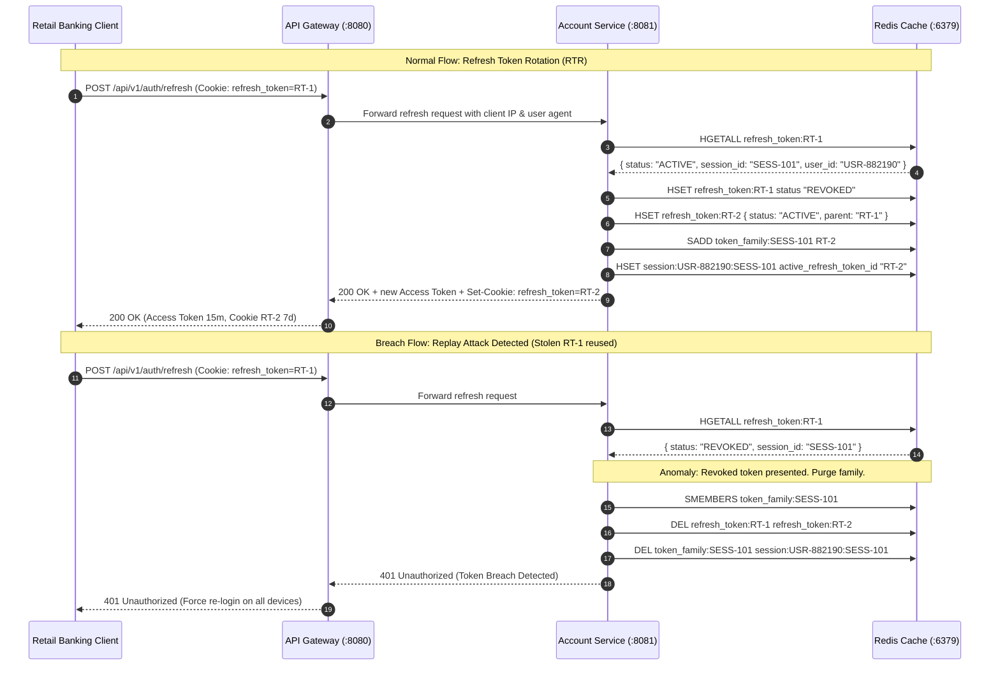
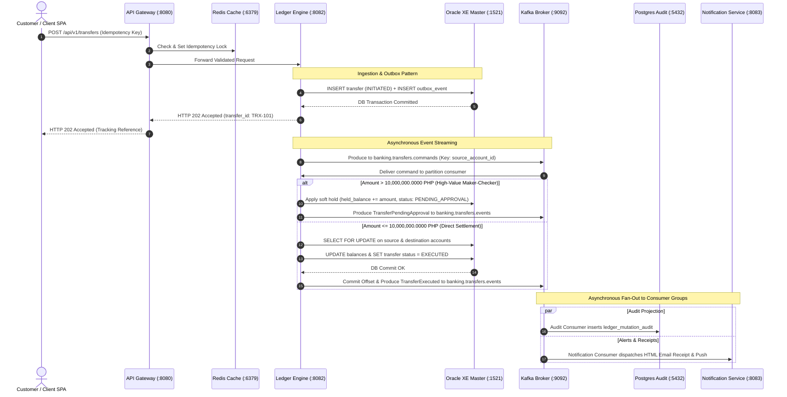

# System Architecture: Retail Ledger & Balance Mutation Engine

This document defines the high-throughput, event-driven, dual-storage, maker-checker banking platform for the FSE Capstone.

An interactive standalone HTML diagram is delivered at [`architecture.html`](file:///c:/Users/JLB83807/The%20Vault/workspaces/FSE-Capstone/architecture.html).
An interactive API sequence diagram is delivered at [`api_sequence.html`](file:///c:/Users/JLB83807/The%20Vault/workspaces/FSE-Capstone/api_sequence.html).

---

## 1. Complete Networking & Port Allocation Matrix

Every containerized service in the Docker Compose bridge network (`banking-net`) has a dedicated, deterministic port mapping:

| Service ID | Container Name | Host Port | Internal Port | Protocol | Access Scope | Primary Purpose |
| :--- | :--- | :---: | :---: | :--- | :--- | :--- |
| `client` | `banking-frontend` | `3000` | `80` / `3000` | HTTP | Public Browser | React SPA: Customer, Teller & Admin portals |
| `gateway` | `gateway-service` | `8080` | `8080` | HTTP / REST | Public API Entry | Perimeter Security, JWT validation, rate limiting |
| `acc_svc` | `account-service` | `8081` | `8081` | HTTP / REST | Internal Network | Customer KYC, user onboarding, account provisioning |
| `tx_engine`| `ledger-mutation-engine`| `8082` | `8082` | HTTP / REST | Internal Network | Concurrency locking, balance mutation, outbox publisher |
| `notif_svc`| `notification-service` | `8083` | `8083` | HTTP / REST | Internal Network | Asynchronous alert consumer & receipt generation |
| `auth_cache`| `redis-cache` | `6379` | `6379` | RESP / TCP | Internal Network | Token blacklist, idempotency locks, balance read-cache |
| `master_db`| `oracle-xe-master` | `1521` | `1521` | Oracle TNS | Internal Network | Master relational state (users, accounts, balances, outbox) |
| `audit_db` | `postgres-audit-vault`| `5432` | `5432` | PostgreSQL | Internal Network | Append-only audit vault (`ledger_mutation_audit`) |
| `broker` | `kafka-broker` | `9092` | `9092` | PLAINTEXT | Internal Network | Apache Kafka commit log in KRaft mode |
| `broker_ui`| `kafka-ui` | `8085` | `8080` | HTTP | Host Browser | Kafka Web Management Dashboard for topics and consumer lag |
| `telemetry`| `prometheus` | `9090` | `9090` | HTTP | Host Browser | Metrics scraper (TPS, latency, pool saturation) |
| `dashboard`| `grafana` | `3001` | `3000` | HTTP | Host Browser | Observability dashboards & live visual traces |

---

## 2. Comprehensive Service & Functional Breakdown

### A. Presentation Layer (`banking-frontend` :3000)
- **Runtime**: React 19, TypeScript, Vite, Tailwind CSS (Nginx container).
- **Core Functions**:
  1. `CustomerPortal`: Real-time balance card, funds transfer initiation form with instant 4-decimal validation, transaction history ledger, bills payment dialog.
  2. `TellerPortal` (Ledger): Maker-Checker review console displaying pending transactions (`> 10,000,000.0000 PHP`), balance hold status, and one-click Approve / Reject modal with mandatory reason inputs.
  3. `AdminPortal`: KYC profile verification queue, account provisioning (Savings, Checking, Credit), system limit configurations.
  4. `AuthContext`: In-memory JWT token storage, automatic Bearer header attachment via Axios interceptors, route protection based on decoded role claims.

---

### B. API Gateway & Perimeter Security (`gateway-service` :8080)
- **Runtime**: Spring Cloud Gateway, Spring Security 6, Nimbus JOSE JWT.
- **Core Functions**:
  1. `JwtAuthenticationFilter`: Extracts Bearer token, validates cryptographic signature (HMAC-SHA256), extracts subject (`user_id`), authority (`ROLE_CUSTOMER`, `ROLE_LEDGER`, `ROLE_ADMIN`), and unique token identifier (`jti`). Short-lived lifetime (15 minutes).
  2. `TokenBlacklistFilter`: Queries Redis (`blacklist:jti:<jti>`) in sub-5ms; instantly blocks revoked tokens from logged-out users or frozen accounts.
  3. `RedisRateLimiter`: Token-bucket algorithm enforcing 100 requests/sec per IP to prevent brute-force attacks.
  4. `RouteConfiguration`:
     - `/api/v1/auth/**` routes to `account-service:8081`
     - `/api/v1/accounts/**` routes to `account-service:8081`
     - `/api/v1/ledger/**` routes to `ledger-mutation-engine:8082`
     - `/api/v1/transfers/**` routes to `ledger-mutation-engine:8082`
     - `/api/v1/bills/**` routes to `ledger-mutation-engine:8082`

---

### C. Account & KYC Microservice (`account-service` :8081)
- **Runtime**: Spring Boot 3, Spring Data JPA, HikariCP.
- **Datasource**: Connected to `oracle-xe-master:1521`.
- **Core Functions**:
  1. `AuthController`:
     - `POST /api/v1/auth/register`: Ingests customer registration payloads with JSR-380 validation, hashes passwords via BCrypt, records identity documents (`users` table), sets status to `PENDING`.
     - `POST /api/v1/auth/login`: Authenticates credentials, initializes session and token family in Redis, returns short-lived access JWT (15 minutes) in body, and sets single-use `refresh_token` in an `HttpOnly`, `Secure`, `SameSite=Strict` cookie (7 days).
     - `POST /api/v1/auth/refresh`: Implements Refresh Token Rotation (RTR). Reads refresh cookie, validates against active token family in Redis, immediately marks old refresh token as revoked, and generates a new access token and rotated refresh token cookie. If a revoked token is presented, detects breach and purges the entire token family.
     - `POST /api/v1/auth/logout`: Pushes active access token `jti` to Redis blacklist set, deletes session and token family from Redis, and clears the refresh cookie (`Max-Age=0`).
  2. `KycService`: Admin endpoints to inspect government ID numbers and approve or reject KYC status.
   3. `AccountProvisioningService`:
     - `POST /api/v1/accounts`: Generates unique account number, links to customer profile, creates initial `balance_master` record with `0.0000 PHP`.
     - `PATCH /api/v1/accounts/{id}/status`: Locks or closes accounts upon fraud flags.
   4. `BalanceInquiryService`:
     - `GET /api/v1/accounts/{id}/balance`: Inspects Redis cache (`account:balance:<id>`). On cache miss, queries Oracle XE and writes to Redis with 30-second TTL.

---

### D. Core Ledger & Balance Mutation Engine (`ledger-mutation-engine` :8082)
- **Runtime**: Spring Boot 3, Spring Data JPA, Spring Kafka, HikariCP (`maximum-pool-size=30`, `minimum-idle=5`).
- **Datasource**: Connected to `oracle-xe-master:1521`.
- **Core Functions**:
  1. `PerimeterValidator`: Enforces `@Digits(integer=14, fraction=4)` and `@Positive` on mutation requests; intercepts malformed requests via `GlobalControllerAdvice` returning RFC-7807 Problem Details.
  2. `IdempotencyInterceptor`: Validates `X-Idempotency-Key` against Redis (`SET tx:<id> "PROCESSING" NX EX 60`). Rejects duplicate concurrent clicks with HTTP 409 Conflict.
  3. `TransactionalOutboxService`:
     - Receives `POST /api/v1/transfers`.
     - Inserts transfer record into Oracle with status `INITIATED`.
     - Inserts serialized command event into `outbox_events` table within the same local database transaction.
     - Returns `HTTP 202 Accepted` to the client in under 15ms with tracking `transfer_id`.
  4. `OutboxPublisherWorker`:
     - Reads pending events from `outbox_events` with `SELECT ... FOR UPDATE SKIP LOCKED`.
     - Publishes records to Kafka topic `banking.transfers.commands` using `source_account_id` as the partition key.
     - Guarantees at-least-once delivery with producer confirmations (`acks=all`, `enable.idempotence=true`).
  5. `TransferSagaConsumer`:
     - Listens to `banking.transfers.commands` with consumer group `ledger-mutation-workers`.
     - Executes `@Lock(LockModeType.PESSIMISTIC_WRITE)` (`SELECT ... FOR UPDATE`) on target rows in `balance_master`.
     - Low-value (`<= 10M PHP`): Debits source account, credits destination account, updates status to `COMMITTED`.
     - High-value (`> 10M PHP`): Applies hold (`hold_amount += amount`), transitions status to `PENDING_APPROVAL`, emits `TransferPendingApproval` event.
     - Checker Approval: Verifies segregation of duties (`maker_id != checker_id`), releases hold, debits source, credits destination, updates status to `COMMITTED`.
     - Checker Rejection: Releases hold, decrements `hold_amount`, transitions status to `FAILED`.
  6. `TransferEventProducer`:
     - Publishes state change events to `banking.transfers.events` (`TransferExecuted`, `TransferRejected`, `TransferFailed`).

---

### E. Notification & Alert Microservice (`notification-service` :8083)
- **Runtime**: Spring Boot 3, Spring Kafka Client.
- **Core Functions**:
  1. `TransactionEventConsumer`: Listens to `banking.transfers.events` under consumer group `notification-workers`.
  2. `ReceiptFormatter`: Formats debit/credit receipts (HTML/PDF) via Thymeleaf including transaction timestamp, before/after balances, reference numbers, and cryptographic verification hashes.
  3. `EmailAlertDispatcher`: Dispatches rich HTML email receipts to customer inboxes and SSE toasts to the web portal.
  4. `TellerAlertDispatcher`: Dispatches high-priority notifications to active Teller screens when high-value transfers enter `PENDING_APPROVAL`.

---

### F. Distributed In-Memory Cache (`redis-cache` :6379)
- **Runtime**: Redis 7 Alpine.
- **Core Functions**:
  1. `Token Blacklist`: Key `blacklist:jti:<jwt_id>` with TTL matching the remaining access token lifetime (max 15 minutes) to revoke logged-out tokens immediately.
  2. `Session and Token Family Store`:
     - `session:<user_id>:<session_id>`: Session metadata hash (client IP, user-agent fingerprint, creation timestamp, active refresh token ID) with a 7-day sliding TTL.
     - `refresh_token:<token_id>`: Token status hash (`status: ACTIVE | REVOKED`, parent token ID, user ID, session ID) with a 7-day TTL.
     - `token_family:<session_id>`: Redis Set tracking all refresh token IDs generated under the current session for instant family-wide revocation during breach detection.
  3. `Idempotency Locks`: Key `tx:<transaction_id>` with 60s TTL to block duplicate transfer clicks in 1ms.
  4. `Balance Read-Cache`: Key `account:balance:<account_id>` with 30s TTL for rapid screen displays. Evicted immediately (`DEL`) upon any balance mutation.

---

### G. Master State Storage (`oracle-xe-master` :1521)
- **Runtime**: Oracle Database Express Edition 21c.
- **Core Functions**:
  1. Master relational persistence: `users`, `accounts`, `balance_master`, `credit_assessments`, `transactions`, `outbox_events`, `notifications`.
  2. Row-level lock acquisition kernel: serializes concurrent transactions on `balance_master` via `FOR UPDATE`.
  3. Strict database check constraints: `CHECK (balance_amount >= hold_amount)`, `CHECK (balance_amount >= 0)`.

---

### H. Dedicated Immutable Audit Vault (`postgres-audit-vault` :5432)
- **Runtime**: PostgreSQL 15+ Alpine.
- **Core Functions**:
  1. Asynchronous Event Projection: Independent consumer group `audit-vault-workers` reads `banking.transfers.events` from Kafka and inserts rows into `ledger_mutation_audit`.
  2. Native compliance triggers: `trg_no_update_delete_mutation_audit` strictly rejects all `UPDATE` and `DELETE` SQL commands.
  3. Fast B-Tree indexing on `(account_id, created_at)` and `(operator_id)` to serve auditor queries and REST endpoints (`GET /api/v1/audit/account/{id}`) in sub-5ms.

---

### I. Event Streaming Broker (`kafka-broker` :9092 & `kafka-ui` :8085)
- **Runtime**: Apache Kafka 3.7+ in KRaft mode (no ZooKeeper dependency).
- **Core Functions**:
  1. Topics:
     - `banking.transfers.commands`: Partitioned by `source_account_id` (6 to 12 partitions). Ensures strict per-account chronological execution order.
     - `banking.transfers.events`: Partitioned by `transfer_id` (6 to 12 partitions). Carries state change events consumed by audit and notification workers.
     - `banking.transfers.retry`: Delayed retry topic for transient database lock conflicts.
     - `banking.transfers.dlt`: Dead Letter Topic isolating unrecoverable poison pill records.
  2. Web Management Dashboard (`provectuslabs/kafka-ui`) on port `8085` for inspecting partition distribution, consumer group lags, and messages during capstone evaluations.

---

### J. Observability Stack (`prometheus` :9090 & `grafana` :3001)
- **Runtime**: Prometheus v2.45 + Grafana v10.
- **Core Functions**:
  1. Scrapes `/actuator/prometheus` across all Spring Boot microservices every 5 seconds.
  2. Tracks live Transactions Per Second (TPS) against the 200 TPS benchmark.
  3. Tracks p50, p95, and p99 latency percentiles against the 150ms SLA.
  4. Monitors HikariCP connection pool saturation and Kafka consumer lag metrics.

---

### K. Authentication, Refresh Token Rotation (RTR) & Breach Detection Architecture

---

### L. Event-Driven Funds Transfer & Kafka Stream Architecture

