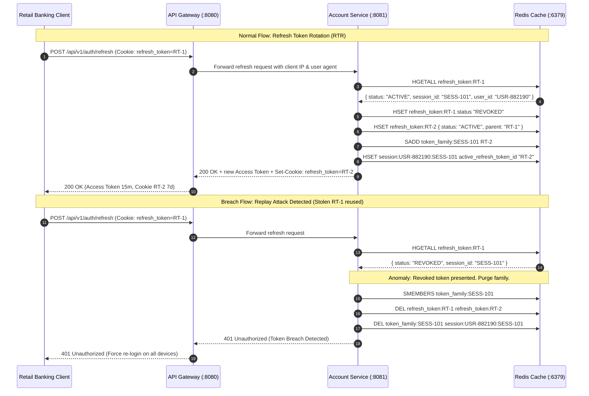
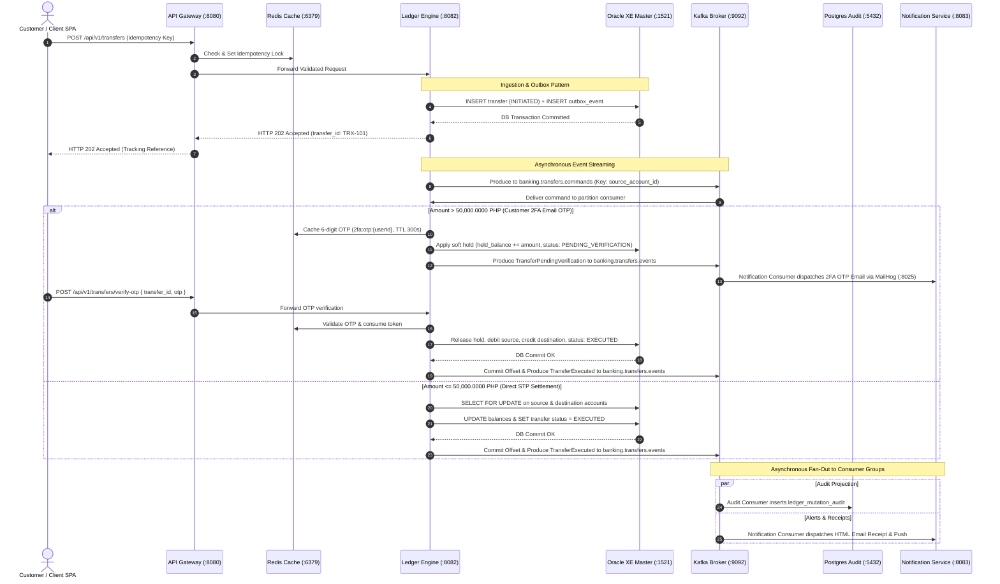

# System Architecture: Retail Ledger & Balance Mutation Engine

This document defines the high-throughput, event-driven, dual-storage, maker-checker banking platform for the FSE Capstone.

An interactive standalone HTML diagram is delivered at [`architecture.html`](file:///c:/Users/JLB83807/The%20Vault/workspaces/FSE-Capstone/architecture.html).
An interactive API sequence diagram is delivered at [`api_sequence.html`](file:///c:/Users/JLB83807/The%20Vault/workspaces/FSE-Capstone/api_sequence.html).
A comprehensive Markdown diagram catalog is delivered at [`ARCHITECTURE_DIAGRAMS.md`](file:///c:/Users/JLB83807/The%20Vault/workspaces/FSE-Capstone/ARCHITECTURE_DIAGRAMS.md).

---

## 1. Complete Networking & Port Allocation Matrix

Every containerized service in the Docker Compose bridge network (`banking-net`) has a dedicated, deterministic port mapping:

| Service ID | Container Name | Host Port | Internal Port | Protocol | Access Scope | Primary Purpose |
| :--- | :--- | :---: | :---: | :--- | :--- | :--- |
| `client` | `banking-frontend` | `3000` | `80` / `3000` | HTTP | Public Browser | React 18 SPA: Customer (email 2FA) & Admin telemetry portals |
| `gateway` | `gateway-service` | `8080` | `8080` | HTTP / REST | Public API Entry | Perimeter Security, JWT validation, rate limiting |
| `acc_svc` | `account-service` | `8081` | `8081` | HTTP / REST | Internal Network | Customer KYC, user onboarding, account provisioning |
| `tx_engine`| `transfer-orchestrator`| `8082` | `8082` | HTTP / REST | Internal Network | Transfer lifecycle orchestrator: Risk Engine evaluation, Saga compensation, T24 dispatch |
| `t24_cbs`  | `temenos-t24-cbs`       | `9100` | `9100` | HTTP / OFS  | Internal Network | Temenos T24 Core Banking System: Dual Ingress (1: Funds Transfer, 2: Reversal) |
| `notif_svc`| `notification-service` | `8083` | `8083` | HTTP / REST | Internal Network | Kafka listener, receipt generation, email 2FA OTP delivery |
| `mailhog`  | `mailhog-smtp`         | `8025` / `1025` | `8025` / `1025` | HTTP / SMTP | Web Inbox / Host | Mock email inbox UI (:8025) and SMTP receiver (:1025) for OTP codes |
| `auth_cache`| `redis-cache` | `6379` | `6379` | RESP / TCP | Internal Network | Token blacklist, 2FA OTP cache (300s TTL), rate limiting |
| `redis_ui`  | `redis-insight`| `5540` | `5540` | HTTP | Host Browser | Redis Insight Web GUI: interactive key browser, TTL & memory inspector |
| `master_db`| `azure-sql-db`         | `1433` | `1433` | TDS / SSL   | Cloud / Internal | Azure SQL Database (Replaces Oracle XE): Master CBS accounts, balances, EOD journals (T24 main connection) |
| `audit_db` | `azure-postgres-vault` | `5432` | `5432` | PostgreSQL  | Cloud / Internal | Azure Database for PostgreSQL: Append-only audit vault (`ledger_mutation_audit`) |
| `broker` | `kafka-broker` | `9092` | `9092` | PLAINTEXT | Internal Network | Apache Kafka commit log in KRaft mode |
| `broker_ui`| `kafka-ui` | `8085` | `8080` | HTTP | Host Browser | Kafka Web Management Dashboard for topics and consumer lag |
| `telemetry`| `dd-agent` | `8126` / `8125` | `8126` / `8125` | APM / StatsD | Host / Internal | Datadog Agent 7: APM traces, DogStatsD metrics, live container logs |
| `jaeger`   | `jaeger-tracing` | `16686` / `4317` | `16686` / `4317` | HTTP / gRPC | Host Browser | OpenTelemetry distributed trace visualizer (:16686) & OTLP receiver |

---

## 2. Comprehensive Service & Functional Breakdown

### A. Presentation Layer (`banking-frontend` :3000)
- **Runtime**: React 18, Vite, Tailwind CSS (Nginx container).
- **Core Functions**:
  1. `CustomerPortal`: Real-time balance cards, quick preset transfer amounts, funds transfer initiation with 4-decimal validation, transaction history ledger, and email OTP verification modal for transfers > PHP 50,000.00.
  2. `AdminPortal`: System telemetry grid, 16-container health status, circuit spool buffer controls, database connection inspector, and audit log viewer. (Admins do not approve transfers; transfers are authorized directly by customers via email).
  3. `AuthContext`: In-memory JWT token storage, automatic Bearer header attachment via Axios interceptors, route protection based on decoded role claims.

---

### B. API Gateway & Perimeter Security (`gateway-service` :8080)
- **Runtime**: Spring Cloud Gateway, Spring Security 6, Nimbus JOSE JWT.
- **Core Functions**:
  1. `JwtAuthenticationFilter`: Extracts Bearer token, validates cryptographic signature (HMAC-SHA256), extracts subject (`user_id`), authority (`ROLE_CUSTOMER`, `ROLE_LEDGER`, `ROLE_ADMIN`), and unique token identifier (`jti`). Short-lived lifetime (15 minutes).
  2. `TokenBlacklistFilter`: Queries Redis (`blacklist:jti:<jti>`) in sub-5ms; instantly blocks revoked tokens from logged-out users or frozen accounts.
  3. `RedisRateLimiter`: Token-bucket algorithm enforcing 100 requests/sec per IP to prevent brute-force attacks.
  4. `RouteConfiguration`:
     - `/api/v1/auth/**` routes to `account-service:8081`
     - `/api/v1/accounts/**` routes to `account-service:8081`
     - `/api/v1/ledger/**` routes to `transfer-orchestrator:8082`
     - `/api/v1/transfers/**` routes to `transfer-orchestrator:8082`
     - `/api/v1/bills/**` routes to `transfer-orchestrator:8082`

---

### C. Account & KYC Microservice (`account-service` :8081)
- **Runtime**: Spring Boot 3, Spring Data JPA, HikariCP.
- **Datasource**: Connected to `Azure Database for PostgreSQL` (port 5432) for users, authentication, KYC profiles, and accounts; uses `Azure Cache for Redis` for token families and blacklists.
- **Core Functions**:
  1. `AuthController`:
     - `POST /api/v1/auth/register`: Ingests customer registration payloads with JSR-380 validation, hashes passwords via BCrypt, records identity documents (`users` table), sets status to `PENDING`.
     - `POST /api/v1/auth/login`: Authenticates credentials, initializes session and token family in Redis, returns short-lived access JWT (15 minutes) in body, and sets single-use `refresh_token` in an `HttpOnly`, `Secure`, `SameSite=Strict` cookie (7 days).
     - `POST /api/v1/auth/refresh`: Implements Refresh Token Rotation (RTR). Reads refresh cookie, validates against active token family in Redis, immediately marks old refresh token as revoked, and generates a new access token and rotated refresh token cookie. If a revoked token is presented, detects breach and purges the entire token family.
     - `POST /api/v1/auth/logout`: Pushes active access token `jti` to Redis blacklist set, deletes session and token family from Redis, and clears the refresh cookie (`Max-Age=0`).
  2. `KycService`: Admin endpoints to inspect government ID numbers and approve or reject KYC status.
   3. `AccountProvisioningService`:
     - `POST /api/v1/accounts`: Generates unique account number, links to customer profile, creates initial `balance_master` record with `0.0000 PHP`.
     - `PATCH /api/v1/accounts/{id}/status`: Locks or closes accounts upon fraud flags.
   4. `BalanceInquiryService`:
     - `GET /api/v1/accounts/{id}/balance`: Inspects Redis cache (`account:balance:<id>`). On cache miss, queries Azure SQL and writes to Redis with 30-second TTL.

---

### D. Funds Transfer Orchestrator (`transfer-orchestrator` :8082)
- **Runtime**: Spring Boot 3, Spring WebClient, Spring Kafka.
- **Core Functions**:
  1. `PerimeterValidator`: Enforces `@Digits(integer=14, fraction=4)` and `@Positive` on mutation requests; intercepts malformed requests via `GlobalControllerAdvice` returning RFC-7807 Problem Details.
  2. `IdempotencyInterceptor`: Validates `X-Idempotency-Key` against Redis (`SET tx:<id> "PROCESSING" NX EX 60`). Rejects duplicate concurrent clicks with HTTP 409 Conflict.
  3. `RiskEngineCoordinator`:
     - Dispatches transfer payload to Decoupled Risk Engine (`POST /api/v1/risk/transfer`) over non-blocking WebClient with strict 200ms SLA timeout.
     - Receives risk evaluation verdict (`ALLOW`, `2FA_CHALLENGE`, or `BLOCK`).
  4. `StepUpChallengeCoordinator`:
     - If risk evaluation mandates 2FA or transfer > PHP 50,000.00, coordinates with `notification-service` to deliver 6-digit OTP to the customer and verifies the OTP before proceeding.
  5. `T24 Dispatcher & Saga Compensation Coordinator`:
     - **Funds Transfer (Endpoint 1)**: Converts validated transfer request into OFS syntax (`FUNDS.TRANSFER,AUTH/I/PROCESS`) and dispatches to `POST /api/v1/t24/funds-transfer`.
     - **Compensating Reversal (Endpoint 2)**: Upon downstream timeout, circuit breaker abort, or notification failure, dispatches compensating reversal (`FUNDS.TRANSFER,REVERSE/I/PROCESS`) to `POST /api/v1/t24/reversal` with the original `TXN.REF` to restore debited customer balances immediately.
  6. `TransferEventProducer`:
     - Publishes state change events to `banking.transfers.events` (`TransferExecuted`, `TransferPendingVerification`, `TransferFailed`, `TransferReversed`).

---

### E. Temenos T24 Core Banking System (`temenos-t24-cbs` :9100)
- **Runtime**: Temenos T24 Core Banking System runtime / Enterprise CBS.
- **Datasource**: Direct and exclusive connection point to `azure-sql-db:1433`.
- **Dual Ingress Endpoints**:
  1. **Endpoint 1: Funds Transfer (`POST /api/v1/t24/funds-transfer`)**:
     - OFS command: `FUNDS.TRANSFER,AUTH/I/PROCESS,//PH100223,TXN.REF=...,DEBIT.ACCT=...,CREDIT.ACCT=...,AMOUNT=...`
     - Validates balances, executes atomic debit and credit mutations, posts GL ledger lines, and records fee tariffs.
  2. **Endpoint 2: Financial Reversal (`POST /api/v1/t24/reversal`)**:
     - OFS command: `FUNDS.TRANSFER,REVERSE/I/PROCESS,//PH100223,TXN.REF=...,ORIGINAL.REF=...`
     - Compensating transaction: restores debited funds, offsets recipient credits, and registers reversal audit trails.
- **Core Functions**:
  1. `Double-Entry Balance Engine`: Primary owner of accounts, customer ledgers, and transaction postings in Azure SQL Database.
  2. `End-of-Day (EOD) & Batch Processing`: Automated daily batch cycles, balance rollups, GL reconciliation, and statement generation.
  3. `Fee & Interest Engines`: Computes real-time transfer tariffs, interest accruals, and regulatory withholding tax.
  4. `ACID Concurrency Kernel`: Acquires row-level pessimistic locks (`SELECT ... WITH (UPDLOCK, ROWLOCK)`) directly on Azure SQL tables.

---

### F. Notification & Alert Microservice (`notification-service` :8083)
- **Runtime**: Spring Boot 3, Spring Kafka Client, Thymeleaf Template Engine.
- **BSP MORB & AMLA Regulatory Compliance Matrix**:
  - **Tier 1: Normal Transaction (₱0.01 – ₱50,000.00)**: Direct STP execution. Automatically dispatches customer HTML email receipt with before/after balances, masked accounts, and SHA-256 verification hash.
  - **Tier 2: Customer 2FA Verification (₱50,000.01 – ₱499,999.99)**: Customer initiated transfer exceeding ₱50k threshold. Triggers 6-digit OTP code dispatched to customer email inbox via MailHog (SMTP `:1025`, web UI `:8025`). Funds held until verified.
  - **Tier 3: High-Value / AMLA Covered (₱500,000.00 and above)**: Mandatory Covered Transaction Report (CTR) filing under Anti-Money Laundering Act (AMLA); requires Customer 2FA OTP verification plus automated AMLA CTR compliance filing.
- **Core Functions**:
  1. `TransactionEventConsumer`: Listens to `banking.transfers.events` under consumer group `notification-workers` (4 concurrent threads).
  2. `ReceiptFormatter`: Formats debit/credit receipts and 2FA OTP security verification messages via Thymeleaf templates.
  3. `EmailAlertDispatcher`: Dispatches rich HTML email receipts and OTP authorization codes via MailHog SMTP (:1025) and SSE toasts to the web portal.
  4. `Deduplication & Resilience`: Redis idempotency caching (`SET notif:seen:<id> 1 NX EX 3600`) and in-memory retry spooling for circuit buffering during SMTP outages.

---

### G. Distributed In-Memory Cache (`redis-cache` :6379)
- **Runtime**: Redis 7 Alpine.
- **Core Functions**:
  1. `Token Blacklist`: Key `blacklist:jti:<jwt_id>` with TTL matching the remaining access token lifetime (max 15 minutes) to revoke logged-out tokens immediately.
  2. `Session and Token Family Store`:
     - `session:<user_id>:<session_id>`: Session metadata hash (client IP, user-agent fingerprint, creation timestamp, active refresh token ID) with a 7-day sliding TTL.
     - `refresh_token:<token_id>`: Token status hash (`status: ACTIVE | REVOKED`, parent token ID, user ID, session ID) with a 7-day TTL.
     - `token_family:<session_id>`: Redis Set tracking all refresh token IDs generated under the current session for instant family-wide revocation during breach detection.
  3. `Idempotency Locks`: Key `tx:<transaction_id>` with 60s TTL to block duplicate transfer clicks in 1ms.
  4. `Balance Read-Cache`: Key `account:balance:<account_id>` with 30s TTL for rapid screen displays. Evicted immediately (`DEL`) upon any balance mutation.

---

### H. Master State Storage (`azure-sql-db` :1433)
- **Runtime**: Azure SQL Database (Replaces legacy Oracle XE).
- **Primary Connection**: Exclusively accessed by Temenos T24 CBS for balance mutations, fees, interest, and EOD batch jobs.
- **Core Functions**:
  1. Master relational persistence: `users`, `accounts`, `balance_master`, `transactions`, `gl_ledger`, `batch_eod_logs`.
  2. Row-level lock acquisition kernel: serializes concurrent transactions on `balance_master` via `UPDLOCK, ROWLOCK`.
  3. Strict database check constraints: `CHECK (balance_amount >= hold_amount)`, `CHECK (balance_amount >= 0)`.

---

### I. Dedicated Immutable Audit Vault (`azure-postgres-vault` :5432)
- **Runtime**: Azure Database for PostgreSQL Flexible Server.
- **Core Functions**:
  1. Asynchronous Event Projection: Independent consumer group `audit-vault-workers` reads `banking.transfers.events` from Kafka and inserts rows into `ledger_mutation_audit`.
  2. Native compliance triggers: `trg_no_update_delete_mutation_audit` strictly rejects all `UPDATE` and `DELETE` SQL commands.
  3. Fast B-Tree indexing on `(account_id, created_at)` and `(operator_id)` to serve auditor queries and REST endpoints (`GET /api/v1/audit/account/{id}`) in sub-5ms.
  3. Fast B-Tree indexing on `(account_id, created_at)` and `(operator_id)` to serve auditor queries and REST endpoints (`GET /api/v1/audit/account/{id}`) in sub-5ms.

---

### I. Event Streaming Broker (`kafka-broker` :9092 & `kafka-ui` :8085)
- **Runtime**: Apache Kafka 3.7+ in KRaft mode (no ZooKeeper dependency).
- **Core Functions**:
  1. Topics:
     - `banking.transfers.commands`: Partitioned by `source_account_id` (6 to 12 partitions). Ensures strict per-account chronological execution order.
     - `banking.transfers.events`: Partitioned by `transfer_id` (6 to 12 partitions). Carries state change events consumed by audit and notification workers.
     - `banking.transfers.retry`: Delayed retry topic for transient database lock conflicts.
     - `banking.transfers.dlt`: Dead Letter Topic isolating unrecoverable poison pill records.
  2. Web Management Dashboard (`provectuslabs/kafka-ui`) on port `8085` for inspecting partition distribution, consumer group lags, and messages during capstone evaluations.

---

### J. Observability Stack (`dd-agent` :8126 & :8125)
- **Runtime**: Datadog Agent 7 (Containerized).
- **Core Functions**:
  1. Ingests distributed APM traces on port `8126` and OTLP spans on ports `4317`/`4318`.
  2. Aggregates DogStatsD metrics on UDP port `8125` (TPS throughput against 200 TPS benchmark, p50/p95/p99 latencies against 150ms SLA).
  3. Monitors HikariCP connection pool saturation across Oracle XE and PostgreSQL and tracks Kafka consumer lag metrics.
  4. Tail-scrapes container logs across all microservices for unified log correlation.

---

### K. Authentication, Refresh Token Rotation (RTR) & Breach Detection Architecture

```mermaid
sequenceDiagram
    autonumber
    participant Client as Retail Banking Client
    participant Gateway as API Gateway (:8080)
    participant AccountSvc as Account Service (:8081)
    participant Redis as Redis Cache (:6379)

    Note over Client,Redis: Normal Flow: Refresh Token Rotation (RTR)
    Client->>Gateway: POST /api/v1/auth/refresh (Cookie: refresh_token=RT-1)
    Gateway->>AccountSvc: Forward refresh request with client IP & user agent
    AccountSvc->>Redis: HGETALL refresh_token:RT-1
    Redis-->>AccountSvc: { status: "ACTIVE", session_id: "SESS-101", user_id: "USR-882190" }
    AccountSvc->>Redis: HSET refresh_token:RT-1 status "REVOKED"
    AccountSvc->>Redis: HSET refresh_token:RT-2 { status: "ACTIVE", parent: "RT-1" }
    AccountSvc->>Redis: SADD token_family:SESS-101 RT-2
    AccountSvc->>Redis: HSET session:USR-882190:SESS-101 active_refresh_token_id "RT-2"
    AccountSvc-->>Gateway: 200 OK + new Access Token + Set-Cookie: refresh_token=RT-2
    Gateway-->>Client: 200 OK (Access Token 15m, Cookie RT-2 7d)

    Note over Client,Redis: Breach Flow: Replay Attack Detected (Stolen RT-1 reused)
    Client->>Gateway: POST /api/v1/auth/refresh (Cookie: refresh_token=RT-1)
    Gateway->>AccountSvc: Forward refresh request
    AccountSvc->>Redis: HGETALL refresh_token:RT-1
    Redis-->>AccountSvc: { status: "REVOKED", session_id: "SESS-101" }
    Note over AccountSvc,Redis: Anomaly: Revoked token presented. Purge family.
    AccountSvc->>Redis: SMEMBERS token_family:SESS-101
    AccountSvc->>Redis: DEL refresh_token:RT-1 refresh_token:RT-2
    AccountSvc->>Redis: DEL token_family:SESS-101 session:USR-882190:SESS-101
    AccountSvc-->>Gateway: 401 Unauthorized (Token Breach Detected)
    Gateway-->>Client: 401 Unauthorized (Force re-login on all devices)
```

---

### L. Event-Driven Funds Transfer & Kafka Stream Architecture

```mermaid
sequenceDiagram
    autonumber
    actor Customer as Customer / Client SPA
    participant Gateway as API Gateway (:8080)
    participant Redis as Redis Cache (:6379)
    participant Engine as Ledger Engine (:8082)
    participant Oracle as Oracle XE Master (:1521)
    participant Kafka as Kafka Broker (:9092)
    participant Postgres as Postgres Audit (:5432)
    participant Notif as Notification Service (:8083)

    Customer->>Gateway: POST /api/v1/transfers (Idempotency Key)
    Gateway->>Redis: Check & Set Idempotency Lock
    Gateway->>Engine: Forward Validated Request

    Note over Engine,Oracle: Ingestion & Outbox Pattern
    Engine->>Oracle: INSERT transfer (INITIATED) + INSERT outbox_event
    Oracle-->>Engine: DB Transaction Committed
    Engine-->>Gateway: HTTP 202 Accepted (transfer_id: TRX-101)
    Gateway-->>Customer: HTTP 202 Accepted (Tracking Reference)

    Note over Engine,Kafka: Asynchronous Event Streaming
    Engine->>Kafka: Produce to banking.transfers.commands (Key: source_account_id)
    Kafka->>Engine: Deliver command to partition consumer

    alt Amount > 50,000.0000 PHP (Customer 2FA Email OTP)
        Engine->>Redis: Cache 6-digit OTP (2fa:otp:{userId}, TTL 300s)
        Engine->>Oracle: Apply soft hold (held_balance += amount, status: PENDING_VERIFICATION)
        Engine->>Kafka: Produce TransferPendingVerification to banking.transfers.events
        Kafka->>Notif: Notification Consumer dispatches 2FA OTP Email via MailHog (:8025)
        Customer->>Gateway: POST /api/v1/transfers/verify-otp { transfer_id, otp }
        Gateway->>Engine: Forward OTP verification
        Engine->>Redis: Validate OTP & consume token
        Engine->>Oracle: Release hold, debit source, credit destination, status: EXECUTED
        Oracle-->>Engine: DB Commit OK
        Engine->>Kafka: Commit Offset & Produce TransferExecuted to banking.transfers.events
    else Amount <= 50,000.0000 PHP (Direct STP Settlement)
        Engine->>Oracle: SELECT FOR UPDATE on source & destination accounts
        Engine->>Oracle: UPDATE balances & SET transfer status = EXECUTED
        Oracle-->>Engine: DB Commit OK
        Engine->>Kafka: Commit Offset & Produce TransferExecuted to banking.transfers.events
    end

    Note over Kafka,Notif: Asynchronous Fan-Out to Consumer Groups
    par Audit Projection
        Kafka->>Postgres: Audit Consumer inserts ledger_mutation_audit
    and Alerts & Receipts
        Kafka->>Notif: Notification Consumer dispatches HTML Email Receipt & Push
    end
```

---

## 3. Dual-Storage Persistence Architecture: CBS Master Database vs Immutable Audit Vault

The platform enforces a dual-storage persistence architecture, partitioning live operational financial transactions from immutable regulatory audit trails:

| Architectural Dimension | CBS Master Ledger Database (`azure-sql-db` :1433) | Immutable Audit Vault (`azure-postgres-vault` :5432) |
| :--- | :--- | :--- |
| **Primary Owner** | `temenos-t24-cbs` (:9100) exclusively | Audit Consumer Worker (`notification-workers`) |
| **Storage Engine** | Azure SQL Database (Relational ACID Kernel) | Azure Database for PostgreSQL 16 Alpine |
| **Data Scope** | Core accounts, customer master ledgers, GL double-entry journals, EOD balances | Append-only financial audit records (`ledger_mutation_audit`), mutation receipts |
| **Concurrency Model** | Strict row-level pessimistic locking (`UPDLOCK, ROWLOCK`), ACID serialization | High-throughput append-only streaming; database trigger strictly blocks UPDATE & DELETE |
| **SLA & Scaling** | Mission-critical core financial SLA; failover-protected double-entry integrity | Independent read-heavy compliance reporting, sub-5ms indexed auditor lookups |
| **External Architecture** | No extraneous presentation databases; direct service integration | Zero direct browser writes; pure asynchronous Kafka event projection |

### Architectural Principles
1. **Pessimistic Balance Integrity**: Temenos T24 CBS serializes high-frequency balance mutations using database row locks on Azure SQL, preventing race conditions and double-spending.
2. **Regulatory Non-Repudiation**: The PostgreSQL audit vault is isolated from operational mutations. A custom trigger (`trg_no_update_delete_mutation_audit`) rejects any tampering attempts, satisfying Bangko Sentral ng Pilipinas (BSP) compliance requirements.
3. **Lean Persistence Footprint**: Business flows operate cleanly through standard microservices and core banking databases without introducing unnecessary intermediate storage layers.

---

## 4. C1–C4 Architectural Hierarchy & Interactive Presentation Explorer

The system is formalized across the C4 model hierarchy to facilitate presentations ranging from executive high-level overviews down to low-level engineering execution flows:

* **Interactive Presentation Navigator**: [`c_model_explorer.html`](file:///c:/Users/JLB83807/The%20Vault/workspaces/FSE-Capstone/c_model_explorer.html)
  An interactive canvas that allows clicking any component node to smoothly zoom in from high-level C1 System Context down to C2 Containers, C3 Components, and C4 Sequence execution flows. Includes keyboard navigation (`1..4` to jump levels, `Esc` to zoom out), node inspection drawer, and instant theme switching.
* **C1: System Context Diagram**: [`c1_system_context.html`](file:///c:/Users/JLB83807/The%20Vault/workspaces/FSE-Capstone/c1_system_context.html)
  Depicts Retail Customers, Back-Office Ops, the Core Platform Boundary, Notification Gateways, and the external Temenos T24 CBS with its dual ingress capabilities.
* **C2: Container Diagram**: [`c2_container.html`](file:///c:/Users/JLB83807/The%20Vault/workspaces/FSE-Capstone/c2_container.html)
  Depicts all containerized deployment units: Frontends, Gateway (:8080), Account Service (:8081), Transfer Orchestrator (:8082), T24 CBS (:9100 with EP1 & EP2), and CBS Master DB (:1433).
* **C3: Component Diagram**: [`c3_component.html`](file:///c:/Users/JLB83807/The%20Vault/workspaces/FSE-Capstone/c3_component.html)
  Exposes the internal code-level modules: Idempotency Guard, Risk Coordinator, Saga Compensation Coordinator, T24 Transfer Client (EP1), T24 Reversal Client (EP2), and T24 Core Accounting Kernel.
* **C4: Sequence / Flow Diagram**: [`c4_sequence.html`](file:///c:/Users/JLB83807/The%20Vault/workspaces/FSE-Capstone/c4_sequence.html)
  Details the execution sequence of a funds transfer via T24 Endpoint 1, followed by a simulated downstream timeout that triggers an automated compensating reversal via T24 Endpoint 2.
* **Full Primary System Architecture**: [`architecture.html`](file:///c:/Users/JLB83807/The%20Vault/workspaces/FSE-Capstone/architecture.html)
  The comprehensive showcase diagram compiled and verified under Archify v3.
