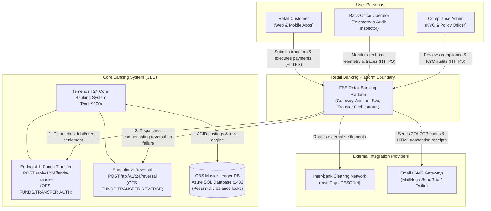
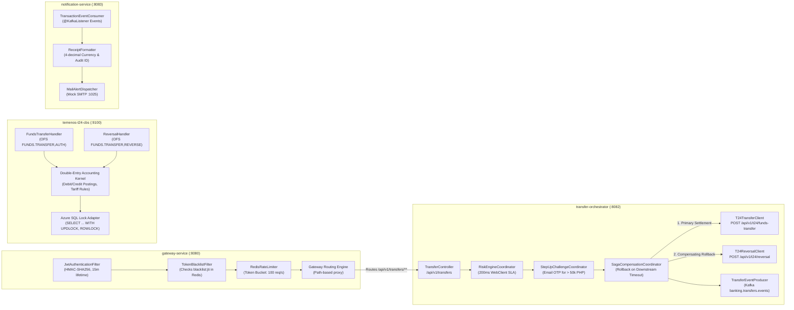
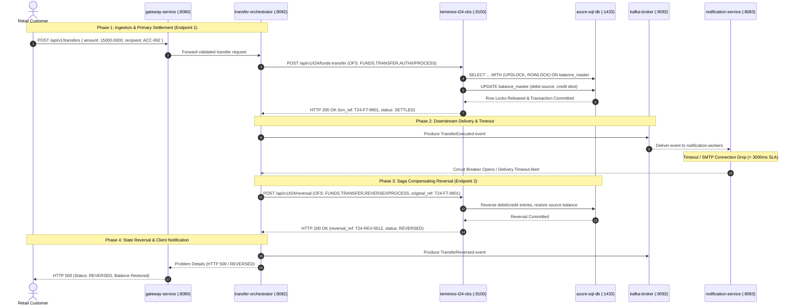
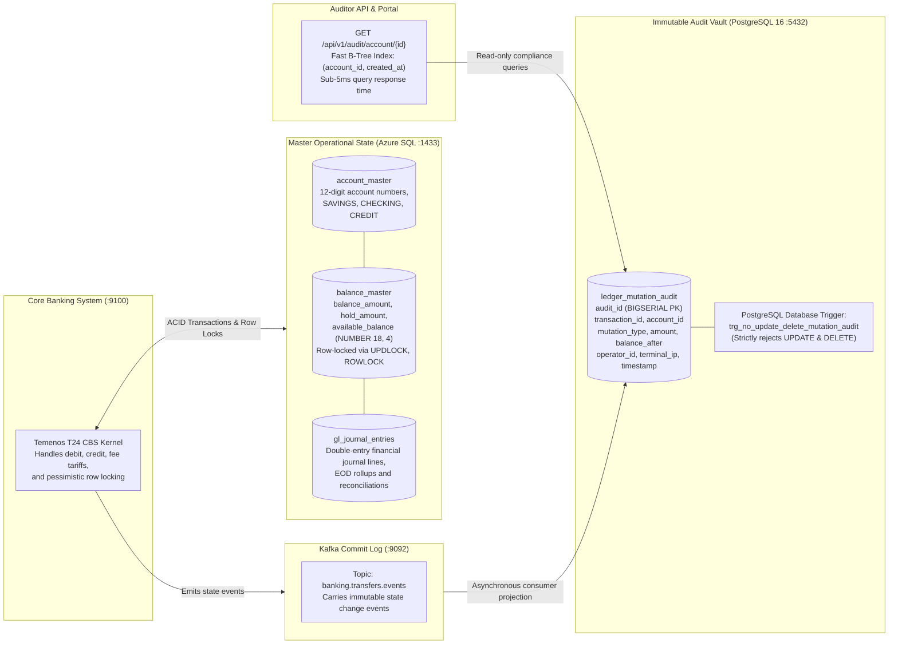
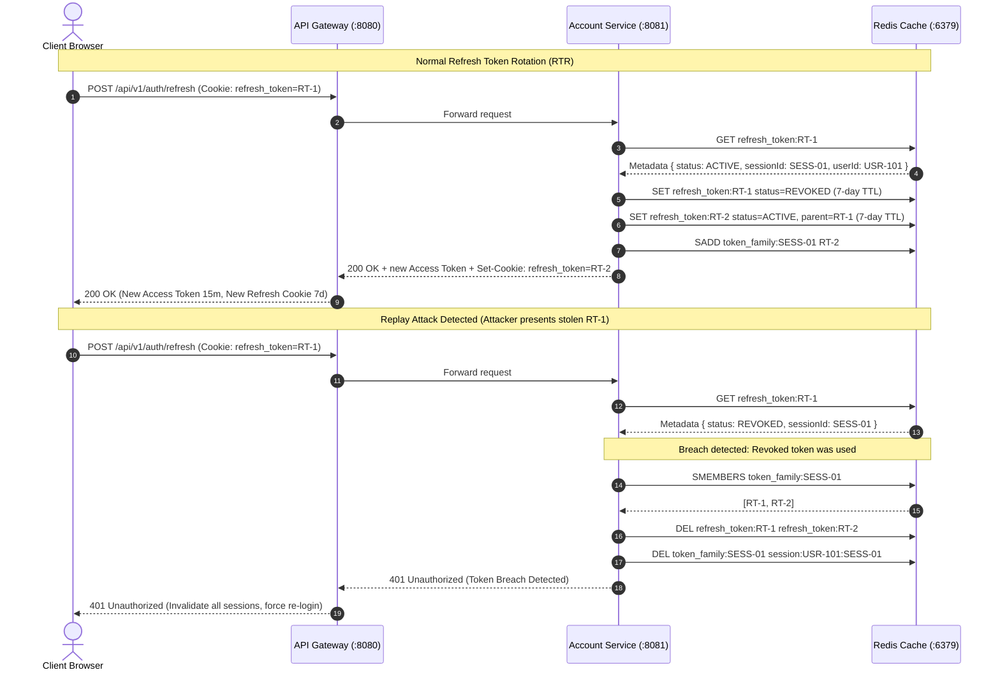

# Architecture Diagrams: Retail Ledger & Balance Mutation Engine

This document provides visual architectural models for the retail banking platform. It formalizes the system across the C4 model hierarchy (Context, Container, Component, and Sequence) and documents the dual-endpoint Temenos T24 Core Banking System (CBS) integration.

Interactive standalone HTML diagrams:
* Interactive C1–C4 Zoom-in Explorer: [`c_model_explorer.html`](file:///c:/Users/JLB83807/The%20Vault/workspaces/FSE-Capstone/c_model_explorer.html)
* C1 System Context Diagram: [`c1_system_context.html`](file:///c:/Users/JLB83807/The%20Vault/workspaces/FSE-Capstone/c1_system_context.html)
* C2 Container Diagram: [`c2_container.html`](file:///c:/Users/JLB83807/The%20Vault/workspaces/FSE-Capstone/c2_container.html)
* C3 Component Diagram: [`c3_component.html`](file:///c:/Users/JLB83807/The%20Vault/workspaces/FSE-Capstone/c3_component.html)
* C4 Sequence Diagram: [`c4_sequence.html`](file:///c:/Users/JLB83807/The%20Vault/workspaces/FSE-Capstone/c4_sequence.html)
* Primary System Showcase: [`architecture.html`](file:///c:/Users/JLB83807/The%20Vault/workspaces/FSE-Capstone/architecture.html)

---

## 1. System Context Diagram (C4 Level 1)

The system context diagram shows the core banking platform, user personas, external clearing networks, and the core Temenos T24 CBS with dual endpoints.



---

## 2. Container Topology & Networking Architecture (C4 Level 2)

All containers run inside the dedicated Docker Compose bridge network (`banking-net`). External browser traffic enters through host port mappings, while inter-service communication uses internal container DNS names.

```mermaid
flowchart TD
    subgraph ClientTier["Presentation Tier"]
        ClientSPA["banking-frontend<br/>React 18, TypeScript, Vite<br/>Host: :3000 | Container: :80"]
    end

    subgraph PerimeterTier["Perimeter Security & Routing Tier"]
        Gateway["gateway-service<br/>Spring Cloud Gateway, Spring Security 6<br/>Host: :8080 | Container: :8080"]
        Redis["redis-cache<br/>Redis 7 Alpine<br/>Host: :6379 | Container: :6379"]
    end

    subgraph ServiceTier["Application Microservices Tier"]
        AccountSvc["account-service<br/>Spring Boot 3, Spring Data JPA<br/>Host: :8081 | Container: :8081"]
        Orchestrator["transfer-orchestrator<br/>Spring Boot 3, Saga Engine<br/>Host: :8082 | Container: :8082"]
        NotifSvc["notification-service<br/>Spring Boot 3, Kafka Consumer<br/>Host: :8083 | Container: :8083"]
    end

    subgraph CBSTier["Temenos T24 Core Banking System (:9100)"]
        T24CBS["temenos-t24-cbs<br/>Dual-Endpoint Core Banking Kernel"]
        T24EP1["EP1: /api/v1/t24/funds-transfer<br/>(Settlement)"]
        T24EP2["EP2: /api/v1/t24/reversal<br/>(Compensation)"]
        T24CBS --- T24EP1
        T24CBS --- T24EP2
    end

    subgraph StorageTier["Persistence & Ledger Data Tier"]
        AzureSQL[("azure-sql-db<br/>Azure SQL Database<br/>Host: :1433 | Port: :1433<br/>(CBS Master Ledger DB)")]
        AzurePostgres[("azure-postgres-vault<br/>PostgreSQL 16 Alpine<br/>Host: :5432 | Port: :5432<br/>(Immutable Audit Vault)")]
    end

    subgraph MessagingTier["Event Streaming Tier"]
        Kafka["kafka-broker<br/>Apache Kafka 3.7+ (KRaft)<br/>Host: :9092 | Container: :9092"]
        MailHog["mailhog-smtp<br/>Mock SMTP & Web Inbox<br/>Host: :8025 / :1025"]
    end

    ClientSPA -->|"HTTPS / REST Bearer JWT"| Gateway

    Gateway -->|"Blacklist checks & rate limiting"| Redis
    Gateway -->|"Route /api/v1/auth/**, /accounts/**"| AccountSvc
    Gateway -->|"Route /api/v1/transfers/**"| Orchestrator

    AccountSvc -->|"Read-cache & RTR token families"| Redis
    AccountSvc -->|"Customer credentials & KYC"| AzurePostgres

    Orchestrator -->|"Idempotency keys (SET NX EX)"| Redis
    Orchestrator -->|"1. Funds Transfer (OFS AUTH)"| T24EP1
    Orchestrator -->|"2. Reversal on Failure (OFS REVERSE)"| T24EP2
    Orchestrator -->|"Publish transfer state events"| Kafka

    T24CBS <-->|"Row locks (UPDLOCK, ROWLOCK)"| AzureSQL

    Kafka -->|"Consume transfer events"| NotifSvc
    Kafka -->|"Consume transfer events"| AzurePostgres

    NotifSvc -->|"Deliver 2FA OTP & HTML receipts"| MailHog
```


```

---

## 3. Microservice Component Architecture (C4 Level 3)

This diagram details the internal modules, service boundaries, and adapters inside each microservice, emphasizing the Transfer Orchestrator and Temenos T24 CBS dual endpoints.



---

## 4. Saga Execution & Dual-Endpoint Reversal Pipeline (C4 Level 4)

This diagram details the sequence flow of a transfer, including execution on Temenos T24 Endpoint 1 (Funds Transfer) followed by an automated compensating rollback on Temenos T24 Endpoint 2 (Reversal) upon downstream notification failure.



---

## 5. Dual-Storage Persistence Topology: CBS Master Ledger vs PostgreSQL Audit Vault

This diagram illustrates the architectural separation between the live operational transactional state in Azure SQL and the append-only regulatory audit vault in PostgreSQL.



---

## 6. High-Value Customer 2FA Verification State Transition Model

Transactions exceeding PHP 50,000.00 require customer multi-factor verification via email OTP before settlement is dispatched to Temenos T24.

```mermaid
stateDiagram-v2
    [*] --> INITIATED: Customer submits transfer request

    state INITIATED {
        [*] --> CheckValue
        CheckValue --> DirectSTP: Amount <= 50,000.0000 PHP
        CheckValue --> Requires2FA: Amount > 50,000.0000 PHP
    }

    DirectSTP --> DISPATCHED_T24: Direct dispatch to T24 Endpoint 1

    Requires2FA --> PENDING_VERIFICATION: 6-digit OTP generated & cached in Redis (TTL 300s)

    state PENDING_VERIFICATION {
        [*] --> EmailDispatched: Notification service sends OTP email via MailHog
        EmailDispatched --> WaitingForInput: Customer enters OTP in frontend modal
        WaitingForInput --> OTPValidated: Code matched in Redis
    }

    OTPValidated --> DISPATCHED_T24: Verified; dispatch to T24 Endpoint 1

    DISPATCHED_T24 --> EXECUTED: T24 returns 200 OK (Settled)

    DISPATCHED_T24 --> REVERSED: Downstream failure triggers T24 Endpoint 2 (Reversed)

    EXECUTED --> AUDITED: Event emitted to Kafka; appended to PostgreSQL Audit Vault
    REVERSED --> AUDITED: Compensation recorded in Audit Vault

    AUDITED --> [*]
```



---

## 7. Refresh Token Rotation (RTR) & Breach Detection Flow

The system protects against stolen refresh tokens by rotating tokens on each refresh call and revoking the entire token family if a retired token is presented.



---

## 8. Network Ports and Protocols Reference

| Container | Host Port | Internal Port | Protocol | Scope | Role |
| :--- | :---: | :---: | :--- | :--- | :--- |
| `banking-frontend` | `3000` | `80` | HTTP / Web | Public | React 18 Single Page Application |
| `gateway-service` | `8080` | `8080` | HTTP / REST | Public | Perimeter security, rate limiting, and routing |
| `account-service` | `8081` | `8081` | HTTP / REST | Internal | Customer onboarding, KYC, account provisioning |
| `transfer-orchestrator` | `8082` | `8082` | HTTP / REST | Internal | Transfer lifecycle, Risk Engine, Saga compensation |
| `temenos-t24-cbs` | `9100` | `9100` | HTTP / OFS | Internal | Core Banking System: EP1 Funds Transfer & EP2 Reversal |
| `notification-service` | `8083` | `8083` | HTTP / REST | Internal | Asynchronous alert dispatching and 2FA email generation |
| `mailhog-smtp` | `8025` / `1025` | `8025` / `1025` | HTTP / SMTP | Public / Host | Mock email web inbox (:8025) and SMTP server (:1025) |
| `redis-cache` | `6379` | `6379` | RESP / TCP | Internal | Token blacklists, idempotency locks, 2FA OTP cache |
| `azure-sql-db` | `1433` | `1433` | TDS / SQL | Internal | Temenos T24 Master Ledger DB (pessimistic row locks) |
| `azure-postgres-vault`| `5432` | `5432` | PostgreSQL | Internal | Append-only immutable regulatory audit vault |
| `kafka-broker` | `9092` | `9092` | PLAINTEXT | Internal | Event streaming commit log (KRaft mode) |
| `kafka-ui` | `8085` | `8080` | HTTP / Web | Host Browser | Kafka partition, message, and consumer management |
| `dd-agent` | `8126` / `8125` | `8126` / `8125` | APM / StatsD | Host / Internal | Enterprise Observability: APM traces, DogStatsD metrics |
| `jaeger-tracing` | `16686` / `4317` | `16686` / `4317` | HTTP / gRPC | Host Browser | OpenTelemetry distributed trace visualizer (:16686) |

---

## 9. C1–C4 Archify Diagrams & Interactive Zoom Explorer

The architecture is rendered as standalone interactive HTML artifacts compiled with Archify v3:

* **Interactive Zoom & Drill-Down Explorer**: [`c_model_explorer.html`](file:///c:/Users/JLB83807/The%20Vault/workspaces/FSE-Capstone/c_model_explorer.html)
  Allows clicking any component node to smoothly zoom in from high-level C1 System Context down to C2 Containers, C3 Components, and C4 Sequence execution flows.
* **C1 System Context Diagram**: [`c1_system_context.html`](file:///c:/Users/JLB83807/The%20Vault/workspaces/FSE-Capstone/c1_system_context.html)
* **C2 Container Diagram**: [`c2_container.html`](file:///c:/Users/JLB83807/The%20Vault/workspaces/FSE-Capstone/c2_container.html)
* **C3 Component Diagram**: [`c3_component.html`](file:///c:/Users/JLB83807/The%20Vault/workspaces/FSE-Capstone/c3_component.html)
* **C4 Sequence Diagram**: [`c4_sequence.html`](file:///c:/Users/JLB83807/The%20Vault/workspaces/FSE-Capstone/c4_sequence.html)
* **Full Primary System Architecture**: [`architecture.html`](file:///c:/Users/JLB83807/The%20Vault/workspaces/FSE-Capstone/architecture.html)


