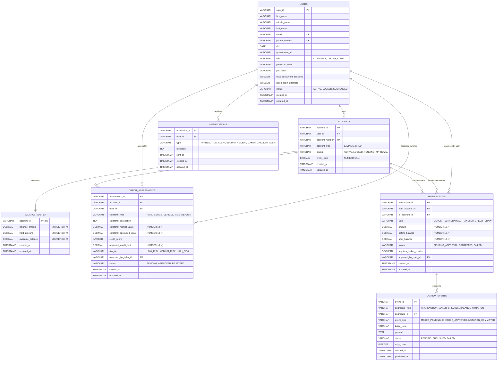

# Entity-Relationship Diagram and Database Storage Topology

This document defines the canonical database schemas across the Master Transactional Database (Oracle XE 21c), the Dedicated Immutable Audit Vault (PostgreSQL 16), and the In-Memory Session Cache (Redis 7).

---

## 1. Storage Boundary and Entity-Relationship Model



---

## 2. Master State Storage (Oracle XE 21c DDL)

Oracle XE houses all live operational and relational data. Service Name: `XEPDB1`, User: `fse_user`.

```sql
-- 1. Users Table
CREATE TABLE users (
    user_id                 VARCHAR2(64) PRIMARY KEY,
    first_name              VARCHAR2(100) NOT NULL,
    middle_name             VARCHAR2(100),
    last_name               VARCHAR2(100) NOT NULL,
    email                   VARCHAR2(255) NOT NULL UNIQUE,
    phone_number            VARCHAR2(30) NOT NULL UNIQUE,
    dob                     DATE NOT NULL,
    government_id           VARCHAR2(100) NOT NULL,
    role                    VARCHAR2(20) NOT NULL CHECK (role IN ('CUSTOMER', 'TELLER', 'ADMIN')),
    password_hash           VARCHAR2(255) NOT NULL,
    pin_hash                VARCHAR2(255),
    max_concurrent_sessions NUMBER(3) DEFAULT 3 NOT NULL,
    failed_login_attempts   NUMBER(3) DEFAULT 0 NOT NULL,
    status                  VARCHAR2(20) DEFAULT 'ACTIVE' NOT NULL CHECK (status IN ('ACTIVE', 'LOCKED', 'SUSPENDED')),
    created_at              TIMESTAMP WITH TIME ZONE DEFAULT CURRENT_TIMESTAMP NOT NULL,
    updated_at              TIMESTAMP WITH TIME ZONE DEFAULT CURRENT_TIMESTAMP NOT NULL
);

-- 2. Accounts Table
CREATE TABLE accounts (
    account_id     VARCHAR2(64) PRIMARY KEY,
    user_id        VARCHAR2(64) NOT NULL,
    account_number VARCHAR2(32) NOT NULL UNIQUE,
    account_type   VARCHAR2(20) NOT NULL CHECK (account_type IN ('SAVINGS', 'CREDIT')),
    status         VARCHAR2(20) DEFAULT 'ACTIVE' NOT NULL CHECK (status IN ('ACTIVE', 'LOCKED', 'PENDING_APPROVAL')),
    credit_limit   NUMBER(18, 4) DEFAULT 0.0000 NOT NULL CHECK (credit_limit >= 0),
    created_at     TIMESTAMP WITH TIME ZONE DEFAULT CURRENT_TIMESTAMP NOT NULL,
    updated_at     TIMESTAMP WITH TIME ZONE DEFAULT CURRENT_TIMESTAMP NOT NULL,
    CONSTRAINT fk_acc_user FOREIGN KEY (user_id) REFERENCES users(user_id)
);

-- 3. Balance Master Table (Locked via SELECT ... FOR UPDATE)
CREATE TABLE balance_master (
    account_id        VARCHAR2(64) PRIMARY KEY,
    balance_amount    NUMBER(18, 4) DEFAULT 0.0000 NOT NULL CHECK (balance_amount >= 0),
    hold_amount       NUMBER(18, 4) DEFAULT 0.0000 NOT NULL CHECK (hold_amount >= 0),
    available_balance NUMBER(18, 4) DEFAULT 0.0000 NOT NULL,
    created_at        TIMESTAMP WITH TIME ZONE DEFAULT CURRENT_TIMESTAMP NOT NULL,
    updated_at        TIMESTAMP WITH TIME ZONE DEFAULT CURRENT_TIMESTAMP NOT NULL,
    CONSTRAINT fk_bm_account FOREIGN KEY (account_id) REFERENCES accounts(account_id),
    CONSTRAINT chk_bm_available_balance CHECK (balance_amount >= hold_amount)
);

-- 4. Credit Assessments Table
CREATE TABLE credit_assessments (
    assessment_id              VARCHAR2(64) PRIMARY KEY,
    account_id                 VARCHAR2(64) NOT NULL,
    user_id                    VARCHAR2(64) NOT NULL,
    collateral_type            VARCHAR2(50) NOT NULL CHECK (collateral_type IN ('REAL_ESTATE', 'VEHICLE', 'TIME_DEPOSIT')),
    collateral_description     CLOB NOT NULL,
    collateral_market_value    NUMBER(18, 4) NOT NULL,
    collateral_appraised_value NUMBER(18, 4) NOT NULL,
    credit_score               NUMBER(4) NOT NULL CHECK (credit_score BETWEEN 300 AND 850),
    approved_credit_limit      NUMBER(18, 4) NOT NULL,
    risk_tier                  VARCHAR2(20) NOT NULL CHECK (risk_tier IN ('LOW_RISK', 'MEDIUM_RISK', 'HIGH_RISK')),
    assessed_by_teller_id      VARCHAR2(64) NOT NULL,
    status                     VARCHAR2(20) DEFAULT 'PENDING' NOT NULL CHECK (status IN ('PENDING', 'APPROVED', 'REJECTED')),
    created_at                 TIMESTAMP WITH TIME ZONE DEFAULT CURRENT_TIMESTAMP NOT NULL,
    updated_at                 TIMESTAMP WITH TIME ZONE DEFAULT CURRENT_TIMESTAMP NOT NULL,
    CONSTRAINT fk_ca_account FOREIGN KEY (account_id) REFERENCES accounts(account_id),
    CONSTRAINT fk_ca_user FOREIGN KEY (user_id) REFERENCES users(user_id),
    CONSTRAINT fk_ca_teller FOREIGN KEY (assessed_by_teller_id) REFERENCES users(user_id)
);

-- 5. Transactions Table
CREATE TABLE transactions (
    transaction_id         VARCHAR2(64) PRIMARY KEY,
    from_account_id        VARCHAR2(64) NOT NULL,
    to_account_id          VARCHAR2(64),
    type                   VARCHAR2(30) NOT NULL CHECK (type IN ('DEPOSIT', 'WITHDRAWAL', 'TRANSFER', 'CREDIT_DRAW')),
    amount                 NUMBER(18, 4) NOT NULL CHECK (amount > 0),
    before_balance         NUMBER(18, 4) NOT NULL,
    after_balance          NUMBER(18, 4) NOT NULL,
    status                 VARCHAR2(30) NOT NULL CHECK (status IN ('PENDING_APPROVAL', 'COMMITTED', 'FAILED')),
    requires_maker_checker NUMBER(1) DEFAULT 0 NOT NULL CHECK (requires_maker_checker IN (0, 1)),
    approved_by_user_id    VARCHAR2(64),
    created_at             TIMESTAMP WITH TIME ZONE DEFAULT CURRENT_TIMESTAMP NOT NULL,
    updated_at             TIMESTAMP WITH TIME ZONE DEFAULT CURRENT_TIMESTAMP NOT NULL,
    CONSTRAINT fk_tx_from_acc FOREIGN KEY (from_account_id) REFERENCES accounts(account_id),
    CONSTRAINT fk_tx_to_acc FOREIGN KEY (to_account_id) REFERENCES accounts(account_id),
    CONSTRAINT fk_tx_approver FOREIGN KEY (approved_by_user_id) REFERENCES users(user_id)
);

-- 6. Outbox Events Table (Transactional Outbox Pattern)
CREATE TABLE outbox_events (
    event_id       VARCHAR2(64) PRIMARY KEY,
    aggregate_type VARCHAR2(50) NOT NULL CHECK (aggregate_type IN ('TRANSACTION', 'MAKER_CHECKER', 'BALANCE_MUTATION')),
    aggregate_id   VARCHAR2(64) NOT NULL,
    event_type     VARCHAR2(50) NOT NULL CHECK (event_type IN ('MAKER_PENDING', 'CHECKER_APPROVED', 'MUTATION_COMMITTED')),
    kafka_topic    VARCHAR2(100) NOT NULL,
    payload        CLOB NOT NULL,
    status         VARCHAR2(20) DEFAULT 'PENDING' NOT NULL CHECK (status IN ('PENDING', 'PUBLISHED', 'FAILED')),
    retry_count    NUMBER(4) DEFAULT 0 NOT NULL,
    created_at     TIMESTAMP WITH TIME ZONE DEFAULT CURRENT_TIMESTAMP NOT NULL,
    published_at   TIMESTAMP WITH TIME ZONE,
    CONSTRAINT fk_oe_aggregate FOREIGN KEY (aggregate_id) REFERENCES transactions(transaction_id)
);

-- 7. Notifications Table
CREATE TABLE notifications (
    notification_id VARCHAR2(64) PRIMARY KEY,
    user_id         VARCHAR2(64) NOT NULL,
    type            VARCHAR2(50) NOT NULL CHECK (type IN ('TRANSACTION_ALERT', 'SECURITY_ALERT', 'MAKER_CHECKER_ALERT')),
    message         CLOB NOT NULL,
    sent_at         TIMESTAMP WITH TIME ZONE DEFAULT CURRENT_TIMESTAMP NOT NULL,
    created_at      TIMESTAMP WITH TIME ZONE DEFAULT CURRENT_TIMESTAMP NOT NULL,
    updated_at      TIMESTAMP WITH TIME ZONE DEFAULT CURRENT_TIMESTAMP NOT NULL,
    CONSTRAINT fk_notif_user FOREIGN KEY (user_id) REFERENCES users(user_id)
);

-- Performance Indexes
CREATE INDEX idx_acc_user ON accounts(user_id);
CREATE INDEX idx_tx_from_acc ON transactions(from_account_id, created_at DESC);
CREATE INDEX idx_tx_to_acc ON transactions(to_account_id, created_at DESC);
CREATE INDEX idx_tx_status ON transactions(status);
CREATE INDEX idx_outbox_status ON outbox_events(status, created_at);
CREATE INDEX idx_notif_user ON notifications(user_id, sent_at DESC);
```

---

## 3. Dedicated Immutable Audit Vault (PostgreSQL 16 DDL)

PostgreSQL is strictly reserved for append-only audit logging. Database: `banking_audit`, User: `audit_user`.

```sql
CREATE TABLE ledger_mutation_audit (
    audit_id             BIGSERIAL PRIMARY KEY,
    transaction_id       VARCHAR(64) UNIQUE NOT NULL,
    account_id           VARCHAR(64) NOT NULL,
    mutation_type        VARCHAR(20) NOT NULL CHECK (mutation_type IN ('DEBIT', 'CREDIT', 'HOLD', 'RELEASE')),
    mutation_amount      NUMERIC(18, 4) NOT NULL CHECK (mutation_amount > 0),
    before_balance       NUMERIC(18, 4) NOT NULL CHECK (before_balance >= 0),
    after_balance        NUMERIC(18, 4) NOT NULL CHECK (after_balance >= 0),
    initiator_user_id    VARCHAR(64) NOT NULL,
    approved_by_user_id  VARCHAR(64),
    status               VARCHAR(20) DEFAULT 'COMMITTED' NOT NULL CHECK (status IN ('COMMITTED', 'FAILED', 'ROLLED_BACK')),
    created_at           TIMESTAMPTZ DEFAULT CURRENT_TIMESTAMP NOT NULL
);

-- Native trigger strictly rejecting UPDATE and DELETE
CREATE OR REPLACE FUNCTION prevent_audit_modification()
RETURNS TRIGGER AS $$
BEGIN
    RAISE EXCEPTION 'Compliance Violation: ledger_mutation_audit is strictly append-only. UPDATE and DELETE operations are forbidden.';
END;
$$ LANGUAGE plpgsql;

CREATE TRIGGER trg_no_update_delete_mutation_audit
BEFORE UPDATE OR DELETE ON ledger_mutation_audit
FOR EACH ROW EXECUTE FUNCTION prevent_audit_modification();

-- Performance Indexes
CREATE INDEX idx_audit_tx_id ON ledger_mutation_audit(transaction_id);
CREATE INDEX idx_audit_account ON ledger_mutation_audit(account_id, created_at DESC);
CREATE INDEX idx_audit_created_at ON ledger_mutation_audit(created_at DESC);
```

---

## 4. In-Memory Session and Token Cache (Redis 7 Topology)

To deliver sub-millisecond authentication verification at the API Gateway and avoid database contention, active JWT tokens, session lifecycles, concurrent session limits, and token revocations are managed in Redis (`redis-cache` on port 6379) rather than relational tables.

### Key Schemas and Expiration Policies

| Key Pattern | Redis Data Type | TTL | Purpose |
| :--- | :--- | :--- | :--- |
| `auth:token:{jti}` | Hash | 15 minutes | Stores claims, user ID, role, and client fingerprint for active access tokens. |
| `auth:user-sessions:{userId}` | Set | 7 days | Set of active token IDs (`jti`) belonging to a user. Used to enforce `max_concurrent_sessions`. |
| `auth:blacklist:{jti}` | String | Remaining token lifetime | Marker indicating revoked or logged-out token. Checked on every gateway request. |
| `auth:refresh:{tokenHash}` | Hash | 7 days | Refresh token family and device metadata for Refresh Token Rotation (RTR). |
| `idemp:{idempotencyKey}` | String (`SET NX EX 60`) | 60 seconds | Concurrency lock preventing double-submission of balance mutations. |

### Concurrency and Session Limit Enforcement Flow

1. **Authentication**: Upon successful credential check, the gateway or auth service queries the cardinality of `auth:user-sessions:{userId}` via `SCARD`.
2. **Session Eviction**: If the active count matches or exceeds `max_concurrent_sessions` (default 3 for customers, 5 for tellers), the oldest token `jti` is popped, added to `auth:blacklist:{jti}` with TTL, and removed from the active set.
3. **Registration**: The new token `jti` is added to `auth:user-sessions:{userId}` via `SADD` and registered with metadata in `auth:token:{jti}` via `HSET` and `EXPIRE`.
4. **Logout and Invalidation**: Calling logout pushes the current `jti` to `auth:blacklist:{jti}` and removes it from `auth:user-sessions:{userId}`.
