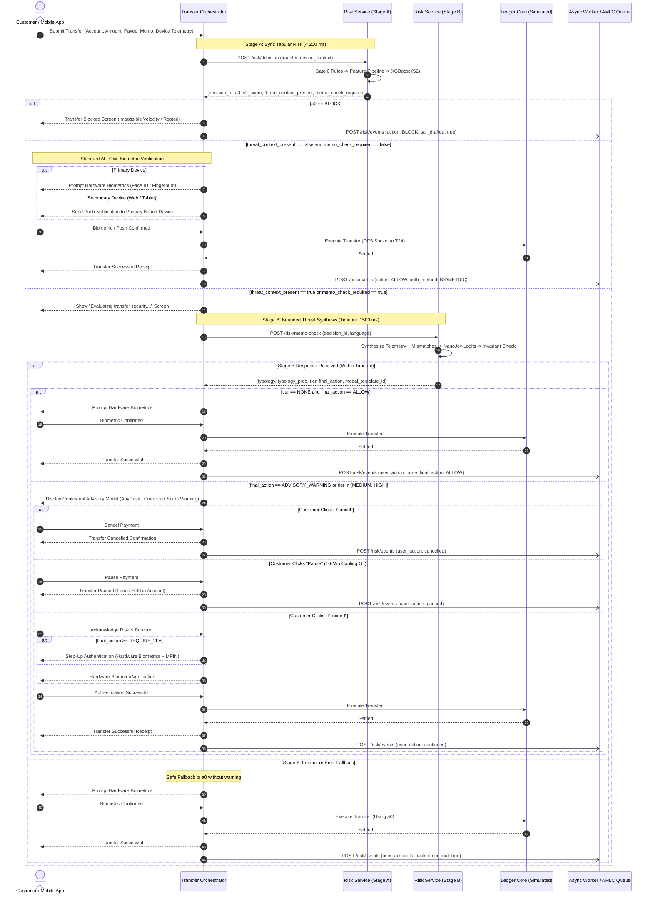

# Two-stage risk architecture

This document outlines the two-stage risk engine architecture for retail bank transfers in a Philippine simulation context. The system decouples immediate tabular risk evaluation from bounded scam typology analysis, ensuring fast payment settlement while delivering targeted friction for social engineering fraud.

## 1. Architectural overview

Retail banking transfers face two distinct fraud categories:
1. Account takeover and malware-driven transfers, where attackers operate without the genuine account holder's consent.
2. Authorized push payment (APP) scams, where the genuine customer authorizes the payment under social engineering pressure, deception, or false promises.

Because scam victims authorize transfers directly from their own authenticated devices, conventional step-up authentication (such as biometrics or device approvals) is often completed by the victim without hesitation. The primary preventative control for authorized scams is therefore a targeted, context-specific customer warning presented before the payment settles.

To balance low latency with targeted scam mitigation, the risk engine divides responsibilities across two stages and an asynchronous reporting path:
- Stage A (synchronous, latency budget under 200 ms): Gate 0 deterministic security rules and XGBoost tabular scoring determine the base action (ALLOW, ADVISORY_WARNING, REQUIRE_2FA, or BLOCK). NanoJev is never called here.
- Stage B (synchronous-bounded, configurable timeout default 1500 ms): If a memo or device threat context (remote-access tools like AnyDesk, active voice call state, purpose-payee mismatch) is present and Stage A did not block the transaction, the orchestrator requests threat evaluation. NanoJev synthesizes the threat narrative and selects an advisory warning or friction tier.
- Asynchronous path (fire-and-forget): The orchestrator emits an event record after customer action or timeout. The risk service logs audit records, drafts Suspicious Transaction Reports (STR/SAR) for the Anti-Money Laundering Council (AMLC) simulation, and enqueues cases for compliance review.

## 2. Component responsibilities

The boundary between orchestrator and risk engine is strict: the risk service evaluates risk and recommends actions; it never moves money. The orchestrator maintains customer session state, displays user interfaces, executes step-up authentication, and invokes the ledger.

| Component | Responsibility | Latency expectation | Failure mode |
| :--- | :--- | :--- | :--- |
| Transfer Orchestrator | Owns customer transfer lifecycle, modal presentation, cool-off timer, biometric/push step-up execution, and core ledger call. | Orchestration overhead < 10 ms | Drops to safe fallback action on risk service errors. |
| Stage A Risk Engine | Gate 0 hard rules (velocity, device tampering, mock location) and XGBoost tabular inference. | Under 200 ms budget (actual p50: ~30 ms) | Returns conservative fallback (REQUIRE_2FA) on internal error. |
| Stage B Typology & Threat Engine | NanoJev (Qwen2.5-0.5B ONNX INT8) synthesizes unstructured device telemetry (AnyDesk, active calls, payee mismatches) and scam typologies; assigns advisory warning templates and friction tiers. | Bounded timeout: 1500 ms (cached: ~3 ms, fresh: ~220 ms) | On timeout or error, orchestrator falls back to Stage A action a0 with no warning modal. |
| Async Review & AMLC Queue | Generates AMLC SAR draft markdown files, logs append-only JSONL audit events, and enqueues high-risk cases for human compliance review. | Background, decoupled from payment settlement | Queue drops recorded in operational metrics; does not block customer transactions. |

## 3. Friction tiers and calibration thresholds

Stage B assigns transactions to one of three friction tiers based on the highest scam typology probability output by NanoJev. The classification uses 7 fixed labels:
- `prize_or_fee_scam` (advance-fee fraud, fake raffle rewards, GCash claiming fees)
- `investment_scam` (crypto doubling, Ponzi schemes, pig-butchering patterns)
- `romance_scam` (emergency aid for online lovers, visa/flight travel fees)
- `impersonation` (fake bank representatives, police, court arrest warrants)
- `fake_invoice_or_selling_scam` (online retail deposits, non-existent COD deliveries)
- `other_suspicious` (unclassified urgent pressure transfers)
- `none` (routine commercial or personal payments)

### Frozen configuration parameters

All thresholds were selected on the validation split (split V) and frozen in `hybrid_bench/models/typology_config.json` before multi-split benchmark evaluation:
- Optimal temperature: T* = 7.12 (fit via negative log-likelihood minimization on validation split V, reducing Expected Calibration Error from 0.5824 to 0.0919)
- Medium friction threshold: theta_medium = 0.35
- High friction threshold: theta_high = 0.50

### Tier definitions

1. NONE (typology is `none` or max scam probability < 0.35):
   The transaction is treated as routine. No warning modal is presented to the customer. Final action remains a0. Requires routine hardware biometric verification.

2. MEDIUM (0.35 <= max scam probability < 0.50):
   The customer is presented with a targeted typology or device threat warning modal explaining the detected pattern in their selected language. The modal provides three actions:
   - Cancel: Aborts the transfer immediately without debiting funds.
   - Pause: Holds the transfer in a 10-minute cooling pause to allow second thought or consultation.
   - Proceed: Requires customer acknowledgment of risk and hardware biometric authentication.

3. HIGH (max scam probability >= 0.50):
   The customer is shown a high-urgency warning modal with mandatory cool-off pause (simulated 24-hour hold). The transfer is held pending compliance review. If a0 was BLOCK, it remains strictly BLOCK.

## 4. Escalate-only safety invariant

To prevent machine learning models or adversarial memo prompts from weakening bank controls, Stage B enforces an architectural invariant:

RiskTier(final_action) >= RiskTier(a0)

Action tiers are ranked as:
- ALLOW (Tier 0)
- ADVISORY_WARNING (Tier 1)
- REQUIRE_2FA (Tier 2, displayed as STEP_UP)
- BLOCK (Tier 3)

NanoJev may escalate a transaction (e.g. from ALLOW to ADVISORY_WARNING, REQUIRE_2FA, or BLOCK), but it can never downgrade a transaction. A Stage A BLOCK verdict cannot be converted to REQUIRE_2FA, ADVISORY_WARNING, or ALLOW, regardless of what the customer inputs in the memo.

This property was verified by:
1. 1,000 randomized property tests across all combinations of inputs, timeouts, and error flags.
2. 60 adversarial prompt injection test vectors across 10 attack categories (100% invariant preservation, 0 downgrades).

## 5. Device binding and authentication controls (Zero SMS OTP)

In strict accordance with Philippine regulatory expectations under BSP Circular 1213:
1. Zero SMS OTP for transactions: SMS OTP is strictly restricted to initial onboarding and device binding. No transfer can be authorized or bypassed via SMS OTP.
2. Primary Device Authorization: Transfers initiated on the customer's cryptographically bound Primary Device require local hardware Biometrics (Face ID or Fingerprint).
3. Secondary Device Authorization: Transfers initiated on an unbound Secondary Device (Web Banking or Tablet) trigger an Out-of-Band (OOB) Push Notification to the bound Primary Device requiring biometric verification.
4. Routine Transfers (`ALLOW`): Every transfer, even when evaluated as clean and low-risk (`ALLOW`), requires bound hardware biometric authorization.

## 6. Prompt caching and security controls

Memos and device telemetry strings are untrusted input. Stage B isolates inputs using the following protections:
1. Delimiter sanitization: All ChatML tokens (`<|im_start|>`, `<|im_end|>`), markdown fence blocks, and control characters are stripped.
2. Character truncation: Memos are truncated to 150 characters before entering the prompt.
3. Content-bound SHA256 cache: NanoJev results are cached in local storage. The cache key binds the ONNX model hash, normalized memo text, amount, payee age, balance drain ratio, and spike ratio. Identical transfers resolve from cache in under 1 ms, protecting the CPU from repetitive inference spikes.
