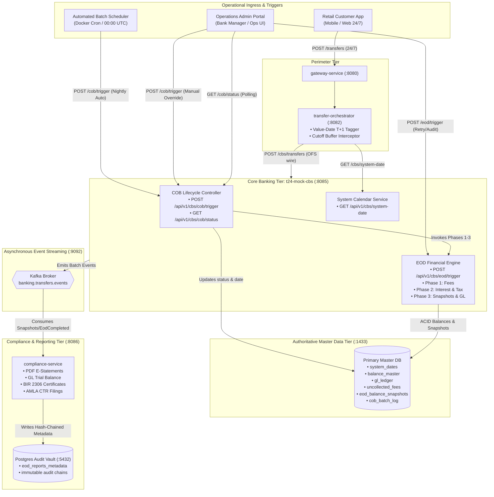
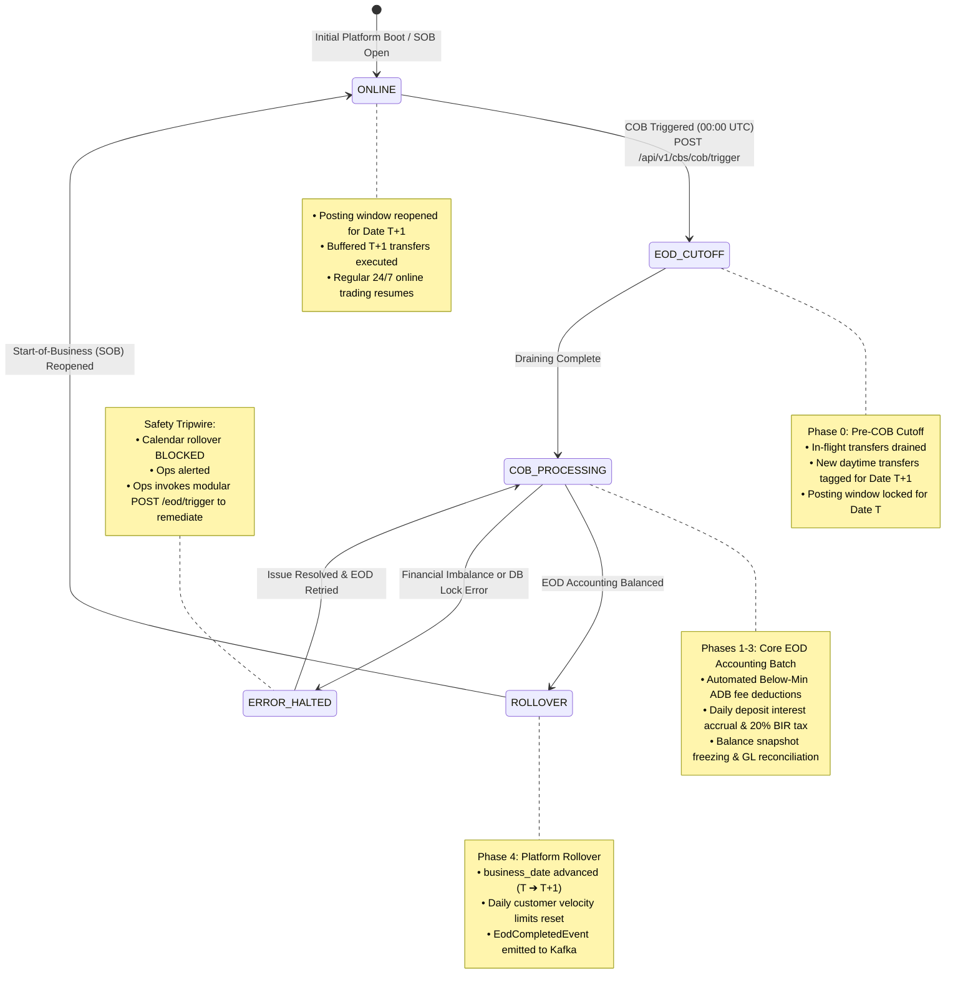
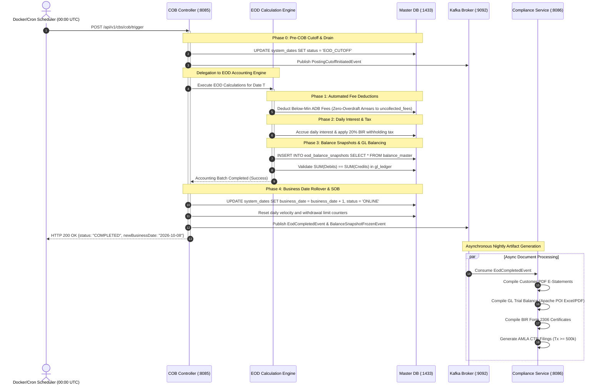
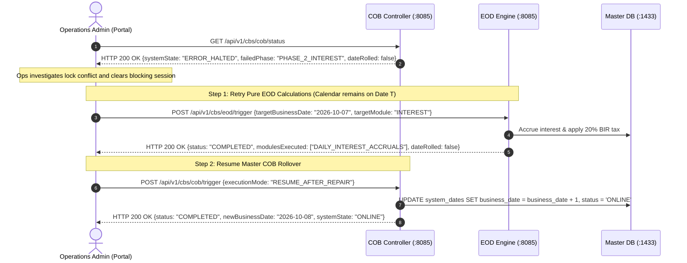
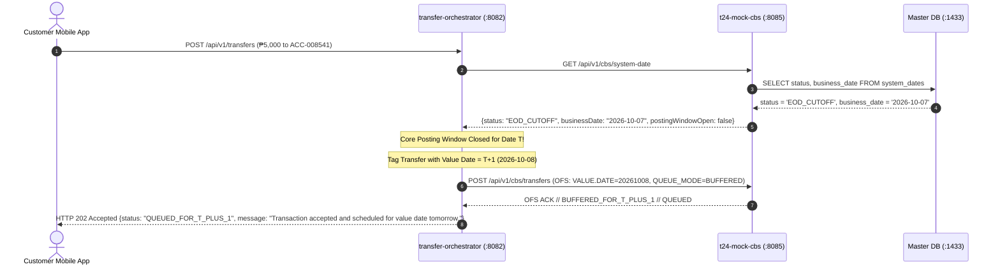

# High-Level Design Architecture: Close of Business (COB) & End-of-Day (EOD)

## 1. Executive Architectural Distinction: COB vs. EOD

In modern core banking architectures (specifically modeling Temenos T24 / Transact), **COB** and **EOD** represent two distinct architectural tiers of the daily financial closing cycle:

```
┌────────────────────────────────────────────────────────────────────────────────────────┐
│               CLOSE OF BUSINESS (COB) — MASTER OPERATIONAL STATE MACHINE               │
│                                                                                        │
│  [Phase 0: Pre-COB]      [Phases 1-3: Core EOD Batch]     [Phase 4: Post-COB / SOB]    │
│  • Channel Drain         ┌──────────────────────────────┐ • Business Date Rollover     │
│  • Cutoff Enforcement    │ End-of-Day (EOD) Accounting: │   (T ➔ T+1)                  │
│  • T+1 Value-Date Tag    │ • Subfeature 4.2: Fees       │ • Reset Daily Limits         │
│  • In-Flight Clearing    │ • Subfeature 4.3: Interest   │ • Re-open Online Processing  │
│                          │ • Subfeature 4.1: Reports/GL │ • Unbuffer T+1 Queue         │
│                          └──────────────────────────────┘                              │
└────────────────────────────────────────────────────────────────────────────────────────┘
```

### 1.1 Comparison Matrix

| Architectural Dimension | **End-of-Day (EOD)** | **Close of Business (COB)** |
| :--- | :--- | :--- |
| **Domain Scope** | **Financial Accounting & Ledger Computation** | **System Lifecycle & Operational State Machine** |
| **Question It Answers** | *"What financial balances, fees, and interest must be calculated for Date $T$?"* | *"How does the core banking platform transition operationally from Date $T \to T+1$?"* |
| **Hierarchy** | **Child Module / Computational Engine** (runs *inside* COB Phases 1–3). | **Parent Container / Master Orchestrator** (coordinates Phases 0 through 4). |
| **Key Responsibilities** | • Calculate below-min ADB maintenance fees.<br>• Accrue daily deposit interest and 20% BIR withholding tax.<br>• Freeze closing balance snapshots (`eod_balance_snapshots`).<br>• Verify double-entry GL balance ($\sum \text{Debits} = \sum \text{Credits}$). | • Manage system state transitions (`ONLINE` ➔ `EOD_CUTOFF` ➔ `COB_PROCESSING` ➔ `ROLLOVER` ➔ `ONLINE`).<br>• Drain in-flight channel transfers and tag 24/7 intake to $T+1$.<br>• Sequence and execute the EOD accounting batch.<br>• Advance authoritative calendar date in `system_dates`.<br>• Reset daily customer velocity/transfer limits.<br>• Trigger Start-of-Business (SOB) re-opening. |
| **Calendar Impact** | **NEVER changes the calendar date.** Balances and logs remain strictly for Date $T$. | **Advances the calendar date from $T \to T+1$** in `system_dates`. |
| **Execution Nature** | Purely computational, idempotent, domain-level accounting. | Platform-level orchestration and state lifecycle governance. |

### 1.2 Architectural Domain Ownership (What Belongs to COB vs. EOD)

To make it immediately obvious which components, phases, and entities belong to which domain:

#### A. Belongs to COB (Close of Business) — Platform Operations & Lifecycle
* **Phases**:
  * **Phase 0 (Pre-COB)**: Locking the posting window, draining in-flight transactions, tagging new 24/7 transfers to Date $T+1$.
  * **Phase 4 (Post-COB / Rollover)**: Advancing `system_dates` ($T \to T+1$), resetting daily customer velocity limits, and reopening the system (`ONLINE`).
* **State Machine**: Governs `ONLINE` ➔ `EOD_CUTOFF` ➔ `COB_PROCESSING` ➔ `ROLLOVER` ➔ `ONLINE`, and the `ERROR_HALTED` tripwire.
* **APIs**:
  * `POST /api/v1/cbs/cob/trigger` (Master pipeline trigger)
  * `GET /api/v1/cbs/cob/status` (Active progress monitoring)
  * `GET /api/v1/cbs/system-date` (Authoritative core date/window query)
* **Database Tables**:
  * `system_dates` (Calendar date and platform status)
  * `cob_batch_log` (Macro batch execution audit)
* **Perimeter Role**: `transfer-orchestrator` intercepting daytime transfers during cutoff with `HTTP 202 Accepted { status: "QUEUED_FOR_T_PLUS_1" }`.

#### B. Belongs to EOD (End of Day) — Financial Accounting Engine
* **Phases**:
  * **Phase 1 (Fees)**: Calculating below-minimum ADB fees with Zero-Overdraft Protection.
  * **Phase 2 (Interest & Tax)**: Daily deposit interest accrual and month-end capitalization with 20% BIR withholding tax split.
  * **Phase 3 (Snapshots & GL)**: Freezing daily balance snapshots and double-entry General Ledger balancing ($\sum \text{Debits} = \sum \text{Credits}$).
* **APIs**:
  * `POST /api/v1/cbs/eod/trigger` (Modular accounting calculations without rolling the system calendar).
* **Database Tables**:
  * `balance_master` (Balance mutations for fees & interest)
  * `gl_ledger` (Double-entry journal records)
  * `uncollected_fees` (Arrears tracking for insolvent accounts)
  * `eod_balance_snapshots` (Permanent daily snapshot history)
* **Reporting (Async)**: `compliance-service` generating PDF E-Statements, GL Trial Balance sheets, BIR Form 2306 tax certificates, and AMLA CTR filings.

---

## 2. Component Topology Architecture



---

## 3. Master Operational State Machine

The authoritative state of the core banking platform is persisted in `system_dates.status`. All services coordinate around these lifecycle states:



---

## 4. End-to-End Operational Workflows

### 4.1 Scenario A: Automated Nightly COB Run (Happy Path)

* **Trigger**: Automated Scheduler fires at `00:00 UTC` via HTTP `POST /api/v1/cbs/cob/trigger`.
* **Execution**: Fully automated transition across Phases 0 through 4.



---

### 4.2 Scenario B: Manual Error Recovery & Remediation

When a computational failure occurs (e.g., transient database lock conflict during interest accrual), the state machine halts in `ERROR_HALTED` to protect financial integrity:



---

### 4.3 Scenario C: 24/7 Digital Intake During Cutoff Window

Customer mobile banking remains functional 24/7. Transactions submitted during the COB window are smoothly tagged with Value Date $T+1$:



---

## 5. API Specification & Endpoint Strategy

### 5.1 Endpoint Overview Matrix

| Service | Port | Method | Endpoint Path | Caller | Primary Responsibility | Wire Format |
| :--- | :--- | :--- | :--- | :--- | :--- | :--- |
| **`t24-mock-cbs`** | `:8085` | `POST` | `/api/v1/cbs/cob/trigger` | Batch Scheduler / Ops Admin | Triggers master Close of Business platform lifecycle (Phases 0–4). | Native JSON |
| **`t24-mock-cbs`** | `:8085` | `GET` | `/api/v1/cbs/cob/status` | Ops Admin / Monitoring Tools | Polls real-time COB state machine, active phase, progress %, and error logs. | Native JSON |
| **`t24-mock-cbs`** | `:8085` | `POST` | `/api/v1/cbs/eod/trigger` | Internal COB / Ops Admin | Triggers idempotent financial calculations for Date $T$ without calendar rollover. | Native JSON |
| **`t24-mock-cbs`** | `:8085` | `GET` | `/api/v1/cbs/system-date` | `transfer-orchestrator` / Gateway | Queries current authoritative business date and posting window status. | Native JSON |

---

### 5.2 Endpoint Schemas

#### 5.2.1 [COB Architecture] `POST /api/v1/cbs/cob/trigger` (Master COB Pipeline Trigger)
* **Purpose**: Orchestrates the master Close of Business platform lifecycle from business date $T \to T+1$.
* **Request Payload**:
  ```json
  {
    "executionMode": "AUTOMATED_SCHEDULE",
    "targetBusinessDate": "2026-10-07",
    "operatorId": "SYSTEM_SCHEDULER"
  }
  ```
* **Response Payload (HTTP 200 OK)**:
  ```json
  {
    "status": "COMPLETED",
    "previousBusinessDate": "2026-10-07",
    "newBusinessDate": "2026-10-08",
    "phasesCompleted": [
      "PHASE_0_POSTING_CUTOFF",
      "PHASE_1_AUTOMATED_FEE_DEDUCTIONS",
      "PHASE_2_DAILY_INTEREST_ACCRUALS",
      "PHASE_3_SNAPSHOT_FREEZING",
      "PHASE_4_BUSINESS_DATE_ROLLOVER"
    ],
    "metrics": {
      "accountsProcessed": 14500,
      "totalFeesCollectedPhp": 85200.00,
      "totalUncollectedFeesLoggedPhp": 3400.00,
      "totalInterestAccruedPhp": 41250.00,
      "totalTaxWithheldBirPhp": 8250.00,
      "snapshotsFrozen": 14500
    },
    "systemState": "ONLINE",
    "executionDurationMs": 4210,
    "completedAtUtc": "2026-10-08T00:04:10Z"
  }
  ```

#### 5.2.2 [COB Architecture] `GET /api/v1/cbs/cob/status` (Active COB State Machine & Progress Status)
* **Purpose**: Real-time observability during long-running batch runs.
* **Request**: None (HTTP GET).
* **Response Payload (HTTP 200 OK)**:
  ```json
  {
    "businessDate": "2026-10-07",
    "systemState": "COB_PROCESSING",
    "currentPhase": "PHASE_2_DAILY_INTEREST_ACCRUALS",
    "progressPercent": 65,
    "startedAtUtc": "2026-10-08T00:00:02Z",
    "elapsedDurationMs": 2730,
    "operatorId": "SYSTEM_SCHEDULER",
    "isLocked": true,
    "lastError": null
  }
  ```

#### 5.2.3 [EOD Architecture] `POST /api/v1/cbs/eod/trigger` (Modular EOD Accounting Calculation Trigger)
* **Purpose**: Calculates fees, interest, and snapshots for Date $T$ without advancing the system calendar.
* **Request Payload**:
  ```json
  {
    "targetBusinessDate": "2026-10-07",
    "targetModule": "ALL",
    "operatorId": "OPS_BATCH_EXEC"
  }
  ```
* **Response Payload (HTTP 200 OK)**:
  ```json
  {
    "status": "COMPLETED",
    "businessDate": "2026-10-07",
    "modulesExecuted": [
      "AUTOMATED_FEE_DEDUCTIONS",
      "DAILY_INTEREST_ACCRUALS",
      "SNAPSHOT_FREEZING"
    ],
    "metrics": {
      "accountsProcessed": 14500,
      "totalFeesCollectedPhp": 85200.00,
      "totalUncollectedFeesLoggedPhp": 3400.00,
      "totalInterestAccruedPhp": 41250.00,
      "totalTaxWithheldBirPhp": 8250.00,
      "snapshotsFrozen": 14500
    },
    "dateRolled": false,
    "executionDurationMs": 3150,
    "completedAtUtc": "2026-10-08T00:03:15Z"
  }
  ```

#### 5.2.4 [COB Architecture] `GET /api/v1/cbs/system-date` (Authoritative Calendar & Posting Window Status)
* **Purpose**: Inquired by `transfer-orchestrator` to determine whether funds transfers post immediately or must be buffered.
* **Response Payload (HTTP 200 OK)**:
  ```json
  {
    "businessDate": "2026-10-07",
    "status": "ONLINE",
    "postingWindowOpen": true,
    "currentPhase": null,
    "lastRolloverAtUtc": "2026-10-07T00:04:21Z"
  }
  ```

---

## 6. Master Database Schema Entities (`t24-mock-cbs`)

### 6.1 COB Architecture Entities (Platform State & Batch Audit)

```sql
-- 1. Authoritative Core Calendar & Platform State (Governed by COB)
CREATE TABLE system_dates (
    id INT PRIMARY KEY DEFAULT 1,
    business_date DATE NOT NULL,
    status VARCHAR(20) NOT NULL CHECK (status IN ('ONLINE', 'EOD_CUTOFF', 'COB_PROCESSING', 'ROLLOVER', 'ERROR_HALTED')),
    posting_window_open BOOLEAN NOT NULL DEFAULT TRUE,
    last_cob_completed_at TIMESTAMP WITH TIME ZONE NULL,
    updated_at TIMESTAMP WITH TIME ZONE NOT NULL DEFAULT CURRENT_TIMESTAMP
);

-- 2. Master COB Operational Audit Log (Governed by COB)
CREATE TABLE cob_batch_log (
    batch_id BIGSERIAL PRIMARY KEY,
    business_date DATE NOT NULL,
    started_at TIMESTAMP WITH TIME ZONE NOT NULL,
    completed_at TIMESTAMP WITH TIME ZONE NULL,
    status VARCHAR(20) NOT NULL, -- 'RUNNING', 'COMPLETED', 'FAILED'
    current_phase VARCHAR(50) NOT NULL,
    accounts_processed INT NOT NULL DEFAULT 0,
    total_fees_collected NUMERIC(18,2) NOT NULL DEFAULT 0.00,
    total_interest_accrued NUMERIC(18,2) NOT NULL DEFAULT 0.00,
    total_tax_withheld NUMERIC(18,2) NOT NULL DEFAULT 0.00,
    error_message TEXT NULL
);
```

### 6.2 EOD Architecture Entities (Financial Ledgers, Arrears & Snapshots)

```sql
-- 3. Authoritative Closing Balance Snapshots (Generated by EOD Phase 3)
CREATE TABLE eod_balance_snapshots (
    snapshot_id BIGSERIAL PRIMARY KEY,
    business_date DATE NOT NULL,
    account_id VARCHAR(32) NOT NULL,
    closing_ledger_balance NUMERIC(18,2) NOT NULL,
    closing_available_balance NUMERIC(18,2) NOT NULL,
    accrued_interest_ytd NUMERIC(18,2) NOT NULL DEFAULT 0.00,
    frozen_at TIMESTAMP WITH TIME ZONE NOT NULL DEFAULT CURRENT_TIMESTAMP,
    CONSTRAINT uq_account_date UNIQUE (account_id, business_date)
);

-- 4. Zero-Overdraft Arrears Tracking (Generated by EOD Phase 1 Fees)
CREATE TABLE uncollected_fees (
    arrears_id BIGSERIAL PRIMARY KEY,
    account_id VARCHAR(32) NOT NULL,
    fee_type VARCHAR(30) NOT NULL, -- 'BELOW_MIN_ADB', 'DORMANCY'
    amount_due NUMERIC(18,2) NOT NULL,
    amount_collected NUMERIC(18,2) NOT NULL DEFAULT 0.00,
    amount_unpaid NUMERIC(18,2) NOT NULL,
    business_date DATE NOT NULL,
    is_settled BOOLEAN NOT NULL DEFAULT FALSE,
    logged_at TIMESTAMP WITH TIME ZONE NOT NULL DEFAULT CURRENT_TIMESTAMP
);
```

---

## 7. Architectural Invariants & Non-Negotiables

1. **Inviolable Date Advancement Rule**: The authoritative calendar date in `system_dates` must **NEVER** advance to $T+1$ if any EOD calculation phase fails or if the General Ledger does not balance ($\sum \text{Debits} \ne \sum \text{Credits}$).
2. **Zero-Overdraft Maintenance Fee Invariant**: Deducting below-min ADB maintenance fees must never drive a customer account into an unarranged negative balance. If an account has $\text{Balance} < \text{Fee}$, the CBS deducts only available funds down to 0.00 and logs the unpaid balance to `uncollected_fees`.
3. **BIR 20% Withholding Tax Invariant**: On month-end interest capitalization, the CBS must split gross interest: crediting exactly 80% to the customer liability balance and crediting 20% directly to the BIR Tax Withholding Payable General Ledger account (`GL-2401`).
4. **24/7 Channel Non-Disruption**: Retail channels are never rejected with hard 500 errors during COB. Transfers arriving during `EOD_CUTOFF` receive `HTTP 202 Accepted` and are value-dated for next business day settlement ($T+1$).
