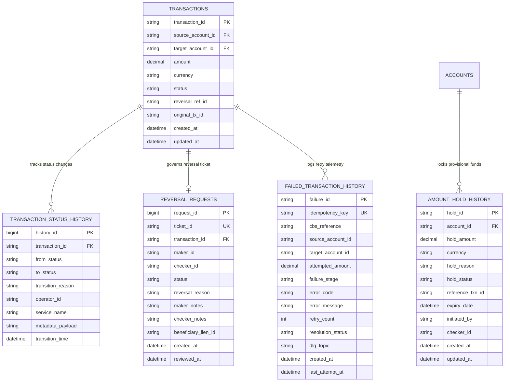
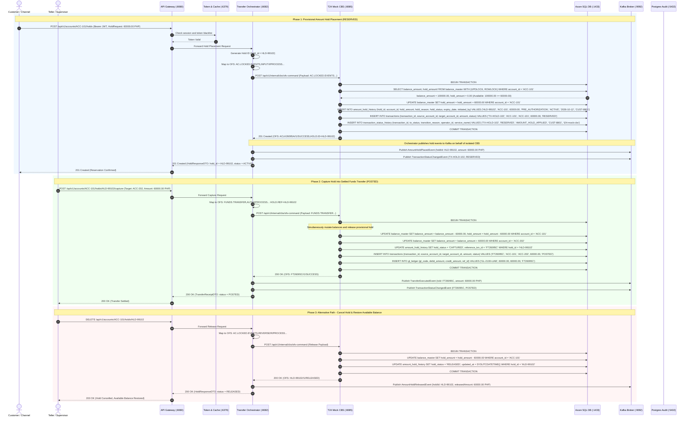
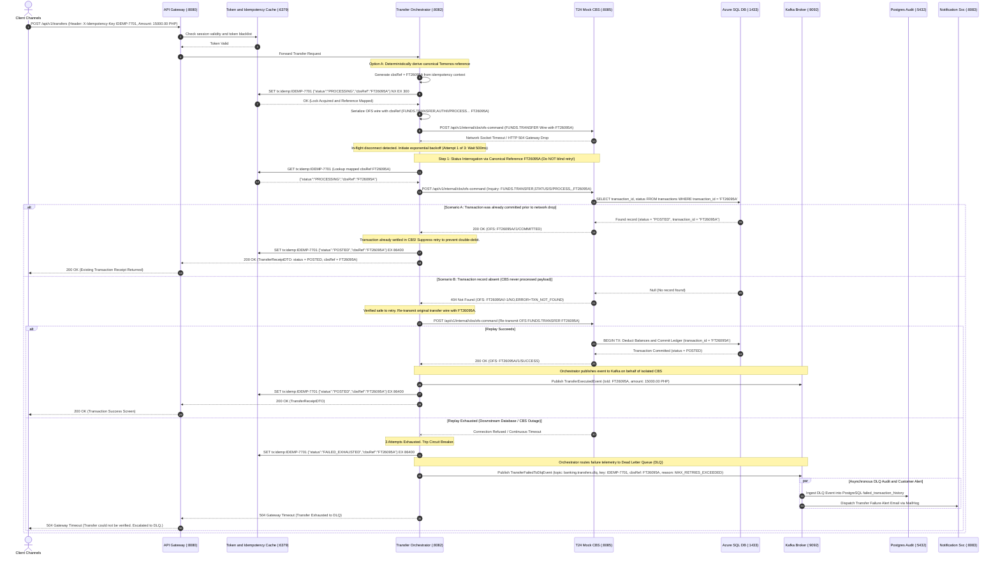

# Core Banking Capabilities: Technical Architecture, Dedicated Schemas & Sequence Diagrams

This document defines the unified technical specifications, database audit schemas, and sequence diagrams for the core banking transaction capabilities:

1. **Intra-Bank Transaction Reversal** (Maker-Checker Dual Control, Beneficiary Lien Placement, and Compensating Double-Entry)
2. **Amount Holds & Reservations** (Provisional Locking, Pre-Authorizations, and Capture/Release via Temenos `AC.LOCKED.EVENTS`)
3. **Failed Transaction & Retry Management** (Idempotent Status Interrogation, Zero Double-Debit Guarantee, Circuit Breaker, and Dead Letter Queue)

---

## 1. Architectural System Overview

The architecture enforces a strict boundary between Edge Orchestration and the Authoritative Core Banking System (CBS) enclave:

```
┌─────────────────┐       HTTPS / JWT       ┌─────────────────┐    token check    ┌─────────────────┐
│ Client Channels │────────────────────────►│   API Gateway   │──────────────────►│   Token Cache   │
│ React & Flutter │                         │  Spring Cloud   │                   │   Redis :6379   │
└─────────────────┘                         └────────┬────────┘                   └─────────────────┘
                                                     │ route request
                                                     ▼
                                            ┌───────────────────────┐
                                            │ Transfer Orchestrator │◄───sync risk check───►┌────────────────┐
                                            │   Spring Boot :8082   │                       │  Risk Engine   │
                                            └──────────┬────────────┘                       │ Python :8084   │
                                                       │                                    └───────┬────────┘
                    ┌──────────────────────────────────┼────────────────────────────────┐           │
                    │ 2FA OTP Advice                   │ Private REST / OFS Wire        │           │ risk evals
                    ▼                                  ▼                                │           ▼
         ┌──────────────────────┐          ┌───────────────────────┐                    │   ┌───────────────┐
         │ Notification Service │          │     T24 Mock CBS      │                    ├──►│ Event Stream  │
         │  Spring Boot :8083   │          │   Spring Boot :8085   │                    │   │  Kafka :9092  │
         └──────────────────────┘          │(Isolated Core Enclave)│                    │   └───────┬───────┘
                                           └───────────┬───────────┘                    │           │
                                                       │ ACID balance updates           │           │ audit stream
                                                       ▼                                │           │
                                            ┌───────────────────────┐                   │           ▼
                                            │  Azure SQL Database   │                   │   ┌───────────────┐
                                            │   Master CBS Ledgers  │                   └──►│  Audit Vault  │
                                            │ (Exclusive Connection)│                       │PostgreSQL:5432│
                                            └───────────────────────┘                       └───────────────┘
```

### Architectural Invariants

1. **Isolated Core Banking Enclave:** The **T24 Mock CBS (`:8085`)** has strictly two communication interfaces:
   - Inbound private REST / OFS commands from the **Transfer Orchestrator (`:8082`)**.
   - Outbound TDS / JDBC connections to the master ledger store in **Azure SQL Database (`:1433`)**.
   - **Zero connection to Apache Kafka**, external notification channels, or perimeter networks.
2. **Exclusive Primary Ledger Connection:** Only **T24 Mock CBS** holds datasource credentials to **Azure SQL Database**. The Transfer Orchestrator has **no database credentials or direct SQL connectivity**. Any database query or mutation must be commanded through the CBS.
3. **Proactive Observer & Kafka Event Broker Pattern:** The **Transfer Orchestrator** inspects CBS execution states and acts as the sole publisher of domain events (`TransactionStatusChangedEvent`, `TransferExecutedEvent`, `TransferReversedEvent`, `TransferFailedToDlqEvent`) to **Apache Kafka (`:9092`)** on behalf of the CBS.
4. **Temenos OFS Wire Syntax:** The Transfer Orchestrator translates high-level JSON requests into official Temenos Open Financial Services (OFS) syntax strings (e.g., `AC.LOCKED.EVENTS`, `FUNDS.TRANSFER,AUTH`, `FUNDS.TRANSFER,STATUS`) before dispatching to T24 CBS.
5. **Maker-Checker Segregation of Duties:** All manual intra-bank financial corrections mandate dual authorization. The initiating user (Maker) cannot be the approving supervisor (Checker).

---

## 2. Master Ledgers & Specialized History Schemas (Azure SQL & PostgreSQL Audit Vault)

The data model unifies an end-to-end chronological status transition history with specialized domain metadata tables across the isolated Core Banking System (Azure SQL) and the asynchronous Audit Vault (PostgreSQL):



---

### 2.1 Master Transactions Table: `transactions`

Maintains the master ledger record with strict state constraints across the 8-state model plus the reversal governance state:

```sql
CREATE TABLE transactions (
    transaction_id      VARCHAR(64) PRIMARY KEY,
    source_account_id   VARCHAR(32) NOT NULL,
    target_account_id   VARCHAR(32) NOT NULL,
    amount              DECIMAL(18, 4) NOT NULL,
    currency            VARCHAR(3) DEFAULT 'PHP',
    status              VARCHAR(32) NOT NULL,
    reversal_ref_id     VARCHAR(64) NULL,     -- Points to reversing transaction if REVERSED
    original_tx_id      VARCHAR(64) NULL,     -- Points to original transaction if this record is a REVERSAL
    created_at          DATETIME2 DEFAULT SYSUTCDATETIME(),
    updated_at          DATETIME2 DEFAULT SYSUTCDATETIME(),
    CONSTRAINT chk_status CHECK (status IN (
        'INITIATED', 'AUTHORIZED', 'RESERVED', 'PROCESSING', 
        'POSTED', 'FAILED', 'CANCELLED', 'REVERSAL_REQUESTED', 'REVERSED'
    ))
);

CREATE NONCLUSTERED INDEX idx_tx_accounts 
ON transactions (source_account_id, target_account_id, created_at DESC);
```

---

### 2.2 Unified Status Change Audit Table: `transaction_status_history`

Tracks every chronological status transition across the entire system lifecycle:

```sql
CREATE TABLE transaction_status_history (
    history_id          BIGINT IDENTITY(1,1) PRIMARY KEY,
    transaction_id      VARCHAR(64) NOT NULL,
    from_status         VARCHAR(32) NULL,     -- NULL on initial creation
    to_status           VARCHAR(32) NOT NULL,
    transition_reason   VARCHAR(255) NOT NULL, -- e.g., 'API_INGESTION', 'RISK_ALLOW', 'OFS_COMMITTED', 'MAKER_DISPUTE_FILED', 'CHECKER_APPROVED'
    operator_id         VARCHAR(64) NULL,     -- User ID or service identifier triggering transition
    service_name        VARCHAR(64) NOT NULL, -- 'transfer-orchestrator', 't24-mock-cbs'
    metadata_payload    NVARCHAR(MAX) NULL,   -- JSON metadata (ticket ID, justification, reversal details)
    transition_time     DATETIME2 DEFAULT SYSUTCDATETIME(),
    CONSTRAINT fk_tx_history FOREIGN KEY (transaction_id) REFERENCES transactions(transaction_id)
);

CREATE NONCLUSTERED INDEX idx_tx_history_lookup 
ON transaction_status_history (transaction_id, transition_time ASC);
```

---

### 2.3 Intra-Bank Reversal Requests Table: `reversal_requests`

Enforces the Maker-Checker governance rule and tracks dispute ticket details:

```sql
CREATE TABLE reversal_requests (
    request_id          BIGINT IDENTITY(1,1) PRIMARY KEY,
    ticket_id           VARCHAR(64) UNIQUE NOT NULL,       -- e.g. 'DISP-8801'
    transaction_id      VARCHAR(64) NOT NULL,              -- Target transaction to be reversed
    maker_id            VARCHAR(64) NOT NULL,              -- Dispute Officer / Teller who submitted claim
    checker_id          VARCHAR(64) NULL,                  -- Branch Manager / Supervisor who reviewed
    status              VARCHAR(32) NOT NULL,              -- 'PENDING_APPROVAL', 'APPROVED', 'REJECTED'
    reversal_reason     VARCHAR(255) NOT NULL,             -- 'DUPLICATE_TRANSFER', 'FRAUD_CLAIM', 'CUSTOMER_DISPUTE'
    maker_notes         NVARCHAR(MAX) NULL,                -- Maker investigation findings
    checker_notes       NVARCHAR(MAX) NULL,                -- Checker authorization notes
    beneficiary_lien_id VARCHAR(64) NULL,                  -- Pre-reversal hold placed on target account
    created_at          DATETIME2 DEFAULT SYSUTCDATETIME(),
    reviewed_at         DATETIME2 NULL,
    CONSTRAINT fk_rev_req_tx FOREIGN KEY (transaction_id) REFERENCES transactions(transaction_id),
    CONSTRAINT chk_rev_status CHECK (status IN ('PENDING_APPROVAL', 'APPROVED', 'REJECTED')),
    CONSTRAINT chk_segregation_of_duties CHECK (checker_id IS NULL OR checker_id <> maker_id) -- 4-Eyes Rule
);

CREATE NONCLUSTERED INDEX idx_rev_pending 
ON reversal_requests (status, created_at ASC);
```

---

### 2.4 Amount Holds Table: `amount_hold_history`

Maintains the lifecycle of provisional locks and pre-authorizations (`AC.LOCKED.EVENTS`):

```sql
CREATE TABLE amount_hold_history (
    hold_id             VARCHAR(64) PRIMARY KEY,           -- e.g. 'HLD-99102'
    account_id          VARCHAR(32) NOT NULL,
    hold_amount         DECIMAL(18, 4) NOT NULL,
    currency            VARCHAR(3) DEFAULT 'PHP',
    hold_reason         VARCHAR(255) NOT NULL,             -- 'PRE_AUTHORIZATION', 'MAKER_CHECKER_PENDING', 'BENEFICIARY_LIEN'
    hold_status         VARCHAR(32) NOT NULL,              -- 'ACTIVE', 'CAPTURED', 'RELEASED', 'EXPIRED'
    reference_txn_id    VARCHAR(64) NULL,                  -- Final settlement transaction ID if captured
    expiry_date         DATETIME2 NOT NULL,
    initiated_by        VARCHAR(64) NOT NULL,
    checker_id          VARCHAR(64) NULL,
    created_at          DATETIME2 DEFAULT SYSUTCDATETIME(),
    updated_at          DATETIME2 DEFAULT SYSUTCDATETIME(),
    CONSTRAINT chk_hold_status CHECK (hold_status IN ('ACTIVE', 'CAPTURED', 'RELEASED', 'EXPIRED'))
);

CREATE NONCLUSTERED INDEX idx_hold_account 
ON amount_hold_history (account_id, hold_status);
```

---

### 2.5 Failed Transaction & DLQ Telemetry Table: `failed_transaction_history` (PostgreSQL Audit Vault)

Records network timeouts, circuit breaker trips, and Dead Letter Queue escalations.

> [!NOTE]
> While Sections 2.1 through 2.4 define the primary banking and audit ledgers managed exclusively by T24 Mock CBS in **Azure SQL Database (`:1433`)**, the `failed_transaction_history` table resides in the **PostgreSQL Audit Vault (`:5432`)**. It is asynchronously populated by consumers of the Kafka `banking.transfers.dlq` topic. This ensures that the isolated Core Banking System remains completely decoupled from web idempotency keys and edge retry telemetry.

```sql
CREATE TABLE failed_transaction_history (
    failure_id          VARCHAR(64) PRIMARY KEY,           -- e.g. 'FAIL-8801'
    idempotency_key     VARCHAR(128) NOT NULL,
    cbs_reference       VARCHAR(64) NULL,                  -- Canonical Temenos reference derived by Orchestrator (e.g. 'FT26095A')
    source_account_id   VARCHAR(32) NOT NULL,
    target_account_id   VARCHAR(32) NOT NULL,
    attempted_amount    DECIMAL(18, 4) NOT NULL,
    failure_stage       VARCHAR(64) NOT NULL,              -- 'NETWORK_TIMEOUT', 'CBS_REJECTED', 'CIRCUIT_BREAKER_TRIPPED'
    error_code          VARCHAR(32) NOT NULL,              -- 'HTTP_504', 'OFS_TIMEOUT', 'MAX_RETRIES_EXCEEDED'
    error_message       VARCHAR(500) NOT NULL,
    retry_count         INT NOT NULL,
    resolution_status   VARCHAR(32) NOT NULL,              -- 'RECOVERED_ON_RETRY', 'RECOVERED_ALREADY_COMMITTED', 'FAILED_EXHAUSTED'
    dlq_topic           VARCHAR(128) NULL,                 -- 'banking.transfers.dlq'
    created_at          TIMESTAMP WITH TIME ZONE DEFAULT CURRENT_TIMESTAMP,
    last_attempt_at     TIMESTAMP WITH TIME ZONE DEFAULT CURRENT_TIMESTAMP
);

CREATE INDEX idx_fail_idemp 
ON failed_transaction_history (idempotency_key);

CREATE INDEX idx_fail_cbs_ref 
ON failed_transaction_history (cbs_reference);
```

---

## 3. Feature 1: Intra-Bank Transaction Reversal (Maker-Checker & Beneficiary Lien)

### 3.1 Overview & Governance Rules

- **Intra-Bank Scope:** Only transfers where both sender and recipient accounts reside in the internal T24 ledger can be reversed via this automated workflow.
- **Pre-Reversal Beneficiary Lien:** When the Maker files a dispute, the CBS immediately applies an amount hold (`hold_amount += amount`) on the receiving account (`ACC-202`) to freeze funds pending supervisor evaluation.
- **Segregation of Duties (4-Eyes Principle):** The user submitting the review (`checker_id`) cannot be the user who submitted the ticket (`maker_id`).
- **Audit Trails:** Transitions move from `POSTED` $\to$ `REVERSAL_REQUESTED` $\to$ `REVERSED` (or back to `POSTED` if rejected).

### 3.2 Sequence Diagram: Intra-Bank Maker-Checker Reversal

```mermaid
sequenceDiagram
    autonumber
    actor Maker as Maker (Dispute Teller)
    actor Checker as Checker (Branch Manager)
    participant Gateway as API Gateway (:8080)
    participant Orch as Transfer Orchestrator (:8082)
    participant CBS as T24 Mock CBS (:8085)
    participant AzureSQL as Azure SQL DB (:1433)
    participant Kafka as Kafka Broker (:9092)
    participant Vault as Postgres Audit (:5432)
    participant Notif as Notification Svc (:8083)

    %% STEP 1: DISPUTE FILING & BENEFICIARY LIEN
    rect rgb(255, 248, 240)
    Note over Maker,Kafka: Step 1: Dispute Initiation & Pre-Reversal Beneficiary Lien
    Maker->>Gateway: POST /api/v1/transfers/TX-901/reversal-request { ticketId: "DISP-8801", reason: "DUPLICATE_TRANSFER", makerId: "OP-MAKER-01" }
    Gateway->>Orch: Forward with Maker credentials
    Note over Orch,CBS: Orchestrator instructs CBS to validate intra-bank status and place beneficiary lien
    Orch->>CBS: POST /api/v1/internal/cbs/transfers/TX-901/reversal-request { ticketId: "DISP-8801", makerId: "OP-MAKER-01" }
    CBS->>AzureSQL: BEGIN TRANSACTION
    CBS->>AzureSQL: SELECT source_account_id, target_account_id, status, amount FROM transactions WITH (UPDLOCK) WHERE transaction_id = 'TX-901'
    Note over CBS: Validate Intra-Bank: Both accounts exist in CBS and status is POSTED
    CBS->>AzureSQL: SELECT balance_amount, hold_amount FROM balance_master WITH (UPDLOCK, ROWLOCK) WHERE account_id = 'ACC-202'
    Note over CBS: Place Pre-Reversal Lien on Beneficiary (Freeze 65,000.00 PHP)
    CBS->>AzureSQL: UPDATE balance_master SET hold_amount = hold_amount + 65000.00 WHERE account_id = 'ACC-202'
    CBS->>AzureSQL: INSERT INTO reversal_requests (ticket_id, transaction_id, maker_id, reversal_reason, status) VALUES ('DISP-8801', 'TX-901', 'OP-MAKER-01', 'DUPLICATE_TRANSFER', 'PENDING_APPROVAL')
    CBS->>AzureSQL: UPDATE transactions SET status = "REVERSAL_REQUESTED" WHERE transaction_id = 'TX-901'
    CBS->>AzureSQL: INSERT INTO transaction_status_history (transaction_id, from_status, to_status, transition_reason, operator_id, service_name) VALUES ('TX-901', 'POSTED', 'REVERSAL_REQUESTED', 'MAKER_DISPUTE_FILED', 'OP-MAKER-01', 't24-mock-cbs')
    CBS->>AzureSQL: COMMIT TRANSACTION
    CBS-->>Orch: 201 Created { ticketId: "DISP-8801", status: "PENDING_APPROVAL" }
    Note over Orch,Kafka: Orchestrator publishes event to Kafka on behalf of isolated CBS
    Orch->>Kafka: Publish TransactionStatusChangedEvent (TX-901, REVERSAL_REQUESTED, ticketId: "DISP-8801")
    Orch-->>Maker: 201 Created (Reversal Request Queued for Checker Review)
    end

    %% STEP 2: CHECKER REVIEW & SETTLEMENT
    rect rgb(240, 255, 240)
    Note over Checker,Kafka: Step 2: Supervisor Authorization & Compensating Double-Entry
    Checker->>Gateway: POST /api/v1/transfers/TX-901/reversal-request/DISP-8801/review { decision: "APPROVE", checkerId: "OP-CHECKER-09" }
    Gateway->>Orch: Forward with Checker credentials
    Note over Orch: Enforce Segregation of Duties: checkerId != makerId (OP-CHECKER-09 != OP-MAKER-01)
    Orch->>CBS: POST /api/v1/internal/cbs/transfers/TX-901/reversal-request/approve { checkerId: "OP-CHECKER-09", ticketId: "DISP-8801" }
    CBS->>AzureSQL: BEGIN TRANSACTION
    CBS->>AzureSQL: SELECT status FROM reversal_requests WITH (UPDLOCK) WHERE ticket_id = 'DISP-8801'
    Note over CBS: Execute Compensating Double-Entry & Release Beneficiary Lien
    CBS->>AzureSQL: UPDATE balance_master SET balance_amount = balance_amount - 65000.00, hold_amount = hold_amount - 65000.00 WHERE account_id = 'ACC-202'
    CBS->>AzureSQL: UPDATE balance_master SET balance_amount = balance_amount + 65000.00 WHERE account_id = 'ACC-101'
    CBS->>AzureSQL: INSERT INTO transactions (transaction_id, source_account_id, target_account_id, amount, status, original_tx_id) VALUES ('TX-REV-901', 'ACC-202', 'ACC-101', 65000.00, 'POSTED', 'TX-901')
    CBS->>AzureSQL: INSERT INTO gl_ledger (gl_code, debit_amount, credit_amount, ref_id) VALUES ('GL-2100-LIAB', 65000.00, 65000.00, 'TX-REV-901')
    CBS->>AzureSQL: UPDATE reversal_requests SET status = "APPROVED", checker_id = "OP-CHECKER-09", reviewed_at = SYSUTCDATETIME() WHERE ticket_id = 'DISP-8801'
    CBS->>AzureSQL: UPDATE transactions SET status = "REVERSED", reversal_ref_id = "TX-REV-901" WHERE transaction_id = 'TX-901'
    CBS->>AzureSQL: INSERT INTO transaction_status_history (transaction_id, from_status, to_status, transition_reason, operator_id, service_name) VALUES ('TX-901', 'REVERSAL_REQUESTED', 'REVERSED', 'CHECKER_APPROVED', 'OP-CHECKER-09', 't24-mock-cbs')
    CBS->>AzureSQL: COMMIT TRANSACTION
    CBS-->>Orch: 200 OK { transactionId: "TX-901", status: "REVERSED", reversalTxId: "TX-REV-901" }
    Note over Orch,Kafka: Orchestrator publishes REVERSED events to Kafka
    Orch->>Kafka: Publish TransactionStatusChangedEvent (TX-901, REVERSED, ref: "TX-REV-901")
    Orch->>Kafka: Publish TransferReversedEvent (txId: "TX-901", reversalRefId: "TX-REV-901", makerId: "OP-MAKER-01", checkerId: "OP-CHECKER-09")
    Orch-->>Checker: HTTP 200 OK (Transfer Reversal Confirmed)
    end

    par Asynchronous Audit & Notification Fan-Out
        Kafka->>Vault: Consume TransferReversedEvent & Project to PostgreSQL
        Kafka->>Notif: Consume TransferReversedEvent & Send Advice Email to Customer
    end
```



---

## 4. Feature 2: Amount Holds & Reservations (`AC.LOCKED.EVENTS`)

### 4.1 Overview & Balance Mechanics

- **Temenos Command:** Uses `AC.LOCKED.EVENTS,INPUT/I/PROCESS` for provisional locking and `AC.LOCKED.EVENTS,REVERSE` for cancellation/release.
- **Balance Equation:**
  $$\text{available\_balance} = \text{balance\_amount} - \text{hold\_amount}$$
- **Lifecycle Integration:** When a provisional hold is placed on source funds, the transaction status moves to **`RESERVED`**. Once captured into a completed transfer, funds are debited, the hold is released simultaneously, and status becomes **`POSTED`**.

### 4.2 Sequence Diagram: Amount Hold Placement, Capture & Release



---

## 5. Feature 3: Failed Transaction & Retry Management (Option A: Edge-Managed Idempotency & Core Uniqueness)

### 5.1 Overview & Zero Double-Debit Guarantee

Under the **Option A Architecture Protocol**, the platform maintains a strict separation of concerns between web edge idempotency and core banking ledger isolation:

- **Edge vs. Core Enclave Separation:**
  - **Edge / Perimeter Tier (Transfer Orchestrator `:8082` + Redis `:6379`):** External web and mobile clients submit HTTP requests bearing the `X-Idempotency-Key` header (e.g., `IDEMP-7701`). Real-world Temenos core banking engines do not recognize, parse, or persist HTTP transport headers. The Transfer Orchestrator and Redis act as the authoritative boundary for web idempotency tokens.
  - **Deterministic Reference Derivation:** Upon receiving a new transfer request, the Transfer Orchestrator checks Redis (`GET tx:idemp:IDEMP-7701`). If absent, the Orchestrator deterministically derives or generates a canonical Temenos banking transaction reference (e.g., `cbsRef = "FT26095A"`). It atomically writes this association to Redis: `SET tx:idemp:IDEMP-7701 '{"status":"PROCESSING","cbsRef":"FT26095A"}' NX EX 300`.
  - **Core Banking System (T24 Mock CBS `:8085` + Azure SQL `:1433`):** The CBS operates exclusively with canonical banking references (`FT...`). It has **zero awareness of web idempotency keys**. When inserting into Azure SQL `transactions`, `transaction_id = 'FT26095A'` acts as the primary key constraint, physically preventing double-debits at the database engine level.

- **Idempotent Status Interrogation (Option A Protocol):**
  - **The Problem:** When an HTTP 504 Gateway Timeout or network socket drop occurs mid-flight, the Orchestrator does not know whether the CBS executed the ledger update before disconnecting. Blindly retrying with a new or arbitrary ID causes **catastrophic double-debits**.
  - **The Interrogation Routine:** Instead of blind retries, the Orchestrator extracts `cbsRef = "FT26095A"` from Redis and dispatches an OFS status inquiry: `FUNDS.TRANSFER,STATUS/S/PROCESS/0/1,,,FT26095A`.
  - **CBS Primary Key Inspection:** The CBS inspects its master ledger: `SELECT transaction_id, status FROM transactions WHERE transaction_id = 'FT26095A'`.
  - **Scenario A (Already Committed):** If the record exists (`status = 'POSTED'`), CBS returns `200 OK (OFS: FT26095A//1/COMMITTED)`. The Orchestrator marks Redis as `{"status":"POSTED","cbsRef":"FT26095A"}`, suppresses redundant execution, and returns the existing receipt to the client.
  - **Scenario B (Absent / Unprocessed):** If CBS returns `404 Not Found (OFS: FT26095A//-1/NO,ERROR=TXN_NOT_FOUND)`, the Orchestrator verifies that no ledger update occurred. It safely re-transmits the original transfer payload with the **exact same canonical reference `FT26095A`**. Because the reference is identical, even if a transient hiccup recurred, CBS primary key uniqueness guarantees zero double-debit.

- **Failure Telemetry & DLQ Routing (Zero SQL Dependency):**
  - The Transfer Orchestrator holds no credentials or direct network connection to Azure SQL.
  - If retries exhaust after 3 exponential backoff attempts (e.g., CBS or database unreachable), the Orchestrator trips its circuit breaker to OPEN, updates Redis with `{"status":"FAILED_EXHAUSTED","cbsRef":"FT26095A"}`, and publishes a `TransferFailedToDlqEvent` to Kafka topic `banking.transfers.dlq` containing both `idempotencyKey` and `cbsReference`.
  - The **PostgreSQL Audit Vault (`:5432`)** consumes the event and logs the failure in `failed_transaction_history`.

### 5.2 Sequence Diagram: Idempotent Interrogation, Retry & DLQ Routing



---

## 6. Temenos OFS Wire Syntax Mapping for Core Capabilities

| Feature Capability | Operation | Temenos Application & Version | Wire OFS Syntax Example |
| :--- | :--- | :--- | :--- |
| **Intra-Bank Reversal** | Reversal Execution | `FUNDS.TRANSFER,REVERSE/R/PROCESS/0/1` | `FUNDS.TRANSFER,REVERSE/R/PROCESS/0/1,U1001/PH100223/1,TX-901,REVERSAL.REASON=DISPUTE` |
| **Intra-Bank Reversal** | CBS Success ACK | CBS OFS Return | `TX-901//1/REVERSED,ORIG.TXN.ID:1:1=TX-901,REV.REF:1:1=TX-REV-901` |
| **Amount Holds** | Create Provisional Hold | `AC.LOCKED.EVENTS,INPUT/I/PROCESS/0/1` | `AC.LOCKED.EVENTS,INPUT/I/PROCESS/0/1,U1001/PH100223/1,,ACCOUNT.NUMBER=ACC-101,LOCKED.AMOUNT=60000.00` |
| **Amount Holds** | Capture Hold into Transfer | `FUNDS.TRANSFER,AUTH/I/PROCESS/0/1` | `FUNDS.TRANSFER,AUTH/I/PROCESS/0/1,U1001/PH100223/1,TX-HOLD-102,HOLD.REF=HLD-99102,AMOUNT=60000.00` |
| **Amount Holds** | Cancel / Release Hold | `AC.LOCKED.EVENTS,REVERSE/R/PROCESS/0/1` | `AC.LOCKED.EVENTS,REVERSE/R/PROCESS/0/1,U1001/PH100223/1,HLD-99102,REVERSAL.REASON=CANCELLED` |
| **Retry & Failure** | Idempotency Interrogation | `FUNDS.TRANSFER,STATUS/S/PROCESS/0/1` | `FUNDS.TRANSFER,STATUS/S/PROCESS/0/1,U1001/PH100223/1,,,FT26095A` |
| **Retry & Failure** | Inquiry: Not Found (Safe) | CBS Query Response | `FT26095A//-1/NO,ERROR=TXN_NOT_FOUND` |
| **Retry & Failure** | Inquiry: Already Settled | CBS Query Response | `FT26095A//1/COMMITTED` |

---

## 7. Kafka Event Contracts (Brokered by Transfer Orchestrator)

All domain events are published exclusively by the **Transfer Orchestrator (`:8082`)** on behalf of the isolated CBS enclave:

### A. Topic: `banking.transfers.events` - `TransactionStatusChangedEvent`
```json
{
  "eventId": "evt_stat_991823",
  "eventType": "TRANSACTION_STATUS_CHANGED",
  "transactionId": "TX-901",
  "fromStatus": "POSTED",
  "toStatus": "REVERSAL_REQUESTED",
  "timestamp": "2026-10-05T17:10:00.120Z",
  "amount": 65000.0000,
  "currency": "PHP",
  "sourceAccountId": "ACC-101",
  "targetAccountId": "ACC-202",
  "transitionReason": "MAKER_DISPUTE_FILED",
  "operatorId": "OP-MAKER-01",
  "serviceSource": "transfer-orchestrator",
  "metadata": {
    "disputeTicket": "DISP-8801",
    "beneficiaryLienApplied": true
  }
}
```

### B. Topic: `banking.transfers.events` - `TransferReversedEvent`
```json
{
  "eventId": "evt_rev_771920",
  "eventType": "TRANSFER_REVERSED",
  "originalTransferId": "TX-901",
  "reversalTransferId": "TX-REV-901",
  "disputeTicketId": "DISP-8801",
  "sourceAccountId": "ACC-101",
  "targetAccountId": "ACC-202",
  "reversedAmount": 65000.0000,
  "currency": "PHP",
  "makerId": "OP-MAKER-01",
  "checkerId": "OP-CHECKER-09",
  "approvalTimestamp": "2026-10-05T17:15:30.100Z",
  "status": "REVERSED"
}
```

### C. Topic: `banking.transfers.dlq` - `TransferFailedToDlqEvent`
```json
{
  "eventId": "evt_dlq_440192",
  "eventType": "TRANSFER_FAILED_TO_DLQ",
  "idempotencyKey": "IDEMP-7701",
  "cbsReference": "FT26095A",
  "sourceAccountId": "ACC-101",
  "targetAccountId": "ACC-202",
  "amount": 15000.0000,
  "currency": "PHP",
  "failureStage": "CIRCUIT_BREAKER_TRIPPED",
  "errorCode": "MAX_RETRIES_EXCEEDED",
  "retryCount": 3,
  "timestamp": "2026-10-05T17:20:15.540Z",
  "resolutionStatus": "FAILED_EXHAUSTED",
  "diagnosticPayload": {
    "lastAttemptTimestamp": "2026-10-05T17:20:14.900Z",
    "cbsHealthStatus": "UNREACHABLE_SOCKET_TIMEOUT"
  }
}
```
