# Core Banking Capabilities: Technical Architecture, Dedicated Schemas & Sequence Diagrams

This document defines the unified technical specifications, database audit schemas, and sequence diagrams for the core banking transaction capabilities:

1. **Intra-Bank Transaction Reversal** (Maker-Checker Dual Control, Beneficiary Lien Placement, and Compensating Double-Entry)
2. **Amount Holds & Reservations** (Provisional Locking, Pre-Authorizations, and Capture/Release via Temenos `AC.LOCKED.EVENTS`)
3. **Failed Transaction & Retry Management** (Idempotent Status Interrogation, Zero Double-Debit Guarantee, Circuit Breaker, and Dead Letter Queue)
4. **End-of-Day (EOD) & Batch Processing Engine** (Posting Cutoff, Automated Fee Deductions, Daily Interest Accruals & 20% Withholding Tax Capitalization, GL Trial Balance Reconciliation, and Business Date Rollover)
   - **Subfeature 4.1**: EOD Reports Generation & General Ledger Reconciliation
   - **Subfeature 4.2**: Automated Batch Fees, Penalties & Zero-Overdraft Arrears
   - **Subfeature 4.3**: Daily Interest Accrual, 20% BIR Withholding Tax & Periodic Capitalization

---

## 1. Architectural System Overview

The architecture enforces a strict boundary between Edge Orchestration and the Authoritative Core Banking System (CBS) enclave:

```
┌─────────────────┐       HTTPS / JWT       ┌─────────────────┐    token check    ┌─────────────────┐
│ Client Channels │────────────────────────►│   API Gateway   │──────────────────►│   Token Cache   │
│ React & Flutter │                         │  Spring Cloud   │                   │   Redis :6379   │
└─────────────────┘                         └────────┬────────┘                   └─────────────────┘
                                                     │ route request
                                                     ▼
                                            ┌───────────────────────┐
                                            │ Transfer Orchestrator │◄───sync risk check───►┌────────────────┐
                                            │   Spring Boot :8082   │                       │  Risk Engine   │
                                            │  [Outbox Publisher]   │                       │ Python :8084   │
                                            └──────────┬────────────┘                       └───────┬────────┘
                                                       │                                            │
                    ┌──────────────────────────────────┼────────────────────────────────┐           │ 1. Record Outbox
                    │ 2FA OTP Advice                   │ 1. Translate JSON to OFS       │           │ 2. Publish
                    ▼                                  ▼ 2. Dispatch OFS Command Wire   │           ▼
         ┌──────────────────────┐          ┌───────────────────────┐                    │   ┌───────────────┐
         │ Notification Service │          │     T24 Mock CBS      │─1. Record cbs_outbox─┼──►│ Event Stream  │
         │  Spring Boot :8083   │          │   Spring Boot :8085   │─2. Direct Publish────┤   │  Kafka :9092  │
         └──────────────────────┘          │ (Core Banking Engine) │                    │   └───────┬───────┘
                                           └───────────┬───────────┘                    │           │
                                                       │ ACID balance & outbox updates  │           │ consume events
                                                       ▼                                │           ▼
                                            ┌───────────────────────┐                   │   ┌───────────────┐
                                            │  Azure SQL Database   │                   │   │ Audit Consumer│
                                            │ Master Ledgers/Outbox │                   │   │ Worker Daemon │
                                            │ (Exclusive Connection)│                   │   └───────┬───────┘
                                            └───────────────────────┘                   │           │ SQL append
                                                                                        │           ▼
                                                                                        │   ┌───────────────┐
                                                                                        └──►│  Audit Vault  │
                                                                                            │PostgreSQL:5432│
                                                                                            └───────────────┘
```

### Architectural Invariants

1. **Core Banking System (CBS) Interfaces:** The **T24 Mock CBS (`:8085`)** maintains three tightly controlled communication interfaces:
   - Inbound private REST / OFS commands from the **Transfer Orchestrator (`:8082`)**.
   - Outbound TDS / JDBC connections to the master ledger store and outbox in **Azure SQL Database (`:1433`)**.
   - Direct outbound domain event publishing to **Apache Kafka (`:9092`)** for authoritative financial transactions, holds, reversals, and batch execution events.
2. **Exclusive Primary Ledger Connection:** Only **T24 Mock CBS** holds datasource credentials to **Azure SQL Database**. The Transfer Orchestrator has **no database credentials or direct SQL connectivity to the primary ledger**. Any database query or mutation must be commanded through the CBS.
3. **Mandatory OFS Translation Before Transmission:** High-level REST or JSON requests must be explicitly serialized into Temenos Open Financial Services (OFS) syntax strings (e.g., `AC.LOCKED.EVENTS`, `FUNDS.TRANSFER,AUTH`, `FUNDS.TRANSFER,STATUS`, `FUNDS.TRANSFER,REVERSE`, `BATCH.JOB,CUTOFF`, `AC.CHARGE,BATCH`) by the sender before transmission to the T24 Mock CBS.
4. **Transactional Outbox Pattern Prior to Publishing:** Senders of events must record every event into a transactional `outbox` table first before dispatching the message to Apache Kafka. The Transfer Orchestrator records perimeter events into its `orchestrator_outbox` table; the T24 Mock CBS atomically records financial domain events into its `cbs_outbox` table in Azure SQL Database within the same ACID transaction as the ledger mutations; and the Python Risk Engine records events into its `risk_outbox` table.
5. **Strict Kafka Database Boundary Separation:** Apache Kafka never mutates databases directly. An explicit consumer worker (`Audit Vault Consumer Worker`) consumes events from Kafka and performs persistence into the PostgreSQL Audit Vault (`ledger_mutation_audit`). Similarly, the Notification Service consumes events from Kafka to deliver emails.
6. **Authoritative Core Domain Event Streaming:** The **T24 Mock CBS** directly publishes authoritative financial domain events (`TransferExecutedEvent`, `TransferReversedEvent`, `AmountHoldPlacedEvent`, `AmountHoldCapturedEvent`, `AmountHoldReleasedEvent`, `FeeDeductedEvent`, `InterestCapitalizedEvent`, `ReportsReadyEvent`, `EodCompletedEvent`) to **Apache Kafka (`:9092`)** from its core domain kernel via its transactional `cbs_outbox`. The **Transfer Orchestrator** publishes perimeter lifecycle events (`TransactionStatusChangedEvent` for intake/screening stages) and failure escalations (`TransferFailedToDlqEvent`).
7. **Maker-Checker Segregation of Duties:** All manual intra-bank financial corrections mandate dual authorization. The initiating user (Maker) cannot be the approving supervisor (Checker).

---

## 2. Master Ledgers & Specialized History Schemas (Azure SQL)

The data model unifies an end-to-end chronological status transition history with specialized domain metadata tables:

```mermaid
erDiagram
    TRANSACTIONS ||--o{ TRANSACTION_STATUS_HISTORY : "tracks status changes"
    TRANSACTIONS ||--o| REVERSAL_REQUESTS : "governs reversal ticket"
    ACCOUNTS ||--o{ AMOUNT_HOLD_HISTORY : "locks provisional funds"
    TRANSACTIONS ||--o{ FAILED_TRANSACTION_HISTORY : "logs retry telemetry"
    ACCOUNTS ||--o{ EOD_BALANCE_SNAPSHOTS : "snapshots closing state"
    ACCOUNTS ||--o{ UNCOLLECTED_FEES : "logs fee arrears"
    ACCOUNTS ||--o{ INTEREST_ACCRUALS : "logs daily accruals"
    ACCOUNTS ||--o{ CBS_OUTBOX : "publishes transactional events"

    TRANSACTIONS {
        string transaction_id PK
        string source_account_id FK
        string target_account_id FK
        decimal amount
        string currency
        string status
        string reversal_ref_id
        string original_tx_id
        datetime created_at
        datetime updated_at
    }

    TRANSACTION_STATUS_HISTORY {
        bigint history_id PK
        string transaction_id FK
        string from_status
        string to_status
        string transition_reason
        string operator_id
        string service_name
        string metadata_payload
        datetime transition_time
    }

    REVERSAL_REQUESTS {
        bigint request_id PK
        string ticket_id UK
        string transaction_id FK
        string maker_id
        string checker_id
        string status
        string reversal_reason
        string maker_notes
        string checker_notes
        string beneficiary_lien_id
        datetime created_at
        datetime reviewed_at
    }

    AMOUNT_HOLD_HISTORY {
        string hold_id PK
        string account_id FK
        decimal hold_amount
        string currency
        string hold_reason
        string hold_status
        string reference_txn_id
        datetime expiry_date
        string initiated_by
        string checker_id
        datetime created_at
        datetime updated_at
    }

    FAILED_TRANSACTION_HISTORY {
        string failure_id PK
        string idempotency_key UK
        string source_account_id
        string target_account_id
        decimal attempted_amount
        string failure_stage
        string error_code
        string error_message
        int retry_count
        string resolution_status
        string dlq_topic
        datetime created_at
        datetime last_attempt_at
    }

    ORCHESTRATOR_OUTBOX {
        bigint outbox_id PK
        string event_id UK
        string event_type
        string aggregate_id
        string topic
        string payload
        string status
        int retry_count
        datetime created_at
        datetime published_at
    }

    SYSTEM_DATES {
        int id PK
        date business_date
        string status
        datetime updated_at
    }

    EOD_REPORTS_METADATA {
        bigint report_id PK
        string report_type
        date business_date
        int record_count
        decimal total_debit_amount
        decimal total_credit_amount
        decimal variance_amount
        string storage_uri
        string file_sha256_hash
        string verification_status
    }

    EOD_BALANCE_SNAPSHOTS {
        bigint snapshot_id PK
        string account_id FK
        decimal closing_balance
        decimal held_amount
        date snapshot_date
    }

    UNCOLLECTED_FEES {
        bigint id PK
        string account_id FK
        string fee_type
        decimal original_fee_amount
        decimal collected_amount
        decimal uncollected_amount
        string status
        date assessment_date
    }

    INTEREST_ACCRUALS {
        bigint accrual_id PK
        string account_id FK
        date accrual_date
        decimal daily_balance
        decimal annual_interest_rate
        decimal daily_accrued_amount
        bit is_capitalized
    }
```



---

### 2.1 Master Transactions Table: `transactions`

Maintains the master ledger record with strict state constraints across the 8-state model plus the reversal governance state:

```sql
CREATE TABLE transactions (
    transaction_id      VARCHAR(64) PRIMARY KEY,
    source_account_id   VARCHAR(32) NOT NULL,
    target_account_id   VARCHAR(32) NOT NULL,
    amount              DECIMAL(18, 4) NOT NULL,
    currency            VARCHAR(3) DEFAULT 'PHP',
    status              VARCHAR(32) NOT NULL,
    reversal_ref_id     VARCHAR(64) NULL,     -- Points to reversing transaction if REVERSED
    original_tx_id      VARCHAR(64) NULL,     -- Points to original transaction if this record is a REVERSAL
    created_at          DATETIME2 DEFAULT SYSUTCDATETIME(),
    updated_at          DATETIME2 DEFAULT SYSUTCDATETIME(),
    CONSTRAINT chk_status CHECK (status IN (
        'INITIATED', 'AUTHORIZED', 'RESERVED', 'PROCESSING', 
        'POSTED', 'FAILED', 'CANCELLED', 'REVERSAL_REQUESTED', 'REVERSED'
    ))
);

CREATE NONCLUSTERED INDEX idx_tx_accounts 
ON transactions (source_account_id, target_account_id, created_at DESC);
```

---

### 2.2 Unified Status Change Audit Table: `transaction_status_history`

Tracks every chronological status transition across the entire system lifecycle:

```sql
CREATE TABLE transaction_status_history (
    history_id          BIGINT IDENTITY(1,1) PRIMARY KEY,
    transaction_id      VARCHAR(64) NOT NULL,
    from_status         VARCHAR(32) NULL,     -- NULL on initial creation
    to_status           VARCHAR(32) NOT NULL,
    transition_reason   VARCHAR(255) NOT NULL, -- e.g., 'API_INGESTION', 'RISK_ALLOW', 'OFS_COMMITTED', 'MAKER_DISPUTE_FILED', 'CHECKER_APPROVED'
    operator_id         VARCHAR(64) NULL,     -- User ID or service identifier triggering transition
    service_name        VARCHAR(64) NOT NULL, -- 'transfer-orchestrator', 't24-mock-cbs'
    metadata_payload    NVARCHAR(MAX) NULL,   -- JSON metadata (ticket ID, justification, reversal details)
    transition_time     DATETIME2 DEFAULT SYSUTCDATETIME(),
    CONSTRAINT fk_tx_history FOREIGN KEY (transaction_id) REFERENCES transactions(transaction_id)
);

CREATE NONCLUSTERED INDEX idx_tx_history_lookup 
ON transaction_status_history (transaction_id, transition_time ASC);
```

---

### 2.3 Intra-Bank Reversal Requests Table: `reversal_requests`

Enforces the Maker-Checker governance rule and tracks dispute ticket details:

```sql
CREATE TABLE reversal_requests (
    request_id          BIGINT IDENTITY(1,1) PRIMARY KEY,
    ticket_id           VARCHAR(64) UNIQUE NOT NULL,       -- e.g. 'DISP-8801'
    transaction_id      VARCHAR(64) NOT NULL,              -- Target transaction to be reversed
    maker_id            VARCHAR(64) NOT NULL,              -- Dispute Officer / Teller who submitted claim
    checker_id          VARCHAR(64) NULL,                  -- Branch Manager / Supervisor who reviewed
    status              VARCHAR(32) NOT NULL,              -- 'PENDING_APPROVAL', 'APPROVED', 'REJECTED'
    reversal_reason     VARCHAR(255) NOT NULL,             -- 'DUPLICATE_TRANSFER', 'FRAUD_CLAIM', 'CUSTOMER_DISPUTE'
    maker_notes         NVARCHAR(MAX) NULL,                -- Maker investigation findings
    checker_notes       NVARCHAR(MAX) NULL,                -- Checker authorization notes
    beneficiary_lien_id VARCHAR(64) NULL,                  -- Pre-reversal hold placed on target account
    created_at          DATETIME2 DEFAULT SYSUTCDATETIME(),
    reviewed_at         DATETIME2 NULL,
    CONSTRAINT fk_rev_req_tx FOREIGN KEY (transaction_id) REFERENCES transactions(transaction_id),
    CONSTRAINT chk_rev_status CHECK (status IN ('PENDING_APPROVAL', 'APPROVED', 'REJECTED')),
    CONSTRAINT chk_segregation_of_duties CHECK (checker_id IS NULL OR checker_id <> maker_id) -- 4-Eyes Rule
);

CREATE NONCLUSTERED INDEX idx_rev_pending 
ON reversal_requests (status, created_at ASC);
```

---

### 2.4 Amount Holds Table: `amount_hold_history`

Maintains the lifecycle of provisional locks and pre-authorizations (`AC.LOCKED.EVENTS`):

```sql
CREATE TABLE amount_hold_history (
    hold_id             VARCHAR(64) PRIMARY KEY,           -- e.g. 'HLD-99102'
    account_id          VARCHAR(32) NOT NULL,
    hold_amount         DECIMAL(18, 4) NOT NULL,
    currency            VARCHAR(3) DEFAULT 'PHP',
    hold_reason         VARCHAR(255) NOT NULL,             -- 'PRE_AUTHORIZATION', 'MAKER_CHECKER_PENDING', 'BENEFICIARY_LIEN'
    hold_status         VARCHAR(32) NOT NULL,              -- 'ACTIVE', 'CAPTURED', 'RELEASED', 'EXPIRED'
    reference_txn_id    VARCHAR(64) NULL,                  -- Final settlement transaction ID if captured
    expiry_date         DATETIME2 NOT NULL,
    initiated_by        VARCHAR(64) NOT NULL,
    checker_id          VARCHAR(64) NULL,
    created_at          DATETIME2 DEFAULT SYSUTCDATETIME(),
    updated_at          DATETIME2 DEFAULT SYSUTCDATETIME(),
    CONSTRAINT chk_hold_status CHECK (hold_status IN ('ACTIVE', 'CAPTURED', 'RELEASED', 'EXPIRED'))
);

CREATE NONCLUSTERED INDEX idx_hold_account 
ON amount_hold_history (account_id, hold_status);
```

---

### 2.5 Failed Transaction & DLQ Telemetry Table: `failed_transaction_history`

Records network timeouts, circuit breaker trips, and Dead Letter Queue escalations:

```sql
CREATE TABLE failed_transaction_history (
    failure_id          VARCHAR(64) PRIMARY KEY,           -- e.g. 'FAIL-8801'
    idempotency_key     VARCHAR(128) NOT NULL,
    source_account_id   VARCHAR(32) NOT NULL,
    target_account_id   VARCHAR(32) NOT NULL,
    attempted_amount    DECIMAL(18, 4) NOT NULL,
    failure_stage       VARCHAR(64) NOT NULL,              -- 'NETWORK_TIMEOUT', 'CBS_REJECTED', 'CIRCUIT_BREAKER_TRIPPED'
    error_code          VARCHAR(32) NOT NULL,              -- 'HTTP_504', 'OFS_TIMEOUT', 'MAX_RETRIES_EXCEEDED'
    error_message       NVARCHAR(500) NOT NULL,
    retry_count         INT NOT NULL,
    resolution_status   VARCHAR(32) NOT NULL,              -- 'RECOVERED_ON_RETRY', 'RECOVERED_ALREADY_COMMITTED', 'FAILED_EXHAUSTED'
    dlq_topic           VARCHAR(128) NULL,                 -- 'banking.transfers.dlq'
    created_at          DATETIME2 DEFAULT SYSUTCDATETIME(),
    last_attempt_at     DATETIME2 DEFAULT SYSUTCDATETIME()
);

CREATE NONCLUSTERED INDEX idx_fail_idemp 
ON failed_transaction_history (idempotency_key);
```

---

### 2.6 Orchestrator Transactional Outbox Table: `orchestrator_outbox`

Enforces the Transactional Outbox pattern across all domain events brokered by the Transfer Orchestrator prior to Apache Kafka dispatch, guaranteeing reliable at-least-once message delivery without distributed 2PC:

```sql
CREATE TABLE orchestrator_outbox (
    outbox_id       BIGINT IDENTITY(1,1) PRIMARY KEY,
    event_id        VARCHAR(64) UNIQUE NOT NULL,
    event_type      VARCHAR(64) NOT NULL,
    aggregate_id    VARCHAR(64) NOT NULL,
    topic           VARCHAR(128) NOT NULL,
    payload         NVARCHAR(MAX) NOT NULL,
    status          VARCHAR(32) NOT NULL DEFAULT 'PENDING',
    retry_count     INT NOT NULL DEFAULT 0,
    created_at      DATETIME2 DEFAULT SYSUTCDATETIME(),
    published_at    DATETIME2 NULL,
    CONSTRAINT chk_outbox_status CHECK (status IN ('PENDING', 'PUBLISHED', 'FAILED'))
);

CREATE NONCLUSTERED INDEX idx_outbox_status 
ON orchestrator_outbox (status, created_at ASC);
```

---

### 2.7 System Dates Table: `system_dates`

Maintains the authoritative banking business date and daytime vs. EOD processing operational state:

```sql
CREATE TABLE system_dates (
    id              INT PRIMARY KEY DEFAULT 1,
    business_date   DATE NOT NULL,
    status          VARCHAR(32) NOT NULL, -- ONLINE, EOD_CUTOFF, EOD_PROCESSING, EOD_COMPLETED
    updated_at      DATETIME2 DEFAULT SYSUTCDATETIME(),
    CONSTRAINT chk_sys_date_status CHECK (status IN ('ONLINE', 'EOD_CUTOFF', 'EOD_PROCESSING', 'EOD_COMPLETED')),
    CONSTRAINT chk_sys_date_singleton CHECK (id = 1)
);
```

---

### 2.8 EOD Reports Metadata Table: `eod_reports_metadata`

Maintains execution metadata, ledger balance verification hashes, record counts, and storage locations for generated EOD batch reports:

```sql
CREATE TABLE eod_reports_metadata (
    report_id           BIGINT IDENTITY(1,1) PRIMARY KEY,
    report_type         VARCHAR(64) NOT NULL, -- GL_TRIAL_BALANCE, TXN_JOURNAL, AMLA_CTR, EOD_SUMMARY
    business_date       DATE NOT NULL,
    generated_at        DATETIME2 DEFAULT SYSUTCDATETIME(),
    record_count        INT NOT NULL,
    total_debit_amount  DECIMAL(18, 4) NULL,
    total_credit_amount DECIMAL(18, 4) NULL,
    variance_amount     DECIMAL(18, 4) DEFAULT 0.0000,
    storage_uri         VARCHAR(512) NOT NULL,
    file_sha256_hash    CHAR(64) NOT NULL,
    verification_status VARCHAR(32) NOT NULL, -- PENDING, VERIFIED, EXCEPTION
    CONSTRAINT chk_report_status CHECK (verification_status IN ('PENDING', 'VERIFIED', 'EXCEPTION'))
);

CREATE NONCLUSTERED INDEX idx_eod_reports_date 
ON eod_reports_metadata (business_date, report_type);
```

---

### 2.9 EOD Account Balance Snapshots Table: `eod_balance_snapshots`

Captures an immutable, frozen snapshot of closing ledger balances and hold amounts at the end of each business date for ADB calculations and audit verification:

```sql
CREATE TABLE eod_balance_snapshots (
    snapshot_id     BIGINT IDENTITY(1,1) PRIMARY KEY,
    account_id      VARCHAR(32) NOT NULL,
    closing_balance DECIMAL(18, 4) NOT NULL,
    held_amount     DECIMAL(18, 4) NOT NULL DEFAULT 0.0000,
    snapshot_date   DATE NOT NULL,
    created_at      DATETIME2 DEFAULT SYSUTCDATETIME(),
    CONSTRAINT uq_snapshot_account_date UNIQUE (account_id, snapshot_date)
);

CREATE NONCLUSTERED INDEX idx_snapshot_lookup 
ON eod_balance_snapshots (snapshot_date, account_id);
```

---

### 2.10 Uncollected Fees & Arrears Table: `uncollected_fees`

Enforces zero-overdraft protection by logging partial deductions and pending arrears when an account has insufficient funds to cover mandatory batch charges:

```sql
CREATE TABLE uncollected_fees (
    id                   BIGINT IDENTITY(1,1) PRIMARY KEY,
    account_id           VARCHAR(32) NOT NULL,
    fee_type             VARCHAR(64) NOT NULL, -- MAINTENANCE, BELOW_MIN_ADB, DORMANCY
    original_fee_amount  DECIMAL(18, 4) NOT NULL,
    collected_amount     DECIMAL(18, 4) NOT NULL,
    uncollected_amount   DECIMAL(18, 4) NOT NULL,
    status               VARCHAR(32) DEFAULT 'PENDING', -- PENDING, RECOVERED, WAIVED
    assessment_date      DATE NOT NULL,
    created_at           DATETIME2 DEFAULT SYSUTCDATETIME(),
    CONSTRAINT chk_fee_status CHECK (status IN ('PENDING', 'RECOVERED', 'WAIVED'))
);

CREATE NONCLUSTERED INDEX idx_uncollected_acct 
ON uncollected_fees (account_id, status);
```

---

### 2.11 Interest Accruals Table: `interest_accruals`

Logs daily accrued interest records calculated from cleared closing balances prior to periodic month-end capitalization:

```sql
CREATE TABLE interest_accruals (
    accrual_id           BIGINT IDENTITY(1,1) PRIMARY KEY,
    account_id           VARCHAR(32) NOT NULL,
    accrual_date         DATE NOT NULL,
    daily_balance        DECIMAL(18, 4) NOT NULL,
    annual_interest_rate DECIMAL(6, 4) NOT NULL, -- e.g. 0.0250 for 2.50%
    daily_accrued_amount DECIMAL(18, 4) NOT NULL,
    is_capitalized       BIT DEFAULT 0,
    created_at           DATETIME2 DEFAULT SYSUTCDATETIME(),
    CONSTRAINT uq_accrual_account_date UNIQUE (account_id, accrual_date)
);

CREATE NONCLUSTERED INDEX idx_accrual_uncalc 
ON interest_accruals (is_capitalized, account_id);
```

---

### 2.12 CBS Transactional Outbox Table: `cbs_outbox`

Guarantees at-least-once domain event publication from T24 Mock CBS to Apache Kafka without dual-write hazards by staging event records within the same local ACID transaction as balance mutations:

```sql
CREATE TABLE cbs_outbox (
    outbox_id       BIGINT IDENTITY(1,1) PRIMARY KEY,
    aggregate_type  VARCHAR(64) NOT NULL, -- TRANSFER, HOLD, REVERSAL, BATCH_FEE, BATCH_INT, BATCH_EOD
    aggregate_id    VARCHAR(64) NOT NULL,
    event_type      VARCHAR(64) NOT NULL,
    topic           VARCHAR(128) NOT NULL,
    payload         NVARCHAR(MAX) NOT NULL,
    status          VARCHAR(32) DEFAULT 'PENDING', -- PENDING, PUBLISHED, FAILED
    created_at      DATETIME2 DEFAULT SYSUTCDATETIME(),
    published_at    DATETIME2 NULL
);

CREATE NONCLUSTERED INDEX idx_cbs_outbox_status 
ON cbs_outbox (status, created_at ASC);
```

---

## 3. Feature 1: Intra-Bank Transaction Reversal (Maker-Checker & Beneficiary Lien)

### 3.1 Overview & Governance Rules

- **Intra-Bank Scope:** Only transfers where both sender and recipient accounts reside in the internal T24 ledger can be reversed via this automated workflow.
- **Pre-Reversal Beneficiary Lien:** When the Maker files a dispute, the CBS immediately applies an amount hold (`hold_amount += amount`) on the receiving account (`ACC-202`) to freeze funds pending supervisor evaluation.
- **Segregation of Duties (4-Eyes Principle):** The user submitting the review (`checker_id`) cannot be the user who submitted the ticket (`maker_id`).
- **Audit Trails:** Transitions move from `POSTED` $\to$ `REVERSAL_REQUESTED` $\to$ `REVERSED` (or back to `POSTED` if rejected).

### 3.2 Sequence Diagram: Intra-Bank Maker-Checker Reversal

```mermaid
sequenceDiagram
    autonumber
    actor Maker as Maker (Dispute Teller)
    actor Checker as Checker (Branch Manager)
    participant Gateway as API Gateway (:8080)
    participant Orch as Transfer Orchestrator (:8082)
    participant OrchOutbox as Orchestrator Outbox
    participant CBS as T24 Mock CBS (:8085)
    participant AzureSQL as Azure SQL DB (:1433)
    participant Kafka as Kafka Broker (:9092)
    participant AuditWorker as Audit Vault Consumer
    participant Vault as Postgres Audit (:5432)
    participant Notif as Notification Svc (:8083)

    %% STEP 1: DISPUTE FILING & BENEFICIARY LIEN
    rect rgb(255, 248, 240)
    Note over Maker,Kafka: Step 1: Dispute Initiation & Pre-Reversal Beneficiary Lien
    Maker->>Gateway: POST /api/v1/transfers/TX-901/reversal-request { ticketId: "DISP-8801", reason: "DUPLICATE_TRANSFER", makerId: "OP-MAKER-01" }
    Gateway->>Orch: Forward with Maker credentials
    Note over Orch: Rule 1: Translate dispute and lien to Temenos OFS syntax before transmission
    Orch->>Orch: Serialize to OFS: AC.LOCKED.EVENTS,INPUT/I/PROCESS,,ACCOUNT.NUMBER=ACC-202,LOCKED.AMOUNT=65000.00,REF=DISP-8801
    Orch->>CBS: POST /api/v1/internal/cbs/ofs-command (Payload: AC.LOCKED.EVENTS wire string)
    CBS->>AzureSQL: BEGIN TRANSACTION
    CBS->>AzureSQL: SELECT source_account_id, target_account_id, status, amount FROM transactions WITH (UPDLOCK) WHERE transaction_id = 'TX-901'
    Note over CBS: Validate Intra-Bank: Both accounts exist in CBS and status is POSTED
    CBS->>AzureSQL: SELECT balance_amount, hold_amount FROM balance_master WITH (UPDLOCK, ROWLOCK) WHERE account_id = 'ACC-202'
    Note over CBS: Place Pre-Reversal Lien on Beneficiary (Freeze 65,000.00 PHP)
    CBS->>AzureSQL: UPDATE balance_master SET hold_amount = hold_amount + 65000.00 WHERE account_id = 'ACC-202'
    CBS->>AzureSQL: INSERT INTO reversal_requests (ticket_id, transaction_id, maker_id, reversal_reason, status) VALUES ('DISP-8801', 'TX-901', 'OP-MAKER-01', 'DUPLICATE_TRANSFER', 'PENDING_APPROVAL')
    CBS->>AzureSQL: UPDATE transactions SET status = "REVERSAL_REQUESTED" WHERE transaction_id = 'TX-901'
    CBS->>AzureSQL: INSERT INTO transaction_status_history (transaction_id, from_status, to_status, transition_reason, operator_id, service_name) VALUES ('TX-901', 'POSTED', 'REVERSAL_REQUESTED', 'MAKER_DISPUTE_FILED', 'OP-MAKER-01', 't24-mock-cbs')
    Note over CBS,AzureSQL: Rule 3: Record domain event into cbs_outbox within the same ACID transaction
    CBS->>AzureSQL: INSERT INTO cbs_outbox (event_type: "TRANSACTION_STATUS_CHANGED", aggregate_id: "TX-901", status: "PENDING")
    CBS->>AzureSQL: COMMIT TRANSACTION
    CBS-->>Orch: 201 Created (OFS: ACLK26095L//1/SUCCESS,TICKET.ID=DISP-8801,STATUS=PENDING_APPROVAL)
    
    Note over CBS,Kafka: Rule 3: CBS publishes domain events directly to Kafka from cbs_outbox
    CBS->>Kafka: Publish TransactionStatusChangedEvent (TX-901, REVERSAL_REQUESTED, ticketId: "DISP-8801")
    CBS->>AzureSQL: UPDATE cbs_outbox SET status = "PUBLISHED", published_at = SYSUTCDATETIME() WHERE aggregate_id = "TX-901" AND status = "PENDING"
    Orch-->>Maker: 201 Created (Reversal Request Queued for Checker Review)
    end

    %% STEP 2: CHECKER REVIEW & SETTLEMENT
    rect rgb(240, 255, 240)
    Note over Checker,Kafka: Step 2: Supervisor Authorization & Compensating Double-Entry
    Checker->>Gateway: POST /api/v1/transfers/TX-901/reversal-request/DISP-8801/review { decision: "APPROVE", checkerId: "OP-CHECKER-09" }
    Gateway->>Orch: Forward with Checker credentials
    Note over Orch: Enforce Segregation of Duties: checkerId != makerId (OP-CHECKER-09 != OP-MAKER-01)
    Note over Orch: Rule 1: Translate approval to Temenos OFS reversal wire syntax before transmission
    Orch->>Orch: Serialize to OFS: FUNDS.TRANSFER,REVERSE/R/PROCESS,,TX-901,TICKET=DISP-8801,CHECKER=OP-CHECKER-09
    Orch->>CBS: POST /api/v1/internal/cbs/ofs-command (Payload: FUNDS.TRANSFER,REVERSE wire string)
    CBS->>AzureSQL: BEGIN TRANSACTION
    CBS->>AzureSQL: SELECT status FROM reversal_requests WITH (UPDLOCK) WHERE ticket_id = 'DISP-8801'
    Note over CBS: Execute Compensating Double-Entry & Release Beneficiary Lien
    CBS->>AzureSQL: UPDATE balance_master SET balance_amount = balance_amount - 65000.00, hold_amount = hold_amount - 65000.00 WHERE account_id = 'ACC-202'
    CBS->>AzureSQL: UPDATE balance_master SET balance_amount = balance_amount + 65000.00 WHERE account_id = 'ACC-101'
    CBS->>AzureSQL: INSERT INTO transactions (transaction_id, source_account_id, target_account_id, amount, status, original_tx_id) VALUES ('TX-REV-901', 'ACC-202', 'ACC-101', 65000.00, 'POSTED', 'TX-901')
    CBS->>AzureSQL: INSERT INTO gl_ledger (gl_code, debit_amount, credit_amount, ref_id) VALUES ('GL-2100-LIAB', 65000.00, 65000.00, 'TX-REV-901')
    CBS->>AzureSQL: UPDATE reversal_requests SET status = "APPROVED", checker_id = "OP-CHECKER-09", reviewed_at = SYSUTCDATETIME() WHERE ticket_id = 'DISP-8801'
    CBS->>AzureSQL: UPDATE transactions SET status = "REVERSED", reversal_ref_id = "TX-REV-901" WHERE transaction_id = 'TX-901'
    CBS->>AzureSQL: INSERT INTO transaction_status_history (transaction_id, from_status, to_status, transition_reason, operator_id, service_name) VALUES ('TX-901', 'REVERSAL_REQUESTED', 'REVERSED', 'CHECKER_APPROVED', 'OP-CHECKER-09', 't24-mock-cbs')
    
    Note over CBS,AzureSQL: Rule 3: Record domain events into cbs_outbox within the same ACID transaction
    CBS->>AzureSQL: INSERT INTO cbs_outbox (event_type: "TRANSACTION_STATUS_CHANGED", aggregate_id: "TX-901", status: "PENDING")
    CBS->>AzureSQL: INSERT INTO cbs_outbox (event_type: "TRANSFER_REVERSED", aggregate_id: "TX-901", status: "PENDING")
    CBS->>AzureSQL: COMMIT TRANSACTION
    CBS-->>Orch: 200 OK (OFS: TX-901//1/REVERSED,REV.REF=TX-REV-901)
    
    Note over CBS,Kafka: Rule 3: CBS publishes domain events directly to Kafka from cbs_outbox
    CBS->>Kafka: Publish TransactionStatusChangedEvent (TX-901, REVERSED, ref: "TX-REV-901")
    CBS->>Kafka: Publish TransferReversedEvent (txId: "TX-901", reversalRefId: "TX-REV-901", makerId: "OP-MAKER-01", checkerId: "OP-CHECKER-09")
    CBS->>AzureSQL: UPDATE cbs_outbox SET status = "PUBLISHED", published_at = SYSUTCDATETIME() WHERE aggregate_id = "TX-901" AND status = "PENDING"
    Orch-->>Checker: HTTP 200 OK (Transfer Reversal Confirmed)
    end

    %% RULE 2: KAFKA DOES NOT MUTATE DATABASE DIRECTLY - AUDIT WORKER INGESTS AND PERSISTS
    par Asynchronous Audit & Notification Fan-Out
        Kafka->>AuditWorker: Consume TransferReversedEvent
        AuditWorker->>Vault: INSERT INTO ledger_mutation_audit (Project Reversal to PostgreSQL)
        Kafka->>Notif: Consume TransferReversedEvent
        Notif->>Notif: Dispatch Advice Email to Customer via MailHog
    end
```



---

## 4. Feature 2: Amount Holds & Reservations (`AC.LOCKED.EVENTS`)

### 4.1 Overview & Balance Mechanics

- **Temenos Command:** Uses `AC.LOCKED.EVENTS,INPUT/I/PROCESS` for provisional locking and `AC.LOCKED.EVENTS,REVERSE` for cancellation/release.
- **Balance Equation:**
  $$\text{available\_balance} = \text{balance\_amount} - \text{hold\_amount}$$
- **Lifecycle Integration:** When a provisional hold is placed on source funds, the transaction status moves to **`RESERVED`**. Once captured into a completed transfer, funds are debited, the hold is released simultaneously, and status becomes **`POSTED`**.

### 4.2 Sequence Diagram: Amount Hold Placement, Capture & Release

```mermaid
sequenceDiagram
    autonumber
    actor Customer as Customer / Channel
    actor Checker as Teller / Supervisor
    participant Gateway as API Gateway (:8080)
    participant Redis as Token & Cache (:6379)
    participant Orch as Transfer Orchestrator (:8082)
    participant OrchOutbox as Orchestrator Outbox
    participant CBS as T24 Mock CBS (:8085)
    participant AzureSQL as Azure SQL DB (:1433)
    participant Kafka as Kafka Broker (:9092)
    participant AuditWorker as Audit Vault Consumer
    participant Vault as Postgres Audit (:5432)

    %% PHASE 1: HOLD PLACEMENT (RESERVED)
    rect rgb(240, 248, 255)
    Note over Customer,Kafka: Phase 1: Provisional Amount Hold Placement (RESERVED)
    Customer->>Gateway: POST /api/v1/accounts/ACC-101/holds (Bearer JWT, HoldRequest: 60000.00 PHP)
    Gateway->>Redis: Check session and token blacklist
    Redis-->>Gateway: Token Valid
    Gateway->>Orch: Forward Hold Placement Request

    Orch->>Orch: Generate Hold ID (hold_id = HLD-99102)
    Note over Orch: Rule 1: Translate hold request to Temenos OFS syntax before transmission
    Orch->>Orch: Map to OFS: AC.LOCKED.EVENTS,INPUT/I/PROCESS,,ACCOUNT.NUMBER=ACC-101,LOCKED.AMOUNT=60000.00
    Orch->>CBS: POST /api/v1/internal/cbs/ofs-command (Payload: AC.LOCKED.EVENTS wire string)

    CBS->>AzureSQL: BEGIN TRANSACTION
    CBS->>AzureSQL: SELECT balance_amount, hold_amount FROM balance_master WITH (UPDLOCK, ROWLOCK) WHERE account_id = 'ACC-101'
    AzureSQL-->>CBS: balance_amount = 100000.00, hold_amount = 0.00 (Available: 100000.00 >= 60000.00)
    CBS->>AzureSQL: UPDATE balance_master SET hold_amount = hold_amount + 60000.00 WHERE account_id = 'ACC-101'
    CBS->>AzureSQL: INSERT INTO amount_hold_history (hold_id, account_id, hold_amount, hold_reason, hold_status, expiry_date, initiated_by) VALUES ('HLD-99102', 'ACC-101', 60000.00, 'PRE_AUTHORIZATION', 'ACTIVE', '2026-10-12', 'CUST-8801')
    CBS->>AzureSQL: INSERT INTO transactions (transaction_id, source_account_id, target_account_id, amount, status) VALUES ('TX-HOLD-102', 'ACC-101', 'ACC-101', 60000.00, 'RESERVED')
    CBS->>AzureSQL: INSERT INTO transaction_status_history (transaction_id, to_status, transition_reason, operator_id, service_name) VALUES ('TX-HOLD-102', 'RESERVED', 'AMOUNT_HOLD_APPLIED', 'CUST-8801', 't24-mock-cbs')
    Note over CBS,AzureSQL: Rule 3: Record hold events into cbs_outbox within ACID transaction
    CBS->>AzureSQL: INSERT INTO cbs_outbox (event_type: "AMOUNT_HOLD_PLACED", aggregate_id: "HLD-99102", status: "PENDING")
    CBS->>AzureSQL: INSERT INTO cbs_outbox (event_type: "TRANSACTION_STATUS_CHANGED", aggregate_id: "TX-HOLD-102", status: "PENDING")
    CBS->>AzureSQL: COMMIT TRANSACTION
    CBS-->>Orch: 201 Created (OFS: ACLK26095A//1/SUCCESS,HOLD.ID=HLD-99102)

    Note over CBS,Kafka: Rule 3: CBS publishes domain events directly to Kafka from cbs_outbox
    CBS->>Kafka: Publish AmountHoldPlacedEvent (holdId: HLD-99102, amount: 60000.00 PHP)
    CBS->>Kafka: Publish TransactionStatusChangedEvent (TX-HOLD-102, RESERVED)
    CBS->>AzureSQL: UPDATE cbs_outbox SET status = "PUBLISHED", published_at = SYSUTCDATETIME() WHERE aggregate_id IN ("HLD-99102", "TX-HOLD-102") AND status = "PENDING"
    
    %% Rule 2: Audit Worker ingests from Kafka and persists to Postgres
    Kafka->>AuditWorker: Consume AmountHoldPlacedEvent & TransactionStatusChangedEvent
    AuditWorker->>Vault: INSERT INTO amount_hold_history (Project hold to PostgreSQL)
    Orch-->>Gateway: 201 Created (HoldResponseDTO: hold_id = HLD-99102, status = ACTIVE)
    Gateway-->>Customer: 201 Created (Reservation Confirmed)
    end

    %% PHASE 2: CAPTURE HOLD INTO SETTLED TRANSFER (POSTED)
    rect rgb(240, 255, 240)
    Note over Checker,Kafka: Phase 2: Capture Hold into Settled Funds Transfer (POSTED)
    Checker->>Gateway: POST /api/v1/accounts/ACC-101/holds/HLD-99102/capture (Target: ACC-202, Amount: 60000.00 PHP)
    Gateway->>Orch: Forward Capture Request
    Note over Orch: Rule 1: Translate capture request to Temenos OFS syntax before transmission
    Orch->>Orch: Map to OFS: FUNDS.TRANSFER,AUTH/I/PROCESS... HOLD.REF=HLD-99102
    Orch->>CBS: POST /api/v1/internal/cbs/ofs-command (Payload: FUNDS.TRANSFER wire string)

    CBS->>AzureSQL: BEGIN TRANSACTION
    Note over CBS: Simultaneously mutate balances and release provisional hold
    CBS->>AzureSQL: UPDATE balance_master SET balance_amount = balance_amount - 60000.00, hold_amount = hold_amount - 60000.00 WHERE account_id = 'ACC-101'
    CBS->>AzureSQL: UPDATE balance_master SET balance_amount = balance_amount + 60000.00 WHERE account_id = 'ACC-202'
    CBS->>AzureSQL: UPDATE amount_hold_history SET hold_status = 'CAPTURED', reference_txn_id = 'FT26095C' WHERE hold_id = 'HLD-99102'
    CBS->>AzureSQL: INSERT INTO transactions (transaction_id, source_account_id, target_account_id, amount, status) VALUES ('FT26095C', 'ACC-101', 'ACC-202', 60000.00, 'POSTED')
    CBS->>AzureSQL: INSERT INTO gl_ledger (gl_code, debit_amount, credit_amount, ref_id) VALUES ('GL-2100-LIAB', 60000.00, 60000.00, 'FT26095C')
    Note over CBS,AzureSQL: Rule 3: Record settlement events into cbs_outbox within ACID transaction
    CBS->>AzureSQL: INSERT INTO cbs_outbox (event_type: "TRANSFER_EXECUTED", aggregate_id: "FT26095C", status: "PENDING")
    CBS->>AzureSQL: INSERT INTO cbs_outbox (event_type: "TRANSACTION_STATUS_CHANGED", aggregate_id: "FT26095C", status: "PENDING")
    CBS->>AzureSQL: COMMIT TRANSACTION
    CBS-->>Orch: 200 OK (OFS: FT26095C//1/SUCCESS)

    Note over CBS,Kafka: Rule 3: CBS publishes domain events directly to Kafka from cbs_outbox
    CBS->>Kafka: Publish TransferExecutedEvent (txId: FT26095C, amount: 60000.00 PHP)
    CBS->>Kafka: Publish TransactionStatusChangedEvent (FT26095C, POSTED)
    CBS->>AzureSQL: UPDATE cbs_outbox SET status = "PUBLISHED", published_at = SYSUTCDATETIME() WHERE aggregate_id = "FT26095C" AND status = "PENDING"
    
    %% Rule 2: Audit Worker ingests from Kafka and persists to Postgres
    Kafka->>AuditWorker: Consume TransferExecutedEvent & TransactionStatusChangedEvent
    AuditWorker->>Vault: INSERT INTO ledger_mutation_audit (Project settlement to PostgreSQL)
    Orch-->>Gateway: 200 OK (TransferReceiptDTO: status = POSTED)
    Gateway-->>Checker: 200 OK (Transfer Settled)
    end

    %% PHASE 3: CANCEL & RELEASE HOLD
    rect rgb(255, 245, 245)
    Note over Checker,Kafka: Phase 3: Alternative Path - Cancel Hold & Restore Available Balance
    Checker->>Gateway: DELETE /api/v1/accounts/ACC-101/holds/HLD-99102
    Gateway->>Orch: Forward Release Request
    Note over Orch: Rule 1: Translate release to Temenos OFS syntax before transmission
    Orch->>Orch: Map to OFS: AC.LOCKED.EVENTS,REVERSE/R/PROCESS,,HLD-99102
    Orch->>CBS: POST /api/v1/internal/cbs/ofs-command (Payload: AC.LOCKED.EVENTS,REVERSE wire string)

    CBS->>AzureSQL: BEGIN TRANSACTION
    CBS->>AzureSQL: UPDATE balance_master SET hold_amount = hold_amount - 60000.00 WHERE account_id = 'ACC-101'
    CBS->>AzureSQL: UPDATE amount_hold_history SET hold_status = 'RELEASED', updated_at = SYSUTCDATETIME() WHERE hold_id = 'HLD-99102'
    Note over CBS,AzureSQL: Rule 3: Record release event into cbs_outbox within ACID transaction
    CBS->>AzureSQL: INSERT INTO cbs_outbox (event_type: "AMOUNT_HOLD_RELEASED", aggregate_id: "HLD-99102", status: "PENDING")
    CBS->>AzureSQL: COMMIT TRANSACTION
    CBS-->>Orch: 200 OK (OFS: HLD-99102//1/RELEASED)

    Note over CBS,Kafka: Rule 3: CBS publishes domain events directly to Kafka from cbs_outbox
    CBS->>Kafka: Publish AmountHoldReleasedEvent (holdId: HLD-99102, releasedAmount: 60000.00 PHP)
    CBS->>AzureSQL: UPDATE cbs_outbox SET status = "PUBLISHED", published_at = SYSUTCDATETIME() WHERE aggregate_id = "HLD-99102" AND status = "PENDING"
    
    %% Rule 2: Audit Worker ingests from Kafka and persists to Postgres
    Kafka->>AuditWorker: Consume AmountHoldReleasedEvent
    AuditWorker->>Vault: INSERT INTO amount_hold_history (Project release to PostgreSQL)
    Orch-->>Gateway: 200 OK (HoldResponseDTO: status = RELEASED)
    Gateway-->>Checker: 200 OK (Hold Cancelled, Available Balance Restored)
    end
```



---

## 5. Feature 3: Failed Transaction & Retry Management

### 5.1 Overview & Zero Double-Debit Guarantee

- **The Problem:** When an HTTP 504 Gateway Timeout or network socket drop occurs mid-flight, the Orchestrator does not know whether the CBS executed the ledger update before disconnecting. Blindly retrying causes **catastrophic double-debits**.
- **The Solution (Idempotent Status Interrogation):** Prior to initiating retry logic, the Transfer Orchestrator issues a dedicated status inquiry: `FUNDS.TRANSFER,STATUS/S/PROCESS` referencing the client's `X-Idempotency-Key`.
- **Zero Primary SQL Dependency for Orchestrator:** The Orchestrator does not connect to Azure SQL to insert failure rows. Instead, it records the failure event to its local transactional outbox, trips the circuit breaker, and publishes a `TransferFailedToDlqEvent` to Kafka topic `banking.transfers.dlq`. An explicit consumer worker (`Audit Vault Consumer Worker`) ingests from the DLQ and persists telemetry into the PostgreSQL Audit Vault (`failed_transaction_history`).

### 5.2 Sequence Diagram: Idempotent Interrogation, Retry & DLQ Routing

```mermaid
sequenceDiagram
    autonumber
    actor Client as Client Channels
    participant Gateway as API Gateway (:8080)
    participant Redis as Token & Idempotency Cache (:6379)
    participant Orch as Transfer Orchestrator (:8082)
    participant OrchOutbox as Orchestrator Outbox
    participant CBS as T24 Mock CBS (:8085)
    participant AzureSQL as Azure SQL DB (:1433)
    participant Kafka as Kafka Broker (:9092)
    participant AuditWorker as Audit Vault Consumer
    participant Vault as Postgres Audit (:5432)
    participant Notif as Notification Svc (:8083)

    Client->>Gateway: POST /api/v1/transfers (Header: X-Idempotency-Key IDEMP-7701, Amount: 15000.00 PHP)
    Gateway->>Redis: Check session validity and token blacklist
    Redis-->>Gateway: Token Valid
    Gateway->>Orch: Forward Transfer Request

    Orch->>Redis: SET tx:idemp:IDEMP-7701 "PROCESSING" NX EX 300
    Redis-->>Orch: OK (Lock Acquired)

    Note over Orch: Rule 1: Translate transfer request to Temenos OFS syntax before transmission
    Orch->>Orch: Map to OFS: FUNDS.TRANSFER,AUTH/I/PROCESS,,U1001/PH100223/1,,IDEMP-7701
    Orch->>CBS: POST /api/v1/internal/cbs/ofs-command (FUNDS.TRANSFER Wire)

    CBS--xOrch: Network Socket Timeout / HTTP 504 Gateway Drop

    Note over Orch: In-flight disconnect detected. Initiate exponential backoff (Attempt 1 of 3: Wait 500ms)

    Note over Orch,CBS: Step 1: Idempotency Status Interrogation (Do NOT blind retry!)
    Note over Orch: Rule 1: Translate status check to Temenos OFS inquiry syntax before transmission
    Orch->>Orch: Map to OFS: FUNDS.TRANSFER,STATUS/S/PROCESS,,,IDEMP-7701
    Orch->>CBS: POST /api/v1/internal/cbs/ofs-command (Inquiry: FUNDS.TRANSFER,STATUS/S/PROCESS,,,IDEMP-7701)
    CBS->>AzureSQL: SELECT transaction_id, status FROM transactions WHERE transaction_id = 'IDEMP-7701'

    alt Scenario A: Transaction was already committed prior to network drop
        AzureSQL-->>CBS: Found record (status = "POSTED", tx_id = "FT26095A")
        CBS-->>Orch: 200 OK (OFS: IDEMP-7701//1/COMMITTED,TXN.ID=FT26095A)
        Note over Orch: Transaction already settled in CBS! Suppress retry to prevent double-debit.
        Orch->>Redis: SET tx:idemp:IDEMP-7701 "POSTED" EX 86400
        Orch-->>Gateway: 200 OK (TransferReceiptDTO: status = POSTED, cbsRef = FT26095A)
        Gateway-->>Client: 200 OK (Existing Transaction Receipt Returned)

    else Scenario B: Transaction record absent (CBS never processed payload)
        AzureSQL-->>CBS: Null (No record found)
        CBS-->>Orch: 404 Not Found (OFS: IDEMP-7701//-1/NO,ERROR=TXN_NOT_FOUND)
        Note over Orch: Verified safe to retry. Re-transmit original transfer wire.

        Note over Orch: Rule 1: Re-transmit serialized OFS wire string
        Orch->>CBS: POST /api/v1/internal/cbs/ofs-command (Re-transmit OFS FUNDS.TRANSFER)

        alt Replay Succeeds
            CBS->>AzureSQL: BEGIN TX: Deduct Balances & Commit Ledger
            Note over CBS,AzureSQL: Rule 3: Record execution event into cbs_outbox within ACID transaction
            CBS->>AzureSQL: INSERT INTO cbs_outbox (event_type: "TRANSFER_EXECUTED", aggregate_id: "FT26095B", status: "PENDING")
            AzureSQL-->>CBS: Transaction Committed (status = POSTED)
            CBS-->>Orch: 200 OK (OFS: FT26095B//1/SUCCESS)
            
            Note over CBS,Kafka: Rule 3: CBS publishes domain events directly to Kafka from cbs_outbox
            CBS->>Kafka: Publish TransferExecutedEvent (txId: FT26095B, amount: 15000.00 PHP)
            CBS->>AzureSQL: UPDATE cbs_outbox SET status = "PUBLISHED", published_at = SYSUTCDATETIME() WHERE aggregate_id = "FT26095B" AND status = "PENDING"
            
            %% Rule 2: Audit Worker ingests from Kafka and persists to Postgres
            Kafka->>AuditWorker: Consume TransferExecutedEvent
            AuditWorker->>Vault: INSERT INTO ledger_mutation_audit (Project committed transfer to PostgreSQL)
            
            Orch->>Redis: SET tx:idemp:IDEMP-7701 "POSTED" EX 86400
            Orch-->>Gateway: 200 OK (TransferReceiptDTO)
            Gateway-->>Client: 200 OK (Transaction Success Screen)

        else Replay Exhausted (Downstream Database / CBS Outage)
            CBS--xOrch: Connection Refused / Continuous Timeout
            Note over Orch: 3 Attempts Exhausted. Trip Circuit Breaker.
            Orch->>Redis: SET tx:idemp:IDEMP-7701 "FAILED_EXHAUSTED" EX 86400
            
            Note over Orch,OrchOutbox: Rule 3: Record failure event into Outbox prior to Kafka DLQ routing
            Orch->>OrchOutbox: INSERT INTO orchestrator_outbox (event_type: "TRANSFER_FAILED_TO_DLQ", aggregate_id: "IDEMP-7701", topic: "banking.transfers.dlq", status: "PENDING")
            Orch->>Kafka: Publish TransferFailedToDlqEvent (topic: banking.transfers.dlq, key: IDEMP-7701, reason: MAX_RETRIES_EXCEEDED)
            Orch->>OrchOutbox: UPDATE orchestrator_outbox SET status = "PUBLISHED", published_at = SYSUTCDATETIME() WHERE aggregate_id = "IDEMP-7701" AND status = "PENDING"
            
            %% Rule 2: Audit Worker ingests from Kafka and persists to Postgres
            par Asynchronous DLQ Audit & Customer Alert
                Kafka->>AuditWorker: Consume TransferFailedToDlqEvent
                AuditWorker->>Vault: INSERT INTO failed_transaction_history (Persist DLQ failure to PostgreSQL)
                Kafka->>Notif: Consume TransferFailedToDlqEvent
                Notif->>Notif: Dispatch Transfer Failure Alert Email via MailHog
            end

            Orch-->>Gateway: 504 Gateway Timeout (Transfer Exhausted to DLQ)
            Gateway-->>Client: 504 Gateway Timeout (Transfer could not be verified. Escalated to DLQ.)
        end
    end
```



---

## 6. Feature 4: End-of-Day (EOD) & Batch Processing Engine

### 6.1 Overview & 5-Phase Batch Lifecycle

In accordance with enterprise banking architecture standards and core platform design invariants:
- **Ledger Mutation Ownership**: Balance mutations, account locking, and double-entry accounting logic reside strictly within the isolated **T24 Mock CBS (`:8085`)**.
- **Primary Data Store**: T24 Mock CBS maintains exclusive, direct connectivity to **Azure SQL Database (`:1433`)** for master account ledgers, balances, and transaction journals using ACID transactions with row-level pessimistic locks (`SELECT ... WITH (UPDLOCK, ROWLOCK)`).
- **Transfer Orchestrator Role**: Acts as the transaction intake gateway, risk engine coordinator, and daytime flow controller. During EOD batch windows, the orchestrator enforces the **EOD Cutoff**, temporarily queuing or value-dating new transfers to the next business date ($T+1$).
- **Decoupled Downstream Workers**:
  - **Apache Kafka (`:9092`)** transports asynchronous batch state events (`banking.batch.events`) published directly by T24 Mock CBS via its transactional `cbs_outbox`.
  - **Notification Service (`:8083`)** delivers customer statements, fee advices, and interest credit receipts.
  - **Audit Vault Consumer Worker** ingests batch events and writes append-only audit records into **Azure PostgreSQL (`:5432`)** (`ledger_mutation_audit`).

The End-of-Day batch processing run follows five strictly sequential execution phases:
1. **Phase 0: Posting Date Cutoff & Channel Freeze**: Orchestrator pauses $T$ transactional intake; pending in-flight transactions are cleared.
2. **Phase 1: Fee Assessment & Deductions (Subfeature 4.2)**: Automated debiting of monthly maintenance, low-balance penalties, and dormancy fees with zero-overdraft protection.
3. **Phase 2: Interest Calculations & Capitalization (Subfeature 4.3)**: Daily interest accrual and periodic net interest capitalization with 20% Final Withholding Tax under Philippine BIR regulations.
4. **Phase 3: Balance Rollup, GL Reconciliation & Reports (Subfeature 4.1)**: Double-entry trial balance validation (\sum \text{Debits} \equiv \sum \text{Credits}) and generation of daily journals, balance snapshots, e-statements, and AMLA CTR compliance files.
5. **Phase 4: Business Date Rollover & System Reopen**: Business date advances from $T$ to $T+1$; CBS and Orchestrator resume daytime STP online processing.

---

### 6.2 Master EOD Swimlane Architecture (Visualizing the Complete Pipeline)

```mermaid
flowchart TD
    %% ==========================================
    %% SWIMLANE: OPERATIONS & SCHEDULER
    %% ==========================================
    subgraph Lane_Ops["Operator & Automated Scheduler Tier"]
        Scheduler["Automated Cron / Scheduler<br/>(Trigger 23:59:00 PST)"]
        AdminPortal["Admin Operations Console<br/>(React 18 / Vite :3000)"]
        BatchMonitor["Batch Progress Monitor<br/>(Live Status Dashboard)"]
    end

    %% ==========================================
    %% SWIMLANE: PERIMETER & ORCHESTRATION
    %% ==========================================
    subgraph Lane_Orch["Perimeter & Orchestration Tier"]
        APIGateway["API Gateway (:8080)<br/>Spring Cloud Gateway"]
        Orchestrator["Transfer Orchestrator (:8082)<br/>Cutoff State Controller"]
        QueueBuffer["Cutoff Transaction Queue<br/>(Value Date: T+1 Buffer)"]
        OrchOutbox["Orchestrator Outbox<br/>(Transactional Outbox Table)"]
    end

    %% ==========================================
    %% SWIMLANE: T24 MOCK CBS ENGINE ENCLAVE
    %% ==========================================
    subgraph Lane_CBS["T24 Mock CBS (:8085) - Core Banking Engine Enclave"]
        EodMaster["EOD Batch Master Controller<br/>(Spring Batch Job Launcher)"]
        CutoffStep["Step 1: In-Flight Drain & Cutoff<br/>(OFS: BATCH.JOB,CUTOFF)"]
        FeeEngine["Step 2: Automated Fee Engine<br/>(OFS: AC.CHARGE,BATCH)"]
        InterestEngine["Step 3: Interest & Tax Engine<br/>(OFS: IC.CHARGE,BATCH)"]
        ReconEngine["Step 4: GL Recon & Reports Engine<br/>(OFS: GL.REPORT,GENERATE)"]
        RolloverStep["Step 5: Date Rollover (T to T+1)<br/>(OFS: DATES,ROLLOVER)"]
    end

    %% ==========================================
    %% SWIMLANE: AZURE SQL MASTER STORAGE
    %% ==========================================
    subgraph Lane_SQL["Azure SQL Database (:1433) - Master Ledgers"]
        SysDateTable[("system_dates<br/>(Status & Value Date)")]
        BalanceMaster[("balance_master<br/>(Pessimistic Row Locks)")]
        GlLedger[("gl_ledger & gl_balances<br/>(Double-Entry Accounts)")]
        ReportStore[("batch_reports & audit_logs<br/>(Metadata & Snapshot Storage)")]
    end

    %% ==========================================
    %% SWIMLANE: EVENT STREAMING
    %% ==========================================
    subgraph Lane_Kafka["Apache Kafka (:9092) - Event Broker"]
        KafkaBatch["Topic: banking.batch.events<br/>(Cutoff, Fees, Interest, Reports)"]
    end

    %% ==========================================
    %% SWIMLANE: DOWNSTREAM WORKERS & AUDIT VAULT
    %% ==========================================
    subgraph Lane_Downstream["Downstream Consumers Tier"]
        NotifService["Notification Service (:8083)<br/>(E-Statements, Fee & Tax Advices)"]
        AuditWorker["Audit Vault Consumer Worker<br/>(audit-vault-workers group)"]
        PostgresAudit[("Azure PostgreSQL (:5432)<br/>Immutable Audit Vault")]
    end

    %% PROCESS FLOW CONNECTIONS
    Scheduler -->|"1. Trigger EOD Job"| Orchestrator
    AdminPortal -->|"1b. Manual Trigger / Override"| APIGateway
    APIGateway -->|"Forward Batch Request"| Orchestrator

    Orchestrator -->|"Hold Daytime Traffic"| QueueBuffer
    Orchestrator -->|"2. Rule 1: OFS BATCH.JOB,CUTOFF"| CutoffStep

    CutoffStep -->|"3. Update Status: EOD_CUTOFF"| SysDateTable
    CutoffStep -->|"Rule 3: Write cbs_outbox & Publish EodCutoffInitiatedEvent"| KafkaBatch
    CutoffStep -->|"OFS ACK: Status Cutoff"| Orchestrator

    Orchestrator -->|"4. Rule 1: OFS AC.CHARGE,BATCH"| FeeEngine
    FeeEngine -->|"Assess Maintenance & Dormancy Fees"| BalanceMaster
    FeeEngine -->|"Post Fee Income Entries"| GlLedger
    FeeEngine -->|"Rule 3: Write cbs_outbox & Publish FeeDeductedEvent"| KafkaBatch
    FeeEngine -->|"OFS ACK: Fees Assessed"| Orchestrator

    Orchestrator -->|"5. Rule 1: OFS IC.CHARGE,BATCH"| InterestEngine
    InterestEngine -->|"Daily Accrual & Monthly Capitalization"| BalanceMaster
    InterestEngine -->|"Post Interest Expense & Tax Payable"| GlLedger
    InterestEngine -->|"Rule 3: Write cbs_outbox & Publish InterestCapitalizedEvent"| KafkaBatch
    InterestEngine -->|"OFS ACK: Interest Capitalized"| Orchestrator

    Orchestrator -->|"6. Rule 1: OFS GL.REPORT,GENERATE"| ReconEngine
    ReconEngine -->|"Query Balances & Validate Sum(DR)=Sum(CR)"| GlLedger
    ReconEngine -->|"Persist Snapshots & Report Records"| ReportStore
    ReconEngine -->|"Rule 3: Write cbs_outbox & Publish ReportsReadyEvent"| KafkaBatch
    ReconEngine -->|"OFS ACK: Recon Verified"| Orchestrator

    Orchestrator -->|"7. Rule 1: OFS DATES,ROLLOVER"| RolloverStep
    RolloverStep -->|"Advance Date: T+1 & Status: ONLINE"| SysDateTable
    RolloverStep -->|"Rule 3: Write cbs_outbox & Publish EodCompletedEvent"| KafkaBatch
    RolloverStep -->|"OFS ACK: Rollover Complete"| Orchestrator
    Orchestrator -->|"Drain Buffered Transactions (Date T+1)"| QueueBuffer

    EodMaster -.->|"Progress Telemetry"| BatchMonitor

    %% DOWNSTREAM CONSUMPTION
    KafkaBatch -->|"Fan-Out Events"| NotifService
    KafkaBatch -->|"Consume Batch Events"| AuditWorker
    AuditWorker -->|"Append-Only Audit Log"| PostgresAudit
```



---

### 6.3 Master End-of-Day (EOD) Batch Pipeline Sequence Diagram (Phase 0 through Phase 4)

```mermaid
sequenceDiagram
    autonumber
    actor Operator as Batch Operator / Scheduler
    participant Gateway as API Gateway (:8080)
    participant Orch as Transfer Orchestrator (:8082)
    participant OrchOutbox as Orchestrator Outbox
    participant CBS as T24 Mock CBS (:8085)
    participant AzureSQL as Azure SQL DB (:1433)
    participant Kafka as Kafka Broker (:9092)
    participant AuditWorker as Audit Vault Consumer
    participant Vault as Postgres Audit (:5432)
    participant Notif as Notification Svc (:8083)

    %% PHASE 0: INITIATION & CUTOFF
    rect rgb(240, 248, 255)
    Note over Operator,Vault: Phase 0: Cutoff Initiation & In-Flight Drainage
    Operator->>Gateway: POST /api/v1/batch/eod/start { valueDate: "2026-10-05" }
    Gateway->>Orch: Forward EOD Batch Trigger
    Note over Orch: Drain daytime in-flight transfers and queue T+1 traffic
    
    Note over Orch: Rule 1: Translate Cutoff instruction to Temenos OFS wire syntax
    Orch->>Orch: Map to OFS: BATCH.JOB,CUTOFF/I/PROCESS,,VALUE.DATE=20261005
    Orch->>CBS: POST /api/v1/internal/cbs/ofs-command (Payload: BATCH.JOB,CUTOFF wire string)
    
    CBS->>AzureSQL: SELECT status FROM system_dates WITH (UPDLOCK)
    AzureSQL-->>CBS: status = "ONLINE"
    CBS->>AzureSQL: UPDATE system_dates SET status = "EOD_CUTOFF"
    Note over CBS,AzureSQL: Rule 3: Record batch event into cbs_outbox within transaction
    CBS->>AzureSQL: INSERT INTO cbs_outbox (event_type: "EOD_CUTOFF_INITIATED", aggregate_id: "BATCH-20261005", status: "PENDING")
    CBS-->>Orch: 200 OK (OFS: BATCH-CUTOFF//1/SUCCESS,STATUS=EOD_CUTOFF)

    Note over CBS,Kafka: Rule 3: CBS publishes batch cutoff event directly to Kafka from cbs_outbox
    CBS->>Kafka: Publish EodCutoffInitiatedEvent (valueDate: 2026-10-05)
    CBS->>AzureSQL: UPDATE cbs_outbox SET status = "PUBLISHED", published_at = SYSUTCDATETIME() WHERE aggregate_id = "BATCH-20261005" AND status = "PENDING"
    end

    %% PHASE 1: SUBFEATURE 4.2 FEES
    rect rgb(255, 250, 240)
    Note over Orch,AzureSQL: Phase 1: Subfeature 4.2 - Automated Batch Fees Assessment
    Note over Orch: Rule 1: Translate Fee execution to Temenos OFS wire syntax
    Orch->>Orch: Map to OFS: AC.CHARGE,BATCH/I/PROCESS,,VALUE.DATE=20261005
    Orch->>CBS: POST /api/v1/internal/cbs/ofs-command (Payload: AC.CHARGE,BATCH wire string)
    
    CBS->>AzureSQL: SELECT candidate accounts for maintenance, below-min ADB, and dormancy fees
    AzureSQL-->>CBS: Candidate account records
    loop For each fee-eligible account
        CBS->>AzureSQL: BEGIN TRANSACTION
        CBS->>AzureSQL: SELECT balance_amount, hold_amount FROM balance_master WITH (UPDLOCK, ROWLOCK) WHERE account_id = ?
        CBS->>AzureSQL: UPDATE balance_master (balance_amount -= feeAmount)
        CBS->>AzureSQL: INSERT INTO transactions (type: "FEE", ref: "FEE-...")
        CBS->>AzureSQL: INSERT INTO gl_ledger (DR: CustomerAcct, CR: GL-4100-FEE-INCOME)
        opt Partial Deduction or Zero Balance
            CBS->>AzureSQL: INSERT INTO uncollected_fees (record unpaid arrears)
        end
        Note over CBS,AzureSQL: Rule 3: Record fee event into cbs_outbox within ACID transaction
        CBS->>AzureSQL: INSERT INTO cbs_outbox (event_type: "FEE_DEDUCTED", aggregate_id: "BATCH-FEE-20261005", status: "PENDING")
        CBS->>AzureSQL: COMMIT TRANSACTION
    end
    CBS-->>Orch: 200 OK (OFS: AC.CHARGE-BATCH//1/SUCCESS,PROCESSED=142,TOTAL_FEES=71000.00,ARREARS=300.00)

    Note over CBS,Kafka: Rule 3: CBS publishes fee events directly to Kafka from cbs_outbox
    CBS->>Kafka: Publish FeeDeductedEvent (processedCount: 142, totalFees: 71000.00 PHP)
    CBS->>AzureSQL: UPDATE cbs_outbox SET status = "PUBLISHED", published_at = SYSUTCDATETIME() WHERE aggregate_id = "BATCH-FEE-20261005" AND status = "PENDING"
    end

    %% PHASE 2: SUBFEATURE 4.3 INTEREST
    rect rgb(245, 255, 245)
    Note over Orch,AzureSQL: Phase 2: Subfeature 4.3 - Interest Accruals & Capitalization
    Note over Orch: Rule 1: Translate Interest execution to Temenos OFS wire syntax
    Orch->>Orch: Map to OFS: IC.CHARGE,BATCH/I/PROCESS,,VALUE.DATE=20261005,PERIOD=2026-10
    Orch->>CBS: POST /api/v1/internal/cbs/ofs-command (Payload: IC.CHARGE,BATCH wire string)

    CBS->>AzureSQL: SELECT active deposit accounts with interest rates
    AzureSQL-->>CBS: Account balances and rate configurations
    loop Daily Accrual Calculation
        CBS->>AzureSQL: INSERT/UPDATE interest_accruals (accruedAmount += dailyInterest)
        CBS->>AzureSQL: INSERT INTO gl_ledger (DR: GL-5100-INT-EXP, CR: GL-2200-INT-PAYABLE)
    end
    opt Month-End / Capitalization Date
        loop Capitalization & Withholding Tax
            CBS->>AzureSQL: BEGIN TRANSACTION
            CBS->>AzureSQL: SELECT balance_amount, accrued_interest FROM balance_master WITH (UPDLOCK, ROWLOCK) WHERE account_id = ?
            Note over CBS: Compute 20% Withholding Tax (Net Interest = Gross - Tax)
            CBS->>AzureSQL: UPDATE balance_master (balance_amount += netInterest)
            CBS->>AzureSQL: INSERT INTO transactions (type: "INTEREST_CREDIT")
            CBS->>AzureSQL: INSERT INTO transactions (type: "WITHHOLDING_TAX")
            CBS->>AzureSQL: INSERT INTO gl_ledger (DR: GL-2200-INT-PAYABLE, CR: CustomerAcct, CR: GL-2300-WHT-PAYABLE)
            CBS->>AzureSQL: UPDATE interest_accruals SET is_capitalized = 1 WHERE account_id = ?
            Note over CBS,AzureSQL: Rule 3: Record interest event into cbs_outbox within ACID transaction
            CBS->>AzureSQL: INSERT INTO cbs_outbox (event_type: "INTEREST_CAPITALIZED", aggregate_id: "BATCH-INT-20261005", status: "PENDING")
            CBS->>AzureSQL: COMMIT TRANSACTION
        end
    end
    CBS-->>Orch: 200 OK (OFS: IC.CHARGE-BATCH//1/SUCCESS,PROCESSED=12000,NET_CREDITED=2038368.00,TAX_WITHHELD=509592.00)

    Note over CBS,Kafka: Rule 3: CBS publishes interest events directly to Kafka from cbs_outbox
    CBS->>Kafka: Publish InterestCapitalizedEvent (capitalizedAccounts: 12000, totalNetCredited: 2038368.00 PHP)
    CBS->>AzureSQL: UPDATE cbs_outbox SET status = "PUBLISHED", published_at = SYSUTCDATETIME() WHERE aggregate_id = "BATCH-INT-20261005" AND status = "PENDING"
    end

    %% PHASE 3: SUBFEATURE 4.1 REPORTS & RECONCILIATION
    rect rgb(255, 245, 250)
    Note over Orch,AzureSQL: Phase 3: Subfeature 4.1 - Balance Rollup, GL Trial Balance & Reports
    Note over Orch: Rule 1: Translate Report generation to Temenos OFS wire syntax
    Orch->>Orch: Map to OFS: GL.REPORT,GENERATE/I/PROCESS,,VALUE.DATE=20261005
    Orch->>CBS: POST /api/v1/internal/cbs/ofs-command (Payload: GL.REPORT,GENERATE wire string)

    CBS->>AzureSQL: SELECT SUM(debit_amount), SUM(credit_amount) FROM gl_ledger WHERE posting_date = '2026-10-05'
    AzureSQL-->>CBS: { totalDebits: 14500000.0000, totalCredits: 14500000.0000 }
    Note over CBS: Validate Zero-Sum GL Equation: Debits equal Credits (Passed)
    CBS->>AzureSQL: INSERT INTO eod_balance_snapshots (account_id, closing_balance, held_amount, snapshot_date)
    CBS->>AzureSQL: INSERT INTO eod_reports_metadata (report_type, status, record_count, storage_uri, file_sha256_hash)
    Note over CBS,AzureSQL: Rule 3: Record reports event into cbs_outbox
    CBS->>AzureSQL: INSERT INTO cbs_outbox (event_type: "REPORTS_READY", aggregate_id: "BATCH-REP-20261005", status: "PENDING")
    CBS-->>Orch: 200 OK (OFS: GL.REPORT//1/SUCCESS,BALANCED=YES,REPORT_COUNT=4)

    Note over CBS,Kafka: Rule 3: CBS publishes reports event directly to Kafka from cbs_outbox
    CBS->>Kafka: Publish ReportsReadyEvent (date: 2026-10-05, glBalanced: true, reportIds: ["GL_TRIAL_BAL", "TXN_JOURNAL", "AMLA_CTR", "EOD_SUMMARY"])
    CBS->>AzureSQL: UPDATE cbs_outbox SET status = "PUBLISHED", published_at = SYSUTCDATETIME() WHERE aggregate_id = "BATCH-REP-20261005" AND status = "PENDING"
    end

    %% PHASE 4: ROLLOVER & REOPEN
    rect rgb(240, 255, 255)
    Note over Orch,Vault: Phase 4: Business Date Rollover & System Reopen
    Note over Orch: Rule 1: Translate Rollover instruction to Temenos OFS wire syntax
    Orch->>Orch: Map to OFS: DATES,ROLLOVER/I/PROCESS,,FROM.DATE=20261005,TO.DATE=20261006
    Orch->>CBS: POST /api/v1/internal/cbs/ofs-command (Payload: DATES,ROLLOVER wire string)

    CBS->>AzureSQL: UPDATE system_dates SET business_date = '2026-10-06', status = 'ONLINE'
    Note over CBS,AzureSQL: Rule 3: Record rollover event into cbs_outbox within transaction
    CBS->>AzureSQL: INSERT INTO cbs_outbox (event_type: "EOD_COMPLETED", aggregate_id: "BATCH-EOD-20261005", status: "PENDING")
    AzureSQL-->>CBS: Date Rollover Committed
    CBS-->>Orch: 200 OK (OFS: DATES-ROLLOVER//1/SUCCESS,NEW.DATE=20261006,STATUS=ONLINE)

    Note over CBS,Kafka: Rule 3: CBS publishes EOD completion event directly to Kafka from cbs_outbox
    CBS->>Kafka: Publish EodCompletedEvent (date: 2026-10-05, nextDate: 2026-10-06, status: SUCCESS)
    CBS->>AzureSQL: UPDATE cbs_outbox SET status = "PUBLISHED", published_at = SYSUTCDATETIME() WHERE aggregate_id = "BATCH-EOD-20261005" AND status = "PENDING"
    
    Orch-->>Gateway: 200 OK (BatchExecutionSummary: status = EOD_COMPLETED, durationSec = 142)
    Gateway-->>Operator: 200 OK (EOD Pipeline Completed Successfully)
    end

    %% DOWNSTREAM EVENT CONSUMPTION (RULE 2: AUDIT WORKER PERSISTS TO POSTGRES)
    par Asynchronous Notification & Statement Delivery
        Kafka->>Notif: Consume FeeDeductedEvent and InterestCapitalizedEvent
        Notif->>Notif: Generate HTML Advices and Dispatch Email via MailHog
        Kafka->>Notif: Consume ReportsReadyEvent
        Notif->>Notif: Generate and Dispatch Monthly Customer E-Statements
    and Rule 2: Immutable Compliance Projection via Audit Worker
        Kafka->>AuditWorker: Consume All Batch Events
        AuditWorker->>Vault: INSERT INTO ledger_mutation_audit (Append-Only Audit Log)
    end
```



---

### 6.4 Subfeature 4.1: Reports Generation & General Ledger Reconciliation Sequence Diagram

```mermaid
sequenceDiagram
    autonumber
    actor Operator as Batch Operator / Scheduler
    participant Orch as Transfer Orchestrator (:8082)
    participant OrchOutbox as Orchestrator Outbox
    participant CBS as T24 Mock CBS (:8085)
    participant AzureSQL as Azure SQL DB (:1433)
    participant Storage as Report Document Vault
    participant Kafka as Kafka Broker (:9092)
    participant AuditWorker as Audit Vault Consumer
    participant Vault as Postgres Audit (:5432)
    participant Notif as Notification Svc (:8083)

    Note over Orch,Vault: Subfeature 4.1 Execution Sequence: Balance Rollup, GL Recon & Reports

    %% STEP 1: GL TRIAL BALANCE & RECONCILIATION
    rect rgb(240, 248, 255)
    Note over Orch: Rule 1: Translate GL Recon command to Temenos OFS wire syntax
    Orch->>Orch: Map to OFS: GL.REPORT,GENERATE/I/PROCESS,,VALUE.DATE=20261005
    Orch->>CBS: POST /api/v1/internal/cbs/ofs-command (Payload: GL.REPORT,GENERATE wire string)

    CBS->>AzureSQL: SELECT gl_code, SUM(debit_amount) AS total_dr, SUM(credit_amount) AS total_cr FROM gl_ledger WHERE posting_date = '2026-10-05' GROUP BY gl_code
    AzureSQL-->>CBS: GL summary rows (totalDebits: 14500000.0000, totalCredits: 14500000.0000)
    Note over CBS: Validate Zero-Sum Balance: Total Debits equal Total Credits (Variance 0.0000 PHP)
    
    alt Variance != 0 (Out-of-Balance Exception)
        CBS->>AzureSQL: INSERT INTO eod_reports_metadata (report_type: "GL_TRIAL_BALANCE", verification_status: "EXCEPTION", variance_amount: variance)
        CBS-->>Orch: 500 Internal Error (OFS: GL.REPORT//-1/FAILED,ERROR=OUT_OF_BALANCE)
        Note over Orch,OrchOutbox: Rule 3: Record exception into Outbox prior to Kafka publication
        Orch->>OrchOutbox: INSERT INTO orchestrator_outbox (event_type: "BATCH_ERROR", aggregate_id: "GL-ERR-20261005", status: "PENDING")
        Orch->>Kafka: Publish BatchErrorEvent (error: "GL Imbalance Detected", date: "2026-10-05")
        Orch->>OrchOutbox: UPDATE orchestrator_outbox SET status = "PUBLISHED", published_at = SYSUTCDATETIME() WHERE aggregate_id = "GL-ERR-20261005" AND status = "PENDING"
    else Variance == 0 (Reconciliation Passed)
        CBS->>AzureSQL: INSERT INTO eod_reports_metadata (report_type: "GL_TRIAL_BALANCE", verification_status: "VERIFIED", variance_amount: 0.0000)
    end
    end

    %% STEP 2: DAILY TRANSACTION JOURNAL & SNAPSHOTS
    rect rgb(255, 250, 240)
    CBS->>AzureSQL: INSERT INTO eod_balance_snapshots (account_id, closing_balance, held_amount, snapshot_date) SELECT account_id, balance_amount, hold_amount, '2026-10-05' FROM balance_master
    AzureSQL-->>CBS: Snapshot records committed (50,000 accounts frozen)

    CBS->>AzureSQL: SELECT * FROM transactions WHERE CAST(created_at AS DATE) = '2026-10-05' ORDER BY created_at ASC
    AzureSQL-->>CBS: Daily financial transactions list
    CBS->>Storage: Store Daily Transaction Journal (CSV/JSON/PDF)
    Storage-->>CBS: Storage URI: /vault/reports/20261005/txn_journal_20261005.pdf
    CBS->>AzureSQL: INSERT INTO eod_reports_metadata (report_type: "TXN_JOURNAL", storage_uri: "/vault/reports/...", verification_status: "VERIFIED")
    end

    %% STEP 3: AMLA CTR REGULATORY COMPLIANCE REPORT
    rect rgb(245, 255, 245)
    CBS->>AzureSQL: SELECT * FROM transactions WHERE amount >= 500000.0000 AND CAST(created_at AS DATE) = '2026-10-05'
    AzureSQL-->>CBS: High-value CTR records
    CBS->>Storage: Store AMLA CTR Compliance Report (JSON/XML)
    Storage-->>CBS: Storage URI: /vault/compliance/20261005/amla_ctr_20261005.json
    CBS->>AzureSQL: INSERT INTO eod_reports_metadata (report_type: "AMLA_CTR", storage_uri: "/vault/compliance/...", verification_status: "VERIFIED")
    end

    %% STEP 4: MONTHLY CUSTOMER E-STATEMENTS
    rect rgb(255, 245, 250)
    CBS->>AzureSQL: SELECT account_id, customer_id FROM accounts WHERE statement_cycle_day = 5 AND status = 'ACTIVE'
    AzureSQL-->>CBS: List of qualifying accounts (Cycle Day 5)
    loop For each statement-eligible account
        CBS->>AzureSQL: SELECT * FROM transactions WHERE account_id = ? AND created_at BETWEEN '2026-09-06' AND '2026-10-05'
        AzureSQL-->>CBS: Monthly transactions and opening/closing balances
    end
    CBS->>AzureSQL: INSERT INTO eod_reports_metadata (report_type: "EOD_BATCH_SUMMARY", verification_status: "COMPLETED")
    CBS-->>Orch: 200 OK (OFS: GL.REPORT//1/SUCCESS,BALANCED=YES,REPORT_COUNT=4,STATEMENT_COUNT=1250)
    end

    %% STEP 5: EVENT PUBLICATION & ASYNC CONSUMPTION
    rect rgb(240, 255, 255)
    Note over CBS,AzureSQL: Rule 3: Record reports completion and statement events into cbs_outbox
    CBS->>AzureSQL: INSERT INTO cbs_outbox (event_type: "REPORTS_READY", aggregate_id: "REP-20261005", status: "PENDING")
    CBS->>AzureSQL: INSERT INTO cbs_outbox (event_type: "STATEMENT_GENERATED", aggregate_id: "STMT-ACC-100223", status: "PENDING")

    Note over CBS,Kafka: Rule 3: CBS publishes reports & statement events directly to Kafka from cbs_outbox
    CBS->>Kafka: Publish ReportsReadyEvent (date: 2026-10-05, glBalanced: true, reportIds: ["GL_TRIAL_BAL", "TXN_JOURNAL", "AMLA_CTR", "EOD_SUMMARY"])
    CBS->>Kafka: Publish StatementGeneratedEvent (accountId: ACC-100223, cycleStart: 2026-09-06, cycleEnd: 2026-10-05)
    CBS->>AzureSQL: UPDATE cbs_outbox SET status = "PUBLISHED", published_at = SYSUTCDATETIME() WHERE aggregate_id IN ("REP-20261005", "STMT-ACC-100223") AND status = "PENDING"
    end

    par Downstream Statement Generation & Dispatch
        Kafka->>Notif: Consume StatementGeneratedEvent
        Notif->>Notif: Render HTML/PDF E-Statement via Thymeleaf
        Notif->>Notif: Dispatch E-Statement advice email via MailHog (:8025)
    and Rule 2: Append-Only Compliance Archival via Audit Worker
        Kafka->>AuditWorker: Consume ReportsReadyEvent
        AuditWorker->>Vault: INSERT INTO ledger_mutation_audit (event: "REPORTS_FILED", hash: sha256)
    end
```



---

### 6.5 Subfeature 4.2: Automated Batch Fees & Zero-Overdraft Arrears Sequence Diagram

```mermaid
sequenceDiagram
    autonumber
    actor Operator as Batch Operator / Scheduler
    participant Orch as Transfer Orchestrator (:8082)
    participant OrchOutbox as Orchestrator Outbox
    participant CBS as T24 Mock CBS (:8085)
    participant AzureSQL as Azure SQL DB (:1433)
    participant Kafka as Kafka Broker (:9092)
    participant AuditWorker as Audit Vault Consumer
    participant Vault as Postgres Audit (:5432)
    participant Notif as Notification Svc (:8083)

    Note over Orch,Vault: Subfeature 4.2 Execution Sequence: Batch Fee Assessment & Deduction

    Note over Orch: Rule 1: Translate Fee execution to Temenos OFS wire syntax
    Orch->>Orch: Map to OFS: AC.CHARGE,BATCH/I/PROCESS,,VALUE.DATE=20261005
    Orch->>CBS: POST /api/v1/internal/cbs/ofs-command (Payload: AC.CHARGE,BATCH wire string)

    CBS->>AzureSQL: SELECT a.account_id, a.account_type, a.status, b.balance_amount, f.fee_type, f.fee_amount, f.min_balance_threshold FROM accounts a JOIN balance_master b ON a.account_id = b.account_id JOIN fee_schedules f ON a.account_type = f.account_type WHERE a.status IN ('ACTIVE', 'DORMANT')
    AzureSQL-->>CBS: List of fee candidate accounts (e.g., ACC-101 and ACC-102)

    %% SCENARIO 1: SUFFICIENT FUNDS (FULL DEDUCTION)
    rect rgb(240, 248, 255)
    Note over CBS,AzureSQL: Account 1 (ACC-101): Sufficient Funds (Balance 25000 PHP, Fee 500 PHP Below-Min ADB)
    CBS->>AzureSQL: BEGIN TRANSACTION
    CBS->>AzureSQL: SELECT balance_amount, hold_amount FROM balance_master WITH (UPDLOCK, ROWLOCK) WHERE account_id = 'ACC-101'
    AzureSQL-->>CBS: balance_amount = 25000.0000, hold_amount = 0.0000
    Note over CBS: Available 25000.0000 >= 500.0000 (Full Deduction)
    CBS->>AzureSQL: UPDATE balance_master SET balance_amount = balance_amount - 500.0000 WHERE account_id = 'ACC-101'
    CBS->>AzureSQL: INSERT INTO transactions (transaction_id, account_id, type, amount, status, description) VALUES ('TXN-FEE-881', 'ACC-101', 'FEE_BELOW_MIN_ADB', 500.0000, 'EXECUTED', 'Monthly Below-Min ADB Fee')
    CBS->>AzureSQL: INSERT INTO gl_ledger (gl_code, debit_amount, credit_amount, ref_id) VALUES ('GL-2100-CUST-LIAB', 500.0000, 0.0000, 'TXN-FEE-881')
    CBS->>AzureSQL: INSERT INTO gl_ledger (gl_code, debit_amount, credit_amount, ref_id) VALUES ('GL-4100-FEE-INCOME', 0.0000, 500.0000, 'TXN-FEE-881')
    CBS->>AzureSQL: COMMIT TRANSACTION
    AzureSQL-->>CBS: Transaction Committed (New Balance: 24,500.00 PHP)
    end

    %% SCENARIO 2: INSUFFICIENT FUNDS (PARTIAL DEDUCTION & ARREARS)
    rect rgb(255, 250, 240)
    Note over CBS,AzureSQL: Account 2 (ACC-102): Insufficient Funds (Balance 200 PHP, Fee 500 PHP Below-Min ADB)
    CBS->>AzureSQL: BEGIN TRANSACTION
    CBS->>AzureSQL: SELECT balance_amount, hold_amount FROM balance_master WITH (UPDLOCK, ROWLOCK) WHERE account_id = 'ACC-102'
    AzureSQL-->>CBS: balance_amount = 200.0000, hold_amount = 0.0000
    Note over CBS: Available 200.0000 < 500.0000 (Partial Deduction: 200.00 deducted, 300.00 to arrears)
    CBS->>AzureSQL: UPDATE balance_master SET balance_amount = 0.0000 WHERE account_id = 'ACC-102'
    CBS->>AzureSQL: INSERT INTO transactions (transaction_id, account_id, type, amount, status, description) VALUES ('TXN-FEE-882', 'ACC-102', 'FEE_BELOW_MIN_ADB_PARTIAL', 200.0000, 'EXECUTED', 'Partial Below-Min ADB Fee')
    CBS->>AzureSQL: INSERT INTO uncollected_fees (account_id, fee_type, original_fee_amount, collected_amount, uncollected_amount, reason) VALUES ('ACC-102', 'BELOW_MIN_ADB', 500.0000, 200.0000, 300.0000, 'INSUFFICIENT_FUNDS')
    CBS->>AzureSQL: INSERT INTO gl_ledger (gl_code, debit_amount, credit_amount, ref_id) VALUES ('GL-2100-CUST-LIAB', 200.0000, 0.0000, 'TXN-FEE-882')
    CBS->>AzureSQL: INSERT INTO gl_ledger (gl_code, debit_amount, credit_amount, ref_id) VALUES ('GL-4100-FEE-INCOME', 0.0000, 200.0000, 'TXN-FEE-882')
    CBS->>AzureSQL: COMMIT TRANSACTION
    AzureSQL-->>CBS: Transaction Committed (New Balance: 0.00 PHP, Uncollected: 300.00 PHP)
    end

    %% BATCH COMPLETION & OUTBOX PUBLICATION
    rect rgb(240, 255, 255)
    Note over CBS,AzureSQL: Rule 3: Record fee events into cbs_outbox within each account transaction
    CBS->>AzureSQL: INSERT INTO cbs_outbox (event_type: "FEE_DEDUCTED", aggregate_id: "FEE-ACC-101", status: "PENDING")
    CBS->>AzureSQL: INSERT INTO cbs_outbox (event_type: "FEE_DEDUCTED", aggregate_id: "FEE-ACC-102", status: "PENDING")
    CBS-->>Orch: 200 OK (OFS: AC.CHARGE-BATCH//1/SUCCESS,PROCESSED=2,DEDUCTED=700.00,ARREARS=300.00)

    Note over CBS,Kafka: Rule 3: CBS publishes fee events directly to Kafka from cbs_outbox
    CBS->>Kafka: Publish FeeDeductedEvent (accountId: ACC-101, feeType: BELOW_MIN_ADB, feeAmount: 500.00 PHP, newBalance: 24500.00 PHP)
    CBS->>Kafka: Publish FeeDeductedEvent (accountId: ACC-102, feeType: BELOW_MIN_ADB_PARTIAL, feeAmount: 200.00 PHP, uncollectedAmount: 300.00 PHP, newBalance: 0.00 PHP)
    CBS->>AzureSQL: UPDATE cbs_outbox SET status = "PUBLISHED", published_at = SYSUTCDATETIME() WHERE aggregate_id IN ("FEE-ACC-101", "FEE-ACC-102") AND status = "PENDING"
    end

    par Asynchronous Customer Advice Delivery
        Kafka->>Notif: Consume FeeDeductedEvent (ACC-101 & ACC-102)
        Notif->>Notif: Generate HTML Fee Advice Email
        Notif->>Notif: Send Email via MailHog (:8025)
    and Rule 2: Append-Only Compliance Archival via Audit Worker
        Kafka->>AuditWorker: Consume FeeDeductedEvent
        AuditWorker->>Vault: INSERT INTO ledger_mutation_audit (event: "FEE_DEDUCTED", details: json)
    end
```



---

### 6.6 Subfeature 4.3: Interest Accrual, 20% Withholding Tax & Capitalization Sequence Diagram

```mermaid
sequenceDiagram
    autonumber
    actor Operator as Batch Operator / Scheduler
    participant Orch as Transfer Orchestrator (:8082)
    participant OrchOutbox as Orchestrator Outbox
    participant CBS as T24 Mock CBS (:8085)
    participant AzureSQL as Azure SQL DB (:1433)
    participant Kafka as Kafka Broker (:9092)
    participant AuditWorker as Audit Vault Consumer
    participant Vault as Postgres Audit (:5432)
    participant Notif as Notification Svc (:8083)

    Note over Orch,Vault: Subfeature 4.3 Execution Sequence: Daily Accrual & Month-End Capitalization

    %% PART 1: DAILY ACCRUAL
    rect rgb(240, 248, 255)
    Note over CBS,AzureSQL: Part 1: Daily Accrual Calculation (Every Business Day)
    Note over Orch: Rule 1: Translate Accrual command to Temenos OFS wire syntax
    Orch->>Orch: Map to OFS: IC.CHARGE,ACCRUAL/I/PROCESS,,VALUE.DATE=20261005
    Orch->>CBS: POST /api/v1/internal/cbs/ofs-command (Payload: IC.CHARGE,ACCRUAL wire string)

    CBS->>AzureSQL: SELECT a.account_id, a.interest_rate, b.balance_amount FROM accounts a JOIN balance_master b ON a.account_id = b.account_id WHERE a.status = 'ACTIVE' AND a.is_interest_bearing = 1 AND b.balance_amount >= a.min_balance_to_earn_interest
    AzureSQL-->>CBS: List of qualifying accounts (e.g., ACC-101 balance = 100000 PHP, rate = 2.50%)
    loop For each eligible account
        Note over CBS: Daily Interest = 100000.0000 * 0.0250 / 365 = 6.8493 PHP
        CBS->>AzureSQL: INSERT INTO interest_accruals (account_id, accrual_date, daily_balance, daily_accrued_amount, is_capitalized) VALUES ('ACC-101', '2026-10-05', 100000.0000, 6.8493, 0)
        CBS->>AzureSQL: INSERT INTO gl_ledger (gl_code, debit_amount, credit_amount, ref_id) VALUES ('GL-5100-INT-EXP', 6.8493, 0.0000, 'ACCRUAL-ACC-101-20261005')
        CBS->>AzureSQL: INSERT INTO gl_ledger (gl_code, debit_amount, credit_amount, ref_id) VALUES ('GL-2200-INT-PAYABLE', 0.0000, 6.8493, 'ACCRUAL-ACC-101-20261005')
    end
    AzureSQL-->>CBS: Daily accruals committed
    CBS-->>Orch: 200 OK (OFS: IC.CHARGE-ACCRUAL//1/SUCCESS,PROCESSED=12000,TOTAL_ACCRUED=82191.60)
    end

    %% PART 2: MONTH-END CAPITALIZATION
    rect rgb(255, 250, 240)
    Note over CBS,AzureSQL: Part 2: Periodic Capitalization & 20% Withholding Tax (Month-End Cutoff)
    Note over Orch: Rule 1: Translate Capitalization command to Temenos OFS wire syntax
    Orch->>Orch: Map to OFS: IC.CHARGE,CAPITALIZE/I/PROCESS,,VALUE.DATE=20261005,PERIOD=2026-10
    Orch->>CBS: POST /api/v1/internal/cbs/ofs-command (Payload: IC.CHARGE,CAPITALIZE wire string)

    CBS->>AzureSQL: SELECT account_id, SUM(daily_accrued_amount) AS gross_interest FROM interest_accruals WHERE is_capitalized = 0 GROUP BY account_id
    AzureSQL-->>CBS: Accounts with accrued interest (e.g., ACC-101 gross_interest = 212.3300 PHP)

    loop For each capitalized account
        Note over CBS: Compute 20% Final Withholding Tax (Gross = 212.33 PHP, Tax = 42.47 PHP, Net = 169.86 PHP)
        CBS->>AzureSQL: BEGIN TRANSACTION
        CBS->>AzureSQL: SELECT balance_amount FROM balance_master WITH (UPDLOCK, ROWLOCK) WHERE account_id = 'ACC-101'
        AzureSQL-->>CBS: balance_amount = 100000.0000
        CBS->>AzureSQL: UPDATE balance_master SET balance_amount = balance_amount + 169.8640 WHERE account_id = 'ACC-101'
        CBS->>AzureSQL: INSERT INTO transactions (transaction_id, account_id, type, amount, status, description) VALUES ('TXN-INT-991', 'ACC-101', 'INTEREST_CREDIT', 169.8640, 'EXECUTED', 'Monthly Net Interest Credit')
        CBS->>AzureSQL: INSERT INTO transactions (transaction_id, account_id, type, amount, status, description) VALUES ('TXN-TAX-992', 'ACC-101', 'WITHHOLDING_TAX', 42.4660, 'EXECUTED', '20% Final Withholding Tax')
        CBS->>AzureSQL: INSERT INTO gl_ledger (gl_code, debit_amount, credit_amount, ref_id) VALUES ('GL-2200-INT-PAYABLE', 212.3300, 0.0000, 'TXN-INT-991')
        CBS->>AzureSQL: INSERT INTO gl_ledger (gl_code, debit_amount, credit_amount, ref_id) VALUES ('GL-2100-CUST-LIAB', 0.0000, 169.8640, 'TXN-INT-991')
        CBS->>AzureSQL: INSERT INTO gl_ledger (gl_code, debit_amount, credit_amount, ref_id) VALUES ('GL-2300-WHT-PAYABLE', 0.0000, 42.4660, 'TXN-TAX-992')
        CBS->>AzureSQL: UPDATE interest_accruals SET is_capitalized = 1 WHERE account_id = 'ACC-101' AND is_capitalized = 0
        CBS->>AzureSQL: COMMIT TRANSACTION
        AzureSQL-->>CBS: Transaction Committed (New Balance: 100,169.8640 PHP)
    end
    Note over CBS,AzureSQL: Rule 3: Record interest event into cbs_outbox within capitalization transaction
    CBS->>AzureSQL: INSERT INTO cbs_outbox (event_type: "INTEREST_CAPITALIZED", aggregate_id: "INT-ACC-101", status: "PENDING")
    CBS-->>Orch: 200 OK (OFS: IC.CHARGE-CAPITALIZE//1/SUCCESS,CAPITALIZED=12000,NET_CREDITED=2038368.00,TAX_WITHHELD=509592.00)

    Note over CBS,Kafka: Rule 3: CBS publishes interest event directly to Kafka from cbs_outbox
    CBS->>Kafka: Publish InterestCapitalizedEvent (accountId: ACC-101, grossInterest: 212.33 PHP, withholdingTax: 42.47 PHP, netInterest: 169.86 PHP, newBalance: 100169.86 PHP)
    CBS->>AzureSQL: UPDATE cbs_outbox SET status = "PUBLISHED", published_at = SYSUTCDATETIME() WHERE aggregate_id = "INT-ACC-101" AND status = "PENDING"
    end

    %% ASYNCHRONOUS CONSUMPTION
    par Asynchronous Customer Advice Delivery
        Kafka->>Notif: Consume InterestCapitalizedEvent
        Notif->>Notif: Generate HTML Monthly Interest & Tax Certificate
        Notif->>Notif: Dispatch Email via MailHog (:8025)
    and Rule 2: Append-Only Compliance Archival via Audit Worker
        Kafka->>AuditWorker: Consume InterestCapitalizedEvent
        AuditWorker->>Vault: INSERT INTO ledger_mutation_audit (event: "INTEREST_CAPITALIZED", details: json)
    end
```



---

## 7. Temenos OFS Wire Syntax Mapping for Core Capabilities

| Feature Capability | Operation | Temenos Application & Version | Wire OFS Syntax Example |
| :--- | :--- | :--- | :--- |
| **Intra-Bank Reversal** | Reversal Execution | `FUNDS.TRANSFER,REVERSE/R/PROCESS/0/1` | `FUNDS.TRANSFER,REVERSE/R/PROCESS/0/1,U1001/PH100223/1,TX-901,REVERSAL.REASON=DISPUTE` |
| **Intra-Bank Reversal** | CBS Success ACK | CBS OFS Return | `TX-901//1/REVERSED,ORIG.TXN.ID:1:1=TX-901,REV.REF:1:1=TX-REV-901` |
| **Amount Holds** | Create Provisional Hold | `AC.LOCKED.EVENTS,INPUT/I/PROCESS/0/1` | `AC.LOCKED.EVENTS,INPUT/I/PROCESS/0/1,U1001/PH100223/1,,ACCOUNT.NUMBER=ACC-101,LOCKED.AMOUNT=60000.00` |
| **Amount Holds** | Capture Hold into Transfer | `FUNDS.TRANSFER,AUTH/I/PROCESS/0/1` | `FUNDS.TRANSFER,AUTH/I/PROCESS/0/1,U1001/PH100223/1,TX-HOLD-102,HOLD.REF=HLD-99102,AMOUNT=60000.00` |
| **Amount Holds** | Cancel / Release Hold | `AC.LOCKED.EVENTS,REVERSE/R/PROCESS/0/1` | `AC.LOCKED.EVENTS,REVERSE/R/PROCESS/0/1,U1001/PH100223/1,HLD-99102,REVERSAL.REASON=CANCELLED` |
| **Retry & Failure** | Idempotency Interrogation | `FUNDS.TRANSFER,STATUS/S/PROCESS/0/1` | `FUNDS.TRANSFER,STATUS/S/PROCESS/0/1,U1001/PH100223/1,,IDEMP-7701` |
| **Retry & Failure** | Inquiry: Not Found (Safe) | CBS Query Response | `IDEMP-7701//-1/NOT_FOUND` |
| **Retry & Failure** | Inquiry: Already Settled | CBS Query Response | `IDEMP-7701//1/COMMITTED,TXN.ID:1:1=FT26095A` |
| **EOD Batch Cutoff** | Phase 0 Posting Freeze | `BATCH.JOB,CUTOFF/I/PROCESS/0/1` | `BATCH.JOB,CUTOFF/I/PROCESS/0/1,U1001/PH100223/1,,VALUE.DATE=20261005` |
| **EOD Batch Cutoff** | Cutoff Success ACK | CBS OFS Return | `BATCH-CUTOFF//1/SUCCESS,STATUS=EOD_CUTOFF,VALUE.DATE=20261005` |
| **Automated Fees** | Batch Fee Assessment & Debit | `AC.CHARGE,BATCH/I/PROCESS/0/1` | `AC.CHARGE,BATCH/I/PROCESS/0/1,U1001/PH100223/1,,VALUE.DATE=20261005` |
| **Automated Fees** | Fees Execution ACK | CBS OFS Return | `AC.CHARGE-BATCH//1/SUCCESS,PROCESSED=142,TOTAL.FEES=71000.00,ARREARS=300.00` |
| **Interest Accrual** | Daily Accrual Calculation | `IC.CHARGE,ACCRUAL/I/PROCESS/0/1` | `IC.CHARGE,ACCRUAL/I/PROCESS/0/1,U1001/PH100223/1,,VALUE.DATE=20261005` |
| **Interest Accrual** | Accrual Success ACK | CBS OFS Return | `IC.CHARGE-ACCRUAL//1/SUCCESS,PROCESSED=12000,TOTAL.ACCRUED=82191.60` |
| **Interest Capitalization** | Month-End Net Capitalization | `IC.CHARGE,CAPITALIZE/I/PROCESS/0/1` | `IC.CHARGE,CAPITALIZE/I/PROCESS/0/1,U1001/PH100223/1,,VALUE.DATE=20261005,PERIOD=2026-10` |
| **Interest Capitalization** | Capitalization & FWT ACK | CBS OFS Return | `IC.CHARGE-CAPITALIZE//1/SUCCESS,CAPITALIZED=12000,NET.CREDITED=2038368.00,TAX.WITHHELD=509592.00` |
| **Reports & GL Recon** | GL Recon & Reports Trigger | `GL.REPORT,GENERATE/I/PROCESS/0/1` | `GL.REPORT,GENERATE/I/PROCESS/0/1,U1001/PH100223/1,,VALUE.DATE=20261005` |
| **Reports & GL Recon** | GL Trial Balance Verified ACK | CBS OFS Return | `GL.REPORT//1/SUCCESS,BALANCED=YES,TOTAL.DR=14500000.00,TOTAL.CR=14500000.00` |
| **Date Rollover** | Advance Business Date T to T+1 | `DATES,ROLLOVER/I/PROCESS/0/1` | `DATES,ROLLOVER/I/PROCESS/0/1,U1001/PH100223/1,,FROM.DATE=20261005,TO.DATE=20261006` |
| **Date Rollover** | System Reopened ACK | CBS OFS Return | `DATES-ROLLOVER//1/SUCCESS,NEW.DATE=20261006,STATUS=ONLINE` |

---

## 8. Kafka Event Contracts

Domain events are published directly by **T24 Mock CBS (`:8085`)** for authoritative transaction mutations and batch events (via `cbs_outbox`), and by **Transfer Orchestrator (`:8082`)** for perimeter lifecycle transitions and failure escalations (via `orchestrator_outbox`):

### A. Topic: `banking.transfers.events` - `TransactionStatusChangedEvent`
```json
{
  "eventId": "evt_stat_991823",
  "eventType": "TRANSACTION_STATUS_CHANGED",
  "transactionId": "TX-901",
  "fromStatus": "POSTED",
  "toStatus": "REVERSAL_REQUESTED",
  "timestamp": "2026-10-05T17:10:00.120Z",
  "amount": 65000.0000,
  "currency": "PHP",
  "sourceAccountId": "ACC-101",
  "targetAccountId": "ACC-202",
  "transitionReason": "MAKER_DISPUTE_FILED",
  "operatorId": "OP-MAKER-01",
  "serviceSource": "transfer-orchestrator",
  "metadata": {
    "disputeTicket": "DISP-8801",
    "beneficiaryLienApplied": true
  }
}
```

### B. Topic: `banking.transfers.events` - `TransferReversedEvent`
```json
{
  "eventId": "evt_rev_771920",
  "eventType": "TRANSFER_REVERSED",
  "originalTransferId": "TX-901",
  "reversalTransferId": "TX-REV-901",
  "disputeTicketId": "DISP-8801",
  "sourceAccountId": "ACC-101",
  "targetAccountId": "ACC-202",
  "reversedAmount": 65000.0000,
  "currency": "PHP",
  "makerId": "OP-MAKER-01",
  "checkerId": "OP-CHECKER-09",
  "approvalTimestamp": "2026-10-05T17:15:30.100Z",
  "status": "REVERSED"
}
```

### C. Topic: `banking.transfers.dlq` - `TransferFailedToDlqEvent`
```json
{
  "eventId": "evt_dlq_440192",
  "eventType": "TRANSFER_FAILED_TO_DLQ",
  "idempotencyKey": "IDEMP-7701",
  "sourceAccountId": "ACC-101",
  "targetAccountId": "ACC-202",
  "amount": 15000.0000,
  "currency": "PHP",
  "failureStage": "CIRCUIT_BREAKER_TRIPPED",
  "errorCode": "MAX_RETRIES_EXCEEDED",
  "retryCount": 3,
  "timestamp": "2026-10-05T17:20:15.540Z",
  "resolutionStatus": "FAILED_EXHAUSTED",
  "diagnosticPayload": {
    "lastAttemptTimestamp": "2026-10-05T17:20:14.900Z",
    "cbsHealthStatus": "UNREACHABLE_SOCKET_TIMEOUT"
  }
}
```

### D. Topic: `banking.batch.events` - `EodCutoffInitiatedEvent`
```json
{
  "eventId": "evt_cutoff_100234",
  "eventType": "EOD_CUTOFF_INITIATED",
  "valueDate": "2026-10-05",
  "cutoffTimestamp": "2026-10-05T23:59:00.000Z",
  "status": "EOD_CUTOFF",
  "initiatedBy": "SYSTEM_SCHEDULER",
  "serviceSource": "transfer-orchestrator"
}
```

### E. Topic: `banking.batch.events` - `FeeDeductedEvent`
```json
{
  "eventId": "evt_fee_449102",
  "eventType": "FEE_DEDUCTED",
  "businessDate": "2026-10-05",
  "timestamp": "2026-10-05T23:59:15.340Z",
  "accountId": "ACC-100223",
  "customerId": "CUST-882190",
  "feeType": "FEE_BELOW_MIN_ADB",
  "feeAmount": 500.0000,
  "currency": "PHP",
  "uncollectedAmount": 0.0000,
  "previousBalance": 3500.0000,
  "newBalance": 3000.0000,
  "transactionRef": "TXN-FEE-881290",
  "glIncomeAccount": "GL-4100-FEE-INCOME"
}
```

### F. Topic: `banking.batch.events` - `InterestCapitalizedEvent`
```json
{
  "eventId": "evt_int_661902",
  "eventType": "INTEREST_CAPITALIZED",
  "businessDate": "2026-10-05",
  "timestamp": "2026-10-05T23:59:30.150Z",
  "accountId": "ACC-100223",
  "customerId": "CUST-882190",
  "period": "2026-10",
  "currency": "PHP",
  "grossInterest": 212.3300,
  "withholdingTaxRate": 0.2000,
  "withholdingTaxAmount": 42.4660,
  "netInterestCredited": 169.8640,
  "previousBalance": 100000.0000,
  "newBalance": 100169.8640,
  "transactionRefInterest": "TXN-INT-991204",
  "transactionRefTax": "TXN-TAX-992305"
}
```

### G. Topic: `banking.batch.events` - `ReportsReadyEvent`
```json
{
  "eventId": "evt_rep_771829",
  "eventType": "REPORTS_READY",
  "businessDate": "2026-10-05",
  "timestamp": "2026-10-05T23:59:40.500Z",
  "glBalanced": true,
  "totalLedgerDebits": 14500000.0000,
  "totalLedgerCredits": 14500000.0000,
  "variance": 0.0000,
  "generatedReports": [
    { "type": "GL_TRIAL_BALANCE", "records": 48, "status": "VERIFIED" },
    { "type": "TXN_JOURNAL", "records": 4210, "status": "STORED" },
    { "type": "AMLA_CTR", "records": 12, "status": "FILED" },
    { "type": "EOD_SUMMARY", "records": 1, "status": "COMPLETED" }
  ]
}
```

### H. Topic: `banking.batch.events` - `StatementGeneratedEvent`
```json
{
  "eventId": "evt_stmt_992104",
  "eventType": "STATEMENT_GENERATED",
  "businessDate": "2026-10-05",
  "timestamp": "2026-10-05T23:59:45.120Z",
  "accountId": "ACC-100223",
  "customerId": "CUST-882190",
  "customerEmail": "customer@example.com",
  "currency": "PHP",
  "cycleStart": "2026-09-06",
  "cycleEnd": "2026-10-05",
  "openingBalance": 125000.0000,
  "closingBalance": 184500.5000,
  "totalDebits": 45000.0000,
  "totalCredits": 104500.5000,
  "interestCredited": 120.5000,
  "withholdingTaxWithheld": 24.1000,
  "transactionCount": 18
}
```

### I. Topic: `banking.batch.events` - `EodCompletedEvent`
```json
{
  "eventId": "evt_eod_882019",
  "eventType": "EOD_COMPLETED",
  "closedBusinessDate": "2026-10-05",
  "newBusinessDate": "2026-10-06",
  "timestamp": "2026-10-06T00:02:22.000Z",
  "durationSeconds": 142,
  "status": "SUCCESS",
  "totalAccountsProcessed": 50000,
  "totalFeesCollectedPHP": 71000.0000,
  "totalInterestCreditedPHP": 2038368.0000,
  "systemStatus": "ONLINE"
}
```
