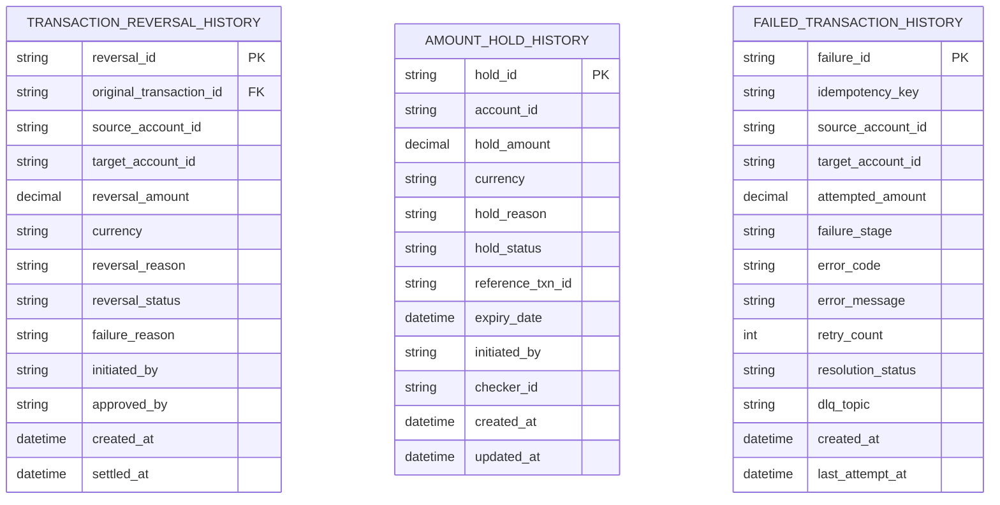
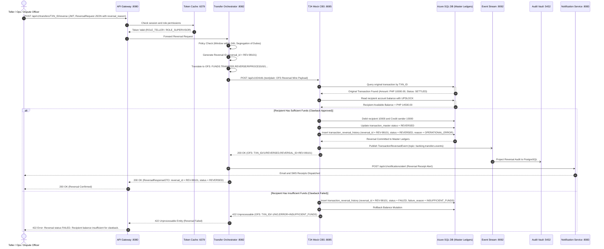
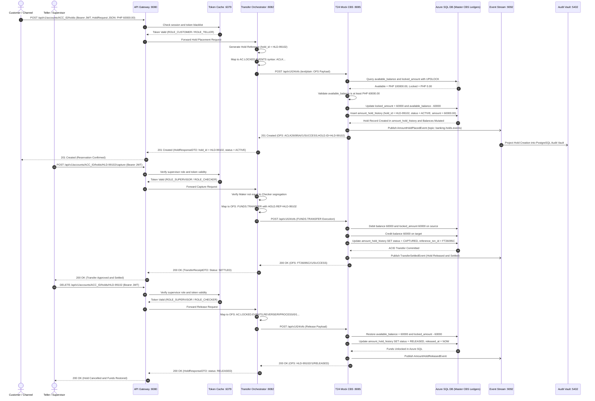
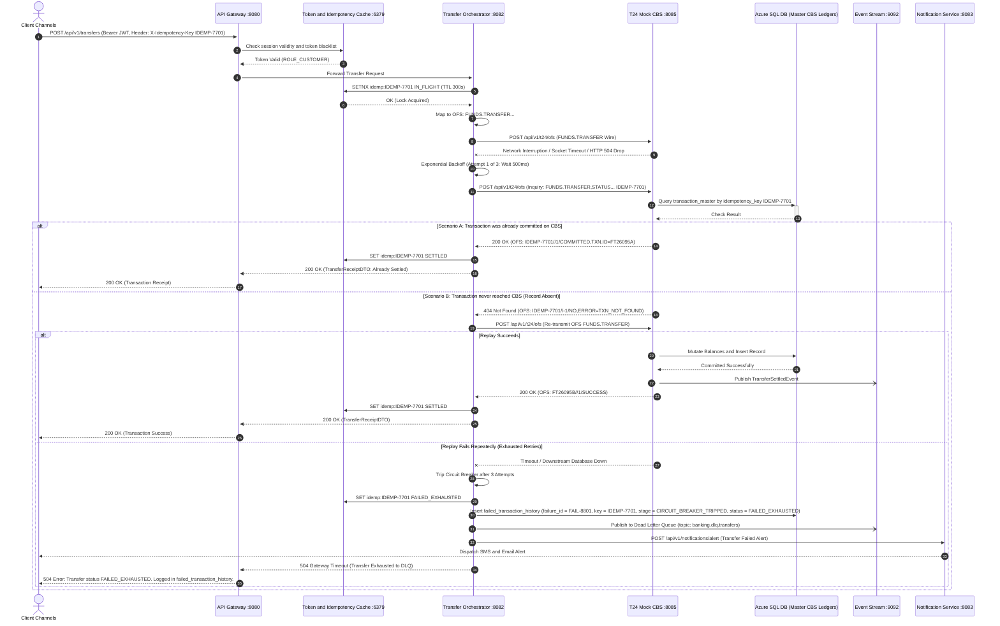

# Core Banking Capabilities: Technical Architecture, Dedicated History Schemas & Sequence Diagrams

This document defines the complete technical specifications and network request sequence diagrams for the three assigned core banking features:

1. **Transaction Reversal** (Chargebacks, Operational Corrections, and Dispute Resolution)
2. **Amount Holds / Reservations** (Provisional Locking, Maker-Checker Holds, and Pre-Authorizations via `AC.LOCKED.EVENTS`)
3. **Failed Transaction / Retry Management** (Idempotent Interrogation, Circuit Breaker, and Dead Letter Queue)

---

## 1. Architectural System Overview

The architecture enforces a strict boundary between Edge Orchestration and the Authoritative Core Banking System (CBS):

```
┌─────────────────┐       HTTPS / JWT       ┌─────────────────┐    token check    ┌─────────────────┐
│ Client Channels │────────────────────────►│   API Gateway   │──────────────────►│   Token Cache   │
│ React & Flutter │                         │  Spring Cloud   │                   │   Redis :6379   │
└─────────────────┘                         └────────┬────────┘                   └─────────────────┘
                                                     │ route request
                                                     ▼
                                            ┌───────────────────────┐
                                            │ Transfer Orchestrator │◄───sync risk check───►┌────────────────┐
                                            │   Spring Boot :8082   │                       │  Risk Engine   │
                                            └──────────┬────────────┘                       │ Python :8084   │
                                                       │                                    └───────┬────────┘
                    ┌──────────────────────────────────┼────────────────────────────────┐           │
                    │ 2FA OTP (if 2FA)                 │ JSON to OFS Wire               │           │ risk evals
                    ▼                                  ▼                                │           ▼
         ┌──────────────────────┐          ┌───────────────────────┐                    │   ┌───────────────┐
         │ Notification Service │          │     T24 Mock CBS      │──transfer events───┼──►│ Event Stream  │
         │  Spring Boot :8083   │          │   Spring Boot :8085   │                    │   │  Kafka :9092  │
         └──────────────────────┘          └───────────┬───────────┘                    │   └───────┬───────┘
                                                       │ ACID balance updates           │           │
                                                       ▼                                │           │ audit proj
                                            ┌───────────────────────┐                   │           ▼
                                            │  Azure SQL Database   │                   │   ┌───────────────┐
                                            │   Master CBS Ledgers  │                   └──►│  Audit Vault  │
                                            │ (Exclusive Connection)│                       │PostgreSQL:5432│
                                            └───────────────────────┘                       └───────────────┘
```

### Architectural Invariants

1. **Temenos OFS Contract:** Transfer Orchestrator translates REST JSON payloads into official Temenos OFS (Open Financial Service) syntax strings before dispatching to T24 CBS.
2. **Exclusive Primary Ledger Connection:** Only **T24 Mock CBS** has direct database connection to the Master CBS Ledgers in Azure SQL.
3. **Dedicated History Tracking:** Each feature maintains its own dedicated, isolated history table in Azure SQL rather than dumping records into a single generic table.

---

## 2. Dedicated Feature History Tables (Database Schema)

Per core banking regulatory standards, each feature has its own dedicated audit and history table with specialized columns:



### 2.1 Table 1: `transaction_reversal_history`

Tracks the exact lifecycle of every reversal request, including approvals, clawback executions, and reasons for failure:

| Column Name               | Data Type       | Nullable | Description                                                                                                                                              |
| :------------------------ | :-------------- | :------- | :------------------------------------------------------------------------------------------------------------------------------------------------------- |
| `reversal_id`             | `VARCHAR(64)`   | `NO`     | **Primary Key** (e.g. `REV-20261005-001`). Unique identifier for this reversal action.                                                                   |
| `original_transaction_id` | `VARCHAR(64)`   | `NO`     | Foreign Key to original transaction (`transaction_master.txn_id`).                                                                                       |
| `source_account_id`       | `VARCHAR(32)`   | `NO`     | Original sender account receiving funds back.                                                                                                            |
| `target_account_id`       | `VARCHAR(32)`   | `NO`     | Original recipient account from which funds are clawed back.                                                                                             |
| `reversal_amount`         | `DECIMAL(18,2)` | `NO`     | The amount being clawed back and reversed.                                                                                                               |
| `currency`                | `VARCHAR(3)`    | `NO`     | Currency code (`PHP`).                                                                                                                                   |
| `reversal_reason`         | `VARCHAR(255)`  | `NO`     | **Required column** explaining why the transaction was reversed (e.g., `OPERATIONAL_ERROR`, `CUSTOMER_DISPUTE`, `FRAUD_CLAWBACK`, `DUPLICATE_TRANSFER`). |
| `reversal_status`         | `VARCHAR(32)`   | `NO`     | Current status: `PENDING_APPROVAL`, `APPROVED`, **`REVERSED`**, `FAILED`, `REJECTED`.                                                                    |
| `failure_reason`          | `VARCHAR(255)`  | `YES`    | Explicit reason if clawback failed (e.g., `INSUFFICIENT_FUNDS_FOR_CLAWBACK`, `ACCOUNT_CLOSED`, `LEGAL_FREEZE`).                                          |
| `initiated_by`            | `VARCHAR(64)`   | `NO`     | User / Teller ID who initiated the reversal.                                                                                                             |
| `approved_by`             | `VARCHAR(64)`   | `YES`    | Supervisor / Checker ID who approved the reversal.                                                                                                       |
| `created_at`              | `DATETIME2`     | `NO`     | Timestamp when reversal was initiated.                                                                                                                   |
| `settled_at`              | `DATETIME2`     | `YES`    | Timestamp when ledger mutation completed and status changed to `REVERSED`.                                                                               |

---

### 2.2 Table 2: `amount_hold_history`

Tracks the lifecycle of provisional locks and pre-authorizations (`AC.LOCKED.EVENTS`):

| Column Name        | Data Type       | Nullable | Description                                                                                |
| :----------------- | :-------------- | :------- | :----------------------------------------------------------------------------------------- |
| `hold_id`          | `VARCHAR(64)`   | `NO`     | **Primary Key** (e.g. `HLD-20261005-001`). Unique hold identifier.                         |
| `account_id`       | `VARCHAR(32)`   | `NO`     | Account on which the funds are locked.                                                     |
| `hold_amount`      | `DECIMAL(18,2)` | `NO`     | Amount locked from available balance.                                                      |
| `currency`         | `VARCHAR(3)`    | `NO`     | Currency code (`PHP`).                                                                     |
| `hold_reason`      | `VARCHAR(255)`  | `NO`     | Reason for hold (e.g., `MAKER_CHECKER_PENDING`, `CARD_PRE_AUTH`, `DISPUTE_INVESTIGATION`). |
| `hold_status`      | `VARCHAR(32)`   | `NO`     | Status: `ACTIVE`, `CAPTURED`, `RELEASED`, `EXPIRED`, `FAILED`.                             |
| `reference_txn_id` | `VARCHAR(64)`   | `YES`    | Final settlement transaction ID if hold was captured into a settled transfer.              |
| `expiry_date`      | `DATETIME2`     | `NO`     | Automatic expiry threshold.                                                                |
| `initiated_by`     | `VARCHAR(64)`   | `NO`     | Originating channel / user.                                                                |
| `checker_id`       | `VARCHAR(64)`   | `YES`    | Supervisor who approved capture or release.                                                |
| `created_at`       | `DATETIME2`     | `NO`     | Hold placement timestamp.                                                                  |
| `updated_at`       | `DATETIME2`     | `NO`     | Hold release or capture timestamp.                                                         |

---

### 2.3 Table 3: `failed_transaction_history`

Tracks network drops, gateway timeouts, idempotency interrogation outcomes, and DLQ escalations:

| Column Name         | Data Type       | Nullable | Description                                                                                                               |
| :------------------ | :-------------- | :------- | :------------------------------------------------------------------------------------------------------------------------ |
| `failure_id`        | `VARCHAR(64)`   | `NO`     | **Primary Key** (e.g. `FAIL-20261005-001`). Unique failure audit record.                                                  |
| `idempotency_key`   | `VARCHAR(128)`  | `NO`     | Client `X-Idempotency-Key` (e.g. `IDEMP-7701`).                                                                           |
| `source_account_id` | `VARCHAR(32)`   | `NO`     | Debtor account.                                                                                                           |
| `target_account_id` | `VARCHAR(32)`   | `NO`     | Creditor account.                                                                                                         |
| `attempted_amount`  | `DECIMAL(18,2)` | `NO`     | Amount attempted.                                                                                                         |
| `failure_stage`     | `VARCHAR(64)`   | `NO`     | Failure point: `NETWORK_TIMEOUT`, `CBS_REJECTED`, `LOCK_ACQUISITION_TIMEOUT`, `CIRCUIT_BREAKER_TRIPPED`.                  |
| `error_code`        | `VARCHAR(32)`   | `NO`     | Error classification: `HTTP_504`, `OFS_TIMEOUT`, `MAX_RETRIES_EXCEEDED`.                                                  |
| `error_message`     | `VARCHAR(500)`  | `NO`     | Diagnostic technical details.                                                                                             |
| `retry_count`       | `INT`           | `NO`     | Number of retry attempts made (1, 2, 3).                                                                                  |
| `resolution_status` | `VARCHAR(32)`   | `NO`     | Final state: `RECOVERED_ON_RETRY`, `RECOVERED_ALREADY_SETTLED`, **`FAILED_EXHAUSTED`**, `MANUAL_RECONCILIATION_REQUIRED`. |
| `dlq_topic`         | `VARCHAR(128)`  | `YES`    | Dead Letter Queue Kafka topic name if dispatched (`banking.transfers.dlq`).                                               |
| `created_at`        | `DATETIME2`     | `NO`     | First failure timestamp.                                                                                                  |
| `last_attempt_at`   | `DATETIME2`     | `NO`     | Final retry attempt timestamp.                                                                                            |

---

## 3. Feature 1: Transaction Reversal

### 3.1 Overview

- **Initiation:** Triggered by teller operational error or customer dispute with mandatory `reversal_reason` and unique `reversal_id`.
- **CBS Validation:** T24 CBS queries Azure SQL to ensure original transaction was `SETTLED` and recipient has sufficient available balance.
- **Audit Persistence:** T24 inserts a record into `transaction_reversal_history`. If clawback succeeds, status is explicitly set to **`REVERSED`**. If recipient funds are insufficient, status is set to **`FAILED`** with `failure_reason = INSUFFICIENT_FUNDS_FOR_CLAWBACK`.

### 3.2 Sequence Diagram: Transaction Reversal



---

## 4. Feature 2: Amount Holds / Reservations (`AC.LOCKED.EVENTS`)

### 4.1 Overview

- **Initiation:** Triggered for high-value Maker-Checker transactions (> PHP 50,000.00) or pre-authorizations.
- **Balance Formula:**
  $$\text{available\_balance} = \text{available\_balance} - \text{hold\_amount}$$
  $$\text{locked\_amount} = \text{locked\_amount} + \text{hold\_amount}$$
- **Audit Persistence:** All status changes (`ACTIVE`, `CAPTURED`, `RELEASED`) are tracked in **`amount_hold_history`**.

### 4.2 Sequence Diagram: Amount Hold Lifecycle



---

## 5. Feature 3: Failed Transaction & Retry Management

### 5.1 Overview

- **Status Interrogation:** Prior to retrying after a network drop, Orchestrator interogates CBS using `FUNDS.TRANSFER,STATUS` with the `X-Idempotency-Key`.
- **Zero Double-Debit Guarantee:** If CBS already settled the transaction, Orchestrator skips re-execution and returns the existing receipt.
- **Audit Persistence:** Every failure event, retry outcome, and Dead Letter Queue dispatch is recorded into **`failed_transaction_history`** with `failure_id`, `failure_stage`, `error_code`, `retry_count`, and `resolution_status`.

### 5.2 Sequence Diagram: Retry Interrogation & Circuit Breaker / DLQ



---

## 6. Temenos OFS Wire Syntax Mapping for the 3 Features

| Feature                  | Operation          | Temenos Application & Version            | Wire OFS Syntax Example                                                                                       |
| :----------------------- | :----------------- | :--------------------------------------- | :------------------------------------------------------------------------------------------------------------ |
| **Transaction Reversal** | Reversal Request   | `FUNDS.TRANSFER,REVERSE/R/PROCESS/0/1`   | `FUNDS.TRANSFER,REVERSE/R/PROCESS/0/1,U1001/PH100223/1,TX-01,REVERSAL.REASON=DISPUTE`                         |
| **Transaction Reversal** | Reversal Response  | CBS ACK                                  | `TX-01//1/REVERSED,ORIG.TXN.ID:1:1=TX-01,REV.REF:1:1=REV-88901`                                               |
| **Amount Holds**         | Create Hold        | `AC.LOCKED.EVENTS,INPUT/I/PROCESS/0/1`   | `AC.LOCKED.EVENTS,INPUT/I/PROCESS/0/1,U1001/PH100223/1,,ACCOUNT.NUMBER=1000-2000-3001,LOCKED.AMOUNT=60000.00` |
| **Amount Holds**         | Capture Hold       | `FUNDS.TRANSFER,AUTH/I/PROCESS/0/1`      | `FUNDS.TRANSFER,AUTH/I/PROCESS/0/1,U1001/PH100223/1,TX-02,HOLD.REF=HLD-99102,AMOUNT=60000.00`                 |
| **Amount Holds**         | Release Hold       | `AC.LOCKED.EVENTS,REVERSE/R/PROCESS/0/1` | `AC.LOCKED.EVENTS,REVERSE/R/PROCESS/0/1,U1001/PH100223/1,HLD-99102,REVERSAL.REASON=CANCELLED`                 |
| **Retry & Failure**      | Status Interrogate | `FUNDS.TRANSFER,STATUS/S/PROCESS/0/1`    | `FUNDS.TRANSFER,STATUS/S/PROCESS/0/1,U1001/PH100223/1,,IDEMP-7701`                                            |
| **Retry & Failure**      | Not Found (Safe)   | CBS Query Response                       | `IDEMP-7701//-1/NOT_FOUND`                                                                                    |
| **Retry & Failure**      | Already Committed  | CBS Query Response                       | `IDEMP-7701//1/COMMITTED,TXN.ID:1:1=FT26095A`                                                                 |
