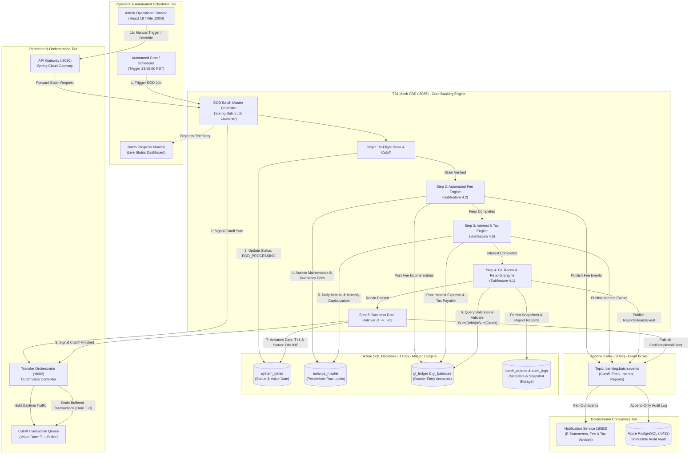
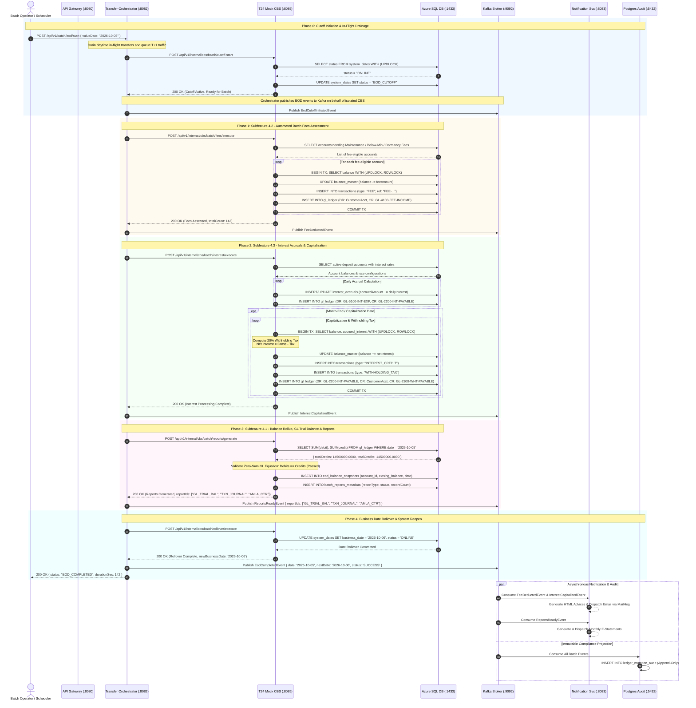

# End-of-Day (EOD) & Batch Processing Architecture: Master Workflow

This document provides the architectural specification, swimlane process models, and sequence diagrams for **Feature 4: End-of-Day (EOD) & Batch Processing** within the revised Core Banking Platform architecture (`banking-platform-architecture.html`).

---

## 1. Architectural Context & System Evolution

In the revised platform architecture:
- **Ledger Mutation Ownership**: Balance mutations, account locking, and double-entry accounting logic have moved from the `transfer-orchestrator` (:8082) into the **T24 Mock CBS** (:8085).
- **Primary Data Store**: T24 Mock CBS maintains exclusive, direct connectivity to **Azure SQL Database** (:1433) for master account ledgers, balances, and transaction journals using ACID transactions with row-level pessimistic locks (`SELECT ... WITH (UPDLOCK, ROWLOCK)`).
- **Transfer Orchestrator Role**: Acts as the transaction intake gateway, risk engine coordinator, and daytime flow controller. During EOD batch windows, the orchestrator enforces the **EOD Cutoff**, temporarily queuing or value-dating new transfers to the next business date ($T+1$).
- **Decoupled Downstream Workers**:
  - **Apache Kafka** (:9092) transports asynchronous batch state events (`banking.batch.events`).
  - **Notification Service** (:8083) delivers customer statements, fee advices, and interest credit receipts.
  - **Azure PostgreSQL** (:5432) serves as an immutable, append-only **Audit Vault** (`ledger_mutation_audit`).

---

## 2. Overall EOD Batch Lifecycle (Feature 4 Master)

The End-of-Day batch processing run follows five strictly sequential execution phases:

1. **Phase 0: Posting Date Cutoff & Channel Freeze**: Orchestrator pauses $T$ transactional intake; pending in-flight transactions are cleared.
2. **Phase 1: Fee Assessment & Deductions (Subfeature 4.2)**: Automated debiting of monthly maintenance, low-balance penalties, and dormancy fees.
3. **Phase 2: Interest Calculations & Capitalization (Subfeature 4.3)**: Daily interest accrual and monthly net interest capitalization with 20% Final Withholding Tax.
4. **Phase 3: Balance Rollup, GL Reconciliation & Reports (Subfeature 4.1)**: Double-entry trial balance validation ($\sum \text{Debits} = \sum \text{Credits}$) and generation of daily journals, balance snapshots, e-statements, and AMLA CTR compliance files.
5. **Phase 4: Business Date Rollover & System Reopen**: Business date advances from $T$ to $T+1$; CBS and Orchestrator resume daytime STP online processing.

---

## 3. Master EOD Swimlane Diagram

---

## 4. Master EOD Sequence Diagram (Request / Response Flow)

---

## 5. Detailed Subfeature Documentation Links

For comprehensive breakdowns, data contracts, and dedicated sequence/swimlane diagrams for each subfeature, refer to:

- [Subfeature 4.1: Reports Architecture](file:///c:/Users/HRR83780/Downloads/group3_fse_capstone/docs/architecture/eod_subfeature_reports.md)
- [Subfeature 4.2: Fees Architecture](file:///c:/Users/HRR83780/Downloads/group3_fse_capstone/docs/architecture/eod_subfeature_fees.md)
- [Subfeature 4.3: Interest Calculations Architecture](file:///c:/Users/HRR83780/Downloads/group3_fse_capstone/docs/architecture/eod_subfeature_interest.md)
