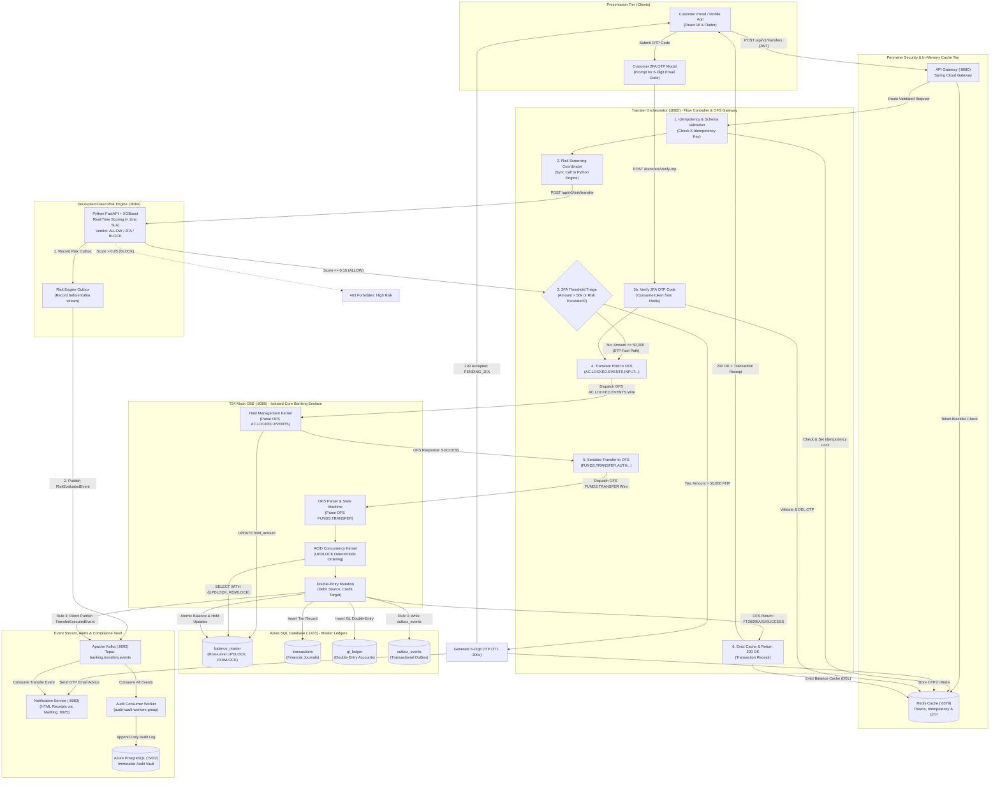

# Funds Transfer & Temenos OFS Settlement Architecture

This document defines the end-to-end technical architecture, swimlane process model, and sequence diagrams for the **Funds Transfer Workflow** in the revised Core Banking Platform architecture (`banking-platform-architecture.html`).

---

## 1. Architectural Overview & Component Responsibilities

Under the revised architecture, ledger mutations and balance locking have been centralized inside the **T24 Mock CBS**:

1. **Client Channels (`clients` :3000)**: React 18 & Flutter clients submit transfer requests with JWT authentication and `X-Idempotency-Key`.
2. **API Gateway (`gateway` :8080)**: Enforces perimeter authentication, checks JWT blacklists in **Redis (`redis` :6379)**, and applies token-bucket rate limits.
3. **Transfer Orchestrator (`orchestrator` :8082)**:
   - Validates payload syntax and acquires Redis idempotency locks.
   - Synchronously queries the **Python Risk Engine (`risk_engine` :8084)** (< 2ms SLA).
   - Coordinates step-up 2FA email verification via the **Notification Service (`notif_service` :8083)** for transfers exceeding 50,000.00 PHP or flagged by risk scoring.
   - Serializes validated JSON transfer requests into standard **Temenos Open Financial Services (OFS)** command syntax before transmission to T24 Mock CBS.
   - Dispatches OFS commands and hold requests to T24 Mock CBS over high-performance internal REST/TCP sockets.
   - **OFS Command Dispatcher & DLQ Router**: Coordinates synchronous validation, risk assessment, and 2FA step-up before serializing financial requests into Temenos OFS wire syntax for CBS execution. When retries are exhausted, trips the circuit breaker and publishes directly to the Kafka Dead Letter Queue (`banking.transfers.dlq`).
   - **Flow Coordinator & OFS Gateway**: Coordinates synchronous validation, risk assessment, and 2FA step-up before serializing financial requests into Temenos OFS wire syntax for CBS execution.
4. **T24 Mock CBS (`t24_cbs` :8085)**:
   - Operates as the **Authoritative Core Banking Engine**: it connects to **Azure SQL Database (`azure_sql` :1433)** for master ledgers and connects directly to **Apache Kafka (`kafka` :9092)** for streaming domain events.
   - Holds the **exclusive primary datasource connection** to **Azure SQL Database (`azure_sql` :1433)**. No other microservice has direct datasource access.
   - Maintains the existing transactional `outbox_events` table in Azure SQL Database, staging domain events within the same atomic ACID transaction as balance mutations.
   - Directly publishes authoritative financial domain events (`TransferExecutedEvent`, `AmountHoldPlacedEvent`, `TransferReversedEvent`) to Apache Kafka (`:9092`).
   - Ingests and executes exclusively serialized Temenos OFS financial messages (`FUNDS.TRANSFER`, `AC.LOCKED.EVENTS`) dispatched by the Orchestrator.
   - Acquires deterministic row-level locks (`SELECT ... WITH (UPDLOCK, ROWLOCK)`) to guarantee strict ACID concurrency and prevent race conditions or overdrafts.
   - Executes double-entry balance debits and credits, records transaction journals, and commits the ledger transaction.
   - Returns standard Temenos OFS success/error response strings (`FT26095A//1/SUCCESS`) and status responses directly to the Orchestrator.
5. **Event Emission & Downstream Consumers**:
   - **Transactional Outbox Protocol**: The **T24 Mock CBS** records domain events into the existing `outbox_events` table in Azure SQL Database within the same ACID transaction as the ledger mutations, commits, publishes directly to **Apache Kafka (`kafka` :9092)**, and marks `outbox_events.status = 'PUBLISHED'`.
   - **Strict Database Boundary Separation**: Apache Kafka does NOT mutate databases directly.
   - **Audit Vault Consumer Worker (`audit_worker`)**: An explicit consumer worker daemon belonging to consumer group `audit-vault-workers` consumes events from Kafka and writes them into the **Azure PostgreSQL (`azure_pg` :5432)** append-only, tamper-proof **Audit Vault** (`ledger_mutation_audit`).
   - **Notification Service (`notif_service` :8083)**: Consumes Kafka events to generate and email HTML transaction receipts via MailHog.

---

## 2. Funds Transfer Swimlane Diagram



---

## 3. Funds Transfer Sequence Diagram (Request / Response Flow)

```mermaid
sequenceDiagram
    autonumber
    actor Customer as Customer (Web / Mobile)
    participant Gateway as API Gateway (:8080)
    participant Redis as Redis Cache (:6379)
    participant Orch as Transfer Orchestrator (:8082)
    participant RiskEngine as Risk Engine (:8084)
    participant RiskOutbox as Risk Engine Outbox
    participant CBS as T24 Mock CBS (:8085)
    participant AzureSQL as Azure SQL DB (:1433)
    participant Kafka as Kafka Broker (:9092)
    participant Notif as Notification Svc (:8083)
    participant AuditWorker as Audit Vault Consumer
    participant AuditVault as Postgres Audit (:5432)

    %% STAGE 1: INGESTION & PERIMETER (INITIATED)
    rect rgb(240, 248, 255)
    Note over Customer,CBS: Stage 1: Ingestion & CBS State Creation (INITIATED)
    Customer->>Gateway: POST /api/v1/transfers (Bearer JWT, Key: TX-901, Amount: 65000.00 PHP)
    Gateway->>Redis: GET blacklist:jti:<jti> (Sub-5ms token check)
    Redis-->>Gateway: Null (Token is valid and active)
    Gateway->>Orch: Forward transfer request
    Orch->>Redis: SET tx:idemp:TX-901 "PROCESSING" NX EX 60
    Redis-->>Orch: OK (Lock acquired - duplicate prevention active)
    Note over Orch: Rule 1: Translate transfer initiation to Temenos OFS syntax before transmission
    Orch->>Orch: Serialize to OFS: FUNDS.TRANSFER,INITIATE/I/PROCESS,,TX-901,DEBIT=ACC-101,CREDIT=ACC-202,AMOUNT=65000.00
    Orch->>CBS: POST /api/v1/internal/cbs/ofs-command (Payload: FUNDS.TRANSFER initiation wire)
    CBS->>AzureSQL: BEGIN TRANSACTION
    CBS->>AzureSQL: INSERT INTO transactions (id: "TX-901", status: "INITIATED")
    CBS->>AzureSQL: INSERT INTO transaction_status_history (tx_id: "TX-901", to_status: "INITIATED", reason: "API_INGESTION")
    Note over CBS,AzureSQL: Rule 3: Record domain event into outbox_events within transaction
    CBS->>AzureSQL: INSERT INTO outbox_events (event_id, aggregate_type, aggregate_id, event_type, kafka_topic, payload, status) VALUES ('EVT-INIT-901', 'TRANSACTION', 'TX-901', 'TRANSACTION_STATUS_CHANGED', 'banking.transfers.events', '{"status":"INITIATED"}', 'PENDING')
    CBS->>AzureSQL: COMMIT TRANSACTION
    CBS-->>Orch: 201 Created (OFS: TX-901//1/INITIATED)
    Note over CBS,Kafka: Rule 3: CBS publishes domain event directly to Kafka from outbox_events
    CBS->>Kafka: Publish TransactionStatusChangedEvent (TX-901, INITIATED)
    CBS->>AzureSQL: UPDATE outbox_events SET status = "PUBLISHED", published_at = SYSUTCDATETIME() WHERE aggregate_id = "TX-901" AND status = "PENDING"
    end

    %% STAGE 2: REAL-TIME RISK EVALUATION & 2FA (AUTHORIZED)
    rect rgb(255, 250, 240)
    Note over Orch,RiskEngine: Stage 2: Risk Screening & Step-Up 2FA (AUTHORIZED)
    Orch->>RiskEngine: POST /api/v1/risk/transfer (ACC-101, Amount: 65000.00 PHP)
    RiskEngine-->>Orch: 200 OK (verdict: ALLOW, riskScore: 0.12, latencyMs: 1.4)
    Note over RiskEngine,RiskOutbox: Rule 3: Risk Engine records evaluation into local outbox prior to Kafka publication
    RiskEngine->>RiskOutbox: INSERT INTO risk_outbox (event_type: "RISK_EVALUATED", aggregate_id: "TX-901", status: "PENDING")
    RiskEngine->>Kafka: Publish RiskEvaluatedEvent (Asynchronous audit telemetry)
    RiskEngine->>RiskOutbox: UPDATE risk_outbox SET status = "PUBLISHED", published_at = SYSUTCDATETIME()

    Note over Orch: Amount 65,000.00 PHP exceeds 50,000.00 PHP threshold (Mandate 2FA OTP)
    Orch->>Redis: SET otp:TX-901 "491823" EX 300 (5-minute TTL)
    Orch->>Notif: POST /api/v1/internal/notifications/otp (TX-901, cust@bank.com)
    Notif-->>Notif: Send 6-digit OTP email via MailHog (:8025)
    Orch-->>Gateway: HTTP 202 Accepted (TX-901, PENDING_2FA_VERIFICATION)
    Gateway-->>Customer: HTTP 202 Accepted (Display 2FA OTP Input Screen)

    Customer->>Gateway: POST /api/v1/transfers/TX-901/verify-otp (OTP: 491823)
    Gateway->>Orch: Forward OTP verification
    Orch->>Redis: GET otp:TX-901
    Redis-->>Orch: "491823" (Match confirmed)
    Orch->>Redis: DEL otp:TX-901 (Atomic token consumption)

    Note over Orch: Rule 1: Translate authorization to Temenos OFS syntax before transmission
    Orch->>Orch: Serialize to OFS: FUNDS.TRANSFER,AUTHORIZE/I/PROCESS,,TX-901,AUTH.METHOD=2FA_EMAIL_OTP
    Orch->>CBS: POST /api/v1/internal/cbs/ofs-command (Payload: FUNDS.TRANSFER authorize wire)
    CBS->>AzureSQL: BEGIN TRANSACTION
    CBS->>AzureSQL: UPDATE transactions SET status = "AUTHORIZED" WHERE id = "TX-901"
    CBS->>AzureSQL: INSERT INTO transaction_status_history (tx_id: "TX-901", from_status: "INITIATED", to_status: "AUTHORIZED", reason: "RISK_AND_2FA_PASSED")
    Note over CBS,AzureSQL: Rule 3: Record domain event into outbox_events within transaction
    CBS->>AzureSQL: INSERT INTO outbox_events (event_id, aggregate_type, aggregate_id, event_type, kafka_topic, payload, status) VALUES ('EVT-AUTH-901', 'TRANSACTION', 'TX-901', 'TRANSACTION_STATUS_CHANGED', 'banking.transfers.events', '{"status":"AUTHORIZED"}', 'PENDING')
    CBS->>AzureSQL: COMMIT TRANSACTION
    CBS-->>Orch: 200 OK (OFS: TX-901//1/AUTHORIZED)
    Note over CBS,Kafka: Rule 3: CBS publishes domain event directly to Kafka from outbox_events
    CBS->>Kafka: Publish TransactionStatusChangedEvent (TX-901, AUTHORIZED)
    CBS->>AzureSQL: UPDATE outbox_events SET status = "PUBLISHED", published_at = SYSUTCDATETIME() WHERE aggregate_id = "TX-901" AND status = "PENDING"
    end

    %% STAGE 3: AMOUNT HOLD PLACEMENT (RESERVED)
    rect rgb(255, 245, 250)
    Note over Orch,AzureSQL: Stage 3: Pre-Settlement Amount Hold (RESERVED)
    Note over Orch: Rule 1: Translate hold request to Temenos OFS syntax before transmission
    Orch->>Orch: Serialize to OFS: AC.LOCKED.EVENTS,INPUT/I/PROCESS,,ACCOUNT.NUMBER=ACC-101,LOCKED.AMOUNT=65000.00
    Orch->>CBS: POST /api/v1/internal/cbs/ofs-command (Payload: AC.LOCKED.EVENTS wire)
    CBS->>AzureSQL: BEGIN TRANSACTION
    CBS->>AzureSQL: SELECT balance_amount, hold_amount FROM balance_master WITH (UPDLOCK, ROWLOCK) WHERE account_id = 'ACC-101'
    AzureSQL-->>CBS: balance_amount = 100000.00, hold_amount = 0.00 (Available: 100000.00 >= 65000.00)
    CBS->>AzureSQL: UPDATE balance_master SET hold_amount = hold_amount + 65000.0000 WHERE account_id = 'ACC-101'
    CBS->>AzureSQL: UPDATE transactions SET status = "RESERVED" WHERE id = "TX-901"
    CBS->>AzureSQL: INSERT INTO transaction_status_history (tx_id: "TX-901", from_status: "AUTHORIZED", to_status: "RESERVED", reason: "AMOUNT_HOLD_APPLIED")
    Note over CBS,AzureSQL: Rule 3: Record hold event into outbox_events within ACID transaction
    CBS->>AzureSQL: INSERT INTO outbox_events (event_id, aggregate_type, aggregate_id, event_type, kafka_topic, payload, status) VALUES ('EVT-HLD-01', 'AMOUNT_HOLD', 'HLD-99102', 'AMOUNT_HOLD_PLACED', 'banking.transfers.events', '{"amount":65000}', 'PENDING')
    CBS->>AzureSQL: COMMIT TRANSACTION
    CBS-->>Orch: 200 OK (OFS: ACLK26095A//1/SUCCESS,HOLD.ID=HLD-99102)
    Note over CBS,Kafka: Rule 3: CBS publishes hold event directly to Kafka from outbox_events
    CBS->>Kafka: Publish AmountHoldPlacedEvent (holdId: HLD-99102, amount: 65000.00 PHP)
    CBS->>AzureSQL: UPDATE outbox_events SET status = "PUBLISHED", published_at = SYSUTCDATETIME() WHERE aggregate_id = "HLD-99102" AND status = "PENDING"
    end

    %% STAGE 4: TEMENOS OFS DISPATCH & IN-FLIGHT STATE (PROCESSING)
    rect rgb(245, 255, 245)
    Note over Orch,CBS: Stage 4: OFS Serialization & In-Flight Transition (PROCESSING)
    Note over Orch: Rule 1: Serialize JSON to Temenos OFS format (FUNDS.TRANSFER,AUTH/I/PROCESS...)
    Orch->>CBS: POST /api/v1/internal/cbs/ofs-command (Payload: OFS Financial String)
    CBS->>AzureSQL: UPDATE transactions SET status = "PROCESSING" WHERE id = "TX-901"
    CBS->>AzureSQL: INSERT INTO transaction_status_history (tx_id: "TX-901", from_status: "RESERVED", to_status: "PROCESSING", reason: "T24_OFS_PROCESSING")
    Note over CBS,AzureSQL: CBS performs ACID ledger settlement within internal transaction
    end

    %% STAGE 5: T24 MOCK CBS ACID SETTLEMENT & HOLD RELEASE (POSTED)
    rect rgb(240, 255, 255)
    Note over CBS,AzureSQL: Stage 5: ACID Ledger Settlement & Release Hold (POSTED)
    CBS->>AzureSQL: BEGIN TRANSACTION
    CBS->>AzureSQL: SELECT account_id, balance_amount, hold_amount FROM balance_master WITH (UPDLOCK, ROWLOCK) WHERE account_id IN ('ACC-101', 'ACC-202') ORDER BY account_id ASC
    AzureSQL-->>CBS: Locks acquired (ACC-101 Available: 35000.00 PHP, ACC-202 Available: 15000.00 PHP)
    Note over CBS: Deduct Balance & Release Hold Simultaneously
    CBS->>AzureSQL: UPDATE balance_master SET balance_amount = balance_amount - 65000.0000, hold_amount = hold_amount - 65000.0000 WHERE account_id = 'ACC-101'
    CBS->>AzureSQL: UPDATE balance_master SET balance_amount = balance_amount + 65000.0000 WHERE account_id = 'ACC-202'
    CBS->>AzureSQL: INSERT INTO transactions (id: "FT26095A", type: "TRANSFER", amount: 65000.0000, status: "POSTED")
    CBS->>AzureSQL: INSERT INTO gl_ledger (DR: ACC-101, CR: ACC-202, amount: 65000.0000, ref: "FT26095A")
    CBS->>AzureSQL: UPDATE transactions SET status = "POSTED" WHERE id = "TX-901"
    CBS->>AzureSQL: INSERT INTO transaction_status_history (tx_id: "TX-901", from_status: "PROCESSING", to_status: "POSTED", reason: "LEDGER_COMMITTED")
    Note over CBS,AzureSQL: Rule 3: Record execution event into outbox_events within ACID transaction
    CBS->>AzureSQL: INSERT INTO outbox_events (event_id, aggregate_type, aggregate_id, event_type, kafka_topic, payload, status) VALUES ('EVT-TX-01', 'TRANSACTION', 'FT26095A', 'TRANSFER_EXECUTED', 'banking.transfers.events', '{"amount":65000}', 'PENDING')
    CBS->>AzureSQL: COMMIT TRANSACTION
    AzureSQL-->>CBS: Transaction Committed (ACID Complete)
    
    Note over CBS,Kafka: Rule 3: CBS publishes domain event directly to Kafka from outbox_events
    CBS->>Kafka: Publish TransferExecutedEvent (txId: FT26095A, amount: 65000.00 PHP)
    CBS->>AzureSQL: UPDATE outbox_events SET status = "PUBLISHED", published_at = SYSUTCDATETIME() WHERE aggregate_id = "FT26095A" AND status = "PENDING"
    CBS-->>Orch: OFS Response: FT26095A//1/SUCCESS,AUTH.DATE=20261005,STATUS=POSTED
    end

    %% STAGE 6: RECEIPT DELIVERY & ASYNC CONSUMERS (RULE 2: AUDIT WORKER PERSISTS TO POSTGRES)
    rect rgb(250, 250, 250)
    Note over Orch,AuditVault: Stage 6: Receipt Delivery & Asynchronous Fan-Out
    Orch->>Redis: DEL account:balance:ACC-101 account:balance:ACC-202 (Evict cached balances)
    Orch-->>Gateway: HTTP 200 OK (transferId: TX-901, cbsRef: FT26095A, status: POSTED, amount: 65000.00 PHP)
    Gateway-->>Customer: HTTP 200 OK (Transfer Success Screen & Receipt)

    par Asynchronous Receipt Email Delivery
        Kafka->>Notif: Consume TransferExecutedEvent
        Notif->>Notif: Render HTML customer receipt via Thymeleaf
        Notif->>Notif: Dispatch email to sender & recipient via MailHog (:8025)
    and Asynchronous Immutable Compliance Projection via Audit Worker
        Kafka->>AuditWorker: Consume TransactionStatusChangedEvents & TransferExecutedEvent
        AuditWorker->>AuditVault: INSERT INTO ledger_mutation_audit (Full Status Roll & Ledger Postings)
    end
    end
```



---

## 4. Alternate Flows & Exception Handling

```mermaid
sequenceDiagram
    autonumber
    actor Customer as Customer
    actor Maker as Maker (Dispute Teller)
    actor Checker as Checker (Branch Manager)
    participant Gateway as API Gateway
    participant Orch as Orchestrator
    participant Risk as Risk Engine
    participant CBS as T24 Mock CBS
    participant AzureSQL as Azure SQL DB
    participant Kafka as Kafka Broker
    participant AuditWorker as Audit Vault Consumer
    participant AuditVault as Postgres Audit (:5432)

    %% EXCEPTION 1: HIGH RISK FRAUD SCORE
    rect rgb(255, 235, 235)
    Note over Customer,Risk: Scenario A: High Risk Fraud Score (> 0.85)
    Customer->>Gateway: POST /transfers (Amount: 200000.00 PHP, suspicious geolocation)
    Gateway->>Orch: Forward transfer request
    Orch->>Risk: POST /api/v1/risk/transfer
    Risk-->>Orch: 200 OK (verdict: BLOCK, riskScore: 0.94, reason: IMPOSSIBLE_TRAVEL)
    Note over Orch: Risk Score exceeds 0.85 threshold (Abort before CBS)
    Orch-->>Customer: HTTP 403 Forbidden (RISK_SCORE_BLOCKED)
    end

    %% EXCEPTION 2: INSUFFICIENT FUNDS
    rect rgb(255, 240, 235)
    Note over Customer,AzureSQL: Scenario B: Insufficient Funds in Azure SQL (FAILED State)
    Customer->>Gateway: POST /transfers (TX-902, Amount: 100000.00 PHP)
    Gateway->>Orch: Forward transfer request
    Note over Orch: Rule 1: Translate hold request to Temenos OFS syntax before transmission
    Orch->>Orch: Serialize to OFS: AC.LOCKED.EVENTS,INPUT/I/PROCESS,,ACCOUNT.NUMBER=ACC-101,LOCKED.AMOUNT=100000.00
    Orch->>CBS: POST /api/v1/internal/cbs/ofs-command (Payload: AC.LOCKED.EVENTS wire string)
    CBS->>AzureSQL: BEGIN TX & SELECT WITH (UPDLOCK, ROWLOCK) WHERE account_id = 'ACC-101'
    AzureSQL-->>CBS: balance_amount = 45000.0000, hold_amount = 0.0000
    Note over CBS: Available 45000.00 < 100000.00 (Insufficient Funds)
    CBS->>AzureSQL: UPDATE transactions SET status = "FAILED" WHERE id = 'TX-902'
    CBS->>AzureSQL: INSERT INTO transaction_status_history (tx_id: "TX-902", to_status: "FAILED", reason: "NSF_INSUFFICIENT_FUNDS")
    Note over CBS,AzureSQL: Rule 3: Record failure event into outbox_events within ACID transaction
    CBS->>AzureSQL: INSERT INTO outbox_events (event_id, aggregate_type, aggregate_id, event_type, kafka_topic, payload, status) VALUES ('EVT-FAIL-902', 'TRANSACTION', 'TX-902', 'TRANSACTION_STATUS_CHANGED', 'banking.transfers.events', '{"status":"FAILED","reason":"NSF"}', 'PENDING')
    CBS->>AzureSQL: COMMIT TRANSACTION
    CBS-->>Orch: HTTP 422 Unprocessable Entity (OFS: TX-902//-1/FAILED,REASON=NSF)
    Note over CBS,Kafka: Rule 3: CBS publishes domain event directly to Kafka from outbox_events
    CBS->>Kafka: Publish TransactionStatusChangedEvent (TX-902, FAILED, reason: "NSF")
    CBS->>AzureSQL: UPDATE outbox_events SET status = "PUBLISHED", published_at = SYSUTCDATETIME() WHERE aggregate_id = "TX-902" AND status = "PENDING"
    Orch-->>Customer: HTTP 422 Unprocessable Entity (INSUFFICIENT_FUNDS)
    end

    %% SCENARIO C: PROACTIVE STATE VERIFICATION (POLLING PATTERN)
    rect rgb(245, 255, 245)
    Note over Orch,CBS: Scenario C: Proactive Polling for Asynchronous / In-Flight State
    Note over Orch: In-flight or timeout recovery: Orchestrator proactively polls CBS
    Note over Orch: Rule 1: Translate inquiry to Temenos OFS syntax before transmission
    Orch->>Orch: Serialize to OFS: FUNDS.TRANSFER,STATUS/S/PROCESS,,,TX-901
    Orch->>CBS: POST /api/v1/internal/cbs/ofs-command (Payload: FUNDS.TRANSFER,STATUS wire string)
    CBS->>AzureSQL: SELECT status, reversal_ref_id FROM transactions WHERE id = 'TX-901'
    AzureSQL-->>CBS: status = "POSTED"
    CBS-->>Orch: 200 OK (OFS: TX-901//1/COMMITTED,TXN.ID=FT26095A)
    Note over Orch: Orchestrator verifies terminal state and publishes missing events if needed
    end

    %% SCENARIO D: INTRA-BANK MAKER-CHECKER REVERSAL (DUAL CONTROL GOVERNANCE)
    rect rgb(255, 245, 255)
    Note over Maker,Kafka: Scenario D: Intra-Bank Reversal (Maker-Checker Dual Control & Beneficiary Lien)
    Maker->>Gateway: POST /api/v1/transfers/TX-901/reversal-request { disputeTicket: "DISP-8801", reason: "DUPLICATE_TRANSFER", makerId: "OP-MAKER-01" }
    Gateway->>Orch: Forward with Maker credentials
    Note over Orch: Rule 1: Translate dispute to Temenos OFS lien syntax before transmission
    Orch->>Orch: Serialize to OFS: AC.LOCKED.EVENTS,INPUT/I/PROCESS,,ACCOUNT.NUMBER=ACC-202,LOCKED.AMOUNT=65000.00,REF=DISP-8801
    Orch->>CBS: POST /api/v1/internal/cbs/ofs-command (Payload: AC.LOCKED.EVENTS wire string)
    CBS->>AzureSQL: BEGIN TRANSACTION
    CBS->>AzureSQL: SELECT source_account_id, target_account_id, status, amount FROM transactions WITH (UPDLOCK) WHERE id = 'TX-901'
    Note over CBS: Validate Intra-Bank: Both ACC-101 and ACC-202 exist in CBS and status is POSTED
    CBS->>AzureSQL: SELECT balance_amount, hold_amount FROM balance_master WITH (UPDLOCK, ROWLOCK) WHERE account_id = 'ACC-202'
    Note over CBS: Place Pre-Reversal Lien on Beneficiary (Freeze 65000.00 PHP)
    CBS->>AzureSQL: UPDATE balance_master SET hold_amount = hold_amount + 65000.00 WHERE account_id = 'ACC-202'
    CBS->>AzureSQL: INSERT INTO reversal_requests (ticket_id, transaction_id, maker_id, reversal_reason, status) VALUES ('DISP-8801', 'TX-901', 'OP-MAKER-01', 'DUPLICATE_TRANSFER', 'PENDING_APPROVAL')
    CBS->>AzureSQL: UPDATE transactions SET status = "REVERSAL_REQUESTED" WHERE id = 'TX-901'
    CBS->>AzureSQL: INSERT INTO transaction_status_history (tx_id: "TX-901", from_status: "POSTED", to_status: "REVERSAL_REQUESTED", reason: "MAKER_DISPUTE_FILED", operator_id: "OP-MAKER-01")
    Note over CBS,AzureSQL: Rule 3: Record domain event into outbox_events within ACID transaction
    CBS->>AzureSQL: INSERT INTO outbox_events (event_id, aggregate_type, aggregate_id, event_type, kafka_topic, payload, status) VALUES ('EVT-REV-901', 'TRANSACTION', 'TX-901', 'TRANSACTION_STATUS_CHANGED', 'banking.transfers.events', '{"status":"REVERSAL_REQUESTED"}', 'PENDING')
    CBS->>AzureSQL: COMMIT TRANSACTION
    CBS-->>Orch: 201 Created (OFS: ACLK26095L//1/SUCCESS,TICKET.ID=DISP-8801,STATUS=PENDING_APPROVAL)
    Note over CBS,Kafka: Rule 3: CBS publishes domain event directly to Kafka from outbox_events
    CBS->>Kafka: Publish TransactionStatusChangedEvent (TX-901, REVERSAL_REQUESTED, ticketId: "DISP-8801")
    CBS->>AzureSQL: UPDATE outbox_events SET status = "PUBLISHED", published_at = SYSUTCDATETIME() WHERE aggregate_id = "TX-901" AND status = "PENDING"
    Orch-->>Maker: 201 Created (Reversal Request Queued for Checker Review)

    Note over Checker,Orch: Checker reviews reversal ticket in authorization queue
    Checker->>Gateway: POST /api/v1/transfers/TX-901/reversal-request/DISP-8801/review { decision: "APPROVE", checkerId: "OP-CHECKER-09" }
    Gateway->>Orch: Forward with Checker credentials
    Note over Orch: Enforce Segregation of Duties: checkerId != makerId (OP-CHECKER-09 != OP-MAKER-01)
    Note over Orch: Rule 1: Translate approval to Temenos OFS reversal syntax before transmission
    Orch->>Orch: Serialize to OFS: FUNDS.TRANSFER,REVERSE/R/PROCESS,,TX-901,TICKET=DISP-8801,CHECKER=OP-CHECKER-09
    Orch->>CBS: POST /api/v1/internal/cbs/ofs-command (Payload: FUNDS.TRANSFER,REVERSE wire string)
    CBS->>AzureSQL: BEGIN TRANSACTION
    CBS->>AzureSQL: SELECT status FROM reversal_requests WITH (UPDLOCK) WHERE ticket_id = 'DISP-8801'
    Note over CBS: Execute Compensating Double-Entry & Release Beneficiary Lien
    CBS->>AzureSQL: UPDATE balance_master SET balance_amount = balance_amount - 65000.00, hold_amount = hold_amount - 65000.00 WHERE account_id = 'ACC-202'
    CBS->>AzureSQL: UPDATE balance_master SET balance_amount = balance_amount + 65000.00 WHERE account_id = 'ACC-101'
    CBS->>AzureSQL: INSERT INTO transactions (id: "TX-REV-901", type: "REVERSAL", amount: 65000.00, status: "POSTED", original_tx_id: "TX-901")
    CBS->>AzureSQL: INSERT INTO gl_ledger (DR: ACC-202, CR: ACC-101, amount: 65000.00, ref: "TX-REV-901")
    CBS->>AzureSQL: UPDATE reversal_requests SET status = "APPROVED", checker_id = "OP-CHECKER-09", reviewed_at = SYSUTCDATETIME() WHERE ticket_id = 'DISP-8801'
    CBS->>AzureSQL: UPDATE transactions SET status = "REVERSED", reversal_ref_id = "TX-REV-901" WHERE id = 'TX-901'
    CBS->>AzureSQL: INSERT INTO transaction_status_history (tx_id: "TX-901", from_status: "REVERSAL_REQUESTED", to_status: "REVERSED", reason: "CHECKER_APPROVED", operator_id: "OP-CHECKER-09")
    Note over CBS,AzureSQL: Rule 3: Record reversal event into outbox_events within ACID transaction
    CBS->>AzureSQL: INSERT INTO outbox_events (event_id, aggregate_type, aggregate_id, event_type, kafka_topic, payload, status) VALUES ('EVT-REV-902', 'TRANSACTION', 'TX-901', 'TRANSFER_REVERSED', 'banking.transfers.events', '{"reversalRefId":"TX-REV-901"}', 'PENDING')
    CBS->>AzureSQL: COMMIT TRANSACTION
    CBS-->>Orch: 200 OK (OFS: TX-901//1/REVERSED,REV.REF=TX-REV-901)
    
    Note over CBS,Kafka: Rule 3: CBS publishes reversal event directly to Kafka from outbox_events
    CBS->>Kafka: Publish TransferReversedEvent (txId: "TX-901", reversalRefId: "TX-REV-901", makerId: "OP-MAKER-01", checkerId: "OP-CHECKER-09")
    CBS->>AzureSQL: UPDATE outbox_events SET status = "PUBLISHED", published_at = SYSUTCDATETIME() WHERE aggregate_id = "TX-901" AND status = "PENDING"
    Orch-->>Checker: HTTP 200 OK (Transfer Reversal Confirmed)
    
    %% RULE 2: AUDIT WORKER PERSISTS TO POSTGRES
    par Asynchronous Audit Ingestion
        Kafka->>AuditWorker: Consume TransferReversedEvent
        AuditWorker->>AuditVault: INSERT INTO ledger_mutation_audit (Project Reversal to PostgreSQL)
    end
    end
```



---

## 5. Key Financial Data Contracts & Schemas

### A. Temenos OFS Request Message Format
Sent from Transfer Orchestrator (`:8082`) to T24 Mock CBS (`:8085`):
```text
FUNDS.TRANSFER,AUTH/I/PROCESS,//PH100223,
TXN.REF=FT26095A,
DEBIT.ACCT.NO=ACC-100223,
CREDIT.ACCT.NO=ACC-200456,
DEBIT.AMOUNT=65000.0000,
DEBIT.CURRENCY=PHP,
PAYMENT.DETAILS=Invoice #12,
ORDERING.CUST=CUST-882190
```

### B. Temenos OFS Success Response Format
Returned from T24 Mock CBS (`:8085`) to Transfer Orchestrator (`:8082`):
```text
FT26095A//1/SUCCESS,
AUTH.DATE=20261005,
TIME=15:40:02,
STATUS=POSTED,
DEBIT.ACCT=ACC-100223,
CREDIT.ACCT=ACC-200456,
POSTED.AMOUNT=65000.0000
```

### C. Kafka Event Payload: `TransferExecutedEvent`
Emitted directly by T24 Mock CBS (`:8085`) to topic `banking.transfers.events`:
```json
{
  "eventId": "evt_tx_551982",
  "eventType": "TRANSFER_EXECUTED",
  "transferId": "FT26095A",
  "businessDate": "2026-10-05",
  "timestamp": "2026-10-05T15:40:02.145Z",
  "sourceAccountId": "ACC-100223",
  "targetAccountId": "ACC-200456",
  "amount": 65000.0000,
  "currency": "PHP",
  "feeAmount": 0.0000,
  "status": "POSTED",
  "riskScore": 0.12,
  "authMethod": "2FA_EMAIL_OTP",
  "sourceNewBalance": 35000.0000,
  "targetNewBalance": 80000.0000,
  "referenceHash": "e3b0c44298fc1c149afbf4c8996fb92427ae41e4649b934ca495991b7852b855"
}
```

### D. Kafka Event Payload: `RiskEvaluatedEvent` & Downstream Consumers
Emitted by the Python Risk Engine to topic `banking.risk.evaluations`:
```json
{
  "eventId": "evt_risk_109281",
  "eventType": "RISK_EVALUATED",
  "transferId": "TX-901",
  "timestamp": "2026-10-05T15:40:01.420Z",
  "sourceAccountId": "ACC-100223",
  "amount": 65000.0000,
  "riskScore": 0.12,
  "verdict": "ALLOW",
  "modelId": "xgboost_v2_fastpath",
  "inferenceLatencyMs": 1.4,
  "extractedFeatures": {
    "velocity10m": 1,
    "ipReputationScore": 0.02,
    "deviceKnown": true,
    "unusualHours": false
  }
}
```

#### Downstream Consumers of `RiskEvaluatedEvent`:
1. **Azure PostgreSQL Audit Vault (`azure_pg` :5432)**:
   - Consumer group `audit-vault-workers` projects the event into `risk_decision_audit`.
   - **Regulatory Purpose (BSP Circular 808 & AMLA)**: Proves to auditors why an automated ML algorithm approved, challenged, or blocked a financial transaction.
2. **Asynchronous "Second-Look" Reviewer (NanoJev / Qwen2.5-0.5B ONNX)**:
   - As documented in [`decoupled_risk_flow.html`](file:///c:/Users/HRR83780/Downloads/group3_fse_capstone/docs/architecture/decoupled_risk_flow.html), background worker pools consume the event to perform deep semantic evaluation of transfer memos and scam typologies without delaying the sub-2ms synchronous fast path.
3. **Compliance Analyst Queue (`analyst_portal`)**:
   - Borderline scores (e.g., 0.60 to 0.85) or transactions flagged with anomalous travel speeds populate the Compliance Officer Dashboard for manual review and Suspicious Transaction Report (STR) filings.
4. **Model Drift & Observability Telemetry (Datadog APM)**:
   - Tracks prediction distribution drift, feature attribution anomalies, and model latency percentiles (p50/p95/p99) over time.
