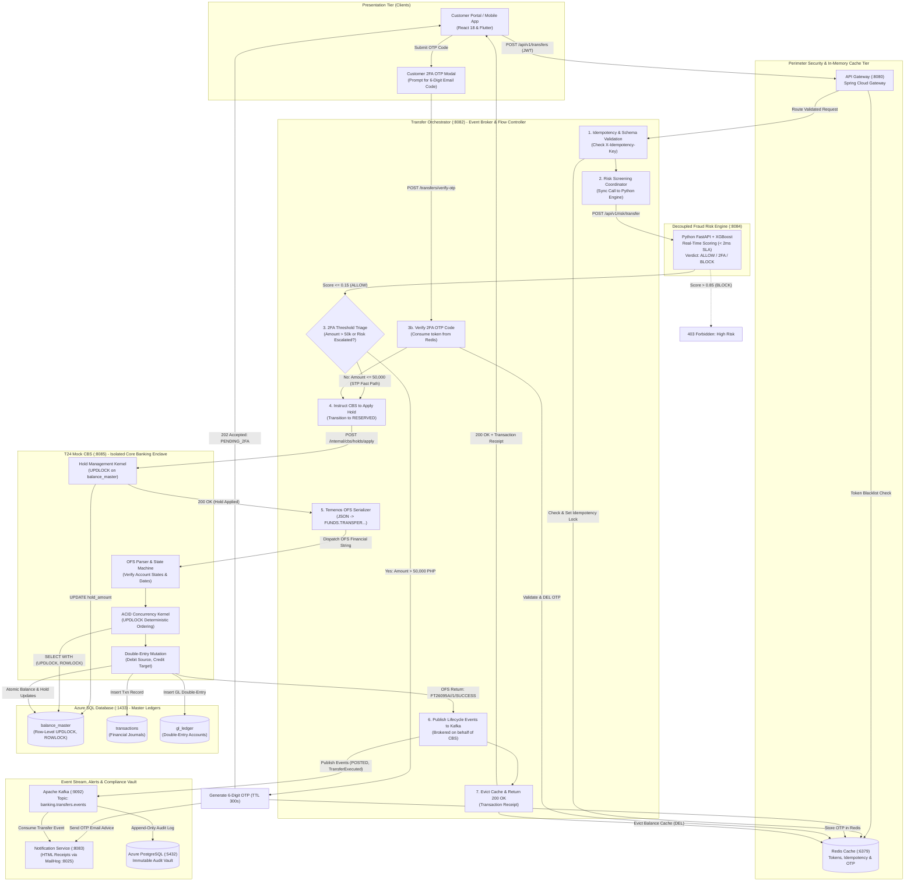
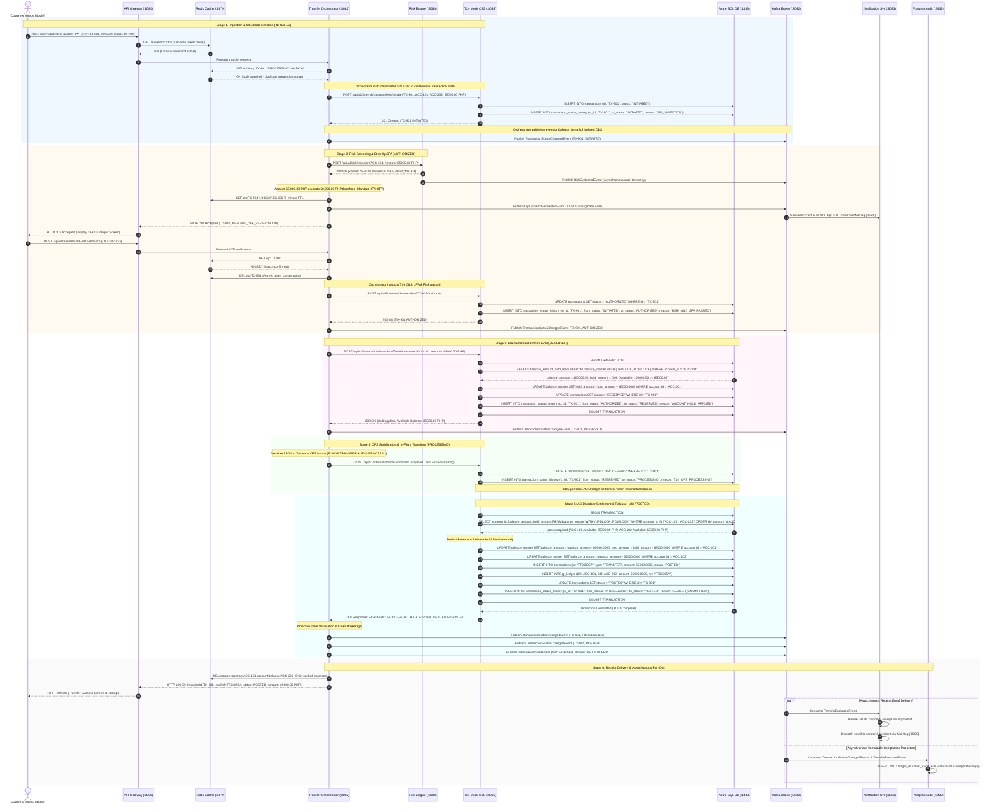
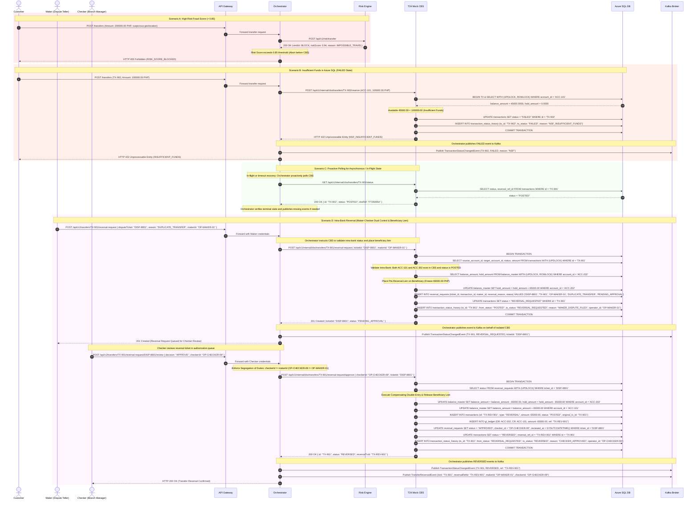

# Funds Transfer & Temenos OFS Settlement Architecture

This document defines the end-to-end technical architecture, swimlane process model, and sequence diagrams for the **Funds Transfer Workflow** in the revised Core Banking Platform architecture (`banking-platform-architecture.html`).

---

## 1. Architectural Overview & Component Responsibilities

Under the revised architecture, ledger mutations and balance locking have been centralized inside the **T24 Mock CBS**:

1. **Client Channels (`clients` :3000)**: React 18 & Flutter clients submit transfer requests with JWT authentication and `X-Idempotency-Key`.
2. **API Gateway (`gateway` :8080)**: Enforces perimeter authentication, checks JWT blacklists in **Redis (`redis` :6379)**, and applies token-bucket rate limits.
3. **Transfer Orchestrator (`orchestrator` :8082)**:
   - Validates payload syntax and acquires Redis idempotency locks.
   - Synchronously queries the **Python Risk Engine (`risk_engine` :8084)** (< 2ms SLA).
   - Coordinates step-up 2FA email verification via the **Notification Service (`notif_service` :8083)** for transfers exceeding 50,000.00 PHP or flagged by risk scoring.
   - Serializes validated JSON transfer requests into standard **Temenos Open Financial Services (OFS)** command syntax.
   - Dispatches OFS commands and hold requests to T24 Mock CBS over high-performance internal REST/TCP sockets.
   - **Proactive Observer & Kafka Event Broker**: Acts as the sole proxy for CBS events. Proactively checks / inspects CBS execution states and publishes all lifecycle domain events (`TransactionStatusChangedEvent`, `TransferExecutedEvent`, `TransferReversedEvent`) to Apache Kafka on behalf of the isolated CBS enclave.
4. **T24 Mock CBS (`t24_cbs` :8085)**:
   - Operates inside an **isolated core banking enclave**: it communicates **exclusively with Azure SQL Database and the Transfer Orchestrator**.
   - Holds the **exclusive primary datasource connection** to **Azure SQL Database (`azure_sql` :1433)**. No other microservice has direct datasource access.
   - Has **zero direct connection to Apache Kafka**, the Notification Service, or external networks.
   - If CBS state changes or requires external action, it never makes outbound calls; instead, the Transfer Orchestrator proactively queries CBS state or reads synchronous command returns and executes the outbound requests / event publications.
   - Ingests and parses Temenos OFS financial messages and internal REST hold/status instructions from the Orchestrator.
   - Acquires deterministic row-level locks (`SELECT ... WITH (UPDLOCK, ROWLOCK)`) to guarantee strict ACID concurrency and prevent race conditions or overdrafts.
   - Executes double-entry balance debits and credits, records transaction journals, and commits the ledger transaction.
   - Returns standard Temenos OFS success/error response strings (`FT26095A//1/SUCCESS`) and status responses directly to the Orchestrator.
5. **Event Emission & Downstream Consumers**:
   - The **Transfer Orchestrator** inspects CBS execution responses/states and publishes domain events (`TransactionStatusChangedEvent`, `TransferExecutedEvent`) to **Apache Kafka (`kafka` :9092)** on behalf of the CBS.
   - **Notification Service (`notif_service` :8083)** consumes Kafka events to generate and email HTML transaction receipts via MailHog.
   - **Azure PostgreSQL (`azure_pg` :5432)** serves as an append-only, tamper-proof **Audit Vault** (`ledger_mutation_audit`).

---

## 2. Funds Transfer Swimlane Diagram



---

## 3. Funds Transfer Sequence Diagram (Request / Response Flow)



---

## 4. Alternate Flows & Exception Handling



---

## 5. Key Financial Data Contracts & Schemas

### A. Temenos OFS Request Message Format
Sent from Transfer Orchestrator (`:8082`) to T24 Mock CBS (`:8085`):
```text
FUNDS.TRANSFER,AUTH/I/PROCESS,//PH100223,
TXN.REF=FT26095A,
DEBIT.ACCT.NO=ACC-100223,
CREDIT.ACCT.NO=ACC-200456,
DEBIT.AMOUNT=65000.0000,
DEBIT.CURRENCY=PHP,
PAYMENT.DETAILS=Invoice #12,
ORDERING.CUST=CUST-882190
```

### B. Temenos OFS Success Response Format
Returned from T24 Mock CBS (`:8085`) to Transfer Orchestrator (`:8082`):
```text
FT26095A//1/SUCCESS,
AUTH.DATE=20261005,
TIME=15:40:02,
STATUS=POSTED,
DEBIT.ACCT=ACC-100223,
CREDIT.ACCT=ACC-200456,
POSTED.AMOUNT=65000.0000
```

### C. Kafka Event Payload: `TransferExecutedEvent`
Emitted by Transfer Orchestrator (`:8082`) on behalf of T24 Mock CBS to topic `banking.transfers.events`:
```json
{
  "eventId": "evt_tx_551982",
  "eventType": "TRANSFER_EXECUTED",
  "transferId": "FT26095A",
  "businessDate": "2026-10-05",
  "timestamp": "2026-10-05T15:40:02.145Z",
  "sourceAccountId": "ACC-100223",
  "targetAccountId": "ACC-200456",
  "amount": 65000.0000,
  "currency": "PHP",
  "feeAmount": 0.0000,
  "status": "POSTED",
  "riskScore": 0.12,
  "authMethod": "2FA_EMAIL_OTP",
  "sourceNewBalance": 35000.0000,
  "targetNewBalance": 80000.0000,
  "referenceHash": "e3b0c44298fc1c149afbf4c8996fb92427ae41e4649b934ca495991b7852b855"
}
```

### D. Kafka Event Payload: `RiskEvaluatedEvent` & Downstream Consumers
Emitted by the Python Risk Engine to topic `banking.risk.evaluations`:
```json
{
  "eventId": "evt_risk_109281",
  "eventType": "RISK_EVALUATED",
  "transferId": "TX-901",
  "timestamp": "2026-10-05T15:40:01.420Z",
  "sourceAccountId": "ACC-100223",
  "amount": 65000.0000,
  "riskScore": 0.12,
  "verdict": "ALLOW",
  "modelId": "xgboost_v2_fastpath",
  "inferenceLatencyMs": 1.4,
  "extractedFeatures": {
    "velocity10m": 1,
    "ipReputationScore": 0.02,
    "deviceKnown": true,
    "unusualHours": false
  }
}
```

#### Downstream Consumers of `RiskEvaluatedEvent`:
1. **Azure PostgreSQL Audit Vault (`azure_pg` :5432)**:
   - Consumer group `audit-vault-workers` projects the event into `risk_decision_audit`.
   - **Regulatory Purpose (BSP Circular 808 & AMLA)**: Proves to auditors why an automated ML algorithm approved, challenged, or blocked a financial transaction.
2. **Asynchronous "Second-Look" Reviewer (NanoJev / Qwen2.5-0.5B ONNX)**:
   - As documented in [`decoupled_risk_flow.html`](file:///c:/Users/HRR83780/Downloads/group3_fse_capstone/docs/architecture/decoupled_risk_flow.html), background worker pools consume the event to perform deep semantic evaluation of transfer memos and scam typologies without delaying the sub-2ms synchronous fast path.
3. **Compliance Analyst Queue (`analyst_portal`)**:
   - Borderline scores (e.g., 0.60 to 0.85) or transactions flagged with anomalous travel speeds populate the Compliance Officer Dashboard for manual review and Suspicious Transaction Report (STR) filings.
4. **Model Drift & Observability Telemetry (Datadog APM)**:
   - Tracks prediction distribution drift, feature attribution anomalies, and model latency percentiles (p50/p95/p99) over time.
