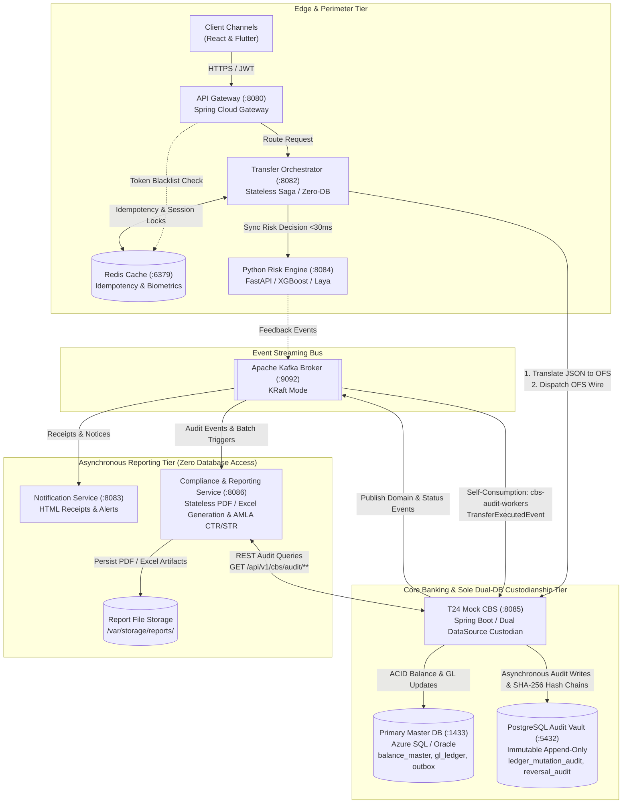

# Core Banking Platform: Service Responsibilities & Architectural Boundaries (Path B)

This document defines the formal division of responsibilities, operational boundaries, and data ownership across all services and infrastructure components in the **Target Decoupled Event-Driven Core Banking Architecture (Path B)**.

---

## 1. Architectural System Overview

The platform separates fast-path edge orchestration, real-time machine learning fraud screening, authoritative core banking ledger mutations, asynchronous customer communication, and immutable regulatory compliance archiving:

---

## 2. Service-by-Service Responsibilities Matrix

### 1. Client Channels (`frontend`)
* **Technology Stack**: React 18, Vite, Tailwind CSS, Flutter Mobile (Dart).
* **Port**: Public Host Browser (:3000).
* **Primary Responsibilities**:
  1. **Customer Self-Service Interface**: Interactive balance cards, preset transfer buttons, 4-decimal transfer inputs, recipient account selection, and live transaction ledger view.
  2. **Mandatory Biometric Confirmation UX**: Interacts with client device hardware sensors (Face ID / Fingerprint / WebAuthn) to generate cryptographic biometric authentication assertions for all funds transfer transactions, regardless of amount or risk score.
  3. **Operations & Admin Portal**: System telemetry grid, real-time circuit breaker status, and the **Maker-Checker Dispute Resolution Console** (allows Tellers to file reversals and Branch Managers to review and approve/reject claims).
  4. **Merchant POS Simulator**: Simulates merchant card pre-authorizations (hotel/car rental holds), capture settlements, and voids/releases.
  5. **Real-Time Push Notifications**: Listens on Server-Sent Events (SSE) connections from `notification-service` to display instantaneous success/failure toast alerts.
* **Data Ownership**: In-memory React state, browser `localStorage` for visual preference themes, and secure `HttpOnly` cookie storage for refresh tokens. Zero direct database connectivity.

---

### 2. API Gateway (`gateway-service`)
* **Technology Stack**: Spring Cloud Gateway, Spring Security 6, Nimbus JOSE JWT, Netty.
* **Port**: `:8080`.
* **Primary Responsibilities**:
  1. **Perimeter Security & TLS Termination**: Acts as the sole public gateway into the internal Docker network (`banking-net`). Rejects unencrypted HTTP and unauthorized requests.
  2. **Cryptographic JWT Validation**: Validates HMAC-SHA256 signatures of inbound Bearer access tokens, parses user claims (`user_id`, `role`), and validates expiration (15-minute TTL).
  3. **Token Blacklist Enforcement**: Interrogates Redis cache (`blacklist:jti:<id>`) in $< 2\text{ms}$; immediately blocks revoked tokens from logged-out users or frozen accounts.
  4. **Per-IP Rate Limiting**: Employs a distributed token-bucket algorithm (100 requests/sec per client IP) to block brute-force and DDoS attempts before they reach downstream business services.
  5. **Reverse Proxy Routing**:
     * `/api/v1/auth/**` $\rightarrow$ `account-service:8081`
     * `/api/v1/accounts/**` $\rightarrow$ `account-service:8081`
     * `/api/v1/transfers/**` $\rightarrow$ `transfer-orchestrator:8082`
     * `/api/v1/holds/**` $\rightarrow$ `transfer-orchestrator:8082`
     * `/api/v1/reversals/**` $\rightarrow$ `transfer-orchestrator:8082`
     * `/api/v1/compliance/**` $\rightarrow$ `compliance-service:8086`
* **Data Ownership**: Stateless. Connects only to Redis (`:6379`) for blacklist checks. Zero SQL database connectivity.

---

### 3. Distributed In-Memory Cache (`redis-cache`)
* **Technology Stack**: Redis 7.2 Alpine.
* **Port**: `:6379`.
* **Primary Responsibilities**:
  1. **Distributed Idempotency Locks**: Atomic key-value locking (`SET tx:idemp:<id> "PROCESSING" NX EX 60`) preventing concurrent double-click debits from executing in parallel.
  2. **Biometric Rate Limiting & Challenge Store**: Stores sliding-window failed biometric attempt counters (`biometric:attempts:<userId>`, max 3 tries before 15-minute lockout), active transfer challenge tokens, and 10-minute cool-off locks.
  3. **Token Revocation Blacklist**: Stores blacklisted JWT identifiers (`blacklist:jti:<jti>`) matching the remaining lifetime of revoked access tokens.
  4. **Refresh Token Rotation (RTR) Family Store**: Maintains session metadata hashes and token sets (`token_family:<sessionId>`) to detect token replay breaches and trigger instant family-wide session invalidation.
  5. **Stale Balance Read Cache**: Caches current customer balances for mobile UI rendering (`account:balance:<id>`, 30s TTL). Evicted immediately (`DEL`) upon any ledger mutation.
* **Data Ownership**: Ephemeral RAM key-value store with Append-Only File (AOF) persistence enabled.

---

### 4. Transfer Orchestrator (`transfer-orchestrator`)
* **Technology Stack**: Spring Boot 3, Java 17, Spring WebClient, Resilience4j, Spring Kafka Producer.
* **Port**: `:8082`.
* **Primary Responsibilities**:
  1. **Saga Workflow Coordination**: Orchestrates the multi-step transaction lifecycle across perimeter security, risk scoring, customer step-up verification, and core CBS dispatch **without holding database locks**.
  2. **Financial Perimeter Validation**: Enforces `@Digits(integer=14, fraction=4)` currency precision, ISO currency rules (`PHP`), positive amounts, and distinct source/destination accounts. Returns RFC-7807 Problem Details on invalid requests.
  3. **Synchronous Fast-Path Risk Client**: Dispatches transfer context to `risk-service:8084` (`POST /api/v1/risk/transfer`) over non-blocking WebClient with a strict 200ms timeout SLA.
  4. **Universal Mandatory Biometric Confirmation Management**: Enforces mandatory biometric verification across ALL funds transfers regardless of amount or risk classification; returns `HTTP 202 Accepted` biometric challenges to the client channel, and validates cryptographic assertions against user credentials in `account-service`.
  5. **Temenos OFS Wire Serialization (Rule 1)**: Translates validated high-level JSON transfer instructions into official Temenos OFS syntax strings:
     * `FUNDS.TRANSFER,INITIATE`
     * `AC.LOCKED.EVENTS,INPUT` (Amount holds / liens)
     * `FUNDS.TRANSFER,AUTH` (Final settlement)
     * `FUNDS.TRANSFER,REVERSAL` (Compensating reversal)
  6. **Resilience & Fault Tolerance**:
     * Implements Resilience4j Circuit Breaker for CBS and Risk Engine calls (`failureRateThreshold: 50%`, `waitDurationInOpenState: 10s`).
     * Executes exponential backoff retries (100ms, 200ms, 400ms) on transient network timeouts.
     * On circuit breaker trip or retry exhaustion: Serializes transfer to `TransferFailedToDlqEvent` and routes directly to the Kafka Dead Letter Queue (`banking.transfers.dlq`), returning `HTTP 503 Service Unavailable`.
* **Data Ownership**: **Zero database access.** Has no JDBC drivers or datasource credentials for Azure SQL or PostgreSQL. Connects only to Redis (`:6379`) and Apache Kafka (`:9092`).

---

### 5. Decoupled Risk Engine (`risk-service`)
* **Technology Stack**: Python 3.12+, FastAPI, Uvicorn, XGBoost, Scikit-Learn, Laya Non-Autoregressive Encoder (ModernBERT / mmBERT), Fallback NanoJev (Qwen2.5-0.5B INT8 ONNX Runtime), Datadog APM (`ddtrace`).
* **Port**: `:8084`.
* **Architecture**: **Two-Stage Multi-Model Risk Engine** (Synchronous Tabular S2 + Synchronous NLP Laya Encoder).
* **Primary Responsibilities**:
  1. **Stage A: Deterministic Rules & Tabular XGBoost S2 (< 30ms SLA)**:
     * **Gate 0 Deterministic Hard Rules**: Immediate execution of non-bypassable perimeter filters (impossible travel velocity > 1,000 km/h, mock GPS, critical device tampering/emulator $\ge ₱50,000$, rooted device with new payee $\ge ₱10,000$) -> Instant `BLOCK` or `REQUIRE_2FA`.
     * **S2 Tabular XGBoost Inference**: Evaluates 40+ behavioral, velocity, counterparty, and financial features calibrated via `TabularFeaturePipeline`.
     * **Real-Time Balance Drain Ratio**: Directly consumes `currentBalance` fetched via orchestrator pre-scoring CBS inquiry (`amount / currentBalance`); drain ratios $\ge 0.90$ flag near-complete account depletion.
     * **Mobile Threat Telemetry**: Detects active screen sharing (`MediaProjectionState.is_screen_sharing`), active voice call coercion (`TelephonyState.call_state == 'CALL_STATE_OFFHOOK'`), and account clipboard paste (`InteractionContext.account_input_mode`).
  2. **Stage B: Synchronous NLP Threat & Memo Synthesis (< 0.10ms SLA via Laya)**:
     * Powered by the **Laya** non-autoregressive encoder (ModernBERT / mmBERT, 10,000+ tx/s) with fallback to **NanoJev** (Qwen2.5-0.5B ONNX).
     * Analyzes unstructured customer transfer memo text in real time against Philippine scam typologies (`advance_fee`, `investment_scam`, `impersonation`, `job_scam`, `marketplace_scam`, `coercion`, Tagalog/Taglish vernacular).
     * Enforces the **Escalate-Only Safety Invariant**: $\text{RiskTier}(a_1) \ge \text{RiskTier}(a_0)$. Downstream NLP can escalate friction, but can NEVER downgrade a Stage A `BLOCK` or `REQUIRE_2FA`. Safe fallback on timeout (> 1500ms) defaults to Stage A $a_0$.
  3. **Multi-Tier Customer Friction & Decision Model**:
     * **`ALLOW`**: Low risk. Requires mandatory cryptographic biometric confirmation on registered primary device.
     * **`ADVISORY_WARNING`**: In-app modal with mandatory 3-second read delay. User can Cancel, Pause for 10-Minute Cool-Off, or Proceed.
     * **`REQUIRE_2FA` (Display: `STEP_UP`)**: High behavioral anomaly. Mandates biometric confirmation + MPIN (Zero SMS/Email OTP).
     * **`BLOCK`**: Critical fraud or impossible velocity. Pre-CBS circuit cut (`HTTP 403 Forbidden`). Zero DB connections opened; T24 is never called.
  4. **Compliance Automation & Event Feedback Loop (Fire-and-Forget)**:
     * **Event Dispatch (`POST /api/v1/risk/events`)**: Records user choice (`continued`, `cancelled`, `paused`, `blocked`) to `data/events.jsonl` for continuous offline model fine-tuning.
     * **Automated AMLC SAR Drafting**: `trigger_sar_async` in `hybrid_bench.sar_generator` automatically compiles formal Suspicious Activity Reports (SAR / STR) compliant with AMLC guidelines for `BLOCK` or `HIGH` tier cases.
     * **Compliance Analyst Triage Desk**: Exposes `GET /api/v1/analyst/cases` and `POST /api/v1/analyst/decision` for compliance officers to inspect forensic case cards with SHAP feature explainability and log human verdicts into `data/analyst_decisions.jsonl`.
  5. **Operational Telemetry & Observability**:
     * Emits Datadog APM tracing spans (`risk.analyze`) with trace/span ID propagation.
     * Provides queue depth, drop counts, timeouts, and latency distributions via `GET /api/v1/risk/metrics`.
* **Data Ownership**: Append-only event store (`data/events.jsonl`, `data/analyst_decisions.jsonl`), in-memory `TransferStore` and `DecisionStore`, and serialized ML pipelines (`s2_xgb_model.joblib`, `s2_feature_pipeline.joblib`). Zero direct SQL database connections.

---

### 6. T24 Mock Core Banking System (`t24-mock-cbs`)
* **Technology Stack**: Spring Boot 3, Java 17, Spring Data JPA, HikariCP (Dual DataSources: `primaryDataSource` + `auditDataSource`), Spring Kafka Producer & Consumer.
* **Port**: `:8085` (REST/OFS endpoint) / `:9100` (TCP OFS Socket).
* **Primary Responsibilities**:
  1. **Processing Bank Transactions (Authoritative Financial Core)**: System of record for customer deposits, double-entry general ledger postings, and account balances.
  2. **Temenos OFS Wire Command Ingestion**: Parses inbound Temenos OFS syntax commands (`FUNDS.TRANSFER`, `AC.LOCKED.EVENTS`, `BATCH.JOB`, `AC.CHARGE`, `IC.CHARGE`, `DATES,ROLLOVER`) and converts them into ACID database transactions.
  3. **Zero-Deadlock Pessimistic Row Locking**: Serializes concurrent balance updates on `balance_master` using `SELECT ... WITH (UPDLOCK, ROWLOCK)` in Azure SQL (or `SELECT ... FOR UPDATE` in Oracle) ordered alphabetically by account ID (`min(A, B) -> max(A, B)`).
  4. **Solvency & Overdraft Protection**: Validates that `(balance_amount - hold_amount) >= requested_amount`. Rejects overdrafts with OFS NACK: `ACCOUNT.BAL.LT.ZERO`.
  5. **Amount Holds & Reservations Management**: Freezes funds by incrementing `hold_amount` via `AC.LOCKED.EVENTS,INPUT` and releases holds upon settlement or cancellation via `AC.LOCKED.EVENTS,RELEASE`.
  6. **Compensating Reversal Settlement**: Executes dual-control authorized reversals via `FUNDS.TRANSFER,REVERSAL`, atomically debiting the beneficiary, crediting the original sender, releasing liens, and creating reversing GL journal entries.
  7. **Asynchronous Audit Vault Ingestion & Cryptographic Hash Chaining via Kafka Self-Consumption**: Asynchronously consumes its own published domain events (`TransferExecutedEvent`, `TransferReversedEvent`, `TransactionStatusChangedEvent`) under consumer group `cbs-audit-workers` to execute append-only SQL inserts into `ledger_mutation_audit`, `reversal_audit`, and `transaction_status_audit` in `postgres-audit-vault` with sequential SHA-256 hash chaining ($Hash_N = \text{SHA256}(Hash_{N-1} + TxPayload)$).
  8. **Failed DLQ Incident Persistence**: Consumes `TransferFailedToDlqEvent` and persists failure payloads into `failed_transaction_audit` in `postgres-audit-vault`.
  9. **CBS Audit Query & Filing REST Endpoints**: Exposes `GET /api/v1/cbs/audit/transactions/{txId}`, `GET /api/v1/cbs/audit/dlq/incidents`, `POST /api/v1/cbs/audit/dlq/resolve/{id}`, and `POST /api/v1/cbs/audit/filings` so `compliance-service` and operational dashboards query and update audit records without direct database connectivity.
  10. **End-of-Day (EOD) Batch State Machine**:
      * **Phase 0 (Posting Cutoff)**: Transitions `system_dates.status = 'EOD_CUTOFF'`; buffers daytime online traffic for $T+1$.
      * **Phase 1 (Automated Fee Deductions)**: Deducts Below-Min ADB and Dormancy charges; logs uncollected amounts to `uncollected_fees` with zero-overdraft balance capping.
      * **Phase 2 (Daily Interest & BIR Tax Accruals)**: Calculates daily interest accruals; month-end capitalizes net 80% to customer accounts and credits 20% to GL Tax Withholding Payable.
      * **Phase 3 (Snapshot Freezing)**: Freezes closing balances into `eod_balance_snapshots`.
      * **Phase 4 (Business Date Rollover)**: Advances `system_dates.business_date = T+1` and sets status back to `ONLINE`.
  11. **3-Way General Ledger Reconciliation (Levels 1 & 2)**:
      * **Level 1 (Horizontal Trial Balance)**: Verifies $\sum \text{debit\_amount} == \sum \text{credit\_amount}$ across `gl_ledger`. Halts EOD if variance $\ne 0.0000$.
      * **Level 2 (Vertical Subledger Rollup)**: Reconciles $\sum \text{balance\_master} \equiv \text{GL-2100-CUST-LIAB}$ and active holds against subledgers.
  12. **Transactional Outbox Event Publishing (Rule 3)**: Atomically writes domain events to `outbox_events` in Azure SQL within the same ACID transaction as balance mutations, commits, and directly publishes to Apache Kafka before setting `status = 'PUBLISHED'`.
  13. **Transaction Status Lifecycle & Reason Tracking (Rule 9)**: Maintains the authoritative finite state machine (`Initiated`, `Authorized`, `Reserved`, `Processing`, `Posted`, `Failed`, `Cancelled`, `PendingReversal`, `Reversed`) in `transactions` and logs every state mutation into `transaction_status_history` with mandatory change reason code, narrative details, actor ID, and high-precision UTC timestamp.
* **Data Ownership**: **Sole and Exclusive Custodian of BOTH Databases** (`azure-sql-db` / Primary Master DB :1433 AND `postgres-audit-vault` / Immutable Audit Vault :5432). Dual-datasource architecture with Zero direct database connectivity permitted for any other microservice.

---

### 7. Notification### 7. Notification & Alert Service (`notification-service`)
* **Technology Stack**: Spring Boot 3, Java 17, Spring Kafka Consumer, Thymeleaf Template Engine, JavaMailSender.
* **Port**: `:8083`.
* **Primary Responsibilities**:
  1. **Customer Communication Gateway**: Consumes `banking.transfers.events` and `banking.risk.evaluations` under consumer group `notification-workers`.
  2. **File & Receipt Generation**: Formats rich HTML transaction receipts using Thymeleaf templates, displaying masked account numbers, before/after balances, reference numbers, and SHA-256 verification hashes.
  3. **Receipt Dispatch**: Sends receipts to customer email inboxes via MailHog SMTP (`:1025` / Web UI `:8025`).
  4. **Security Alert Dispatch**: Formats and delivers manager security alerts and suspicious account warnings when unusual login or transfer anomalies trip high fraud thresholds (Transfer OTP verification is handled via in-app popup prompt).
  5. **Real-Time Client Push Alerts**: Broadcasts Server-Sent Events (SSE) toasts directly to active browser sessions (`GET /api/v1/notifications/stream/{userId}`).
  6. **Deduplication & Fault Tolerance**: Checks Redis deduplication keys (`notif:seen:<eventId>`) to prevent duplicate customer emails during Kafka message re-deliveries.
* **Data Ownership**: Connects to Redis (`:6379`) for deduplication and Kafka (`:9092`) for event consumption. Zero SQL database connectivity.

---

### 8. Compliance & Reporting Service (`compliance-service`)
* **Technology Stack**: Spring Boot 3, Java 17, Spring Kafka Consumer, OpenPDF / Apache POI, WebClient / RestTemplate. (Zero JDBC drivers, zero SQL datasources).
* **Port**: `:8086`.
* **Primary Responsibilities**:
  1. **Stateless Regulatory Reporting & Document Generation Engine**: Generates CPU-heavy compliance artifacts (PDF E-Statements, GL Trial Balance Excel/PDF, BIR Form 2306 tax certificates, AMLA CTR/STR files), offloading compute from the core banking engine.
  2. **Asynchronous Event Ingestion**: Consumes from `banking.transfers.events`, `banking.batch.events`, and `banking.transfers.dlq` under consumer group `compliance-reporting-workers` to trigger document generation and aggregate in-memory reporting metrics.
  3. **AMLA Regulatory Compliance (Republic Act No. 9160)**:
     * **Covered Transaction Reporting (CTR)**: Scans transfer events; automatically aggregates and compiles mandatory CTR regulatory files for single or aggregate transactions $\ge ₱500,000.00$.
     * **Suspicious Transaction Reporting (STR)**: Ingests high-fraud alerts from `banking.risk.evaluations` (score $> 0.85$ or structuring patterns) and creates STR investigation dockets for the bank's Compliance Officer.
     * **Filing Registration**: Formally registers completed CTR/STR filing records by calling `POST /api/v1/cbs/audit/filings` on `t24-mock-cbs`.
  4. **BSP Circular 808 IT Risk Audit Trail Oversight**: Queries immutable audit trails for dispute investigations via `GET /api/v1/cbs/audit/transactions/{txId}` and exposes audit queries to compliance portals.
  5. **File Generation & Storage Management**:
     * Generates customer PDF e-statements, GL trial balance reports, daily transaction journals, and BIR 20% withholding tax certificates.
     * Writes generated PDF, CSV, and XML report files to secure object storage (e.g., Azure Blob Storage, AWS S3, or local Docker volume `/var/storage/reports/`).
     * Submits file metadata and SHA-256 checksums to `t24-mock-cbs` (`POST /api/v1/cbs/audit/eod/reports-metadata`) to be sealed into `eod_reports_metadata`.
  6. **Dead Letter Queue (DLQ) Incident Ingestion & Replay API**:
     * Exposes administrative APIs (`GET /api/v1/compliance/dlq/incidents`, `POST /api/v1/compliance/dlq/replay/{txId}`) for compliance and DevOps officers to inspect poison pills and trigger reconciliation replays.
     * Delegates incident queries to `t24-mock-cbs` (`GET /api/v1/cbs/audit/dlq/incidents`), re-injects replayed payloads to `transfer-orchestrator`, and marks incidents resolved via `t24-mock-cbs` (`POST /api/v1/cbs/audit/dlq/resolve/{id}`).
  7. **Zero Database Footprint (Zero-DB Architecture)**: Contains zero JDBC drivers, zero datasource pools, and zero direct SQL connections to Azure SQL or PostgreSQL.
* **Data Ownership**: Report Storage Volume (`/var/storage/reports/`). **Zero direct SQL database connectivity.**

---

### 9. Primary Master### 9. Primary Master Relational Database (`azure-sql-db` / `oracle-xe-master`)
* **Technology Stack**: Azure SQL Database / Oracle Database Express Edition 21c.
* **Port**: `:1433` (TDS) / `:1521` (TNS).
* **Primary Responsibilities**:
  1. **Master Financial Persistence**: Stores `accounts`, `balance_master`, `transactions`, `gl_accounts`, `gl_ledger`, `gl_balances`, `system_dates`, `reversal_tickets`, `amount_hold_history`, `uncollected_fees`, `eod_balance_snapshots`, and `outbox_events`.
  2. **ACID Solvency Constraints**: Enforces database check constraints:
     * `CHECK (balance_amount >= hold_amount)`
     * `CHECK (balance_amount >= 0)`
  3. **Pessimistic Row-Level Locking Engine**: Serializes concurrent balance updates via `UPDLOCK, ROWLOCK`.
* **Data Ownership**: Accessible **exclusively by `t24-mock-cbs`**. All other microservices are strictly prohibited from connecting directly.

---

### 10. Dedicated Immutable Audit Vault Database (`postgres-audit-vault`)
* **Technology Stack**: PostgreSQL 16 Alpine Flexible Server.
* **Port**: `:5432` (Container) / `:5433` (Host mapping).
* **Primary Responsibilities**:
  1. **Immutable Compliance Storage**: Stores `ledger_mutation_audit`, `reversal_audit`, `amount_hold_audit`, `failed_transaction_history`, `compliance_filings`, `eod_reports_metadata`, and `reconciliation_exceptions_audit`.
  2. **Native Anti-Tamper Trigger Security**: Enforces database-level triggers (`trg_no_update_delete_mutation_audit`) that reject all `UPDATE` and `DELETE` SQL commands.
  3. **Sub-5ms Audit Query Performance**: Maintains specialized B-Tree composite indexes on `(account_id, created_at)` and `(operator_id)` to serve auditor queries instantly.
* **Data Ownership**: Accessible **exclusively by `t24-mock-cbs`** (Sole Custodian). All `compliance-service` queries access audit data via CBS REST audit query endpoints (`GET /api/v1/cbs/audit/**`).

---

### 11. Apache Kafka Event Bus (`kafka-broker`)
* **Technology Stack**: Apache Kafka 3.7+ in KRaft Mode (No ZooKeeper dependency).
* **Port**: `:9092` (Host) / `:29092` (Docker internal bridge).
* **Primary Responsibilities**:
  1. **Decoupled Commit Log**: Buffers and routes asynchronous domain events across microservices with high throughput and configurable retention (7 days).
  2. **Partitioned Chronological Ordering**: Topics are partitioned by `account_id` or `transfer_id` (6 to 12 partitions) to guarantee strict chronological per-account execution.
  3. **Standard Event Catalog**:
     * `banking.transfers.events`: Authoritative core transaction, hold, and reversal events emitted by T24 CBS. Consumed by `notification-service`, `compliance-service`, and self-consumed by `t24-mock-cbs` (`cbs-audit-workers`) for asynchronous audit vault archiving.
     * `banking.transfers.dlq`: Poison pills and circuit-breaker escalated failures emitted by Transfer Orchestrator.
     * `banking.risk.evaluations`: Fast-path fraud scores and security alerts emitted by Python Risk Engine.
     * `banking.batch.events`: Posting cutoff, fee deduction, interest capitalization, report ready, and rollover events emitted by T24 CBS.
     * `banking.audit.alerts`: Critical P1 alerts (e.g., EOD trial balance out-of-balance variance) emitted by T24 CBS.
* **Data Ownership**: Commit log partitions on persistent disk volume `kafka_data`.

---

## 3. Cross-Cutting Capability & Responsibility Matrix

| Capability / Responsibility | Primary Service Responsible | Collaborating Services | Storage / Technology Used |
| :--- | :--- | :--- | :--- |
| **Perimeter Security & Rate Limiting** | `gateway-service` (:8080) | `redis-cache` | Spring Cloud Gateway, Redis Token Bucket |
| **Idempotency Locking** | `transfer-orchestrator` (:8082) | `redis-cache` | Redis `SET ... NX EX 60` |
| **Assessing Risky Transactions** | `risk-service` (:8084) | `transfer-orchestrator` | Python FastAPI, XGBoost ML Inference |
| **OFS Wire Syntax Serialization** | `transfer-orchestrator` (:8082) | `t24-mock-cbs` | Temenos OFS Syntax String Generator |
| **Processing Bank Transactions** | `t24-mock-cbs` (:8085) | `azure-sql-db` | Double-Entry Accounting, Pessimistic Locking |
| **Zero-Deadlock Account Locking** | `t24-mock-cbs` (:8085) | `azure-sql-db` | Alphabetical `UPDLOCK, ROWLOCK` Ordering |
| **Amount Holds / Pre-Authorizations** | `t24-mock-cbs` (:8085) | `transfer-orchestrator` | `AC.LOCKED.EVENTS,INPUT` / `RELEASE` |
| **Maker-Checker Reversal Settlement** | `t24-mock-cbs` (:8085) | `transfer-orchestrator` | `FUNDS.TRANSFER,REVERSAL` Compensating Entries |
| **EOD Batch Pipeline & Rollover** | `t24-mock-cbs` (:8085) | `azure-sql-db` | State Machine (Cutoff $\rightarrow$ Fees $\rightarrow$ Int $\rightarrow$ Date+1) |
| **GL Trial Balance Recon (L1 & L2)** | `t24-mock-cbs` (:8085) | `azure-sql-db` | $\sum \text{DR} == \sum \text{CR}$ & Subledger Rollup Check |
| **Customer Email Receipts & Alerts** | `notification-service` (:8083) | `kafka-broker` | Thymeleaf HTML Engine, MailHog SMTP (:1025) |
| **Real-Time Client Toasts** | `notification-service` (:8083) | `frontend` | Server-Sent Events (SSE) `/stream/{userId}` |
| **File Generation (Statements & Reports)**| `compliance-service` (:8086) | `kafka-broker` | OpenPDF, Apache POI, XML Serializers |
| **File Persistence & Hash Tracking** | `compliance-service` (:8086) | `t24-mock-cbs`, `postgres-audit-vault` | Storage Volume / S3, `POST /api/v1/cbs/audit/eod/reports-metadata` |
| **AMLA Covered Transaction Reporting**| `compliance-service` (:8086) | `kafka-broker` | Automated CTR Aggregator ($\ge$ ₱500k PHP) |
| **Immutable Audit Vault Archiving** | `t24-mock-cbs` (:8085) | `postgres-audit-vault`, `kafka-broker` | Append-Only `ledger_mutation_audit`, Triggers, Self-Consumption |
| **Cryptographic Hash Chaining** | `t24-mock-cbs` (:8085) | `postgres-audit-vault`, `kafka-broker` | Sequential SHA-256 Hash Chain via `cbs-audit-workers` |
| **DLQ Failure Ingestion & Replay API**| `compliance-service` (:8086) | `t24-mock-cbs`, `kafka-broker` | `failed_transaction_audit`, Replay REST API |
| **Audit Parity Check (Level 3 Recon)** | `compliance-service` (:8086) | `t24-mock-cbs`, `postgres-audit-vault`| Cross-Store Checksum ($\text{Count}_{\text{SQL}} == \text{Count}_{\text{PG}}$) via CBS REST API |

---

## 4. Key Architectural File Generation & Persistence Breakdown

### A. What Files Are Generated and by Whom?

#### Compliance & Reporting Service (:8086)

| File Document Type | Format & Generator | Regulatory / Business Purpose |
| :--- | :--- | :--- |
| **1. Customer E-Statements** | PDF (OpenPDF / iText) | Monthly statement of accounts |
| **2. GL Trial Balance** | PDF & Excel (Apache POI) | Internal and external audit verification |
| **3. Transaction Journal** | CSV & PDF | Daily debit/credit audit trail |
| **4. BIR Tax Certificates** | PDF (BIR Form 2306 template) | 20% Final Withholding Tax certificate |
| **5. AMLA CTR Submission** | XML / JSON (AMLC Schema) | RA 9160 Covered Transaction Filing ($\ge ₱500,000.00$) |
| **6. AMLA STR Case Dockets** | PDF & JSON | RA 9160 Suspicious Transaction Dossier |

#### Notification Service (:8083)

| File Document Type | Format & Generator | Regulatory / Business Purpose |
| :--- | :--- | :--- |
| **1. Transaction Receipts** | HTML (Thymeleaf Engine) | Instantaneous customer transfer receipt |
| **2. Security Alerts** | HTML (Thymeleaf Engine) | Security anomaly & device challenge notification |

### B. Where and How Are Files Persisted?

1. **Physical File Storage**:
   * All binary files (PDFs, Excels, XML packages) generated by `compliance-service` are written to a persistent storage backend:
     * **Cloud Target**: Azure Blob Storage Container / AWS S3 Bucket (`compliance-reports-vault/YYYY/MM/DD/`).
     * **Local / Docker Target**: Persistent Docker volume mounted at `/var/storage/banking-reports/`.
2. **Metadata & Cryptographic Persistence (`postgres-audit-vault`)**:
   * For every persisted file, `compliance-service` submits file metadata and cryptographic hashes to `t24-mock-cbs` (`POST /api/v1/cbs/audit/eod/reports-metadata` and `POST /api/v1/cbs/audit/filings`), which persists them into `eod_reports_metadata` and `compliance_filings` in `postgres-audit-vault`:
     * `report_id` (Primary Key UUID)
     * `report_type` (`GL_TRIAL_BALANCE`, `CUSTOMER_STATEMENT`, `AMLA_CTR`, `BIR_TAX_2306`)
     * `file_uri` (Storage location URI)
     * `sha256_hash` (Cryptographic hash of the file bytes; used to prove the file was never altered after generation)
     * `record_count` (Number of financial rows aggregated)
     * `generated_at` (UTC timestamp)
     * `retention_expiry` (Legal retention date: 5 years per BSP rules)
3. **Receipt Storage & Invalidation (`redis-cache` & `postgres-audit-vault`)**:
   * HTML receipts dispatched by `notification-service` are retained in Redis for 24 hours for fast client retrieval, while transaction audit records in PostgreSQL preserve the receipt verification hash permanently.

---

## 5. Summary: Why Path B is Structurally Sound

1. **Sole Dual-Database Custodianship & Zero-DB Microservices**: `t24-mock-cbs` has exclusive, authoritative control over both data stores (`azure-sql-db` Master and `postgres-audit-vault`); `transfer-orchestrator` and `compliance-service` are strictly Zero-DB microservices.
2. **Elimination of Lock Extensions**: The primary database holds account row locks for sub-5ms because it does not make synchronous network calls to PostgreSQL during balance mutations; audit vault persistence is completely offloaded to asynchronous Kafka self-consumption.
3. **Decoupled Heavy Operations**: PDF generation, CSV exports, AMLA reporting, and cryptographic hashing are completely offloaded from the transactional engine into `compliance-service`.
4. **Complete Regulatory Coverage**: The architecture satisfies all legal mandates of the **Bangko Sentral ng Pilipinas (BSP)**, **Anti-Money Laundering Council (AMLC)**, and **Bureau of Internal Revenue (BIR)**.
