# Target Architecture Transition Design: Decoupled Core Banking Platform (Path B)

This document is the comprehensive, authoritative design specification detailing the structural, architectural, and data model additions required to transition the core banking platform from its current implementation state to the target **Decoupled Event-Driven Core Banking Architecture (Path B)**.

> **Scope Clarification**: Per current requirements, the **Amount Holds & Reservations** (`AC.LOCKED.EVENTS`) and **Three-Way General Ledger Reconciliation** features are deferred and excluded from this design phase. This document focuses strictly on **Intra-Bank Funds Transfers**, **Maker-Checker Dual Control Reversals**, **Resilience4j Circuit Breaking / DLQ Incident Management**, and the **Close of Business (COB) & End-of-Day (EOD) Batch Lifecycle Pipeline** (Phases 0 through 4).

---

## 1. Executive Summary & Transition Scope

### 1.1 Objective
The purpose of this transition is to transform the existing tightly coupled prototype into a production-grade, highly resilient financial platform adhering to international core banking standards (Temenos T24 OFS protocol) and Philippine regulatory frameworks (Bangko Sentral ng Pilipinas - BSP, Anti-Money Laundering Council - AMLC, and Bureau of Internal Revenue - BIR).

### 1.2 The Core Problem in Current State
In the current repository implementation:
1. **Synchronous Dual-Datasource Contention**: The existing `ledger-mutation-engine` manages two simultaneous HikariCP datasource pools (`oracleMasterDataSource` and `postgresAuditDataSource`). During fund transfers, it acquires pessimistic row-level locks on `balance_master` in the primary database and executes synchronous JDBC writes to PostgreSQL `ledger_mutation_audit` **while the primary database lock is still actively held**.
2. **Blast Radius & Lock Hoarding**: Any latency spike, network blip, or connection pool exhaustion in PostgreSQL blocks primary account mutations, stalls the Oracle/Azure SQL connection pool, and cascades into global HTTP request timeouts.
3. **Monolithic Responsibility Overload**: Financial validation, risk coordination, balance locking, audit vault archiving, and outbox relaying all reside within a single application process (`ledger-mutation-engine`), violating single-responsibility and regulatory air-gap principles.
4. **Missing Production Capabilities**: Intra-bank transaction reversals, circuit breaking with dead letter queueing, multi-phase Close of Business (COB) operational lifecycle governance and End-of-Day (EOD) batch accounting, and automated AMLA/BIR regulatory filings are currently unimplemented.

### 1.3 The Target State Solution (Path B)
The target architecture introduces complete database custodianship isolation between the financial/audit core and peripheral services:
* **Authoritative Financial & Audit Engine (`t24-mock-cbs` :8085)**: **Sole and exclusive custodian of BOTH database engines** (`azure-sql-db` / Primary Master DB and `postgres-audit-vault` / PostgreSQL 16). Acquires sub-5ms row-level locks on `balance_master`, mutates accounts, posts double-entry general ledger lines to `gl_ledger`, records domain events to `outbox_events` for Kafka streaming, and **directly writes immutable audit records to `ledger_mutation_audit`, `reversal_audit`, and `transaction_status_audit` in PostgreSQL with sequential SHA-256 hash chaining**. This guarantees immediate audit finality within CBS execution without relying on asynchronous message bus arrival for regulatory audit preservation.
* **Stateless Perimeter Orchestrator (`transfer-orchestrator` :8082)**: Possesses **zero SQL datasource configurations or JDBC drivers**. Coordinates fraud evaluation, mandatory biometric confirmation (Face ID / Fingerprint), and behavioral 10-minute cool-off holds without tying up database locks, translating client JSON commands into Temenos Open Financial Services (OFS) syntax.
* **Intelligent Anti-Scam Protection & Cognitive Cool-Off**: Leverages the two-stage risk pipeline (Gate 0 + S2 XGBoost, and Stage B Laya ModernBERT/mmBERT encoder with NanoJev fallback) within `risk-service:8084` to synthesize personalized anti-scam advisories. Empowers users to trigger a voluntary **10-minute cooling-off period** managed by `redis-cache`, enforcing a cognitive pause before funds can be settled.
* **Stateless Compliance & Reporting Engine (`compliance-service` :8086)**: Possesses **zero SQL datasource configurations or direct database connections**. Decoupled completely from database access, it consumes Kafka events and queries CBS read-only audit APIs to compile AMLA reports (CTR $\ge 500\text{k}$, STR), manage DLQ incident inspections/replays, and offload CPU-heavy Close of Business / End-of-Day PDF/Excel customer statement and GL trial balance generation.

---

## 2. High-Level Architecture Topology

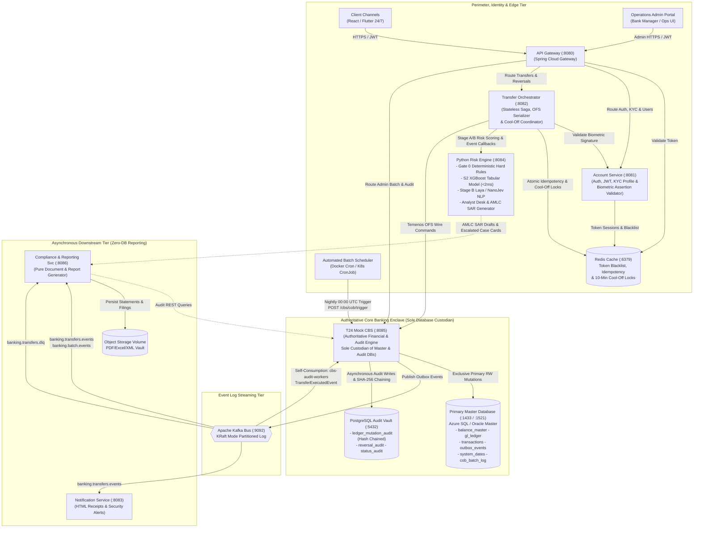

### 2.1 Architectural Tier Breakdown & Component Roles
* **Perimeter, Identity & Edge Tier**:
  * **`Automated Batch Scheduler (Docker Cron / K8s CronJob)`**: Dedicated infrastructure scheduler daemon firing automated nightly batches at `00:00 UTC` by dispatching HTTP `POST /api/v1/cbs/cob/trigger` to `t24-mock-cbs`.
  * **`Operations Admin Portal`**: Secure React management console used by bank operations managers and auditors to monitor real-time COB progress (`GET /api/v1/cbs/cob/status`), trigger manual batch overrides, perform modular calculations during recovery (`POST /api/v1/cbs/eod/trigger`), and adjudicate disputes.
  * **`API Gateway (:8080)`**: Central ingress point for all client requests; handles TLS termination, JWT sanity verification, token blacklist inspection against Redis, and URL routing.
  * **`Account Service (:8081)`**: Authoritative microservice for customer identity, user onboarding, KYC status tiers, credentials authentication, session JWT issuing, and mandatory cryptographic biometric assertion validation (`POST /api/v1/internal/users/{userId}/validate-biometric`).
  * **`Redis Cache (:6379)`**: Shared sub-millisecond in-memory cache for JWT blacklisting (`blacklist:jti`), distributed idempotency locks (`tx:idemp:<key>`), biometric attempt rate-limiting, and 10-minute anti-scam cooling-off timer locks (`tx:cooloff:<txId>`).
  * **`Transfer Orchestrator (:8082)`**: Stateless Saga orchestrator decoupled from direct database drivers; manages perimeter validation, invokes `risk-service`, coordinates mandatory biometric confirmation challenges with `account-service`, enforces cool-off countdowns, buffers daytime traffic during cutoff (`HTTP 202 Accepted`), and serializes requests to Temenos OFS syntax.
  * **`Python Risk Engine (:8084)`**: Real-time FastAPI microservice executing sub-2ms XGBoost scoring and local neural LLM (`Qwen2.5-0.5B-Instruct` / NanoJev) inference to evaluate transfer risk and generate natural language anti-scam warning advisories.
* **Authoritative Core Banking Enclave**:
  * **`T24 Mock CBS (:8085)`**: Isolated financial and audit core holding exclusive database connectivity to **BOTH** `azure-sql-db` and `postgres-audit-vault`. Executes atomic sub-5ms row-level locks and double-entry postings in Master DB, publishes domain events via the transactional outbox, and asynchronously consumes its own TransferExecutedEvent (and related events) from Kafka to write immutable audit records with SHA-256 hash chains to PostgreSQL.
* **Event Log Streaming Tier**:
  * **`Apache Kafka Bus (:9092)`**: High-throughput partitioned event broker in KRaft mode decoupling authoritative core banking mutations from asynchronous downstream subscribers.
* **Asynchronous Downstream Tier**:
  * **`Notification Service (:8083)`**: Consumes domain events from Kafka to deliver customer HTML transaction receipts and security alerts via SMTP.
  * **`Compliance & Reporting Service (:8086)`**: Possesses zero database connections. Consumes domain and DLQ events and queries CBS audit APIs to compile AMLA CTR/STR filings, coordinate DLQ incident replay, and generate heavy End-of-Day PDF/Excel reports without database contention.

---

## 3. Added and Split Services: Architectural Evolution

The target architecture reorganizes backend responsibilities to achieve total isolation between high-frequency transactional locking and regulatory archiving.

```mermaid
flowchart LR
    subgraph Current_State["Current State (As-Is)"]
        LME["ledger-mutation-engine (:8082)<br/>• REST Endpoints<br/>• Risk Engine Client<br/>• Oracle Row Locks<br/>• Sync Postgres Dual-Write<br/>• Direct Outbox Poller"]
    end

    subgraph Target_State["Target State (Path B Additions & Splits)"]
        direction TB
        NEW_ORCH["Transfer Orchestrator (:8082)<br/>(Split from Engine)"]
        NEW_CBS["T24 Mock CBS (:8085)<br/>(Split from Engine)"]
        NEW_COMP["Compliance & Reporting Svc (:8086)<br/>(Newly Added Service)"]
    end

    LME -.->|Stateless Orchestration & OFS| NEW_ORCH
    LME -.->|Financial Core & Sole DB Custodian (Azure + Postgres)| NEW_CBS
    LME -.->|Decoupled Report & Document Generation (Zero DB)| NEW_COMP
```

### 3.1 Service Evolution Breakdown

| Service Name | Port | Transition Nature | Origin & Rationale for Addition / Split |
| :--- | :--- | :--- | :--- |
| **`transfer-orchestrator`** | `:8082` | **Split Service** | **Split from `ledger-mutation-engine`**.<br/>*Why Split*: Stripping database drivers and datasource configurations out of the intake tier prevents database connections from idling during perimeter validation, external risk scoring, or mandatory biometric verification. It acts as a stateless Saga orchestrator, coordinates Resilience4j circuit breakers with DLQ routing, enforces 10-minute anti-scam cool-off locks in Redis, and serializes requests into Temenos OFS wire syntax. |
| **`t24-mock-cbs`** | `:8085` | **Split Service** | **Split from `ledger-mutation-engine`**.<br/>*Why Split*: Isolates the Authoritative Core Banking System as the **sole custodian of BOTH databases** (`azure-sql-db` and `postgres-audit-vault`). It manages ledger mutations in Azure SQL, publishes domain events to Kafka, and asynchronously consumes its own published events (such as TransferExecutedEvent) to write immutable audit trails in PostgreSQL with sequential SHA-256 hash chains. Eliminating external HTTP calls and deferring audit vault writes to asynchronous self-consumption ensures account row-level locks are held strictly under 5 milliseconds. |
| **`compliance-service`** | `:8086` | **Added Service** | **Newly Added Service (pure reporting & compliance worker)**.<br/>*Why Added*: Holds **zero SQL datasource connections**. Consumes Kafka events and queries CBS audit APIs to compile AMLA CTR/STR regulatory filings, coordinates DLQ inspection/replay, and generates CPU-heavy EOD PDF/Excel reports without database contention or impacting CBS throughput. |
| **`gateway-service`** | `:8080` | Existing (Retained) | Updated routing rules to proxy `/api/v1/compliance/**` to port `:8086`, `/api/v1/transfers/**` and `/api/v1/reversals/**` to port `:8082`. |
| **`account-service`** | `:8081` | Existing (Retained) | Manages user registration, authentication, JWT issuing, KYC tier levels, Redis session stores, and public-key biometric credential validation. |
| **`notification-service`**| `:8083` | Existing (Retained) | Consumes domain events from Kafka to generate customer HTML transaction receipts and deliver manager security alerts via MailHog SMTP (Transfer authorization is validated directly via mandatory device biometric confirmation). |
| **`risk-service`** | `:8084` | Existing (Retained) | Real-time Python FastAPI microservice executing a production **Two-Stage Multi-Model Risk Engine**:<br/>• **Stage A (Synchronous Tabular Risk, latency &lt; 30ms)**: Gate 0 deterministic hard rules (impossible travel velocity &gt; 1,000 km/h, mock GPS, device tampering, emulator) and S2 XGBoost model evaluating 40+ behavioral, velocity, and counterparty features (including real-time balance drain ratio and spike ratio).<br/>• **Stage B (Synchronous NLP Threat & Memo Synthesis, latency &lt; 0.10ms)**: Powered by the **Laya** non-autoregressive encoder (ModernBERT / mmBERT, 10,000+ tx/s, detecting Philippine scam typologies in English/Tagalog/Taglish and mobile threat context like AnyDesk/active call coercion) with fallback to **NanoJev** (Qwen2.5-0.5B INT8 ONNX). Enforces the **Escalate-Only Safety Invariant**.<br/>• **Compliance & Analyst Desk**: Fire-and-forget event feedback loop (`POST /api/v1/risk/events`), automated AMLC Suspicious Activity Report (SAR / STR) draft generation via `hybrid_bench.sar_generator`, and an interactive Analyst Triage Desk (`GET /api/v1/analyst/cases`, `POST /api/v1/analyst/decision`). |

---

## 4. Database Additions & Segregation Model

The system enforces strict database custodianship: **`t24-mock-cbs (:8085)` has sole and exclusive ownership of BOTH database engines** (`azure-sql-db` and `postgres-audit-vault`). All other microservices (`transfer-orchestrator`, `compliance-service`, `risk-service`, `account-service`) possess **zero direct SQL database connectivity**.

```mermaid
flowchart TD
    subgraph Master_Persistence["Primary Relational Store (Azure SQL / Oracle Master :1433)"]
        direction TB
        M1["Existing: accounts, balance_master, transactions, outbox_events"]
        M2["Added: gl_accounts (Chart of Accounts)"]
        M3["Added: gl_ledger (Double-Entry Journal Postings)"]
        M4["Added: gl_balances (Real-Time Debit/Credit Accumulators)"]
        M5["Added: reversal_requests (Maker-Checker Dispute Tickets)"]
        M6["Added: uncollected_fees (Zero-Overdraft Arrears Tracking)"]
        M7["Added: interest_accruals (Daily Accrued Interest)"]
        M8["Added: eod_balance_snapshots (Closing State Freezes)"]
        M9["Added: system_dates (Core Business Date & COB State Machine)"]
        M10["Added: transaction_status_history (Master Transition Log)"]
        M11["Added: cob_batch_log (Master COB Operational Audit Log)"]
    end

    subgraph Audit_Vault["Dedicated Immutable Vault (PostgreSQL 16 :5432)"]
        direction TB
        A1["Enhanced: ledger_mutation_audit (Trigger Protected + Hash Chained)"]
        A2["Added: reversal_audit (Dual-Control Sign-Off History)"]
        A3["Added: failed_transaction_audit (DLQ Poison Pill Ingestion)"]
        A4["Added: eod_reports_metadata (SHA-256 Registry of Generated Files)"]
        A5["Added: compliance_filings (AMLA CTR >= 500k & STR Filings)"]
        A6["Added: transaction_status_audit (Tamper-Evident Mirror of Status Changes)"]
    end

    CBS_NODE["T24 Mock CBS (:8085)<br/>Sole Database Custodian"] -->|Exclusive Primary RW| Master_Persistence
    CBS_NODE -->|Exclusive Asynchronous Audit Ledger RW<br/>(via Kafka Self-Consumption)| Audit_Vault
```

### 4.1 Master Database Table Additions (`azure-sql-db` / `oracle-xe-master`)

| Table Name | Schema Type | Primary Purpose | Key Fields & Constraints | Exclusive Owner |
| :--- | :--- | :--- | :--- | :--- |
| **`gl_accounts`** | Master Ledger | Chart of Accounts defining asset, liability, equity, revenue, and expense accounts. | `gl_code` (PK), `account_name`, `account_type`, `currency`, `is_active` | `t24-mock-cbs` |
| **`gl_ledger`** | Transactional | Immutable double-entry financial journal lines created atomically with customer transactions. | `journal_id` (PK), `transaction_id` (FK), `gl_code` (FK), `debit_amount`, `credit_amount`, `posting_date` | `t24-mock-cbs` |
| **`gl_balances`** | Summary Ledger | Real-time and end-of-day debit/credit balance aggregations. | `gl_code` (PK), `fiscal_period`, `total_debit`, `total_credit`, `net_balance` | `t24-mock-cbs` |
| **`reversal_requests`** | Transactional | Maker-Checker dispute ticket state machine governing financial reversals. | `ticket_id` (PK), `original_tx_id` (FK), `maker_id`, `checker_id`, `status` (`PENDING`, `APPROVED`, `REJECTED`) | `t24-mock-cbs` |
| **`uncollected_fees`** | Transactional | Zero-overdraft arrears ledger tracking uncollected below-min ADB fees. | `fee_id` (PK), `account_id` (FK), `fee_type`, `amount_due`, `amount_collected`, `is_settled` | `t24-mock-cbs` |
| **`interest_accruals`** | Transactional | Daily interest accrual records calculated during EOD Phase 2 pending month-end capitalization. | `accrual_id` (PK), `account_id` (FK), `accrual_date`, `daily_rate`, `accrued_amount`, `is_capitalized` | `t24-mock-cbs` |
| **`eod_balance_snapshots`**| Analytical | Daily immutable snapshot of closing customer balances frozen during EOD Phase 3. | `snapshot_id` (PK), `account_id` (FK), `business_date`, `closing_balance` | `t24-mock-cbs` |
| **`system_dates`** | Control State | Authoritative core banking operational calendar and master COB state machine coordinator. | `system_date_id` (PK), `business_date`, `status` (`ONLINE`, `EOD_CUTOFF`, `COB_PROCESSING`, `ROLLOVER`, `ERROR_HALTED`), `posting_window_open`, `last_cob_completed_at`, `updated_at` | `t24-mock-cbs` |
| **`cob_batch_log`** | Operational Audit | Master COB operational execution audit log tracking phases, execution duration, metrics, and failure tripwires. | `batch_id` (PK), `business_date`, `started_at`, `completed_at`, `status` (`RUNNING`, `COMPLETED`, `FAILED`), `current_phase`, `accounts_processed`, `total_fees_collected`, `total_interest_accrued`, `total_tax_withheld`, `error_message` | `t24-mock-cbs` |
| **`transaction_status_history`**| Master Audit | Chronological status change log capturing every state transition, actor ID, and mandatory change reason. | `history_id` (PK), `transaction_id` (FK), `from_status`, `to_status`, `change_reason`, `reason_details`, `actor_id`, `actor_type`, `changed_at`, `metadata_json` | `t24-mock-cbs` |

### 4.2 Dedicated Audit Vault Table Additions (`postgres-audit-vault`)

| Table Name | Schema Type | Primary Purpose | Key Fields & Security Constraints | Exclusive Owner |
| :--- | :--- | :--- | :--- | :--- |
| **`ledger_mutation_audit`**| Immutable Audit | Append-only financial mutation mirror. Written directly by `t24-mock-cbs` upon transaction commit. Protected by PostgreSQL triggers preventing `UPDATE`/`DELETE`. | `audit_id` (PK), `transaction_id` (UNIQUE), `source_account_id`, `target_account_id`, `amount`, `sha256_hash` | `t24-mock-cbs` |
| **`reversal_audit`** | Compliance | Immutable audit trail of dual-control Maker-Checker reversal operations. Written directly by `t24-mock-cbs` upon reversal commit. | `audit_id` (PK), `ticket_id`, `maker_id`, `checker_id`, `original_tx_id`, `approved_at`, `reversal_tx_id` | `t24-mock-cbs` |
| **`failed_transaction_audit`**| Ops / Compliance | Dead Letter Queue (DLQ) failure payloads and circuit breaker trip events for incident inspection and replay. Managed by `t24-mock-cbs`. | `incident_id` (PK), `transaction_id`, `error_code`, `payload_json`, `stack_trace`, `replay_status` | `t24-mock-cbs` |
| **`eod_reports_metadata`**| Compliance Vault | Registry and cryptographic verification ledger of generated EOD artifacts. Managed by `t24-mock-cbs` upon EOD batch finalization. | `report_id` (PK), `report_type`, `file_uri`, `sha256_checksum`, `record_count`, `retention_expiry_date` | `t24-mock-cbs` |
| **`compliance_filings`** | Regulatory | Covered Transaction Reports (CTR) and Suspicious Transaction Reports (STR) filed per AMLA. Sealed by `t24-mock-cbs`. | `filing_id` (PK), `filing_type` (`CTR_500K`, `STR_FRAUD`), `transaction_id`, `payload_xml`, `amlc_ref` | `t24-mock-cbs` |
| **`transaction_status_audit`**| Immutable Audit | Mirrored append-only status change audit trail with cryptographic SHA-256 hash chaining. Written directly by `t24-mock-cbs`. Protected by triggers against `UPDATE`/`DELETE`. | `audit_id` (PK), `transaction_id`, `from_status`, `to_status`, `change_reason`, `reason_details`, `actor_id`, `actor_type`, `changed_at`, `sha256_hash`, `prev_hash` | `t24-mock-cbs` |

### 4.3 Canonical Transaction Status Model & Lifecycle Audit Architecture

To provide end-to-end operational traceability, prevent phantom financial mutations, and meet strict Bangko Sentral ng Pilipinas (BSP) audit guidelines, the target architecture enforces a strict **finite state machine** governing the lifecycle of every funds transfer. Every transaction must reside in exactly one canonical state at any given point in time, and **every single status mutation must be chronologically recorded with a mandatory change reason code, explanatory reason narrative, actor identifier, and UTC timestamp**.

#### 4.3.1 Canonical Status Definitions & State Semantics

The platform standardizes on seven core operational statuses, augmented by two dual-control governance states:

| Status Identifier | Lifecycle Category | State Description & Core Semantics | Typical Duration / TTL | Permitted Next States |
| :--- | :--- | :--- | :--- | :--- |
| **`Initiated`** | Ingestion | Request has been received and ingested by `transfer-orchestrator:8082` via API Gateway. Distributed idempotency lock is held in Redis (`tx:idemp:<id>`), payload schema constraints validated, and transaction tracking UUID assigned. Solvency and fraud scoring have not yet executed. | $< 100\text{ms}$ | `Authorized`, `Cancelled` |
| **`Authorized`** | Verification | Security perimeter validation passed: Customer JWT claims verified, KYC daily limits checked, ML/XGBoost fraud classification passed (or anti-scam warning acknowledged + voluntary 10-minute cool-off elapsed), and mandatory device biometric confirmation (Face ID / Fingerprint) cryptographically verified by `account-service`. Customer intent is legally certified. | $< 500\text{ms}$ | `Reserved`, `Cancelled` |
| **`Reserved`** | Pre-Settlement | Source account liquidity has been earmarked/reserved in pre-settlement controls to guarantee sufficient funds before dispatching to the core banking engine. Prevents concurrent double-spend race conditions while awaiting CBS lock acquisition. | $< 200\text{ms}$ | `Processing`, `Failed` |
| **`Processing`** | Core Execution | The transaction instruction has been serialized into Temenos OFS syntax (`FUNDS.TRANSFER,INITIATE...`) and dispatched to `t24-mock-cbs:8085`. The core banking engine has initiated an ACID transaction and acquired pessimistic row-level locks (`UPDLOCK, ROWLOCK`) on `balance_master` in strict ascending ID order. Double-entry general ledger computations are actively executing. | $< 5\text{ms}$ | `Posted`, `Failed` |
| **`Posted`** | Terminal Success | Authoritative final settlement committed. Account balances debited and credited in `balance_master`, double-entry journals committed to `gl_ledger`, transactional outbox event written to `outbox_events`, and ACID database commit completed. Transaction is financially immutable. | Permanent | `PendingReversal` (if disputed) |
| **`Failed`** | Terminal Failure | Unrecoverable error occurred during core processing. Solvency deficit in CBS (`ACCOUNT.BAL.LT.ZERO`), account status inactive/closed, database deadlock timeout, or downstream circuit breaker exhaustion. No customer balance or general ledger mutations persist. | Permanent | None (Terminal) |
| **`Cancelled`** | Terminal Abort | Transaction aborted prior to core financial processing. Triggered by automated hard fraud rejection (`risk_score > 0.85`), user cancellation upon reading the LLM anti-scam warning or during the 10-minute cool-off period, cancelled biometric prompt, or 3 consecutive failed biometric attempts. | Permanent | None (Terminal) |
| **`PendingReversal`** | Dual-Control Escrow | Operational dispute ticket filed by a Branch Teller (Maker) against an existing `Posted` transaction (`reversal_requests`). The transaction is placed under dual-control managerial escrow awaiting Operations Manager (Checker) adjudication. | 24–72 hours | `Reversed`, `Posted` |
| **`Reversed`** | Post-Terminal Settlement | Reversal dispute approved by Operations Manager (Checker). Authoritative compensating double-entry accounting lines committed to `gl_ledger`, customer funds restored in `balance_master`, and reversal audit trail cryptographically sealed in `reversal_audit`. | Permanent | None (Terminal) |

#### 4.3.2 Transaction Lifecycle State Machine Diagram

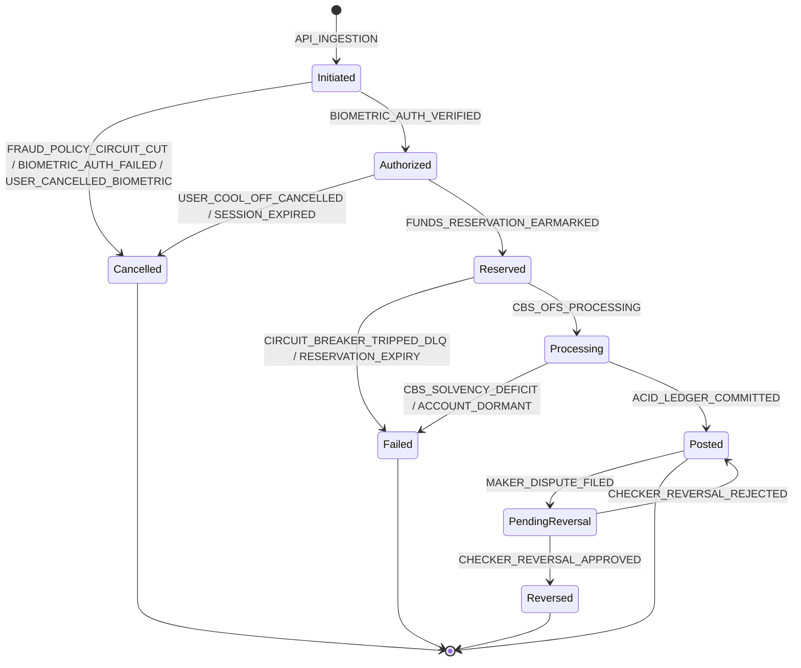

#### 4.3.3 State Transition Matrix, Change Reason Catalog & Business Invariants

Every state transition must carry an authorized **Reason Code**, a descriptive explanation, and the originating **Actor ID** and **Actor Type**:

| From Status | To Status | Triggering Event / API | Standardized Reason Code | Reason Narrative & Context | Enforced Invariant & Business Rule | Responsible Actor & Service |
| :--- | :--- | :--- | :--- | :--- | :--- | :--- |
| `[*]` | `Initiated` | `POST /api/v1/transfers` | `API_INGESTION` | Transfer request ingested by Gateway and Orchestrator; idempotency key locked. | Lock `tx:idemp:<key>` acquired with 60s TTL in Redis. Prevents concurrent duplicates. | `CUSTOMER`<br/>`transfer-orchestrator` |
| `Initiated` | `Authorized` | `POST /verify-biometric` | `BIOMETRIC_AUTH_VERIFIED` | Customer completed mandatory biometric confirmation (Face ID / Fingerprint) via device secure enclave. | Cryptographic signature verified against user credential in `account-service`. Mandatory for ALL transfers regardless of amount or risk level. | `CUSTOMER`<br/>`account-service` |
| `Initiated` | `Authorized` | Cool-off Reconfirmation | `SCAM_ADVISORY_CONFIRMED_BIOMETRIC_VERIFIED` | Customer completed 10-minute cool-off after scam warning and authorized transfer via mandatory biometrics. | Cool-off lock `tx:cooloff:<id>` expired (600s); explicit customer reconfirmation and biometric signature match. | `CUSTOMER`<br/>`transfer-orchestrator` |
| `Initiated` | `Cancelled` | Risk Score $> 0.85$ | `FRAUD_POLICY_CIRCUIT_CUT` | Real-time ML inference classified transaction as high fraud risk; execution blocked. | Hard fraud circuit cut. Zero DB connections opened; opens AMLA STR docket. | `SYSTEM_RISK`<br/>`risk-service` |
| `Initiated` | `Cancelled` | Biometrics 3 Fails | `BIOMETRIC_ATTEMPTS_EXCEEDED` | Customer failed biometric authentication 3 consecutive times; transaction aborted. | Redis counter `biometric:attempts:<userId>` reached 3; user locked from initiating transfers for 15 minutes. | `CUSTOMER`<br/>`account-service` |
| `Initiated` | `Cancelled` | User Prompt Dismiss | `USER_CANCELLED_BIOMETRIC` | Customer dismissed or cancelled native biometric authentication dialog. | Challenge TTL expires; distributed idempotency lock released in Redis. | `CUSTOMER`<br/>`transfer-orchestrator` |
| `Authorized` | `Reserved` | Internal Liquidity Earmark | `FUNDS_RESERVATION_EARMARKED` | Source account funds earmarked to guarantee solvency during CBS transit. | Internal balance earmark applied prior to dispatching wire to core banking engine. | `SYSTEM_ORCH`<br/>`transfer-orchestrator` |
| `Authorized` | `Cancelled` | Cool-off Cancellation | `USER_COOL_OFF_CANCELLED` | Customer reviewed anti-scam warning during 10-minute pause and chose to cancel. | Social engineering coercion broken; Redis cool-off key deleted; locks freed. | `CUSTOMER`<br/>`transfer-orchestrator` |
| `Authorized` | `Cancelled` | Challenge Timeout | `SESSION_TIMEOUT_ABANDONED` | Challenge authorization window (180s) expired without client submission. | Challenge key `chal:tx:<id>` expired in Redis. | `SYSTEM_ORCH`<br/>`transfer-orchestrator` |
| `Reserved` | `Processing` | Dispatch Temenos OFS | `CBS_OFS_PROCESSING` | OFS wire string transmitted to `t24-mock-cbs:8085`; CBS ACID transaction started. | Row locks acquired on `balance_master` in strict ascending ID order (`min`, `max`). | `SYSTEM_CBS`<br/>`t24-mock-cbs` |
| `Reserved` | `Failed` | Circuit Breaker Trip | `CIRCUIT_BREAKER_TRIPPED_DLQ` | Downstream CBS unreachable after 3 retries; circuit tripped to OPEN. | Resilience4j circuit open; payload dispatched to `banking.transfers.dlq`. | `SYSTEM_ORCH`<br/>`transfer-orchestrator` |
| `Processing` | `Posted` | ACID Commit Master DB | `ACID_LEDGER_COMMITTED` | Balances mutated, balanced GL journals created, and outbox event registered. | Sub-5ms lock budget maintained; double-entry equality ($\sum \text{DR} = \sum \text{CR}$) verified. | `SYSTEM_CBS`<br/>`t24-mock-cbs` |
| `Processing` | `Failed` | CBS Solvency Check Deficit | `CBS_SOLVENCY_DEFICIT` | Source account available balance is insufficient to settle transfer amount. | Rollback transaction; emit OFS NACK `ACCOUNT.BAL.LT.ZERO`; zero GL mutation. | `SYSTEM_CBS`<br/>`t24-mock-cbs` |
| `Processing` | `Failed` | Account Inactive / Closed | `CBS_ACCOUNT_INACTIVE` | Beneficiary account is marked dormant, suspended, or closed in CBS core. | Rollback transaction; emit OFS NACK `ACCOUNT.STATUS.INVALID`. | `SYSTEM_CBS`<br/>`t24-mock-cbs` |
| `Posted` | `PendingReversal` | `POST /reversals/request` | `MAKER_DISPUTE_FILED` | Branch Teller (Maker) filed dispute ticket `REV-500` requesting fund clawback. | Segregation of duties enforced: ticket status `PENDING`, awaiting manager sign-off. | `TELLER_MAKER`<br/>`t24-mock-cbs` |
| `PendingReversal` | `Reversed` | `POST /reversals/approve` | `CHECKER_REVERSAL_APPROVED_SETTLED` | Operations Manager (Checker) authorized reversal; compensating settlement executed. | Dual-control verified: `checker_id != maker_id`; beneficiary balance verified. | `MANAGER_CHECKER`<br/>`t24-mock-cbs` |
| `PendingReversal` | `Posted` | `POST /reversals/reject` | `CHECKER_REVERSAL_REJECTED` | Operations Manager (Checker) rejected dispute ticket; original transaction maintained. | Ticket marked `REJECTED`; original transaction restored to unencumbered `Posted` state. | `MANAGER_CHECKER`<br/>`t24-mock-cbs` |

#### 4.3.4 Logical Data Architecture for Status & Reason Tracking

To guarantee complete operational auditability, system-of-record consistency, and compliance with Bangko Sentral ng Pilipinas (BSP) core banking standards without prematurely coupling the architecture to physical database-specific storage types, the design specifies the **logical schema attributes**, domain concepts, and integrity invariants for both the primary transaction store and the immutable audit vault.

##### Primary Master Database Entity: `transaction_status_history` (`azure-sql-db` / `oracle-xe-master`)
Every status mutation within the core banking enclave creates an immutable entry in `transaction_status_history`:

| Logical Attribute | Domain Concept | Cardinality / Nullability | Architectural Purpose & Business Semantics |
| :--- | :--- | :--- | :--- |
| `history_id` | Unique Identifier | Mandatory (PK) | Sequential or unique record identifier within the state transition log. |
| `transaction_id` | Foreign Key Reference | Mandatory (FK) | Relational correlation linking this state change to the parent financial record in `transactions`. |
| `from_status` | Status Enumeration | Optional (Null for origin) | Prior canonical status immediately preceding this transition (`Initiated`, `Authorized`, `Reserved`, `Processing`, etc.). |
| `to_status` | Status Enumeration | Mandatory | Resulting canonical status (`Initiated`, `Authorized`, `Reserved`, `Processing`, `Posted`, `Failed`, `Cancelled`, `PendingReversal`, `Reversed`). |
| `change_reason` | Standardized Reason Code | Mandatory | Standardized, machine-readable reason code identifying the business rule, perimeter policy, or settlement trigger (e.g., `ACID_LEDGER_COMMITTED`, `CBS_SOLVENCY_DEFICIT`, `FRAUD_POLICY_CIRCUIT_CUT`). |
| `reason_details`| Explanatory Narrative | Optional | Human-readable explanation, error diagnosis, or operational context associated with the transition. |
| `actor_id` | Actor Identifier | Mandatory | Unique identity of the human actor (Customer, Teller, Manager) or automated system process initiating the transition. |
| `actor_type` | Actor Classification | Mandatory | Classification of the acting principal (`CUSTOMER`, `SYSTEM_ORCHESTRATOR`, `SYSTEM_CBS`, `SYSTEM_RISK`, `TELLER_MAKER`, `MANAGER_CHECKER`, `BATCH_SCHEDULER`). |
| `changed_at` | Universal Timestamp | Mandatory | High-precision UTC timestamp recording the exact chronological moment of state transition. |
| `metadata_json` | Contextual Telemetry | Optional | Structured contextual payload capturing request telemetry, risk scores, challenge IDs, or core banking wire references. |

*Architectural Access Pattern*:
* Designed for low-latency chronological lineage lookups by `transaction_id` and regulatory compliance aggregation by `change_reason`.

##### Dedicated Audit Vault Entity: `transaction_status_audit` (`postgres-audit-vault :5432`)
The `t24-mock-cbs` core engine directly records all state transitions into the dedicated Audit Vault, maintaining an unbroken cryptographic hash chain across the financial lifecycle:

| Logical Attribute | Domain Concept | Cardinality / Nullability | Architectural Purpose & Regulatory Semantics |
| :--- | :--- | :--- | :--- |
| `audit_id` | Vault Sequence ID | Mandatory (PK) | Monotonically increasing record sequence identifier within the compliance vault. |
| `transaction_id` | Transaction Reference | Mandatory | Correlation identifier linking the audit entry to the original transaction. |
| `from_status` | Status Enumeration | Optional | Status prior to state transition. |
| `to_status` | Status Enumeration | Mandatory | Resulting canonical status. |
| `change_reason` | Standardized Reason Code | Mandatory | Standardized transition reason code matching the core banking event. |
| `reason_details`| Explanatory Narrative | Optional | Descriptive narrative or operational explanation. |
| `actor_id` | Actor Identifier | Mandatory | Identity of the human or service actor. |
| `actor_type` | Actor Classification | Mandatory | Classification of the initiating entity. |
| `changed_at` | Universal Timestamp | Mandatory | Universal timestamp in UTC. |
| `metadata_json` | Contextual Telemetry | Optional | Structured contextual parameters and telemetry. |
| `prev_hash` | Cryptographic Hash Link | Mandatory | SHA-256 digest of the immediately preceding vault record, establishing an unbroken cryptographic hash chain. |
| `sha256_hash` | Cryptographic Digest | Mandatory | Tamper-evident digest computed over current attributes and `prev_hash` ($\text{SHA256}(\text{audit\_id} \parallel \text{prev\_hash} \parallel \text{tx\_id} \parallel \text{to\_status} \parallel \text{reason} \parallel \text{changed\_at})$). |

*Storage Immutability Invariant*:
* The audit vault enforces strict append-only semantics. Modifying or deleting existing status audit rows is architecturally prohibited at the storage boundary.

#### 4.3.5 Event Streaming Contract: `TransactionStatusChangedEvent`

Whenever a transaction status transition occurs, a domain event is streamed to topic `banking.transfers.events` so downstream subscribers (Audit Vault, Notification Engine, UI WebSocket Gateway) synchronize in real time:

```json
{
  "eventId": "evt-7f8e9a2b-3c4d-5e6f-7a8b-9c0d1e2f3a4b",
  "eventType": "TransactionStatusChangedEvent",
  "version": "1.0",
  "transactionId": "TX-100234",
  "fromStatus": "Processing",
  "toStatus": "Posted",
  "changeReason": "ACID_LEDGER_COMMITTED",
  "reasonDetails": "ACID transaction committed atomically: debited source account, credited target account, general ledger balanced",
  "actorId": "SYSTEM_CBS_8085",
  "actorType": "SYSTEM_CBS",
  "changedAt": "2026-10-07T01:45:00.123456Z",
  "metadata": {
    "sourceAccountId": "ACC-01",
    "targetAccountId": "ACC-02",
    "amount": 5000.00,
    "currency": "PHP",
    "ofsReference": "FT261007000123"
  }
}
```

---

## 5. Event-Driven Architecture: Kafka Event Catalog

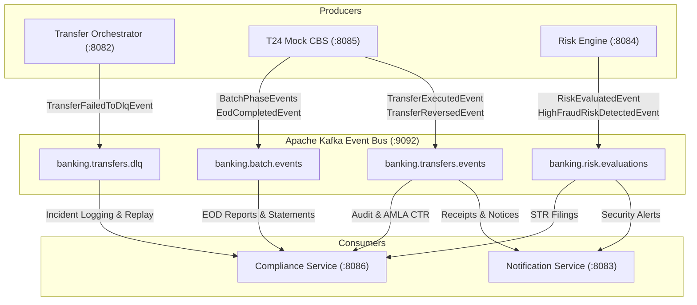

### 5.1 Kafka Events Catalog

| Topic Name | Event Name | Producer Service | When Produced (Trigger Condition) | Consumer Service(s) | Consumer Purpose & Action |
| :--- | :--- | :--- | :--- | :--- | :--- |
| `banking.transfers.events` | `TransferExecutedEvent` | `t24-mock-cbs` | After ACID transaction successfully commits debits, credits, and GL entries in master DB. | 1. `t24-mock-cbs` (Self-Consumption: `cbs-audit-workers`)<br/>2. `notification-service`<br/>3. `compliance-service` | 1. Asynchronously consumes own event to persist immutable audit row to `ledger_mutation_audit` in PostgreSQL with continuous SHA-256 hash chaining.<br/>2. Renders HTML receipt and emails customer.<br/>3. Aggregates stateless reporting metrics and triggers AMLA CTR generation if amount $\ge ₱500,000.00$. |
| `banking.transfers.events` | `TransferReversedEvent` | `t24-mock-cbs` | After dual-control reversal settles compensating accounting entries in master DB. | 1. `t24-mock-cbs` (Self-Consumption: `cbs-audit-workers`)<br/>2. `notification-service`<br/>3. `compliance-service` | 1. Asynchronously consumes own event to persist immutable records to `reversal_audit` and compensating entries to `ledger_mutation_audit` with SHA-256 hash chains.<br/>2. Emails customer reversal confirmation.<br/>3. Updates reversal dispute metrics and compliance logs. |
| `banking.transfers.events` | `TransactionStatusChangedEvent` | `transfer-orchestrator` / `t24-mock-cbs` | Emitted upon every state transition across the canonical status set (`Initiated`, `Authorized`, `Reserved`, `Processing`, `Posted`, `Failed`, `Cancelled`, `PendingReversal`, `Reversed`) with mandatory change reason code and actor telemetry. | 1. `t24-mock-cbs` (Self-Consumption: `cbs-audit-workers`)<br/>2. `compliance-service`<br/>3. `notification-service` | 1. Asynchronously consumes event to mirror state transition into `transaction_status_audit` in PostgreSQL with SHA-256 hash chaining.<br/>2. Updates in-memory compliance monitoring metrics.<br/>3. Emits real-time SSE push updates / toasts to client UI. |
| `banking.transfers.dlq` | `TransferFailedToDlqEvent` | `transfer-orchestrator`| When Resilience4j circuit breaker trips or retries exhaust. | 1. `t24-mock-cbs`<br/>2. `compliance-service` | 1. Ingests payload into `failed_transaction_audit` for administrative review and replay.<br/>2. Alerts compliance and operations dashboard. |
| `banking.risk.evaluations` | `RiskEvaluatedEvent` | `risk-service` | Upon completion of real-time ML fraud inference ($< 2\text{ms}$). | `compliance-service` | Stores scoring telemetry and feature vectors for auditability. |
| `banking.risk.evaluations` | `HighFraudRiskDetectedEvent` | `risk-service` | When fraud probability score exceeds $0.85$ or structuring alert trips. | 1. `compliance-service`<br/>2. `notification-service` | 1. Creates AMLA Suspicious Transaction Report (STR) investigation docket.<br/>2. Alerts Branch Manager. |
| `banking.batch.events` | `PostingCutoffInitiatedEvent` | `t24-mock-cbs` | When master COB Phase 0 starts, locking posting for Date $T$ and buffering daytime online traffic for $T+1$. | `compliance-service` | Prepares reporting engines and queues nightly jobs. |
| `banking.batch.events` | `FeeDeductedEvent` | `t24-mock-cbs` | During EOD Phase 1 when below-min ADB or dormancy fees are debited with zero-overdraft protection. | 1. `notification-service`<br/>2. `compliance-service` | 1. Dispatches fee deduction statement notice.<br/>2. Records fee collection audit. |
| `banking.batch.events` | `InterestCapitalizedEvent` | `t24-mock-cbs` | During EOD Phase 2 when net 80% interest is capitalized and 20% BIR tax withheld. | 1. `notification-service`<br/>2. `compliance-service` | 1. Emails interest credited notification.<br/>2. Compiles BIR Form 2306 tax withholding documentation and certificates. |
| `banking.batch.events` | `BalanceSnapshotFrozenEvent` | `t24-mock-cbs` | During EOD Phase 3 when closing balances are committed to `eod_balance_snapshots`. | `compliance-service` | Triggers E-Statement and Trial Balance generation routines. |
| `banking.batch.events` | `EodCompletedEvent` | `t24-mock-cbs` | During COB Phase 4 when business date advances to $T+1$, customer velocity limits reset, and system returns to `ONLINE`. | 1. `compliance-service`<br/>2. `gateway-service` | 1. Finalizes daily reporting packages.<br/>2. Unfreezes regular daytime transaction routing. |

---

## 6. Request-Response Sequence Diagrams

### 6.1 Feature 1: Intra-Bank Funds Transfer

#### 6.1.1 Happy Path: Intra-Bank Funds Transfer with Mandatory Biometric Confirmation

```mermaid
sequenceDiagram
    autonumber
    actor Customer as Customer (Web/Mobile)
    participant UI as Client App (React / Flutter)
    participant GW as API Gateway (:8080)
    participant Redis as Redis Cache (:6379)
    participant Orch as Transfer Orchestrator (:8082)
    participant Risk as Python Risk Engine (:8084)
    participant Acct as Account Service (:8081)
    participant CBS as T24 Mock CBS (:8085)
    participant MasterDB as Primary Master DB (:1433)
    participant Kafka as Kafka Broker (:9092)
    participant Notif as Notification Svc (:8083)
    participant Comp as Compliance Svc (:8086)
    participant AuditDB as Postgres Audit Vault (:5432)

    Customer->>UI: Submits Transfer Details (Amount, Recipient)
    UI->>GW: POST /api/v1/transfers (Bearer JWT, Payload)
    GW->>Redis: Check Token Blacklist (blacklist:jti)
    Redis-->>GW: OK (Token Valid)
    GW->>Orch: Proxy POST /api/v1/transfers

    Note over Orch,Redis: State: Initiated (Reason: API_INGESTION)
    Orch->>Redis: SET tx:state:{id} "Initiated" EX 300
    Orch->>Redis: SET tx:idemp:{id} "PROCESSING" NX EX 60
    Redis-->>Orch: OK (Lock Acquired)

    Note over Orch,CBS: Step 1 (Read): Authoritative Account Balance Inquiry (OFS: ENQUIRY.SELECT)
    Orch->>CBS: GET /api/v1/cbs/accounts/ACC-001294/balance
    CBS-->>Orch: HTTP 200 {availableBalance: 100000.00, ledgerBalance: 100000.00}

    Note over Orch,Risk: Step 2: Two-Stage Risk Evaluation (< 2ms S2 Tabular + Laya NLP)
    Orch->>Risk: POST /api/v1/risk/decision (Stage A: Gate 0 & S2 XGBoost, balanceDrainRatio: 0.15)
    Risk-->>Orch: HTTP 200 {decision_id: "DEC-100234", action: "ALLOW", s2_score: 12, memo_check_required: true}

    opt Memo Check Required (Customer Transfer Memo Present)
        Orch->>Risk: POST /api/v1/risk/memo-check {decision_id: "DEC-100234", language: "en"}
        Risk-->>Orch: HTTP 200 {decision_id: "DEC-100234", tier: "NONE", final_action: "ALLOW", typology: "none"}
    end

    Note over Orch,UI: Mandatory Biometric Challenge (Required for ALL transfers)
    Orch->>Redis: SET chal:tx:{id} "PENDING_BIOMETRIC" EX 180
    Orch-->>GW: HTTP 202 Accepted {status: "REQUIRE_BIOMETRIC", challengeId: "{id}", method: "NATIVE_BIOMETRIC", prompt: "Authenticate via Face ID or Fingerprint"}
    GW-->>UI: HTTP 202 Accepted (Mount Native Biometric Sensor Prompt)

    UI->>Customer: Displays Native Biometric Prompt (Face ID / Fingerprint)
    Customer->>UI: Authenticates with Biometric Sensor
    Note over UI: Device Secure Enclave Cryptographically Signs Assertion
    UI->>Orch: POST /api/v1/transfers/{id}/verify-biometric {challengeId: "{id}", biometricSignature: "...", credentialId: "..."}

    Note over Orch,Acct: Cryptographic Biometric Assertion Validation
    Orch->>Acct: POST /api/v1/internal/users/{userId}/validate-biometric {signature, credentialId}
    Acct->>Acct: Verify signature against registered FIDO2/WebAuthn public key
    Acct-->>Orch: HTTP 200 {valid: true}
    Orch->>Redis: DEL chal:tx:{id}

    Note over Orch,Redis: State Transition: Authorized (Reason: BIOMETRIC_AUTH_VERIFIED)
    Orch->>Redis: SET tx:state:{id} "Authorized" EX 300

    Note over Orch,Risk: Post-Decision Feedback & Model Re-Training Event (Async Fire-and-Forget)
    Orch-)Risk: POST /api/v1/risk/events {decision_id: "DEC-100234", user_action: "continued", stepup_result: "success", final_action: "ALLOW"}

    Note over Orch,Redis: State Transition: Reserved (Reason: FUNDS_RESERVATION_EARMARKED)
    Orch->>Redis: SET tx:state:{id} "Reserved" EX 300

    Note over Orch,CBS: Serialize JSON to Temenos OFS Wire Syntax (State: Processing)
    Orch->>CBS: POST /api/v1/cbs/transfers (OFS: FUNDS.TRANSFER,INITIATE...)
    CBS->>MasterDB: BEGIN TRANSACTION
    CBS->>MasterDB: SELECT balance_amount FROM balance_master WITH (UPDLOCK, ROWLOCK) WHERE account_id IN (src, dst) ORDER BY account_id ASC
    MasterDB-->>CBS: Balances Locked (Sufficient Solvency)
    CBS->>MasterDB: UPDATE balance_master SET balance_amount = balance_amount - amount WHERE account_id = src
    CBS->>MasterDB: UPDATE balance_master SET balance_amount = balance_amount + amount WHERE account_id = dst
    CBS->>MasterDB: INSERT INTO gl_ledger (DR Cust Liab, CR Cust Liab)
    CBS->>MasterDB: INSERT INTO transactions (id, status='Posted')
    CBS->>MasterDB: INSERT INTO transaction_status_history (transaction_id, from_status='Processing', to_status='Posted', change_reason='ACID_LEDGER_COMMITTED', actor_id='SYSTEM_CBS', actor_type='SYSTEM_CBS')
    CBS->>MasterDB: INSERT INTO outbox_events (TransferExecutedEvent & TransactionStatusChangedEvent)
    CBS->>MasterDB: COMMIT TRANSACTION
    MasterDB-->>CBS: Transaction Committed

    Note over CBS,Kafka: Transactional Outbox Event Dispatch to Kafka Bus
    CBS->>Kafka: Publish TransferExecutedEvent & TransactionStatusChangedEvent
    CBS->>MasterDB: UPDATE outbox_events SET status = 'PUBLISHED'

    CBS-->>Orch: OFS ACK // FUNDS.TRANSFER//1/TX100234//SUCCESS
    Orch->>Redis: SET tx:idemp:{id} "SUCCESS" EX 86400
    Orch-->>GW: HTTP 200 OK {status: "Posted", txId: "TX100234"}
    GW-->>UI: HTTP 200 OK (Transfer Successful)
    UI-->>Customer: Displays Transfer Receipt Screen

    par Asynchronous Kafka Subscribers
        Note over Kafka,AuditDB: CBS Self-Consumption for Immutable Audit Ledger
        Kafka->>CBS: Consume TransferExecutedEvent & TransactionStatusChangedEvent (cbs-audit-workers)
        CBS->>AuditDB: INSERT INTO ledger_mutation_audit (...) with SHA-256 Hash Chain
        CBS->>AuditDB: INSERT INTO transaction_status_audit (...)
        AuditDB-->>CBS: Audit Records Sealed & Offset Committed
    and
        Kafka->>Notif: Consume TransferExecutedEvent
        Notif->>Customer: Send HTML Receipt via MailHog SMTP (:1025)
    and
        Kafka->>Comp: Consume TransferExecutedEvent & TransactionStatusChangedEvent
        Comp->>Comp: Update Reporting Metrics & Trigger AMLA CTR if Amount >= 500k
    end
```

#### 6.1.2 Alternate Flow A: Biometric Authentication Failure & Cancellation

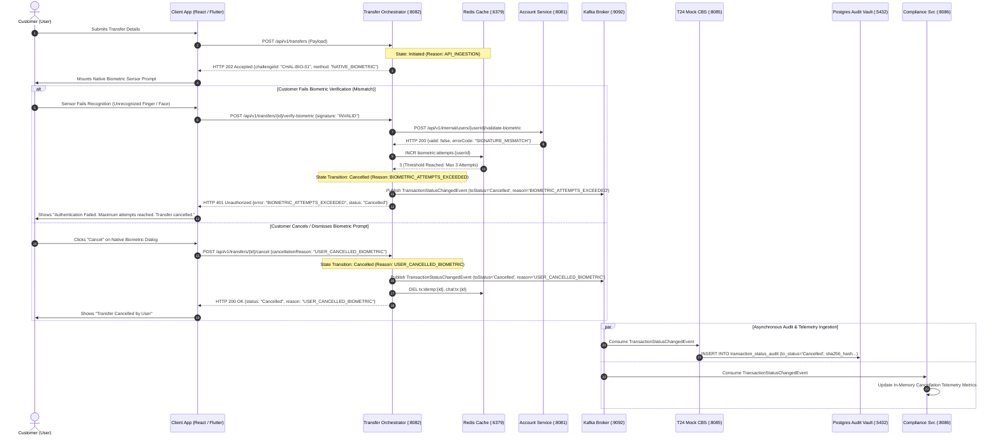

#### 6.1.3 Alternate Flow B: High Fraud Risk Cutoff (Immediate Block)

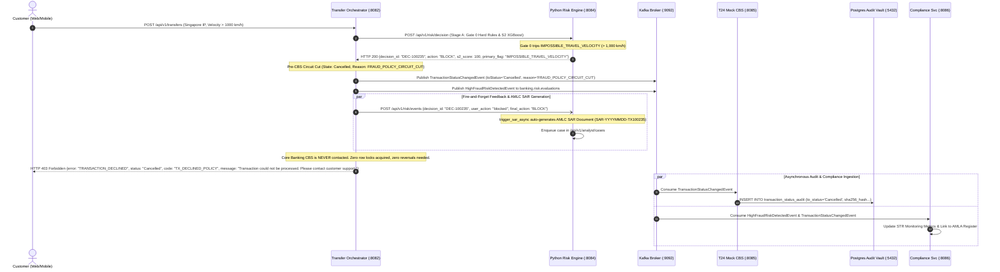

#### 6.1.4 Alternate Flow C: Insufficient Account Balance (CBS Solvency Failure)

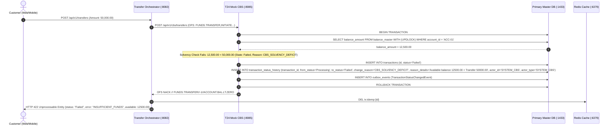

#### 6.1.5 Alternate Flow D: Idempotency Lock Collision (Duplicate In-Flight Request)

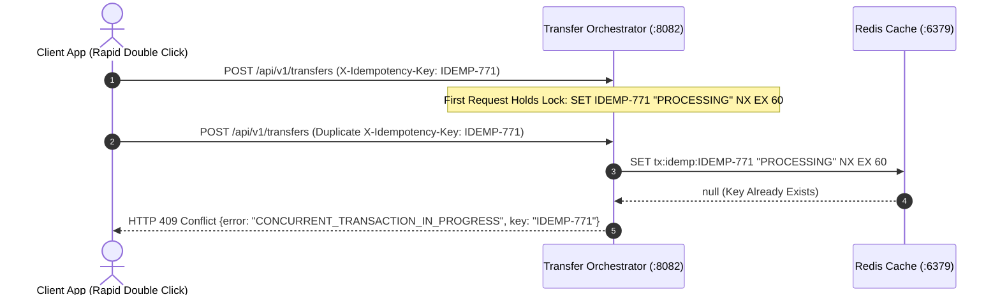

#### 6.1.6 Alternate Flow E: LLM-Generated Anti-Scam Advisory & 10-Minute Cool-Off Flow

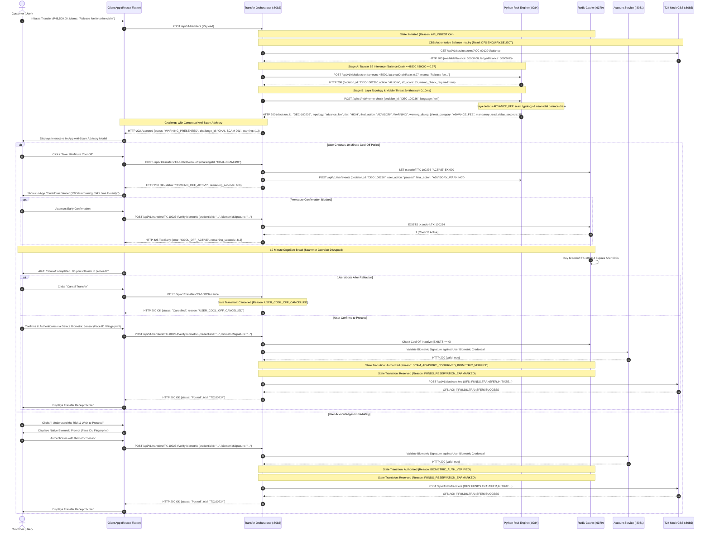

---

### 6.2 Feature 2: Intra-Bank Transaction Reversal (Maker-Checker Governance)

#### 6.2.1 Happy Path: Reversal Ticket Creation, Approval, and Compensating Settlement

```mermaid
sequenceDiagram
    autonumber
    actor Maker as Branch Teller (Maker)
    actor Checker as Operations Manager (Checker)
    participant Orch as Transfer Orchestrator (:8082)
    participant CBS as T24 Mock CBS (:8085)
    participant MasterDB as Primary Master DB (:1433)
    participant Kafka as Kafka Broker (:9092)
    participant Comp as Compliance Svc (:8086)
    participant AuditDB as Postgres Audit Vault (:5432)

    Note over Maker,Orch: Phase 1: Reversal Dispute Ticket Filing (State: Posted to PendingReversal)
    Maker->>Orch: POST /api/v1/reversals/request {original_tx_id: "TX-100", reason: "WRONG_ACCOUNT"}
    Orch->>CBS: POST /api/v1/cbs/reversals/ticket
    CBS->>MasterDB: INSERT INTO reversal_requests (ticket_id, original_tx_id, maker_id, status='PENDING')
    CBS->>MasterDB: UPDATE transactions SET status = 'PendingReversal' WHERE id = 'TX-100'
    CBS->>MasterDB: INSERT INTO transaction_status_history (transaction_id, from_status='Posted', to_status='PendingReversal', change_reason='MAKER_DISPUTE_FILED', reason_details='Wrong account dispute filed by teller', actor_id='USR-99', actor_type='TELLER_MAKER')
    CBS->>MasterDB: INSERT INTO outbox_events (TransactionStatusChangedEvent)
    CBS->>AuditDB: INSERT INTO transaction_status_audit (transaction_id, from_status='Posted', to_status='PendingReversal', change_reason='MAKER_DISPUTE_FILED', actor_id='USR-99', sha256_hash...)
    CBS-->>Orch: Ticket REV-500 Created
    Orch-->>Maker: HTTP 201 Created {ticketId: "REV-500", transactionStatus: "PendingReversal"}

    Note over Checker,Orch: Phase 2: Checker Review & Dual Authorization
    Checker->>Orch: POST /api/v1/reversals/REV-500/approve (Manager JWT)
    Note over Orch: Validate Segregation of Duties: checker_id != maker_id
    Orch->>CBS: POST /api/v1/cbs/reversals/REV-500/execute (OFS: FUNDS.TRANSFER,REVERSAL)

    Note over CBS,MasterDB: Phase 3: Compensating Double-Entry Settlement (State: PendingReversal to Reversed)
    CBS->>MasterDB: BEGIN TRANSACTION
    CBS->>MasterDB: SELECT balance_amount FROM balance_master WITH (UPDLOCK) WHERE account_id = beneficiary
    Note over CBS: Solvency Check: beneficiary balance >= reversal amount
    CBS->>MasterDB: UPDATE balance_master SET balance_amount = balance_amount - amount WHERE account_id = beneficiary
    CBS->>MasterDB: UPDATE balance_master SET balance_amount = balance_amount + amount WHERE account_id = original_sender
    CBS->>MasterDB: INSERT INTO gl_ledger (Inverted Compensating DR/CR Lines)
    CBS->>MasterDB: UPDATE reversal_requests SET checker_id = ?, status = 'APPROVED'
    CBS->>MasterDB: UPDATE transactions SET status = 'Reversed', reversal_ref_id = 'REV-500' WHERE id = 'TX-100'
    CBS->>MasterDB: INSERT INTO transaction_status_history (transaction_id, from_status='PendingReversal', to_status='Reversed', change_reason='CHECKER_REVERSAL_APPROVED_SETTLED', reason_details='Operations Manager approved reversal of wrong account credit', actor_id='MGR-02', actor_type='MANAGER_CHECKER')
    CBS->>MasterDB: INSERT INTO outbox_events (TransferReversedEvent & TransactionStatusChangedEvent)
    CBS->>MasterDB: COMMIT TRANSACTION

    Note over CBS,Kafka: Transactional Outbox Event Dispatch to Kafka Bus
    CBS->>Kafka: Publish TransferReversedEvent & TransactionStatusChangedEvent to banking.transfers.events
    CBS-->>Orch: OFS ACK // FUNDS.TRANSFER,REVERSAL//SUCCESS
    Orch-->>Checker: HTTP 200 OK {status: "Reversed", reversalRef: "REV-500"}

    par Asynchronous Kafka Subscribers
        Note over Kafka,AuditDB: CBS Self-Consumption for Reversal Audit
        Kafka->>CBS: Consume TransferReversedEvent & TransactionStatusChangedEvent (cbs-audit-workers)
        CBS->>AuditDB: INSERT INTO reversal_audit (ticket_id, original_tx_id, maker_id, checker_id, reason, reversal_tx_id, timestamp)
        CBS->>AuditDB: INSERT INTO ledger_mutation_audit (Compensating Journal Lines, sha256_hash...)
        CBS->>AuditDB: INSERT INTO transaction_status_audit (from_status='PendingReversal', to_status='Reversed', change_reason='CHECKER_REVERSAL_APPROVED_SETTLED', sha256_hash...)
        AuditDB-->>CBS: Reversal Audit Entries Sealed & Offset Committed
    and
        Kafka->>Comp: Consume TransferReversedEvent & TransactionStatusChangedEvent
        Comp->>Comp: Update Reversal Metrics & Regulatory Dispute Dossier
    end
```

#### 6.2.2 Alternate Flow A: Segregation of Duties Violation (Self-Approval Blocked)

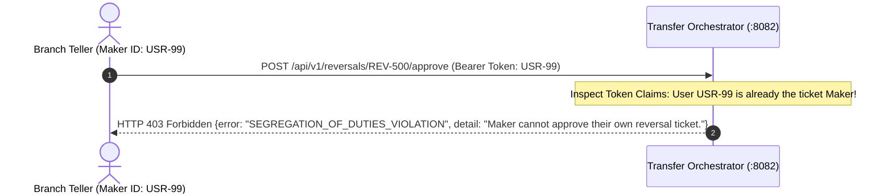

#### 6.2.3 Alternate Flow B: Checker Rejection of Dispute Ticket

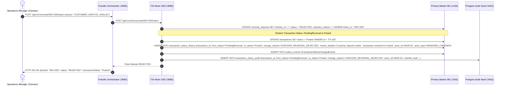

#### 6.2.4 Alternate Flow C: Beneficiary Insufficient Balance for Reversal


---

### 6.3 Feature 3: Circuit Breaker & DLQ Incident Management

#### 6.3.1 Downstream CBS Failure, Circuit Breaker Trip, and DLQ Routing

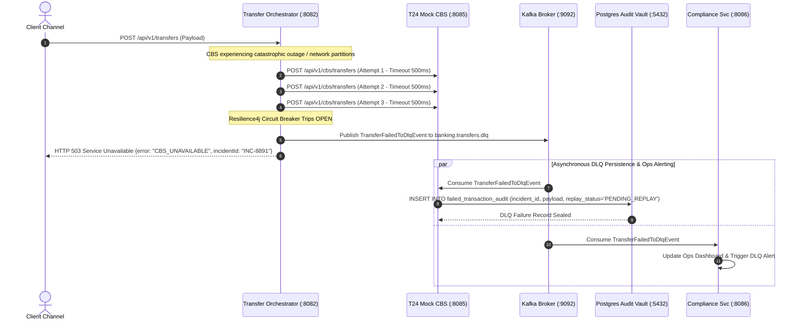

#### 6.3.2 Administrative DLQ Incident Inspection and Manual Replay Flow

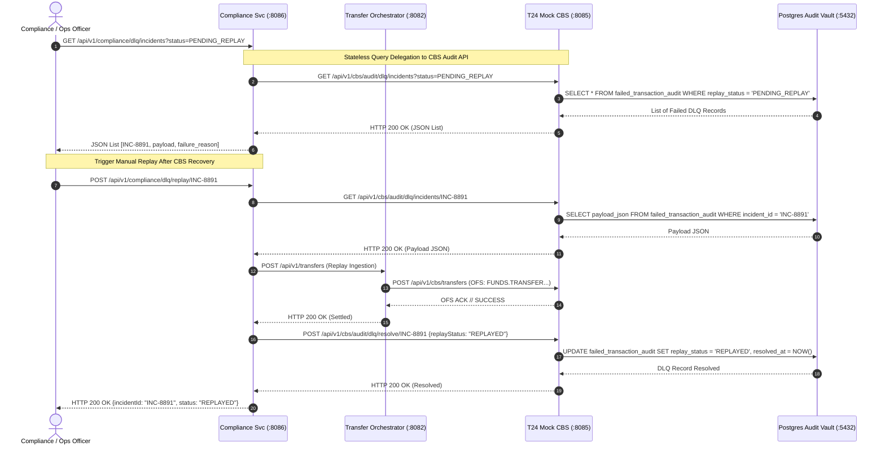

---

### 6.4 Feature 4: Close of Business (COB) & End-of-Day (EOD) Batch Pipeline Master Execution

#### 6.4.1 Executive Architectural Distinction: COB vs. EOD

In modern core banking architectures (specifically modeling Temenos T24 / Transact), **COB** and **EOD** represent two distinct architectural tiers of the daily financial closing cycle:

```
┌────────────────────────────────────────────────────────────────────────────────────────┐
│               CLOSE OF BUSINESS (COB) — MASTER OPERATIONAL STATE MACHINE               │
│                                                                                        │
│  [Phase 0: Pre-COB]      [Phases 1-3: Core EOD Batch]     [Phase 4: Post-COB / SOB]    │
│  • Channel Drain         ┌──────────────────────────────┐ • Business Date Rollover     │
│  • Cutoff Enforcement    │ End-of-Day (EOD) Accounting: │   (T ➔ T+1)                  │
│  • T+1 Value-Date Tag    │ • Subfeature 4.2: Fees       │ • Reset Daily Limits         │
│  • In-Flight Clearing    │ • Subfeature 4.3: Interest   │ • Re-open Online Processing  │
│                          │ • Subfeature 4.1: Reports/GL │ • Unbuffer T+1 Queue         │
│                          └──────────────────────────────┘                              │
└────────────────────────────────────────────────────────────────────────────────────────┘
```

##### Architectural Comparison Matrix

| Architectural Dimension | **End-of-Day (EOD)** | **Close of Business (COB)** |
| :--- | :--- | :--- |
| **Domain Scope** | **Financial Accounting & Ledger Computation** | **System Lifecycle & Operational State Machine** |
| **Question It Answers** | *"What financial balances, fees, and interest must be calculated for Date $T$?"* | *"How does the core banking platform transition operationally from Date $T \to T+1$?"* |
| **Hierarchy** | **Child Module / Computational Engine** (runs *inside* COB Phases 1–3). | **Parent Container / Master Orchestrator** (coordinates Phases 0 through 4). |
| **Key Responsibilities** | • Calculate below-min ADB maintenance fees.<br>• Accrue daily deposit interest and 20% BIR withholding tax.<br>• Freeze closing balance snapshots (`eod_balance_snapshots`).<br>• Verify double-entry GL balance ($\sum \text{Debits} = \sum \text{Credits}$). | • Manage system state transitions (`ONLINE` ➔ `EOD_CUTOFF` ➔ `COB_PROCESSING` ➔ `ROLLOVER` ➔ `ONLINE`).<br>• Drain in-flight channel transfers and tag 24/7 intake to $T+1$.<br>• Sequence and execute the EOD accounting batch.<br>• Advance authoritative calendar date in `system_dates`.<br>• Reset daily customer velocity/transfer limits.<br>• Trigger Start-of-Business (SOB) re-opening. |
| **Calendar Impact** | **NEVER changes the calendar date.** Balances and logs remain strictly for Date $T$. | **Advances the calendar date from $T \to T+1$** in `system_dates`. |
| **Execution Nature** | Purely computational, idempotent, domain-level accounting. | Platform-level orchestration and state lifecycle governance. |

##### Architectural Domain Ownership

* **Belongs to COB (Close of Business) — Platform Operations & Lifecycle**:
  * **Phase 0 (Pre-COB Cutoff)**: Locking the posting window for Date $T$, draining in-flight transactions, and tagging new 24/7 transfers to Date $T+1$.
  * **Phase 4 (Post-COB Rollover / SOB)**: Advancing `system_dates` ($T \to T+1$), resetting daily customer velocity limits, recording `cob_batch_log`, and reopening the system (`ONLINE`).
  * **State Machine Governance**: Enforces `ONLINE` ➔ `EOD_CUTOFF` ➔ `COB_PROCESSING` ➔ `ROLLOVER` ➔ `ONLINE`, with the `ERROR_HALTED` safety tripwire.
  * **Master APIs**: `POST /api/v1/cbs/cob/trigger` (macro lifecycle), `GET /api/v1/cbs/cob/status` (progress monitoring), and `GET /api/v1/cbs/system-date` (authoritative date/window query).
* **Belongs to EOD (End of Day) — Financial Accounting Engine**:
  * **Phase 1 (Fees)**: Calculating below-minimum ADB fees with Zero-Overdraft Protection.
  * **Phase 2 (Interest & Tax)**: Daily deposit interest accrual and month-end capitalization with 20% BIR withholding tax split.
  * **Phase 3 (Snapshots & GL)**: Freezing daily balance snapshots (`eod_balance_snapshots`) and double-entry General Ledger balancing ($\sum \text{Debits} = \sum \text{Credits}$).
  * **Modular APIs**: `POST /api/v1/cbs/eod/trigger` (executes pure accounting calculations on Date $T$ without rolling the calendar date).
  * **Async Reporting**: `compliance-service` generating PDF E-Statements, GL Trial Balance sheets, BIR Form 2306 tax certificates, and AMLA CTR filings.

---

#### 6.4.2 Master COB Execution Sequence (Phases 0 through 4 Happy Path)

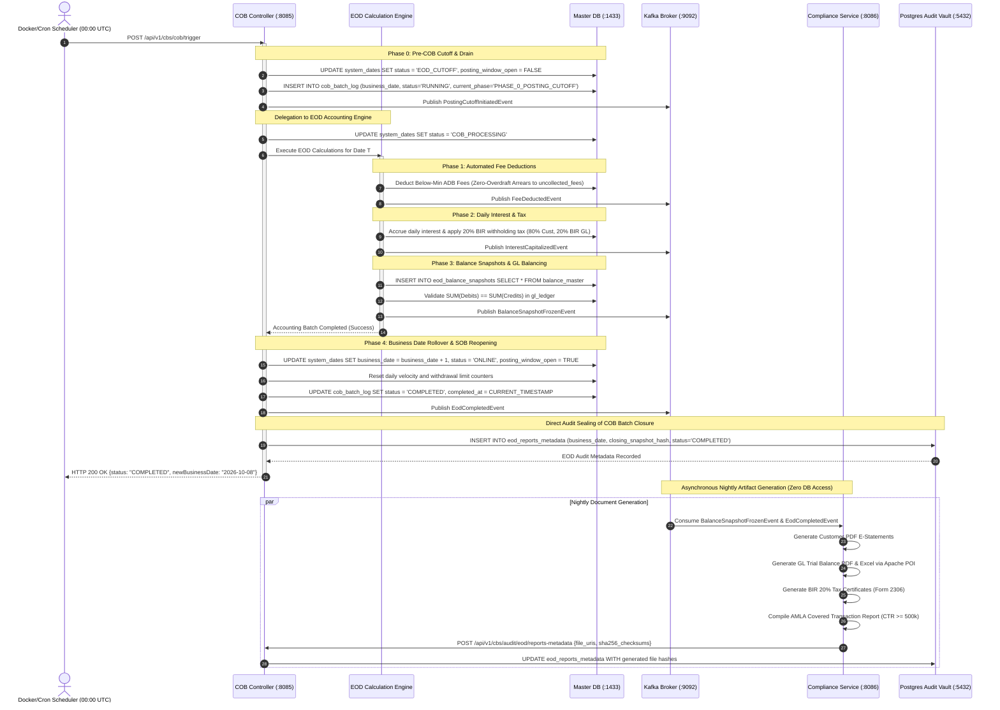

---

#### 6.4.3 Alternate Flow: Error Recovery & Remediation (The ERROR_HALTED Tripwire)

When a calculation failure occurs (e.g., transient database lock conflict during interest accrual or General Ledger imbalance), the state machine halts in `ERROR_HALTED` to protect financial integrity, **strictly blocking calendar rollover**:

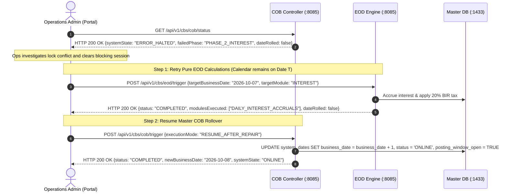

---

#### 6.4.4 Phase 0 Cutoff Flow: 24/7 Daytime Online Requests Buffered During Cutoff

Customer mobile banking remains functional 24/7. Transactions submitted during the COB window are smoothly tagged with Value Date $T+1$:

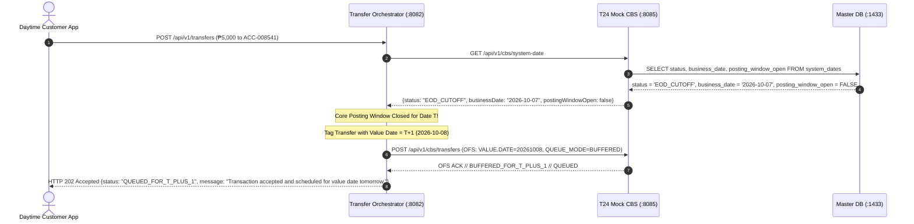

---

#### 6.4.5 Phase 1 Alternate Flow: Zero-Overdraft Arrears Capping for Insolvent Accounts

```mermaid
sequenceDiagram
    autonumber
    participant CBS as T24 Mock CBS (:8085)
    participant MasterDB as Primary Master DB (:1433)

    Note over CBS: Evaluating Account ACC-901 for Below-Min ADB Fee (₱500.00)
    CBS->>MasterDB: SELECT balance_amount FROM balance_master WHERE account_id = 'ACC-901'
    MasterDB-->>CBS: balance_amount = ₱150.00
    Note over CBS: Full deduction would cause illegal negative balance (-₱350.00)!
    CBS->>MasterDB: UPDATE balance_master SET balance_amount = 0.00 WHERE account_id = 'ACC-901'
    CBS->>MasterDB: INSERT INTO gl_ledger (DR Cust Liab 150.00, CR Fee Income 150.00)
    CBS->>MasterDB: INSERT INTO uncollected_fees (account_id, fee_type, amount_due=500.00, amount_collected=150.00, is_settled=FALSE)
    Note over CBS: Zero-Overdraft Protection Preserved - Arrears Logged
```

---

### 6.5 Feature 5: Real-Time Risk Engine Two-Stage Pipeline & Compliance Analyst Adjudication

#### 6.5.1 Two-Stage Risk Evaluation (Stage A Tabular S2 -> Stage B Laya Typology & Escalate-Only Invariant)

```mermaid
sequenceDiagram
    autonumber
    actor Customer as Customer (Mobile App)
    participant Orch as Transfer Orchestrator (:8082)
    participant CBS as T24 Mock CBS (:8085)
    participant Risk as Python Risk Engine (:8084)
    participant Acct as Account Service (:8081)

    Customer->>Orch: POST /api/v1/transfers (₱15,000.00, Memo: "Urgent hospital bail release")
    
    Note over Orch,CBS: Authoritative Account Balance Inquiry (Read: OFS ENQUIRY.SELECT)
    Orch->>CBS: GET /api/v1/cbs/accounts/ACC-001294/balance
    CBS-->>Orch: HTTP 200 {availableBalance: 20000.00, ledgerBalance: 20000.00}

    Note over Orch,Risk: Stage A: Tabular S2 Screening (< 30ms, Balance Drain = 15k / 20k = 0.75)
    Orch->>Risk: POST /api/v1/risk/decision {amount: 15000.00, balanceDrainRatio: 0.75, memo: "Urgent hospital..."}
    Note over Risk: Gate 0 Passes, S2 XGBoost outputs p = 0.22 (Below TAU_2FA)
    Risk-->>Orch: HTTP 200 {decision_id: "DEC-5091", action: "ALLOW", s2_score: 22, memo_present: true, memo_check_required: true}

    Note over Orch,Risk: Stage B: Laya Typology Semantic Evaluation (< 0.10ms)
    Orch->>Risk: POST /api/v1/risk/memo-check {decision_id: "DEC-5091", language: "en"}
    Note over Risk: Laya detects IMPERSONATION emergency scam typology (p=0.91)
    Note over Risk: Escalate-Only Invariant: Escalates ALLOW to ADVISORY_WARNING
    Risk-->>Orch: HTTP 200 {decision_id: "DEC-5091", typology: "impersonation", tier: "HIGH", final_action: "ADVISORY_WARNING", warning_dialog: {...}}

    Orch-->>Customer: HTTP 202 Accepted {status: "WARNING_PRESENTED", dialog: "Impersonation Alert: Verify family identity directly"}
    Customer->>Customer: Contacts family member and discovers impersonation fraud
    Customer->>Orch: POST /api/v1/transfers/TX-100237/cancel {reason: "USER_ADVISORY_ABORTED"}
    
    Orch-)Risk: POST /api/v1/risk/events {decision_id: "DEC-5091", user_action: "cancelled", final_action: "ADVISORY_WARNING"}
    Note over Orch: Transaction Cancelled. Core Banking System was NEVER called.
```

#### 6.5.2 Compliance Analyst Case Investigation, Forensic Review & Adjudication Flow

```mermaid
sequenceDiagram
    autonumber
    actor Analyst as AML / Fraud Compliance Analyst
    participant Portal as Compliance & Ops Portal
    participant Risk as Python Risk Engine (:8084)
    participant Comp as Compliance Service (:8086)
    participant AuditDB as Postgres Audit Vault (:5432)

    Note over Analyst,Portal: Daily Suspicious Activity & Escalated Case Triage
    Analyst->>Portal: Opens Fraud & Scam Case Worklist
    Portal->>Risk: GET /api/v1/analyst/cases
    Risk-->>Portal: HTTP 200 OK [CaseCards: {case_id, transaction_id, scam_typology, s2_score, top_3_shap_features, sar_drafted}]

    Portal-->>Analyst: Displays Forensic Case Cards with SHAP Explainability & AMLC SAR Draft
    Analyst->>Portal: Reviews Telemetry (Device Rooting, Clipboard Paste, Voice Call Coercion)
    Analyst->>Portal: Submits Case Adjudication (CONFIRM_FRAUD with Forensic Affidavit Notes)
    Portal->>Risk: POST /api/v1/analyst/decision {case_id: "CASE-DEC-100235", decision: "CONFIRM_FRAUD", analyst_id: "ANALYST_01", notes: "Confirmed advance-fee impersonation"}
    Risk-->>Portal: HTTP 200 OK {status: "SUCCESS", entry: {...}}

    par Audit Mirroring & Regulatory Filing
        Portal->>Comp: POST /api/v1/compliance/filings/amla/sar {caseId: "CASE-DEC-100235", status: "ADJUDICATED_FRAUD"}
        Comp->>CBS: POST /api/v1/cbs/audit/filings {caseId: "CASE-DEC-100235", filing_type: "STR", amlc_reference: "AML-20261007-0091"}
        CBS->>AuditDB: INSERT INTO compliance_filings (filing_type='STR', amlc_reference, filing_status='READY_FOR_SUBMISSION')
        AuditDB-->>CBS: Filing Record Sealed
        CBS-->>Comp: HTTP 201 Created
        Comp-->>Portal: HTTP 201 Created (AMLA STR Docket Sealed)
    end
    Portal-->>Analyst: Confirmation: Case Closed & AMLA STR Docket Filed
```

---

## 7. Business Logic Flowcharts (Happy Paths & Alternate Cases)

### 7.1 Funds Transfer Processing Logic Flowchart

```mermaid
flowchart TD
    Start([Inbound Transfer Request]) --> ValidatePerimeter{Valid Token &<br/>Payload Precision?}
    ValidatePerimeter -- No --> Ret400[Return HTTP 400 Bad Request]
    ValidatePerimeter -- Yes --> CheckIdemp{Acquire Redis Lock<br/>tx:idemp:id?}
    CheckIdemp -- Collision --> Ret409[Return HTTP 409 Duplicate Transfer]
    CheckIdemp -- Acquired --> SetInit[State: Initiated<br/>Reason: API_INGESTION]
    SetInit --> InquireBal[CBS Balance Inquiry (Read)<br/>GET /api/v1/cbs/accounts/id/balance]
    InquireBal --> CallRisk[Invoke Python Risk Engine<br/>FastAPI / XGBoost with Balance Drain Ratio]

    CallRisk --> EvalRisk{Risk Engine &<br/>LLM Analysis}
    EvalRisk -- Score > 0.85 --> BlockFraud[State: Cancelled<br/>Reason: FRAUD_POLICY_CIRCUIT_CUT<br/>Emit HighFraudRiskDetectedEvent<br/>Return HTTP 403 Forbidden]
    EvalRisk -- 0.40 < Score <= 0.85 or Scam Typology --> GenLLMWarning[Qwen2.5 LLM Synthesizes Natural<br/>Language Anti-Scam Advisory]
    GenLLMWarning --> PresentAdvisory[Return HTTP 202 WARNING_PRESENTED<br/>Mount In-App Scam Advisory Modal]
    PresentAdvisory --> UserAdvisoryAction{Customer Action on<br/>Scam Advisory}
    UserAdvisoryAction -- Cancel Transfer --> AbortTx[State: Cancelled<br/>Reason: USER_ABORTED_TRANSFER<br/>Return HTTP 200 Cancelled]
    UserAdvisoryAction -- Take 10-Min Cool-Off --> StartCoolOff[Set Redis Cool-Off Lock 600s<br/>Display In-App Countdown Banner]
    StartCoolOff --> CoolOffTimer{10 Minutes Elapsed?}
    CoolOffTimer -- Premature Attempt --> RejectEarly[Reject: Return HTTP 425 Too Early]
    CoolOffTimer -- Timer Finished --> PromptReconfirm{Customer Confirms<br/>Wish to Proceed?}
    PromptReconfirm -- No / Abort --> AbortCoolOff[State: Cancelled<br/>Reason: USER_COOL_OFF_CANCELLED<br/>Return HTTP 200 Cancelled]
    PromptReconfirm -- Yes --> ReqBio[Mandatory Biometric Confirmation<br/>Trigger Native Face ID / Fingerprint Prompt]
    UserAdvisoryAction -- Acknowledge Immediately --> ReqBio
    EvalRisk -- Score <= 0.40 Clean --> ReqBio

    ReqBio --> AwaitBio{Validate Customer<br/>Biometric Signature?}
    AwaitBio -- Invalid / Sensor Fail / Cancelled --> RetBioFail[State: Cancelled<br/>Reason: BIOMETRIC_AUTH_FAILED<br/>Return HTTP 401 Unauthorized]
    AwaitBio -- Valid Cryptographic Match --> SetAuthBio[State: Authorized<br/>Reason: BIOMETRIC_AUTH_VERIFIED]

    SetAuthBio --> SetReserved[State: Reserved<br/>Reason: FUNDS_RESERVATION_EARMARKED]
    SetReserved --> TranslateOFS[Translate Request into<br/>Temenos OFS Wire Syntax]

    TranslateOFS --> DispatchCBS[Transmit OFS Command to<br/>T24 Mock CBS POST /api/v1/cbs/transfers]
    DispatchCBS --> CheckCBSStatus{CBS System Date<br/>Status?}
    CheckCBSStatus -- EOD_CUTOFF --> BufferT1[Queue Transaction for T+1 &<br/>Return HTTP 202 Accepted]
    CheckCBSStatus -- ONLINE --> BeginTx[CBS Begins ACID Transaction<br/>State: Processing]

    BeginTx --> RowLock[Pessimistic Row Lock Accounts<br/>ORDER BY account_id ASC]
    RowLock --> CheckSolv{Available Balance >=<br/>Transfer Amount?}
    CheckSolv -- No --> RollbackOFS[State: Failed<br/>Reason: CBS_SOLVENCY_DEFICIT<br/>Rollback & Return OFS NACK<br/>Return HTTP 422 Unprocessable]
    CheckSolv -- Yes --> MutateBalances[Debit Source & Credit Target<br/>in balance_master]

    MutateBalances --> PostGL[Insert Double-Entry Records<br/>into gl_ledger]
    PostGL --> WriteHistory[Insert into transaction_status_history<br/>State: Posted, Reason: ACID_LEDGER_COMMITTED]
    WriteHistory --> WriteOutbox[Insert Outbox Events<br/>TransferExecuted & StatusChanged]
    WriteOutbox --> CommitTx[Commit ACID Transaction]
    CommitTx --> PubKafka[Publish Domain Events to Kafka<br/>banking.transfers.events]
    PubKafka --> Ret200[Return HTTP 200 OK to Client<br/>status: Posted]
    PubKafka --> AsyncCBSAudit[CBS Self-Consumes Event:<br/>Writes Hash Chains to Postgres]
    Ret200 --> AsyncNotif[Notification Svc Sends Email]
    Ret200 --> AsyncMetrics[Compliance Svc Updates Metrics]
```

---

### 7.2 Maker-Checker Reversal Dispute Governance Flowchart

```mermaid
flowchart TD
    Start([Dispute Claim Initiated]) --> MakerCreate[Teller / Maker Creates Reversal Ticket]
    MakerCreate --> RecordTicket[Insert into reversal_requests &<br/>Update transactions status = PendingReversal<br/>Reason: MAKER_DISPUTE_FILED]
    RecordTicket --> WaitChecker[Await Operations Manager Review]

    WaitChecker --> CheckerAction{Checker Decision}
    CheckerAction -- Reject --> CheckerReject[Checker Rejects Ticket]
    CheckerReject --> UpdateRej[Update status = REJECTED &<br/>Restore transactions status = Posted<br/>Reason: CHECKER_REVERSAL_REJECTED]
    UpdateRej --> EndRej([Dispute Denied - HTTP 200])

    CheckerAction -- Approve --> VerifyDual{Checker ID !=<br/>Maker ID?}
    VerifyDual -- Same User --> BlockSeg[Reject: Segregation of Duties Violation<br/>Return HTTP 403 Forbidden]
    VerifyDual -- Distinct --> CheckBenSolv{Beneficiary Balance >=<br/>Reversal Amount?}

    CheckBenSolv -- Deficit --> BenFail[Reject: Beneficiary Balance Depleted<br/>State: Failed<br/>Reason: REVERSAL_DEFICIT_BENEFICIARY_INSOLVENT<br/>Return HTTP 422 Unprocessable]
    CheckBenSolv -- Sufficient --> BeginReversal[CBS Begins ACID Reversal Transaction<br/>State: Processing Reversal]

    BeginReversal --> MutateCompensating[Debit Beneficiary Account &<br/>Credit Original Sender Account]
    MutateCompensating --> ReverseGL[Post Inverted Journal Lines to gl_ledger]
    ReverseGL --> MarkReversed[Update transactions status = Reversed &<br/>Insert into transaction_status_history<br/>Reason: CHECKER_REVERSAL_APPROVED_SETTLED]
    MarkReversed --> OutboxRev[Write Outbox Events<br/>Reversed & StatusChanged]
    OutboxRev --> CommitRev[Commit Master DB Transaction]
    CommitRev --> KafkaRev[Publish to Kafka banking.transfers.events]
    KafkaRev --> AsyncRevAudit[CBS Self-Consumes Event:<br/>Writes reversal_audit & status_audit]
    KafkaRev --> AsyncRevComp[Compliance Svc Monitors Dispute Dossier]
    CommitRev --> EndAppr([Reversal Settled - HTTP 200<br/>status: Reversed])
```

---

### 7.3 Resilience4j Circuit Breaker & DLQ Escalation Flowchart

```mermaid
flowchart TD
    Start([Dispatch Transfer to CBS]) --> CheckCBState{Resilience4j<br/>Circuit State?}
    
    CheckCBState -- OPEN --> RouteDLQDirect[Short-Circuit: Bypass CBS Call]
    CheckCBState -- CLOSED / HALF-OPEN --> AttemptCall[Transmit OFS Command over HTTP]

    AttemptCall --> CallOutcome{CBS Call Outcome}
    CallOutcome -- Success 200 ACK --> ResetCB[Record Success & Return 200 OK]
    CallOutcome -- Solvency NACK --> ReturnBizError[Return 422 Business Error]
    CallOutcome -- Network Timeout / 5xx --> RetryEval{Retries < 3?}

    RetryEval -- Yes --> Backoff[Exponential Backoff 100ms, 200ms, 400ms]
    Backoff --> AttemptCall
    RetryEval -- Exhausted --> TripCB[Increment Failure Count]

    TripCB --> CheckTripRate{Failure Rate >= 50%?}
    CheckTripRate -- Yes --> OpenCircuit[Trip Circuit State to OPEN for 10s]
    CheckTripRate -- No --> RouteDLQDirect

    OpenCircuit --> RouteDLQDirect
    RouteDLQDirect --> PublishDLQ[Publish TransferFailedToDlqEvent<br/>to banking.transfers.dlq]
    PublishDLQ --> Return503[Return HTTP 503 Service Unavailable]

    PublishDLQ --> CompIngest[Compliance Svc Consumes DLQ Event]
    CompIngest --> InsertFailedAudit[Insert into failed_transaction_audit<br/>status = PENDING_REPLAY]

    InsertFailedAudit --> OfficerReview{Operations Officer<br/>Manual Intervention}
    OfficerReview -- Fix Poison Pill & Replay --> ExecuteReplay[Compliance Svc Invokes Replay API]
    ExecuteReplay --> AttemptCall
    OfficerReview -- Mark Unrecoverable --> DropTx[Update replay_status = CANCELLED]
```

---

### 7.4 Master Close of Business (COB) & End-of-Day (EOD) State Machine & Pipeline Flowchart

#### 7.4.1 Master Operational State Machine

The authoritative state of the core banking platform is persisted in `system_dates.status`. All services coordinate around these lifecycle states:

```mermaid
stateDiagram-v2
    [*] --> ONLINE: Initial Platform Boot / SOB Open

    ONLINE --> EOD_CUTOFF: COB Triggered (00:00 UTC)<br/>POST /api/v1/cbs/cob/trigger
    note right of EOD_CUTOFF
        Phase 0: Pre-COB Cutoff
        • In-flight transfers drained
        • New daytime transfers tagged for Date T+1
        • Posting window locked for Date T
    end note

    EOD_CUTOFF --> COB_PROCESSING: Draining Complete
    note right of COB_PROCESSING
        Phases 1-3: Core EOD Accounting Batch
        • Automated Below-Min ADB fee deductions
        • Daily deposit interest accrual & 20% BIR tax
        • Balance snapshot freezing & GL reconciliation
    end note

    COB_PROCESSING --> ROLLOVER: EOD Accounting Balanced
    note right of ROLLOVER
        Phase 4: Platform Rollover
        • business_date advanced (T ➔ T+1)
        • Daily customer velocity limits reset
        • EodCompletedEvent emitted to Kafka
    end note

    COB_PROCESSING --> ERROR_HALTED: Financial Imbalance or DB Lock Error
    note left of ERROR_HALTED
        Safety Tripwire:
        • Calendar rollover BLOCKED
        • Ops alerted
        • Ops invokes modular POST /eod/trigger to remediate
    end note

    ERROR_HALTED --> COB_PROCESSING: Issue Resolved & EOD Retried

    ROLLOVER --> ONLINE: Start-of-Business (SOB) Reopened
    note right of ONLINE
        • Posting window reopened for Date T+1
        • Buffered T+1 transfers executed
        • Regular 24/7 online trading resumes
    end note
```

#### 7.4.2 Master COB & EOD Computational Pipeline Flowchart

```mermaid
flowchart TD
    Trigger([COB Scheduler Fires 00:00 UTC<br/>POST /api/v1/cbs/cob/trigger]) --> Phase0[Phase 0: Pre-COB Posting Cutoff]
    Phase0 --> SetCutoff[Update system_dates status = EOD_CUTOFF &<br/>posting_window_open = false]
    Phase0 --> LogCOB[Insert cob_batch_log with status = RUNNING]
    SetCutoff --> BufferTx[Route New Daytime Traffic to T+1 Buffer Queue<br/>HTTP 202 Accepted]
    BufferTx --> Phase1[Phase 1: Automated Fee Deductions]

    Phase1 --> ScanADB[Identify Accounts Below Minimum ADB]
    ScanADB --> DeductFee{Balance >= Fee?}
    DeductFee -- Yes --> FullDeduct[Debit Full Fee & Credit Fee Income GL]
    DeductFee -- No --> CapZero[Debit Balance to Exactly 0.00 &<br/>Log Unpaid Balance to uncollected_fees]
    FullDeduct --> Phase2[Phase 2: Daily Interest Accruals]
    CapZero --> Phase2

    Phase2 --> CalcDailyInt[Calculate Daily Interest: Bal * Rate / 365]
    CalcDailyInt --> CheckMonthEnd{Is Today Last Day<br/>of Month?}
    CheckMonthEnd -- No --> AccrueOnly[Insert Accrued Interest to interest_accruals]
    CheckMonthEnd -- Yes --> CapitalizeInt[Capitalize: Credit 80% to Customer Account &<br/>Credit 20% to BIR Tax Withholding GL]
    AccrueOnly --> Phase3[Phase 3: Snapshot Freezing & GL Reconciliation]
    CapitalizeInt --> Phase3

    Phase3 --> FreezeSnap[Freeze Closing Balances into eod_balance_snapshots]
    FreezeSnap --> ValidateGL{Validate GL Balanced?<br/>SUM Debits == SUM Credits}
    ValidateGL -- Imbalanced / Error --> TripHalt[Tripwire: Update system_dates status = ERROR_HALTED &<br/>BLOCK Calendar Rollover]
    TripHalt --> OpsAlert[Alert Ops / Remediate via POST /eod/trigger]

    ValidateGL -- Balanced --> Phase4[Phase 4: Business Date Rollover & SOB]
    Phase4 --> AdvanceDate[Advance system_dates business_date to T+1]
    AdvanceDate --> SetOnline[Update system_dates status = ONLINE &<br/>posting_window_open = true]
    SetOnline --> ResetLimits[Reset Daily Velocity & Withdrawal Limits]
    ResetLimits --> UpdateBatchLog[Update cob_batch_log status = COMPLETED]
    UpdateBatchLog --> PubEODComp[Publish EodCompletedEvent to Kafka]
    PubEODComp --> GenReports[Compliance Svc Generates Statements,<br/>Trial Balance & AMLA Filings]
    GenReports --> EndEOD([System Ready for Daytime T+1 Operations])
```

---

## 8. Non-Negotiable Architectural Rules & Invariants

To guarantee financial correctness and regulatory auditability, the implementation must adhere strictly to these rules:

1. **Rule 1 (Temenos OFS Wire Serialization)**:
   * The Transfer Orchestrator (`:8082`) must translate all financial instructions into official Temenos OFS syntax strings (`FUNDS.TRANSFER,INITIATE`, `FUNDS.TRANSFER,REVERSAL`) prior to transmitting them to `t24-mock-cbs` (`:8085`).
2. **Rule 2 (Sole Dual-Database Custodianship by Core Banking & Asynchronous Audit Ledger Ingestion via Kafka Self-Consumption)**:
   * **Sole Database Ownership by T24 CBS**: The Core Banking System (`t24-mock-cbs:8085`) has sole, exclusive ownership of **BOTH** database engines:
     1. Primary Master Relational Database (`azure-sql-db` / `oracle-xe-master`:1433 / :1521)
     2. Immutable Audit Vault (`postgres-audit-vault`:5432)
     It is the ONLY microservice configured with SQL JDBC datasources (`primaryDataSource` and `auditDataSource`).
   * **Asynchronous Audit Ledger Writes via Kafka Self-Consumption**: When executing financial transactions (`FUNDS.TRANSFER,INITIATE`), reversals (`FUNDS.TRANSFER,REVERSAL`), or status mutations, `t24-mock-cbs` commits the master transaction and emits domain events via the transactional outbox to Kafka (`banking.transfers.events`). In the background, `t24-mock-cbs` itself consumes its own published events under consumer group `cbs-audit-workers`, writes immutable audit records to `postgres-audit-vault` (`ledger_mutation_audit`, `reversal_audit`, `transaction_status_audit`), and computes sequential cryptographic SHA-256 hash chains. This completely decouples audit ledger persistence from the synchronous payment execution path, keeping the primary account lock and response latency strictly under 5 milliseconds.
   * **Zero-DB Tier for Orchestrator and Compliance**: Neither `transfer-orchestrator:8082` nor `compliance-service:8086` holds direct SQL datasource configurations, JDBC drivers, or connection pool credentials to either database engine. All historical audit inquiries by compliance portals or external auditors are served via CBS REST audit query endpoints (`GET /api/v1/cbs/audit/**`).
3. **Rule 3 (Transactional Outbox Atomicity)**:
   * Senders of events must record domain events into `outbox_events` in the primary database within the exact same ACID transaction as the financial ledger mutations. Events are streamed to Kafka only after the database transaction has committed.
4. **Rule 4 (Zero-Deadlock Account Locking Order)**:
   * Pessimistic row-level locks on `balance_master` must always be acquired in strict ascending alphabetical order of account IDs (`min(account_A, account_B)` followed by `max(account_A, account_B)`).
5. **Rule 5 (Sub-5 Millisecond Primary Lock Budget)**:
   * The primary database lock must never be held across network boundaries. All risk evaluations, mandatory cryptographic biometric verifications, and Kafka streaming must occur before lock acquisition or after transaction commit.
6. **Rule 6 (Maker-Checker Segregation of Duties)**:
   * In any intra-bank reversal, the approving user (`checker_id`) must not match the initiating user (`maker_id`). Reversals attempted by the same user must be rejected immediately with `HTTP 403 Forbidden`.
7. **Rule 7 (Immutable Audit Vault Anti-Tamper Triggers)**:
   * The PostgreSQL Audit Vault must enforce database-level trigger rules prohibiting any `UPDATE` or `DELETE` SQL operations on `ledger_mutation_audit`, `reversal_audit`, and `transaction_status_audit`.
8. **Rule 8 (Anti-Scam Cool-Off Window Invariant)**:
   * When a customer opts into the 10-minute behavioral cool-off period upon receiving an LLM anti-scam warning, the orchestrator sets an atomic lock in Redis (`tx:cooloff:<txId>`) with a 600-second TTL. Any attempt to confirm or settle the transaction prior to the expiration of the timer must be rejected immediately with `HTTP 425 Too Early`. Upon timer expiration, the transaction requires explicit customer re-confirmation and mandatory biometric verification before an OFS settlement command can be dispatched to CBS.
9. **Rule 9 (Transaction Status Lifecycle Immutability & Mandatory Reason Logging Invariant)**:
   * Every transaction status mutation across the canonical lifecycle (`Initiated` -> `Authorized` -> `Reserved` -> `Processing` -> `Posted`, terminal states `Failed` and `Cancelled`, and governance states `PendingReversal` and `Reversed`) must be accompanied by an atomic insert into `transaction_status_history` in the Master Database and an asynchronous mirror into `transaction_status_audit` in the PostgreSQL Audit Vault. Every status change record must capture an explicit machine-readable `change_reason` code, an explanatory `reason_details` narrative, the originating `actor_id` and `actor_type`, and a high-precision UTC timestamp. Unlogged direct mutations of `transactions.status` are strictly prohibited by database-level constraints and domain service validation.

10. **Rule 10 (Universal Mandatory Biometric Confirmation Invariant)**:
    * Every customer funds transfer transaction unconditionally mandates cryptographic biometric authentication (Face ID, Touch ID, or FIDO2/WebAuthn assertion) signed via the client device's secure enclave and validated by `account-service:8081`. This biometric verification is strictly non-bypassable: it executes regardless of the transfer amount (no de minimis or exemption threshold) and regardless of whether the risk engine classifies the transaction as clean, low-risk, or suspicious. Any attempt to transition a transaction to `Authorized` or dispatch an OFS instruction to CBS without an active, verified biometric assertion token must be rejected immediately with `HTTP 401 Unauthorized`.

11. **Rule 11 (CBS Write Isolation & Pre-Posting Perimeter Guard Invariant)**:
    * The Core Banking System (`t24-mock-cbs:8085`) operates as a strictly protected, authoritative financial ledger of record and must only receive financial mutation instructions (`FUNDS.TRANSFER,INITIATE` or `PAYMENT.ORDER`) after all upstream perimeter validations—including idempotency, read-only balance inquiry, ML fraud screening, and mandatory biometric verification—have completely succeeded.
    * **Balance Inquiry Separation (Read)**: To calculate the real-time **Balance Drain Ratio** (`transfer_amount / current_balance`) for ML fraud scoring, the orchestrator invokes a lightweight, non-locking read enquiry (`GET /api/v1/cbs/accounts/{id}/balance`, OFS wire equivalent `ENQUIRY.SELECT`) *prior* to invoking `risk-service:8084`. The current balance and drain ratio are supplied directly in the risk evaluation payload.
    * **Zero T24 Pollution on Blocks**: If a transaction is blocked (due to fraud score $> 0.85$, impossible velocity, or sanction violations), the orchestrator immediately terminates the transaction at the orchestration perimeter (`HTTP 403 Forbidden`, state `Cancelled`, reason `FRAUD_POLICY_CIRCUIT_CUT`). The Core Banking System (`t24-mock-cbs`) is never invoked, zero database connections or row-level locks are acquired in the Master Database, and absolutely no compensating reversals or debit rollbacks in T24 are ever required.
    * **External Buffering of 10-Minute Hold (No `AC.LOCKED.EVENTS`)**: When an anti-scam warning triggers a 10-minute reflection window, the `transfer-orchestrator` buffers the transfer externally in the orchestration/Redis tier (`tx:cooloff:<txId>`, 600s TTL). T24 remains completely unaware of the holding state, intentionally avoiding the creation and overhead of complex Temenos `AC.LOCKED.EVENTS` inside the core banking engine. Only when the 10-minute timer expires and the customer completes mandatory biometric reconfirmation does the orchestrator dispatch the single, final `FUNDS.TRANSFER` write instruction to T24. If the customer cancels during the 10-minute window, the Redis buffer is discarded, the transaction status is marked `Cancelled`, and T24 remains completely untouched.

12. **Rule 12 (Risk Engine Escalate-Only Safety Invariant & Zero-SMS Fallback)**:
    * The Two-Stage Risk Engine enforces a strict mathematical safety monotonicity:
      $$\text{RiskTier}(a_1) \ge \text{RiskTier}(a_0)$$
      where action tiers are ordered: `ALLOW` (0) < `ADVISORY_WARNING` (1) < `REQUIRE_2FA` (2) < `BLOCK` (3).
    * Downstream NLP analysis in Stage B (Laya / NanoJev) can escalate friction (e.g., escalating `ALLOW` to `ADVISORY_WARNING` or `REQUIRE_2FA`), but it can **NEVER downgrade** a Gate 0 or Stage A `BLOCK` or `REQUIRE_2FA`.
    * **Safe Timeout & Error Fallback**: If Stage B times out ($> 1,500\text{ms}$) or throws a model execution error, the system must immediately and safely fall back to the Stage A baseline action $a_0$. A downstream AI failure must **NEVER cause payment execution failure**.
    * **Zero SMS OTP Authorization Invariant**: All high-friction or step-up authentication channels (`REQUIRE_2FA` / `STEP_UP`) strictly mandate device-bound cryptographic biometrics (Face ID, Touch ID, FIDO2 WebAuthn) or secure mobile push notifications paired with MPIN. Delivering OTP codes over SMS or email for transaction authorization is strictly prohibited due to SIM-swapping, SS7 interception, and social engineering vulnerabilities.

13. **Rule 13 (Inviolable Date Advancement Rule & ERROR_HALTED Tripwire)**:
    * The authoritative calendar date in `system_dates` must **NEVER** advance to $T+1$ if any EOD calculation phase fails, if an unhandled exception occurs, or if the General Ledger does not balance ($\sum \text{Debits} \ne \sum \text{Credits}$). If a failure occurs, the platform must immediately transition to `ERROR_HALTED`, notify operations, and preserve Date $T$ until remediated.

14. **Rule 14 (Zero-Overdraft Maintenance Fee Invariant)**:
    * Deducting below-min ADB maintenance fees must never drive a customer account into an unarranged negative balance. If an account has $\text{Balance} < \text{Fee}$, the CBS deducts only available funds down to 0.00 and logs the unpaid balance to `uncollected_fees`.

15. **Rule 15 (BIR 20% Withholding Tax Invariant)**:
    * On month-end interest capitalization, the CBS must split gross interest: crediting exactly 80% to the customer liability balance and crediting 20% directly to the BIR Tax Withholding Payable General Ledger account (`GL-2401`).

16. **Rule 16 (24/7 Channel Non-Disruption During COB Cutoff Window)**:
    * Retail channels are never rejected with hard 500 errors during COB. Transfers arriving during `EOD_CUTOFF` receive `HTTP 202 Accepted` and are value-dated for next business day settlement ($T+1$).

---

## 9. Added Endpoints & Interface Payload Contracts

This section defines the API specifications, HTTP routes, headers, and request/response JSON payload schemas across the newly split and added microservices in the target architecture.

### 9.1 Overview & Endpoint Catalog

| Microservice | Port | HTTP Method | Endpoint Path | Caller / Consumer | Purpose & Scope |
| :--- | :--- | :--- | :--- | :--- | :--- |
| **`transfer-orchestrator`** | `:8082` | `POST` | `/api/v1/transfers` | Client Channels / Gateway | Ingests transfer, coordinates fraud evaluation, issues mandatory biometric confirmation challenges (and anti-scam advisory if flagged). |
| **`transfer-orchestrator`** | `:8082` | `POST` | `/api/v1/transfers/{id}/verify-biometric` | Client Channels (Native Biometrics) | Submits device-signed cryptographic biometric assertion (Face ID / Fingerprint) to authorize an initiated transfer. |
| **`transfer-orchestrator`** | `:8082` | `POST` | `/api/v1/transfers/{id}/cool-off` | Client Channels (Advisory UI) | Activates voluntary 10-minute anti-scam cooling-off lock in Redis. |
| **`transfer-orchestrator`** | `:8082` | `POST` | `/api/v1/transfers/{id}/cancel` | Client Channels (Advisory UI) | Explicitly aborts a transfer during advisory warning or cooling-off period. |
| **`transfer-orchestrator`** | `:8082` | `POST` | `/api/v1/reversals/request` | Branch Teller (Maker UI) | Files an intra-bank transaction dispute reversal ticket. |
| **`transfer-orchestrator`** | `:8082` | `POST` | `/api/v1/reversals/{ticketId}/approve` | Operations Manager (Checker UI) | Approves reversal ticket and dispatches compensating reversal to CBS. |
| **`transfer-orchestrator`** | `:8082` | `POST` | `/api/v1/reversals/{ticketId}/reject` | Operations Manager (Checker UI) | Rejects reversal ticket and restores transaction state to Posted. |
| **`t24-mock-cbs`** | `:8085` | `POST` | `/api/v1/cbs/transfers` | `transfer-orchestrator` | Core funds transfer execution: balance locking, solvency check, and GL posting (Wire: OFS). |
| **`t24-mock-cbs`** | `:8085` | `POST` | `/api/v1/cbs/reversals/{ticketId}/execute` | `transfer-orchestrator` | Executes compensating double-entry journal reversal and marks status `Reversed` (Wire: OFS). |
| **`t24-mock-cbs`** | `:8085` | `GET` | `/api/v1/cbs/accounts/{accountId}/balance` | Internal Services / Orchestrator | Authoritative real-time balance and solvency enquiry from core ledger (Wire: OFS). |
| **`t24-mock-cbs`** | `:8085` | `POST` | `/api/v1/cbs/reversals/ticket` | `transfer-orchestrator` | Persists reversal ticket in Master DB and transitions status to `PendingReversal` (Wire: Native JSON). |
| **`t24-mock-cbs`** | `:8085` | `POST` | `/api/v1/cbs/reversals/{ticketId}/reject` | `transfer-orchestrator` | Records dispute rejection and restores transaction status to `Posted` (Wire: Native JSON). |
| **`t24-mock-cbs`** | `:8085` | `POST` | `/api/v1/cbs/cob/trigger` | Scheduled Batch Job / Ops Admin | Triggers master Close of Business platform lifecycle (Phases 0–4) rolling date $T \to T+1$ (Wire: Native JSON). |
| **`t24-mock-cbs`** | `:8085` | `GET` | `/api/v1/cbs/cob/status` | Ops Admin / Monitoring Tools | Polls real-time COB state machine, active phase, progress %, and error logs (Wire: Native JSON). |
| **`t24-mock-cbs`** | `:8085` | `POST` | `/api/v1/cbs/eod/trigger` | Scheduled Batch Job / Ops Admin | Triggers modular accounting calculations for Date $T$ without advancing calendar date (Wire: Native JSON). |
| **`t24-mock-cbs`** | `:8085` | `GET` | `/api/v1/cbs/system-date` | Internal Services / Gateway | Queries current core banking business date, status, and posting window state (Wire: Native JSON). |
| **`t24-mock-cbs`** | `:8085` | `GET` | `/api/v1/cbs/audit/transactions/{txId}` | `compliance-service` / Auditor Portal | Queries immutable audit record, status transitions, and SHA-256 hash chain from `postgres-audit-vault`. |
| **`t24-mock-cbs`** | `:8085` | `GET` | `/api/v1/cbs/audit/dlq/incidents` | `compliance-service` / DevOps | Queries dead-lettered DLQ failure records from `failed_transaction_audit` in `postgres-audit-vault`. |
| **`t24-mock-cbs`** | `:8085` | `POST` | `/api/v1/cbs/audit/dlq/resolve/{id}` | `compliance-service` / DevOps | Updates DLQ incident resolution status in `failed_transaction_audit`. |
| **`t24-mock-cbs`** | `:8085` | `POST` | `/api/v1/cbs/audit/filings` | `compliance-service` / AMLA Portal | Persists formal AMLA CTR/STR filing records to `compliance_filings` in `postgres-audit-vault`. |
| **`compliance-service`** | `:8086` | `GET` | `/api/v1/compliance/audit/transactions/{txId}` | Audit / Compliance Portal | Queries immutable audit trail, status transitions, and SHA-256 hash chains. |
| **`compliance-service`** | `:8086` | `GET` | `/api/v1/compliance/dlq/incidents` | Operations / DevOps Portal | Queries dead-lettered failed transactions for inspection. |
| **`compliance-service`** | `:8086` | `POST` | `/api/v1/compliance/dlq/replay/{incidentId}` | Operations / DevOps Portal | Triggers authorized manual replay of a DLQ incident through the orchestrator. |
| **`compliance-service`** | `:8086` | `GET` | `/api/v1/compliance/reports/eod/{businessDate}` | Audit / Compliance Portal | Retrieves catalog and SHA-256 checksums of generated EOD artifacts. |
| **`compliance-service`** | `:8086` | `GET` | `/api/v1/compliance/filings/amla` | AMLA Compliance Officer Portal | Queries AMLA Covered Transaction (CTR) and Suspicious Transaction (STR) filings. |
| **`account-service`** | `:8081` | `POST` | `/api/v1/internal/users/{userId}/validate-biometric` | `transfer-orchestrator` (Internal) | Cryptographically verifies device biometric assertion against registered user public key. |
| **`risk-service`** | `:8084` | `POST` | `/api/v1/risk/transfer` | `transfer-orchestrator` (Internal) | Unified synchronous Gate 0 + S2 XGBoost scoring, mobile threat synthesis, and async review queueing. |
| **`risk-service`** | `:8084` | `POST` | `/api/v1/risk/decision` | `transfer-orchestrator` (Internal) | Stage A: Fast synchronous tabular risk assessment (&lt;30ms) via Gate 0 hard rules and S2 XGBoost. |
| **`risk-service`** | `:8084` | `POST` | `/api/v1/risk/memo-check` | `transfer-orchestrator` (Internal) | Stage B: Real-time NLP scam typology scoring and warning modal synthesis (&lt;0.10ms via Laya). |
| **`risk-service`** | `:8084` | `POST` | `/api/v1/risk/events` | `transfer-orchestrator` (Internal) | Asynchronous feedback event logger, automated AMLC SAR drafting, and analyst case triage. |
| **`risk-service`** | `:8084` | `GET` | `/api/v1/analyst/cases` | Compliance Portal / Officers | Retrieves escalated fraud and scam case cards requiring human compliance adjudication. |
| **`risk-service`** | `:8084` | `POST` | `/api/v1/analyst/decision` | Compliance Portal / Officers | Records human compliance officer adjudication verdict (`CONFIRM_FRAUD` / `DISMISS`) with forensic notes. |
| **`risk-service`** | `:8084` | `GET` | `/api/v1/risk/transfers/{txId}` | Internal Services / Ops | Queries transfer risk evaluation status, tabular feature records, and second-look review outcome. |
| **`risk-service`** | `:8084` | `GET` | `/api/v1/risk/metrics` | DevOps / Datadog APM | Reports reviewer queue depth, drop counts, timeouts, and p50/p95 inference latencies. |
| **`risk-service`** | `:8084` | `GET` | `/api/v1/risk/customers/{id}` | Internal Services / Orchestrator | Retrieves customer baseline profile, registered coordinates, and 30-day transfer statistics. |
| **`risk-service`** | `:8084` | `POST` | `/api/v1/risk/simulate/{scenario}`| QA / Test Automation | Simulates pre-configured test scenarios (`normal`, `impossible_travel`, `scam_memo`). |
| **`risk-service`** | `:8084` | `GET` | `/health` | Kubernetes / Gateway / Ops | Microservice health check confirming active engine backend (`laya`/`nanojev`) and Datadog APM status. |

> [!NOTE]
> ### Architectural Note: Dedicated OFS Endpoints and Payload Protocols in `t24-mock-cbs`
>
> **1. Multi-Endpoint Architecture (Lifting Single Consolidated OFS Ingress Restriction)**:
> While legacy core banking prototypes often funnel all traffic through a single generic message queue (e.g. `POST /api/v1/cbs/ofs`), such multiplexing creates severe API ambiguity, breaks RESTful resource routing, and hinders perimeter observability. In this target architecture, the restriction requiring a single consolidated OFS endpoint is lifted. `t24-mock-cbs` (:8085) exposes **clear, dedicated, and semantic REST endpoints** for distinct financial, administrative, and batch operations:
> * **Dedicated OFS Financial Endpoints**:
>   * `POST /api/v1/cbs/transfers` — Explicit intake for customer funds transfer initiation, balance mutations, and GL ledger updates.
>   * `POST /api/v1/cbs/reversals/{ticketId}/execute` — Dedicated execution endpoint for compensating double-entry reversal accounting.
>   * `GET /api/v1/cbs/accounts/{accountId}/balance` — Direct core inquiry endpoint for real-time ledger balance and solvency checks.
> * **Operational, Dispute & Audit Workflow Endpoints**:
>   * `POST /api/v1/cbs/reversals/ticket` and `POST /api/v1/cbs/reversals/{ticketId}/reject` — Manage multi-party Maker-Checker ticketing workflows and status auditing without invoking immediate balance movements.
>   * `GET /api/v1/cbs/audit/transactions/{txId}` and `GET /api/v1/cbs/audit/dlq/incidents` — Query immutable ledger audit rows, status transitions, and dead-lettered DLQ records from `postgres-audit-vault` to power the Zero-DB compliance service and operational dashboards.
>   * `POST /api/v1/cbs/audit/dlq/resolve/{id}` and `POST /api/v1/cbs/audit/filings` — Authorize resolution of DLQ incidents and commit sealed AMLA regulatory filings directly to the audit vault.
> * **Batch Pipeline Administration**:
>   * `POST /api/v1/cbs/cob/trigger` and `GET /api/v1/cbs/cob/status` — Master Close of Business platform lifecycle orchestrator and live status monitor.
>   * `POST /api/v1/cbs/eod/trigger` — Modular, idempotent financial accounting engine executing fee deductions, interest accruals, and snapshot freezing for Date $T$ without advancing the system calendar.
>   * `GET /api/v1/cbs/system-date` — Authoritative operational calendar inquiry used by the orchestrator to enforce cutoff gating.
>
> **2. Wire Payload Protocol Clarification (OFS vs. Native JSON Payloads)**:
> * **OFS Endpoints (`/api/v1/cbs/transfers`, `/api/v1/cbs/reversals/{ticketId}/execute`, `/api/v1/cbs/accounts/{accountId}/balance`)**: Despite being presented with clean, human-readable JSON request and response payloads throughout this specification for schema clarity and documentation readability, **these endpoints still transmit in official Temenos OFS syntax over the wire** (e.g., `FUNDS.TRANSFER,INITIATE/...`, `FUNDS.TRANSFER,REVERSAL/...`, and `ENQUIRY.SELECT...`). The `transfer-orchestrator` serializes domain commands into OFS string streams before dispatching HTTP calls, and `t24-mock-cbs` deserializes them via its internal OFS parser.
> * **Non-OFS Endpoints (`/api/v1/cbs/reversals/ticket`, `/api/v1/cbs/reversals/{ticketId}/reject`, `/api/v1/cbs/eod/trigger`, `GET /api/v1/cbs/system-date`, and `/api/v1/cbs/audit/**`)**: These endpoints **genuinely use standard JSON payloads and native HTTP REST semantics** both in design and in runtime implementation. They do **NOT** use OFS wire syntax. They are modern RESTful administrative APIs designed for programmatic interoperability with Docker schedulers, management dashboards, and the orchestration and compliance tiers.

---

### 9.2 Perimeter Orchestration Layer: `transfer-orchestrator` (:8082)

#### 9.2.1 `POST /api/v1/transfers` (Initiate Transfer / Challenge Evaluation)
* **Purpose**: Primary intake endpoint for customer fund transfers. Coordinates perimeter validation, Redis idempotency locking, and real-time fraud scoring via `risk-service`. Coordinates perimeter validation, Redis idempotency locking, and real-time fraud scoring via `risk-service`. Regardless of the transfer amount or risk score, every transfer returns an HTTP `202 Accepted` challenge requiring mandatory device biometric confirmation (Face ID / Fingerprint) before funds can move. If an anti-scam pattern is flagged, the challenge also mounts the natural language advisory modal.
* **Caller**: Client App (React / Flutter) via `gateway-service:8080`.
* **Headers**:
  * `Authorization: Bearer <Customer-JWT>`
  * `Content-Type: application/json`
  * `X-Idempotency-Key: <UUID-v4>`

**Request Payload**:
```json
{
  "sourceAccountId": "ACC-001294",
  "destinationAccountId": "ACC-008541",
  "amount": 15000.00,
  "currency": "PHP",
  "transactionType": "INTRA_BANK",
  "memo": "Payment for freelance software consulting",
  "channel": "MOBILE_APP",
  "clientMetadata": {
    "ipAddress": "120.29.74.112",
    "deviceFingerprint": "dev-fp-98a7c2e14",
    "userAgent": "FinTechApp/2.4.0 (Android 14; Pixel 8)"
  }
}
```

**Response Payload: Happy Path (Instant Posting - HTTP 200 OK)**:
```json
{
  "transactionId": "TX-100234",
  "referenceNumber": "REF-20261007-0091",
  "status": "Posted",
  "sourceAccountId": "ACC-001294",
  "destinationAccountId": "ACC-008541",
  "amount": 15000.00,
  "currency": "PHP",
  "settledAtUtc": "2026-10-07T08:14:22.108Z",
  "cbsExecutionRef": "FT2628000100234",
  "message": "Transfer successfully posted to core banking ledger."
}
```

**Response Payload: Mandatory Biometric Confirmation Challenge (Required for ALL transfers - HTTP 202 Accepted)**:
```json
{
  "transactionId": "TX-100234",
  "status": "Initiated",
  "challenge": {
    "challengeId": "CHAL-BIO-9012",
    "challengeType": "BIOMETRIC_CONFIRMATION",
    "prompt": "Authenticate via Face ID or Fingerprint to confirm this transfer.",
    "biometricPromptTitle": "Authorize Funds Transfer",
    "biometricPromptSubtitle": "Transfer ₱15,000.00 to ACC-008541",
    "expiresInSeconds": 180,
    "maxAttempts": 3
  },
  "message": "Mandatory biometric authorization required to execute transfer."
}
```

**Response Payload: Anti-Scam Advisory Warning with Cool-Off Option (HTTP 202 Accepted)**:
```json
{
  "transactionId": "TX-100236",
  "status": "Initiated",
  "challenge": {
    "challengeId": "CHAL-SCAM-991",
    "challengeType": "ANTI_SCAM_ADVISORY",
    "riskScore": 0.68,
    "warning": {
      "category": "ADVANCE_FEE_SCAM",
      "message": "Warning: Transfer notes specify 'release fee' for a newly created recipient account. Legitimate financial institutions and government agencies will NEVER ask you to send money to unlock prizes, loans, or funds.",
      "allowCoolOff": true,
      "coolOffDurationSeconds": 600
    },
    "availableActions": [
      "TAKE_COOL_OFF",
      "PROCEED_WITH_BIOMETRICS",
      "CANCEL"
    ]
  },
  "message": "Elevated social engineering risk pattern identified by neural risk model."
}
```

**Response Payload: Security Policy Cutoff (HTTP 403 Forbidden)**:
```json
{
  "error": "TRANSACTION_DECLINED",
  "code": "TX_DECLINED_POLICY",
  "status": "Cancelled",
  "message": "Transaction could not be processed at this time. Please contact customer support.",
  "timestampUtc": "2026-10-07T08:14:25Z"
}
```

**Response Payload: Insufficient Available Balance (HTTP 422 Unprocessable Entity)**:
```json
{
  "error": "INSUFFICIENT_FUNDS",
  "status": "Failed",
  "transactionId": "TX-100237",
  "sourceAccountId": "ACC-001294",
  "requestedAmount": 50000.00,
  "availableBalance": 12500.00,
  "cbsReasonCode": "CBS_SOLVENCY_DEFICIT"
}
```

**Response Payload: Circuit Breaker Open / CBS Outage (HTTP 503 Service Unavailable)**:
```json
{
  "error": "CORE_BANKING_CIRCUIT_OPEN",
  "status": "Failed",
  "incidentId": "INC-8891",
  "detail": "Core Banking System is currently unavailable. Request safely dispatched to Dead Letter Queue for compliance review.",
  "timestampUtc": "2026-10-07T08:14:26Z"
}
```

---

#### 9.2.2 `POST /api/v1/transfers/{id}/verify-biometric` (Submit Mandatory Biometric Confirmation)
* **Purpose**: Submits the device-signed cryptographic biometric assertion (Face ID / Fingerprint / WebAuthn) generated via the client's secure hardware enclave. Enforces Redis rate limiting (<3 failed attempts), verifies assertion signature via `account-service`, advances status to `Authorized` (`BIOMETRIC_AUTH_VERIFIED`), and proceeds to CBS settlement.
* **Caller**: Client App (React / Flutter) via `gateway-service:8080`.
* **Headers**:
  * `Authorization: Bearer <Customer-JWT>`
  * `Content-Type: application/json`

**Request Payload**:
```json
{
  "challengeId": "CHAL-BIO-9012",
  "credentialId": "cred-fido2-7a89b0",
  "biometricSignature": "MEQCIC8xQ49s8kL2mWz89...3j9wIjP",
  "authenticatorData": "SZYN5YgOjGh0NBcPZHZgW4...02A==",
  "clientDataJson": "eyJ0eXBlIjoid2ViYXV0aG4uZ2V0IiwiY2hhbGxlbmdlIjoiQ0hBTC1CSU8tOTAxMiJ9"
}
```

**Response Payload: Success (HTTP 200 OK)**:
```json
{
  "transactionId": "TX-100234",
  "referenceNumber": "REF-20261007-0091",
  "status": "Posted",
  "sourceAccountId": "ACC-001294",
  "destinationAccountId": "ACC-008541",
  "amount": 15000.00,
  "currency": "PHP",
  "settledAtUtc": "2026-10-07T08:14:22.108Z",
  "cbsExecutionRef": "FT2628000100234",
  "message": "Biometric authentication verified successfully. Transaction posted to core banking ledger."
}
```

**Response Payload: Biometric Verification Failed (HTTP 401 Unauthorized)**:
```json
{
  "error": "BIOMETRIC_VERIFICATION_FAILED",
  "attemptsRemaining": 2,
  "challengeId": "CHAL-BIO-9012",
  "detail": "Cryptographic biometric signature verification failed. Please try again."
}
```

---

#### 9.2.3 `POST /api/v1/transfers/{id}/cool-off` (Initiate 10-Minute Behavioral Cool-Off Lock)
* **Purpose**: Triggered when the customer chooses the voluntary 10-minute behavioral cool-off option upon reading an anti-scam warning. Sets an atomic lock in Redis (`tx:cooloff:<txId>`) with a 600-second TTL to enforce a cognitive pause and break social engineering coercion.
* **Caller**: Client App (React / Flutter) via `gateway-service:8080`.
* **Headers**:
  * `Authorization: Bearer <Customer-JWT>`
  * `Content-Type: application/json`

**Request Payload**:
```json
{
  "challengeId": "CHAL-SCAM-991",
  "coolOffDurationSeconds": 600
}
```

**Response Payload: Success (HTTP 200 OK)**:
```json
{
  "transactionId": "TX-100236",
  "status": "COOLING_OFF_ACTIVE",
  "coolOffDurationSeconds": 600,
  "lockExpiresAtUtc": "2026-10-07T08:24:22Z",
  "message": "A 10-minute cooling-off period has been activated. During this time, transfer settlement is locked. Please use this time to contact your bank or verify the recipient independently."
}
```

**Response Payload: Premature Verification Attempt Blocked (HTTP 425 Too Early)**:
```json
{
  "error": "COOL_OFF_ACTIVE",
  "transactionId": "TX-100236",
  "remainingSeconds": 412,
  "lockExpiresAtUtc": "2026-10-07T08:24:22Z",
  "detail": "Cooling-off lock is currently active. Early confirmation is blocked to protect you from social engineering."
}
```

---

#### 9.2.4 `POST /api/v1/transfers/{id}/cancel` (Abort Transfer During Advisory or Cool-Off)
* **Purpose**: Allows the customer to abort an initiated transfer after reflecting on an anti-scam warning advisory or during the 10-minute cool-off window. Transitions status to `Cancelled` with reason `USER_COOL_OFF_CANCELLED` or `USER_ADVISORY_ABORTED`.
* **Caller**: Client App (React / Flutter) via `gateway-service:8080`.
* **Headers**:
  * `Authorization: Bearer <Customer-JWT>`
  * `Content-Type: application/json`

**Request Payload**:
```json
{
  "challengeId": "CHAL-SCAM-991",
  "cancellationReason": "USER_COOL_OFF_CANCELLED",
  "userFeedback": "Suspected advance-fee scam attempt after reviewing warning notice"
}
```

**Response Payload: Success (HTTP 200 OK)**:
```json
{
  "transactionId": "TX-100236",
  "status": "Cancelled",
  "changeReason": "USER_COOL_OFF_CANCELLED",
  "cancelledAtUtc": "2026-10-07T08:18:14Z",
  "message": "Transfer cancelled by user. No funds were debited."
}
```

---

#### 9.2.5 `POST /api/v1/reversals/request` (Maker Files Dispute Reversal Ticket)
* **Purpose**: Branch Teller (Maker) files a dispute ticket to reverse a previously posted intra-bank transaction (e.g. wrong account credited or duplicate entry). Dispatches ticket initialization to CBS, transitioning transaction status from `Posted` to `PendingReversal`.
* **Caller**: Branch Teller Console via `gateway-service:8080`.
* **Headers**:
  * `Authorization: Bearer <Teller-JWT>`
  * `Content-Type: application/json`

**Request Payload**:
```json
{
  "originalTransactionId": "TX-100234",
  "disputeReason": "WRONG_ACCOUNT_CREDITED",
  "makerNotes": "Customer reported sending funds to wrong recipient due to miskeyed account digits. Disputed within 24hr window."
}
```

**Response Payload: Success (HTTP 201 Created)**:
```json
{
  "ticketId": "REV-500",
  "originalTransactionId": "TX-100234",
  "transactionStatus": "PendingReversal",
  "makerId": "TELLER-USR-99",
  "status": "PENDING",
  "createdAtUtc": "2026-10-07T09:30:00Z",
  "message": "Reversal dispute ticket registered. Transaction status moved to PendingReversal awaiting Manager Checker review."
}
```

---

#### 9.2.6 `POST /api/v1/reversals/{ticketId}/approve` (Checker Dual-Approval & Reversal Execution)
* **Purpose**: Operations Manager (Checker) approves the reversal dispute ticket. Enforces segregation of duties (`checkerId != makerId`) and triggers CBS compensating double-entry accounting, transitioning transaction status from `PendingReversal` to `Reversed`.
* **Caller**: Operations Manager Console via `gateway-service:8080`.
* **Headers**:
  * `Authorization: Bearer <Manager-JWT>`
  * `Content-Type: application/json`

**Request Payload**:
```json
{
  "approvalNotes": "Customer dispute documentation and affidavit reviewed. Dual authorization approved for full clawback."
}
```

**Response Payload: Success (HTTP 200 OK)**:
```json
{
  "ticketId": "REV-500",
  "originalTransactionId": "TX-100234",
  "reversalTransactionId": "TX-REV-901",
  "transactionStatus": "Reversed",
  "checkerId": "MGR-02",
  "approvedAtUtc": "2026-10-07T09:45:10Z",
  "cbsExecutionRef": "FT2628000100901",
  "message": "Reversal approved and executed. Compensating ledger journals posted successfully."
}
```

**Response Payload: Segregation of Duties Violation (HTTP 403 Forbidden)**:
```json
{
  "error": "SEGREGATION_OF_DUTIES_VIOLATION",
  "ticketId": "REV-500",
  "makerId": "TELLER-USR-99",
  "checkerId": "TELLER-USR-99",
  "detail": "Maker cannot approve their own reversal ticket. Dual control requires an independent Operations Manager."
}
```

**Response Payload: Beneficiary Balance Deficit (HTTP 422 Unprocessable Entity)**:
```json
{
  "error": "REVERSAL_FAILED_DEFICIT",
  "ticketId": "REV-500",
  "transactionStatus": "Failed",
  "originalTransactionId": "TX-100234",
  "requiredClawbackAmount": 15000.00,
  "beneficiaryAvailableBalance": 500.00,
  "detail": "Beneficiary account balance is insufficient to execute clawback. Dispute escalated to Manual Collections."
}
```

---

#### 9.2.7 `POST /api/v1/reversals/{ticketId}/reject` (Checker Rejection of Dispute Ticket)
* **Purpose**: Operations Manager (Checker) rejects the reversal dispute ticket. Dispatches rejection to CBS, restoring transaction status from `PendingReversal` back to `Posted`.
* **Caller**: Operations Manager Console via `gateway-service:8080`.
* **Headers**:
  * `Authorization: Bearer <Manager-JWT>`
  * `Content-Type: application/json`

**Request Payload**:
```json
{
  "rejectionReason": "CUSTOMER_DISPUTE_INVALID",
  "checkerNotes": "Investigation confirmed legitimate transaction authorized by cardholder."
}
```

**Response Payload: Success (HTTP 200 OK)**:
```json
{
  "ticketId": "REV-500",
  "ticketStatus": "REJECTED",
  "originalTransactionId": "TX-100234",
  "transactionStatus": "Posted",
  "checkerId": "MGR-02",
  "rejectedAtUtc": "2026-10-07T09:40:00Z",
  "message": "Dispute ticket rejected. Original transaction restored to Posted."
}
```

---

### 9.3 Core Banking Layer: `t24-mock-cbs` (:8085)

> [!IMPORTANT]
> **Architectural Note on T24 Mock Core Banking System Payloads & OFS Wire Behavior**:
> The endpoints in this section are structured into dedicated, readable REST routes for each core banking capability. For the financial transaction and enquiry endpoints (`POST /api/v1/cbs/transfers`, `POST /api/v1/cbs/reversals/{ticketId}/execute`, and `GET /api/v1/cbs/accounts/{accountId}/balance`), the request and response schemas are displayed below in JSON format for easy viewing, schema documentation, and human readability only. In runtime practice, all network transmissions for these endpoints are serialized to and parsed from standard Temenos Open Financial Services (OFS) syntax strings over HTTP/TCP wire protocols (e.g., `FUNDS.TRANSFER,INITIATE/I/PROCESS/...`, `FUNDS.TRANSFER,REVERSAL/I/PROCESS/...`, and `ENQUIRY.SELECT...`). Conversely, non-OFS operational endpoints (`/api/v1/cbs/reversals/ticket`, `/api/v1/cbs/reversals/{ticketId}/reject`, `/api/v1/cbs/eod/trigger`, `GET /api/v1/cbs/system-date`) operate natively with standard JSON payloads.

#### 9.3.1 `POST /api/v1/cbs/transfers` (Core Financial Transaction Execution - Funds Transfer [Wire: OFS])
* **Purpose**: Core banking funds transfer execution. Acquires pessimistic row-level locks on `balance_master` in canonical ascending account order, evaluates solvency, mutates balances, posts double-entry lines in `gl_ledger`, updates `transactions` (to `Posted` or `Failed`), inserts `transaction_status_history`, and records events to `outbox_events`.
* **Caller**: `transfer-orchestrator:8082`.
* **OFS Wire Syntax Equivalent**:
  ```text
  FUNDS.TRANSFER,INITIATE/I/PROCESS//123456,USER01/123456,TRANSACTION.TYPE=AC,DEBIT.ACCT.NO=ACC-001294,CREDIT.ACCT.NO=ACC-008541,AMOUNT=15000.00,CURRENCY=PHP,VALUE.DATE=20261007
  ```

**Request Payload (JSON View for Readability)**:
```json
{
  "transactionId": "TX-100234",
  "commandType": "FUNDS.TRANSFER,INITIATE",
  "sourceAccountId": "ACC-001294",
  "destinationAccountId": "ACC-008541",
  "amount": 15000.00,
  "currency": "PHP",
  "valueDate": "2026-10-07",
  "referenceNumber": "REF-20261007-0091",
  "narration": "Intra-bank client transfer"
}
```

**Response Payload: Success / OFS ACK Equivalent (JSON View for Readability)**:
```json
{
  "ofsStatus": "1",
  "transactionId": "TX-100234",
  "cbsReference": "FT2628000100234",
  "status": "Posted",
  "sourceAccountId": "ACC-001294",
  "sourceBalanceAfter": 85000.00,
  "destinationAccountId": "ACC-008541",
  "destinationBalanceAfter": 45000.00,
  "executionTimestampUtc": "2026-10-07T08:14:22.095Z"
}
```

**Response Payload: Solvency Deficit / OFS NACK Equivalent (JSON View for Readability)**:
```json
{
  "ofsStatus": "-1",
  "transactionId": "TX-100234",
  "status": "Failed",
  "cbsErrorCode": "ACCOUNT.BAL.LT.ZERO",
  "cbsErrorMessage": "Debit account balance insufficient to cover transaction amount",
  "sourceAccountId": "ACC-001294",
  "availableBalance": 12500.00,
  "requestedAmount": 50000.00
}
```

---

#### 9.3.2 `POST /api/v1/cbs/reversals/ticket` (Dispute Ticket Initialization & Status Transition [Wire: Native JSON])
* **Purpose**: Records a new dispute ticket in `reversal_requests`, sets `transactions.status` to `PendingReversal`, logs reason `MAKER_DISPUTE_FILED` in `transaction_status_history`, and writes `TransactionStatusChangedEvent` to `outbox_events`.
* **Caller**: `transfer-orchestrator:8082`.

**Request Payload (JSON View for Readability)**:
```json
{
  "ticketId": "REV-500",
  "originalTransactionId": "TX-100234",
  "makerId": "TELLER-USR-99",
  "disputeReason": "WRONG_ACCOUNT_CREDITED",
  "makerNotes": "Customer reported miskeyed digits"
}
```

**Response Payload (JSON View for Readability)**:
```json
{
  "ticketId": "REV-500",
  "ticketStatus": "PENDING",
  "originalTransactionId": "TX-100234",
  "transactionStatus": "PendingReversal",
  "recordedAtUtc": "2026-10-07T09:30:00.050Z"
}
```

---

#### 9.3.3 `POST /api/v1/cbs/reversals/{ticketId}/execute` (Compensating Reversal Settlement [Wire: OFS])
* **Purpose**: Executes dual-control approved reversal. Acquires pessimistic locks, swaps debit and credit accounts, verifies beneficiary solvency, posts inverted double-entry entries to `gl_ledger`, marks ticket `APPROVED`, sets `transactions.status = 'Reversed'`, and writes domain events to `outbox_events`.
* **Caller**: `transfer-orchestrator:8082`.
* **OFS Wire Syntax Equivalent**:
  ```text
  FUNDS.TRANSFER,REVERSAL/I/PROCESS//123456,MGR02/123456,ORIGINAL.FT.NO=FT2628000100234,TICKET.ID=REV-500
  ```

**Request Payload (JSON View for Readability)**:
```json
{
  "ticketId": "REV-500",
  "originalTransactionId": "TX-100234",
  "checkerId": "MGR-02",
  "approvalNotes": "Dual control approval executed by Branch Manager"
}
```

**Response Payload: Success (JSON View for Readability)**:
```json
{
  "ofsStatus": "1",
  "ticketId": "REV-500",
  "reversalTransactionId": "TX-REV-901",
  "cbsReference": "FT2628000100901",
  "status": "Reversed",
  "beneficiaryAccountId": "ACC-008541",
  "beneficiaryBalanceAfter": 30000.00,
  "originalSenderAccountId": "ACC-001294",
  "originalSenderBalanceAfter": 100000.00,
  "executedAtUtc": "2026-10-07T09:45:10.022Z"
}
```

**Response Payload: Beneficiary Insolvent Deficit (JSON View for Readability)**:
```json
{
  "ofsStatus": "-1",
  "ticketId": "REV-500",
  "status": "Failed",
  "cbsErrorCode": "BENEFICIARY_INSUFFICIENT_FUNDS",
  "cbsErrorMessage": "Beneficiary account balance insufficient to perform clawback",
  "beneficiaryAccountId": "ACC-008541",
  "availableBalance": 500.00,
  "requiredAmount": 15000.00
}
```

---

#### 9.3.4 `POST /api/v1/cbs/reversals/{ticketId}/reject` (Dispute Rejection & Status Restoration [Wire: Native JSON])
* **Purpose**: Records dispute rejection in `reversal_requests`, restores `transactions.status` from `PendingReversal` back to `Posted`, logs reason `CHECKER_REVERSAL_REJECTED` in `transaction_status_history`, and writes `TransactionStatusChangedEvent` to `outbox_events`.
* **Caller**: `transfer-orchestrator:8082`.

**Request Payload (JSON View for Readability)**:
```json
{
  "ticketId": "REV-500",
  "checkerId": "MGR-02",
  "rejectionReason": "CUSTOMER_DISPUTE_INVALID",
  "checkerNotes": "Investigation confirmed legitimate cardholder authorization"
}
```

**Response Payload (JSON View for Readability)**:
```json
{
  "ticketId": "REV-500",
  "ticketStatus": "REJECTED",
  "originalTransactionId": "TX-100234",
  "transactionStatus": "Posted",
  "recordedAtUtc": "2026-10-07T09:40:00.012Z"
}
```

---

#### 9.3.5 `GET /api/v1/cbs/accounts/{accountId}/balance` (Core Balance & Solvency Enquiry [Wire: OFS])
* **Purpose**: Authoritative real-time balance and solvency enquiry directly against `balance_master`. Enables the orchestrator or internal services to verify ledger balances without polling cached copies.
* **Caller**: `transfer-orchestrator:8082`, Internal Microservices.
* **OFS Wire Syntax Equivalent**:
  ```text
  ENQUIRY.SELECT,,USER01/123456,ACCOUNT.NUMBER:EQ=ACC-001294
  ```
* **OFS Response Wire Equivalent**:
  ```text
  1/ACC-001294//SUCCESS,CURRENT.BALANCE:1:1=85000.00,AVAILABLE.BALANCE:1:1=85000.00,CURRENCY:1:1=PHP
  ```

**Request**: None (HTTP GET with `accountId` path parameter).

**Response Payload: Success (JSON View for Readability)**:
```json
{
  "ofsStatus": "1",
  "accountId": "ACC-001294",
  "currency": "PHP",
  "ledgerBalance": 85000.00,
  "availableBalance": 85000.00,
  "accountStatus": "ACTIVE",
  "asOfUtc": "2026-10-07T08:14:22Z"
}
```

---

#### 9.3.6 `POST /api/v1/cbs/cob/trigger` (Master Close of Business Pipeline Invocation [Wire: Native JSON])
* **Purpose**: Orchestrates the master Close of Business platform lifecycle from business date $T \to T+1$: Phase 0 Posting Cutoff (`system_dates.status = EOD_CUTOFF`), delegation to EOD accounting engine (Phases 1–3), Phase 4 Business Date Rollover to T+1 (`system_dates.status = ONLINE`, `posting_window_open = true`), and resets daily customer velocity counters.
* **Caller**: Batch Scheduler (00:00 UTC) / Operations Admin.

**Request Payload (JSON View for Readability)**:
```json
{
  "executionMode": "AUTOMATED_SCHEDULE",
  "targetBusinessDate": "2026-10-07",
  "operatorId": "SYSTEM_SCHEDULER"
}
```

**Response Payload: Success (JSON View for Readability)**:
```json
{
  "status": "COMPLETED",
  "previousBusinessDate": "2026-10-07",
  "newBusinessDate": "2026-10-08",
  "phasesCompleted": [
    "PHASE_0_POSTING_CUTOFF",
    "PHASE_1_AUTOMATED_FEE_DEDUCTIONS",
    "PHASE_2_DAILY_INTEREST_ACCRUALS",
    "PHASE_3_SNAPSHOT_FREEZING",
    "PHASE_4_BUSINESS_DATE_ROLLOVER"
  ],
  "metrics": {
    "accountsProcessed": 14500,
    "totalFeesCollectedPhp": 85200.00,
    "totalUncollectedFeesLoggedPhp": 3400.00,
    "totalInterestAccruedPhp": 41250.00,
    "totalTaxWithheldBirPhp": 8250.00,
    "snapshotsFrozen": 14500
  },
  "systemState": "ONLINE",
  "executionDurationMs": 4210,
  "completedAtUtc": "2026-10-08T00:04:10Z"
}
```

---

#### 9.3.7 `GET /api/v1/cbs/cob/status` (Active COB State Machine & Progress Status [Wire: Native JSON])
* **Purpose**: Real-time observability during long-running batch runs to poll active pipeline phase, progress percentage, lock state, and diagnostic error telemetry.
* **Caller**: Operations Admin Portal, Monitoring Daemons, Datadog / Prometheus exporters.

**Request**: None (HTTP GET).

**Response Payload: Active Run (JSON View for Readability)**:
```json
{
  "businessDate": "2026-10-07",
  "systemState": "COB_PROCESSING",
  "currentPhase": "PHASE_2_DAILY_INTEREST_ACCRUALS",
  "progressPercent": 65,
  "startedAtUtc": "2026-10-08T00:00:02Z",
  "elapsedDurationMs": 2730,
  "operatorId": "SYSTEM_SCHEDULER",
  "isLocked": true,
  "lastError": null
}
```

---

#### 9.3.8 `POST /api/v1/cbs/eod/trigger` (Modular EOD Accounting Calculation Trigger [Wire: Native JSON])
* **Purpose**: Executes pure financial calculations (below-min ADB fees, daily interest accruals with 20% BIR withholding, closing snapshots) for Date $T$ **strictly without advancing the system calendar date** (`dateRolled: false`). Enables targeted testing and manual remediation when recovering from an `ERROR_HALTED` state.
* **Caller**: Internal COB Controller / Operations Admin.

**Request Payload (JSON View for Readability)**:
```json
{
  "targetBusinessDate": "2026-10-07",
  "targetModule": "ALL",
  "operatorId": "OPS_BATCH_EXEC"
}
```

**Response Payload: Success (JSON View for Readability)**:
```json
{
  "status": "COMPLETED",
  "businessDate": "2026-10-07",
  "modulesExecuted": [
    "AUTOMATED_FEE_DEDUCTIONS",
    "DAILY_INTEREST_ACCRUALS",
    "SNAPSHOT_FREEZING"
  ],
  "metrics": {
    "accountsProcessed": 14500,
    "totalFeesCollectedPhp": 85200.00,
    "totalUncollectedFeesLoggedPhp": 3400.00,
    "totalInterestAccruedPhp": 41250.00,
    "totalTaxWithheldBirPhp": 8250.00,
    "snapshotsFrozen": 14500
  },
  "dateRolled": false,
  "executionDurationMs": 3150,
  "completedAtUtc": "2026-10-08T00:03:15Z"
}
```

---

#### 9.3.9 `GET /api/v1/cbs/system-date` (Operational Core Business Date & State Query [Wire: Native JSON])
* **Purpose**: Fetches the authoritative core banking business date, posting cutoff status, and batch pipeline state.
* **Caller**: `transfer-orchestrator:8082`, `gateway-service:8080`, Admin Dashboards.

**Request**: None (HTTP GET).

**Response Payload (JSON View for Readability)**:
```json
{
  "businessDate": "2026-10-07",
  "status": "ONLINE",
  "postingWindowOpen": true,
  "currentPhase": null,
  "lastRolloverAtUtc": "2026-10-07T00:04:21Z"
}
```

---

### 9.4 Compliance & Reporting Layer: `compliance-service` (:8086)

#### 9.4.1 `GET /api/v1/compliance/audit/transactions/{txId}` (Query Immutable Audit Trail & Hash Validation)
* **Purpose**: Retrieves immutable audit trail from PostgreSQL `ledger_mutation_audit` and `transaction_status_audit`, returning complete lifecycle transitions, actors, reason codes, and verification of cryptographic SHA-256 hash chains.
* **Caller**: Internal Audit Portal / Compliance Officers.
* **Headers**:
  * `Authorization: Bearer <Audit-JWT>`

**Response Payload: Success (HTTP 200 OK)**:
```json
{
  "transactionId": "TX-100234",
  "currentStatus": "Posted",
  "hashValidation": {
    "chainIntact": true,
    "inspectedRecordsCount": 1,
    "tamperDetected": false
  },
  "ledgerAuditRecords": [
    {
      "auditId": 89412,
      "sourceAccountId": "ACC-001294",
      "destinationAccountId": "ACC-008541",
      "amount": 15000.00,
      "sourceBalanceAfter": 85000.00,
      "destBalanceAfter": 45000.00,
      "recordHash": "a3f81e7d28c94bf01034fbe9a128e4692881bce9f1a2384910248401928490b4",
      "prevRecordHash": "7b2c918a00234fe89234812398401923849102934810293481029348129344e1",
      "timestampUtc": "2026-10-07T08:14:22.120Z"
    }
  ],
  "statusTransitions": [
    {
      "fromStatus": "Initiated",
      "toStatus": "Authorized",
      "changeReason": "AUTH_PERIMETER_CLEARED",
      "actorId": "SYSTEM_ORCH",
      "actorType": "ORCHESTRATOR",
      "timestampUtc": "2026-10-07T08:14:21.050Z"
    },
    {
      "fromStatus": "Authorized",
      "toStatus": "Reserved",
      "changeReason": "FUNDS_RESERVATION_EARMARKED",
      "actorId": "SYSTEM_ORCH",
      "actorType": "ORCHESTRATOR",
      "timestampUtc": "2026-10-07T08:14:21.080Z"
    },
    {
      "fromStatus": "Reserved",
      "toStatus": "Processing",
      "changeReason": "CBS_OFS_DISPATCHED",
      "actorId": "SYSTEM_ORCH",
      "actorType": "ORCHESTRATOR",
      "timestampUtc": "2026-10-07T08:14:21.110Z"
    },
    {
      "fromStatus": "Processing",
      "toStatus": "Posted",
      "changeReason": "ACID_LEDGER_COMMITTED",
      "actorId": "SYSTEM_CBS",
      "actorType": "SYSTEM_CBS",
      "timestampUtc": "2026-10-07T08:14:22.095Z"
    }
  ]
}
```

---

#### 9.4.2 `GET /api/v1/compliance/dlq/incidents` (Query Dead Letter Queue Failed Incidents)
* **Purpose**: Queries paginated list of failed DLQ transaction incidents stored in `failed_transaction_audit` for operational and compliance review (delegated to `t24-mock-cbs` via `GET /api/v1/cbs/audit/dlq/incidents`).
* **Caller**: Operations / DevOps Portal.
* **Query Parameters**: `?status=PENDING_REPLAY&page=0&size=20`.

**Response Payload: Success (HTTP 200 OK)**:
```json
{
  "totalElements": 1,
  "totalPages": 1,
  "pageNumber": 0,
  "pageSize": 20,
  "content": [
    {
      "incidentId": "INC-8891",
      "correlationId": "CORR-99812",
      "errorType": "CBS_CONNECTION_TIMEOUT",
      "circuitBreakerState": "OPEN",
      "replayStatus": "PENDING_REPLAY",
      "originalPayload": {
        "sourceAccountId": "ACC-004112",
        "destinationAccountId": "ACC-009981",
        "amount": 2500.00,
        "currency": "PHP"
      },
      "failureTimestampUtc": "2026-10-07T08:14:26Z"
    }
  ]
}
```

---

#### 9.4.3 `POST /api/v1/compliance/dlq/replay/{incidentId}` (Trigger Manual DLQ Incident Replay)
* **Purpose**: Operations officer triggers manual authorized replay of a dead-lettered transaction payload back through `transfer-orchestrator`. Following successful settlement, `compliance-service` calls `t24-mock-cbs` (`POST /api/v1/cbs/audit/dlq/resolve/{id}`) to resolve the incident record in PostgreSQL.
* **Caller**: Operations / DevOps Portal.
* **Headers**:
  * `Authorization: Bearer <OpsOfficer-JWT>`
  * `Content-Type: application/json`

**Request Payload**:
```json
{
  "officerId": "OPS-OFFICER-07",
  "officerNotes": "CBS connectivity restored. Replaying transaction payload from DLQ after verifying downstream health."
}
```

**Response Payload: Success (HTTP 200 OK)**:
```json
{
  "incidentId": "INC-8891",
  "replayStatus": "REPLAYED",
  "settledTransactionId": "TX-100238",
  "resolvedBy": "OPS-OFFICER-07",
  "resolvedAtUtc": "2026-10-07T08:25:01Z",
  "message": "Incident successfully replayed and settled in CBS."
}
```

---

#### 9.4.4 `GET /api/v1/compliance/reports/eod/{businessDate}` (Query Generated EOD Artifacts Catalog)
* **Purpose**: Queries generated End-of-Day artifacts catalog from `eod_reports_metadata`, providing download storage URIs and cryptographic SHA-256 checksums for customer e-statements, GL trial balance spreadsheets, BIR Form 2306 tax certificates, and AMLA CTR XML packages.
* **Caller**: Compliance Officer / Financial Auditors.

**Request**: None (HTTP GET).

**Response Payload: Success (HTTP 200 OK)**:
```json
{
  "businessDate": "2026-10-07",
  "reportsCount": 3,
  "reports": [
    {
      "reportType": "GL_TRIAL_BALANCE_EXCEL",
      "fileName": "gl_trial_balance_2026-10-07.xlsx",
      "storageUri": "s3://compliance-vault/eod/2026-10-07/gl_trial_balance_2026-10-07.xlsx",
      "sha256Checksum": "4e7c1f8a29b40c812739481239841029348102934810293481029348102933b9",
      "fileSizeBytes": 142850,
      "generatedAtUtc": "2026-10-08T00:06:12Z"
    },
    {
      "reportType": "BIR_FORM_2306_WITHHOLDING_PDF",
      "fileName": "bir_2306_withholding_2026-10-07.pdf",
      "storageUri": "s3://compliance-vault/eod/2026-10-07/bir_2306_withholding_2026-10-07.pdf",
      "sha256Checksum": "8a1d0f5e12839481203948102934810293481029348102934810293481029c14",
      "fileSizeBytes": 512400,
      "generatedAtUtc": "2026-10-08T00:07:33Z"
    },
    {
      "reportType": "AMLA_CTR_XML_BATCH",
      "fileName": "amla_ctr_package_2026-10-07.xml",
      "storageUri": "s3://compliance-vault/eod/2026-10-07/amla_ctr_package_2026-10-07.xml",
      "sha256Checksum": "3c98b2e102934810293481029348102934810293481029348102934810293f07",
      "fileSizeBytes": 89420,
      "generatedAtUtc": "2026-10-08T00:08:45Z"
    }
  ]
}
```

---

#### 9.4.5 `GET /api/v1/compliance/filings/amla` (AMLA Covered & Suspicious Transaction Filings)
* **Purpose**: Lists AMLA Covered Transaction Reports (CTR >= PHP 500,000) and Suspicious Transaction Reports (STR) compiled from the audit vault.
* **Caller**: AMLA Compliance Officer Portal.
* **Query Parameters**: `?filingType=CTR&businessDate=2026-10-07`.

**Response Payload: Success (HTTP 200 OK)**:
```json
{
  "businessDate": "2026-10-07",
  "filingType": "CTR",
  "batchReference": "AMLA-CTR-20261007-01",
  "totalTransactions": 2,
  "items": [
    {
      "transactionId": "TX-100220",
      "sourceAccountId": "ACC-000551",
      "destinationAccountId": "ACC-009941",
      "amount": 750000.00,
      "currency": "PHP",
      "reportingThresholdPhp": 500000.00,
      "status": "READY_FOR_SUBMISSION"
    }
  ]
}
```

---

### 9.5 Internal Support Service Interfaces

#### 9.5.1 `POST /api/v1/internal/users/{userId}/validate-biometric` (`account-service` :8081)
* **Purpose**: Internal synchronous endpoint called by `transfer-orchestrator` to verify the client device's cryptographic biometric assertion signature against the public key registered in `account-service` (FIDO2 / WebAuthn credential).
* **Caller**: `transfer-orchestrator:8082`.
* **Headers**: `Content-Type: application/json`.

**Request Payload**:
```json
{
  "credentialId": "cred-fido2-7a89b0",
  "biometricSignature": "MEQCIC8xQ49s8kL2mWz89...3j9wIjP",
  "authenticatorData": "SZYN5YgOjGh0NBcPZHZgW4...02A==",
  "clientDataJson": "eyJ0eXBlIjoid2ViYXV0aG4uZ2V0IiwiY2hhbGxlbmdlIjoiQ0hBTC1CSU8tOTAxMiJ9"
}
```

**Response Payload: Valid Biometric Signature (HTTP 200 OK)**:
```json
{
  "valid": true,
  "userId": "USR-10928",
  "credentialId": "cred-fido2-7a89b0",
  "biometricType": "FINGERPRINT_FACE_ID",
  "validatedAtUtc": "2026-10-07T08:14:21Z"
}
```

**Response Payload: Invalid Biometric Signature (HTTP 200 OK)**:
```json
{
  "valid": false,
  "userId": "USR-10928",
  "errorCode": "SIGNATURE_VERIFICATION_FAILED",
  "detail": "Public key signature check failed against registered credential."
}
```

---

#### 9.5.2 `POST /api/v1/risk/transfer` (or `/api/v1/risk/analyze`) (Unified Real-Time Risk Analysis - Synchronous S2 + Threat Telemetry)
* **Purpose**: Primary synchronous risk screening endpoint. Executes Gate 0 deterministic hard rules, S2 XGBoost tabular inference (evaluating 40+ features including `balance_drain_ratio` and `spike_ratio`), and contextual mobile threat analysis (detecting screen sharing, active voice call coercion, and clipboard paste). If a memo is present, it executes synchronous Laya memo analysis and enqueues second-look review.
* **Caller**: `transfer-orchestrator:8082`.
* **Headers**: `Content-Type: application/json`.

**Request Payload**:
```json
{
  "transaction_id": "TX-100236",
  "user_id": "USR-10928",
  "account_id": "ACC-001294",
  "target_account_id": "ACC-008541",
  "amount": 48500.00,
  "currency": "PHP",
  "memo": "Release fee for prize claim winning package",
  "latitude": 14.5995,
  "longitude": 120.9842,
  "ip_address": "120.29.74.112",
  "ip_latitude": 14.6010,
  "ip_longitude": 120.9890,
  "rooted": false,
  "hooking": false,
  "emulator": false,
  "tampered": false,
  "attestation_verdict": "PASS",
  "mock_location": false,
  "is_vpn": false,
  "payee_age_days": 2.0,
  "new_payee": true,
  "is_primary_device": true,
  "device_id": "dev-uuid-98a7c2e14",
  "device_context": {
    "device_id": "dev-uuid-98a7c2e14",
    "is_primary_device": true,
    "device_model": "iPhone 15 Pro",
    "os_version": "iOS 18.1",
    "active_accessibility_services": [],
    "media_projection": {
      "is_screen_sharing": false,
      "virtual_display_count": 0
    },
    "telephony": {
      "call_state": "CALL_STATE_OFFHOOK",
      "call_duration_seconds": 340.0
    },
    "interaction": {
      "account_input_mode": "PASTED_FROM_CLIPBOARD",
      "clipboard_preview_snippet": "ACC-008541",
      "time_spent_on_form_seconds": 8.5
    }
  },
  "counterparty_context": {
    "payee_account_type": "INDIVIDUAL_SAVINGS",
    "payee_age_hours": 48.0,
    "is_first_interaction": true,
    "transfer_purpose": "PRIZE_RELEASE_FEE"
  }
}
```

**Response Payload: Success / Advisory Warning (HTTP 200 OK)**:
```json
{
  "transaction_id": "TX-100236",
  "decision": "ADVISORY_WARNING",
  "fraud_score": 68,
  "is_anomaly": true,
  "anomaly_probability": 0.6845,
  "primary_flag": "DEVICE_THREAT_LIVE_CALL_COERCION",
  "all_flags": [
    "MODERATE_XGBOOST_RISK",
    "DEVICE_THREAT_LIVE_CALL_COERCION",
    "CLIPBOARD_PASTE_NEW_PAYEE"
  ],
  "metrics": {
    "distance_from_home_km": 1.25,
    "distance_from_last_km": 0.80,
    "elapsed_minutes": 45.0,
    "velocity_kmh": 1.07,
    "is_impossible_travel": false,
    "is_high_speed_transit": false,
    "ip_discrepancy_km": 0.55,
    "is_vpn_detected": false,
    "spike_ratio": 24.25
  },
  "customer_summary": {
    "user_id": "USR-10928",
    "full_name": "Juan Dela Cruz",
    "average_transfer": 2000.00,
    "home_location": "Manila, PH"
  },
  "evaluation_time_ms": 1.45,
  "advisory_tier": "ADVISORY_WARNING",
  "warning_dialog": {
    "title": "Active Phone Call & Potential Coercion Detected",
    "threat_category": "LIVE_CALL_COERCION",
    "body_message": "You are currently on an active phone call while executing a high-value transfer to a new payee. Fraudsters frequently impersonate bank personnel or law enforcement and pressure victims to send money immediately. Bank employees will NEVER ask you to make a transfer over the phone.",
    "checkbox_acknowledgment_text": "I confirm that no one on the phone is instructing or pressuring me to make this transfer.",
    "recommended_action": "HANG_UP_CALL",
    "mandatory_read_delay_seconds": 3
  },
  "threat_narrative": "High-value transfer (₱48,500.00, 24.2x baseline) executed during active voice call (340s) with account number pasted from external clipboard.",
  "auth_method": "BIOMETRIC_PRIMARY",
  "status": "ADVISORY_PENDING",
  "review_enqueued": true,
  "settlement_window_seconds": 60.0,
  "memo_analysis": {
    "typology": "advance_fee",
    "typology_prob": 0.942,
    "consistency": "HIGH_RISK"
  }
}
```

---

#### 9.5.3 `POST /api/v1/risk/decision` (Stage A: Fast Synchronous Tabular Risk & Gate 0 Hard Rules)
* **Purpose**: Stage A fast path execution (latency budget $< 30\text{ms}$). Evaluates Gate 0 deterministic filters and S2 XGBoost model. Does NOT execute heavy NLP or LLM inference. Stores intermediate decision in `DecisionStore` and returns `memo_check_required` flag indicating whether Stage B is necessary.
* **Caller**: `transfer-orchestrator:8082`.
* **Headers**: `Content-Type: application/json`.

**Request Payload**:
```json
{
  "transfer": {
    "transaction_id": "TX-100236",
    "user_id": "USR-10928",
    "account_id": "ACC-001294",
    "target_account_id": "ACC-008541",
    "amount": 48500.00,
    "memo": "Release fee for prize claim winning package",
    "payee_age_days": 2.0,
    "new_payee": true
  },
  "device_context": {
    "latitude": 14.5995,
    "longitude": 120.9842,
    "velocity_kmh": 1.07,
    "distance_from_home_km": 1.25,
    "rooted": false,
    "emulator": false,
    "tampered": false,
    "attestation_verdict": "PASS",
    "is_primary_device": true
  }
}
```

**Response Payload: Success (HTTP 200 OK)**:
```json
{
  "decision_id": "DEC-4A89C102EF90",
  "action": "ALLOW",
  "display_action": "ALLOW",
  "s2_score": 35,
  "memo_present": true,
  "memo_check_required": true,
  "threat_check_required": true,
  "advisory_tier": "NONE",
  "warning_dialog": null,
  "auth_method": "BIOMETRIC_PRIMARY",
  "latency_ms": 1.15
}
```

---

#### 9.5.4 `POST /api/v1/risk/memo-check` (Stage B: Real-Time NLP Scam Typology Scoring & Warning Synthesis)
* **Purpose**: Stage B sync-bounded NLP evaluation (latency budget $< 1,500\text{ms}$; typically $< 0.10\text{ms}$ with Laya). Scores transfer memo text against Philippine scam typologies (`advance_fee`, `investment_scam`, `impersonation`, `job_scam`, `marketplace_scam`, `coercion`). Enforces the **Escalate-Only Safety Invariant** ($\text{RiskTier}(a_1) \ge \text{RiskTier}(a_0)$).
* **Caller**: `transfer-orchestrator:8082`.
* **Headers**: `Content-Type: application/json`.

**Request Payload**:
```json
{
  "decision_id": "DEC-4A89C102EF90",
  "language": "en"
}
```

**Response Payload: Success / High-Tier Typology Detected (HTTP 200 OK)**:
```json
{
  "decision_id": "DEC-4A89C102EF90",
  "typology": "advance_fee",
  "typology_prob": 0.942,
  "tier": "HIGH",
  "advisory_tier": "ADVISORY_WARNING",
  "final_action": "ADVISORY_WARNING",
  "display_action": "ADVISORY_WARNING",
  "modal_template_id": "MODAL_ADVANCE_FEE",
  "warning_text": "Warning: The transfer notes indicate a fee or deposit required to claim prize winnings or packages. Legitimate financial institutions and couriers will NEVER ask for upfront transfer fees to release funds.",
  "warning_dialog": {
    "title": "Suspected Advance-Fee Scam Detected",
    "threat_category": "ADVANCE_FEE",
    "body_message": "Warning: The recipient account was created recently and the payment memo specifies a 'release fee' for prize winnings. Legitimate financial institutions and government agencies will NEVER ask you to send money to unlock prizes or funds.",
    "checkbox_acknowledgment_text": "I understand that legitimate organizations do not require advance transfer fees to claim funds.",
    "recommended_action": "CANCEL_TRANSFER",
    "mandatory_read_delay_seconds": 3
  },
  "threat_category": "advance_fee",
  "language": "en",
  "timed_out": false,
  "cached": false,
  "latency_ms": 0.08
}
```

---

#### 9.5.5 `POST /api/v1/risk/events` (Asynchronous Event Ingestion, Automated AMLC SAR Draft & Feedback Loop)
* **Purpose**: Post-decision asynchronous fire-and-forget event reporter. Dispatched by the orchestrator upon user interaction (`continued`, `cancelled`, `paused`, or `blocked`). Automatically triggers background generation of official AMLC Suspicious Activity Reports (SAR / STR) via `hybrid_bench.sar_generator` for `BLOCK` or `HIGH` tier cases, enqueues cases in the Analyst Triage Queue, and appends records to `data/events.jsonl` for offline model re-training.
* **Caller**: `transfer-orchestrator:8082` (Fire-and-forget).
* **Headers**: `Content-Type: application/json`.

**Request Payload: User Pauses Transfer for 10-Minute Cool-Off**:
```json
{
  "decision_id": "DEC-4A89C102EF90",
  "user_action": "paused",
  "stepup_result": "skipped",
  "final_action": "ADVISORY_WARNING"
}
```

**Request Payload: Hard Fraud Block Triggering AMLC SAR**:
```json
{
  "decision_id": "DEC-100235",
  "user_action": "blocked",
  "stepup_result": "skipped",
  "final_action": "BLOCK"
}
```

**Response Payload: Success (HTTP 200 OK)**:
```json
{
  "status": "RECORDED",
  "event_id": "EVT-8F91A002",
  "sar_drafted": true,
  "analyst_queued": true
}
```

---

#### 9.5.6 `GET /api/v1/analyst/cases` & `POST /api/v1/analyst/decision` (Compliance Analyst Case Desk & Adjudication)
* **Purpose**: Regulatory compliance and fraud investigation portal endpoints. `GET /api/v1/analyst/cases` lists all escalated case cards pending human adjudication. `POST /api/v1/analyst/decision` records the final compliance officer determination (`CONFIRM_FRAUD` or `DISMISS`) with forensic notes into `data/analyst_decisions.jsonl`.
* **Caller**: Compliance & Fraud Management Portal / `compliance-service:8086`.
* **Headers**:
  * `Authorization: Bearer <ComplianceOfficer-JWT>`
  * `Content-Type: application/json`

**`GET /api/v1/analyst/cases` Response Payload (HTTP 200 OK)**:
```json
[
  {
    "case_id": "CASE-DEC-100235",
    "transaction_id": "TX-100235",
    "user_id": "USR-10928",
    "amount": 500000.00,
    "memo": "Crypto wallet investment yield transfer",
    "tier": "HIGH",
    "scam_typology": "investment_scam",
    "user_action": "blocked",
    "s2_initial_action": "BLOCK",
    "final_action": "BLOCK",
    "s2_fraud_score": 96.5,
    "top_3_shap_features": [
      {"feature": "velocity_kmh", "importance": 0.42, "value": 1050.4},
      {"feature": "balance_drain_ratio", "importance": 0.31, "value": 0.98},
      {"feature": "spike_ratio", "importance": 0.22, "value": 250.0}
    ],
    "sar_file_path": "hybrid_bench/reports/sar_drafts/SAR-20261007-TX-100235.txt",
    "enqueued_at": 1791249693.8
  }
]
```

**`POST /api/v1/analyst/decision` Request Payload**:
```json
{
  "case_id": "CASE-DEC-100235",
  "transaction_id": "TX-100235",
  "decision": "CONFIRM_FRAUD",
  "analyst_id": "OFFICER-AML-04",
  "notes": "Verified impossible travel velocity from Singapore IP. Counterparty identified as unverified overseas mule account. Retained on STR register."
}
```

**`POST /api/v1/analyst/decision` Response Payload (HTTP 200 OK)**:
```json
{
  "status": "SUCCESS",
  "entry": {
    "case_id": "CASE-DEC-100235",
    "transaction_id": "TX-100235",
    "decision": "CONFIRM_FRAUD",
    "analyst_id": "OFFICER-AML-04",
    "notes": "Verified impossible travel velocity from Singapore IP. Counterparty identified as unverified overseas mule account. Retained on STR register.",
    "adjudicated_at": "2026-10-07T09:45:00.120Z"
  }
}
```

---

#### 9.5.7 `GET /api/v1/risk/metrics` & `GET /api/v1/risk/transfers/{txId}` (Operational Telemetry & Inspection)
* **Purpose**: Real-time observability and audit inspection. `GET /metrics` exports reviewer queue depth, drop counts, timeouts, and p50/p95 latency metrics for Datadog APM ingestion. `GET /transfers/{txId}` returns full evaluation and second-look review records.
* **Caller**: DevOps Monitoring / Datadog Agent / Internal Services.

**`GET /api/v1/risk/metrics` Response Payload (HTTP 200 OK)**:
```json
{
  "queue_depth": 0,
  "drops": 0,
  "timeouts": 0,
  "reviews_completed": 1420,
  "escalations": 38,
  "escalation_rate_pct": 2.68,
  "time_to_review_p50_ms": 0.08,
  "time_to_review_p95_ms": 0.15,
  "inference_p50_ms": 0.05,
  "inference_p95_ms": 0.12
}
```

---

#### 9.5.8 `GET /health` (Service Health & APM Tracing Diagnostic)
* **Purpose**: Microservice health check confirming active engine state and Datadog APM tracing integration.
* **Caller**: Kubernetes Liveness Probe / Gateway / Consul.

**Response Payload (HTTP 200 OK)**:
```json
{
  "status": "UP",
  "service": "risk-service",
  "architecture": "Two-Stage Tabular S2 + Laya ModernBERT NLP",
  "version": "2.0.0",
  "sync_engine": "Gate 0 + XGBoost (S2)",
  "async_reviewer": {
    "model": "laya-multilingual",
    "model_loaded": true,
    "intra_op_threads": 4,
    "settlement_window_seconds": 60.0
  },
  "datadog_apm": true
}
```

---

## 10. Phased Transition & Implementation Roadmap

The transition from the existing codebase to Path B will be executed in three phased milestones:

```mermaid
flowchart LR
    M1["Phase 1: Module Scaffolding & Zero-DB Orchestrator<br/>• Create compliance-service :8086 (Stateless Reporting)<br/>• Strip JDBC drivers from transfer-orchestrator :8082<br/>• Implement Temenos OFS Serializer"]
    M2["Phase 2: Decouple CBS as Sole Dual-DB Custodian<br/>• Create t24-mock-cbs :8085 with dual datasources<br/>• Consolidate Azure SQL & Postgres into CBS<br/>• Configure CBS Async Audit Writes via Kafka Self-Consumption<br/>• Implement Outbox Publisher"]
    M3["Phase 3: Core Capabilities & Batch<br/>• Reversal Maker-Checker Engine<br/>• Resilience4j DLQ Pipeline<br/>• Master COB Lifecycle & EOD Batch Engine<br/>• AMLA CTR & BIR Reports"]

    M1 --> M2 --> M3
```

### Phase 1: Compliance Decoupling (`compliance-service` :8086)
1. Scaffold `backend/compliance-service` using Spring Boot 3 as a Zero-DB stateless reporting engine.
2. Implement PDF/Excel report generators (OpenPDF, Apache POI) for customer statements, GL trial balances, and BIR Form 2306 tax certificates.
3. Implement Kafka consumers listening to `banking.transfers.events`, `banking.transfers.dlq`, and `banking.batch.events` for event-driven report triggering and AMLA CTR aggregation.
4. Integrate with `t24-mock-cbs` REST audit APIs (`GET /api/v1/cbs/audit/**`) for audit trail lookups and DLQ incident inspection.

### Phase 2: Engine Decoupling (`transfer-orchestrator` & `t24-mock-cbs`)
1. Refactor `backend/ledger-mutation-engine` into two isolated Maven modules:
   * `backend/t24-mock-cbs` (Port `:8085`, sole custodian of Azure SQL Master and PostgreSQL Audit Vault).
   * `backend/transfer-orchestrator` (Port `:8082`, stateless Saga & OFS client with Zero-DB footprint).
2. Configure `t24-mock-cbs` with dual Spring Data JPA / JDBC DataSources (`primaryDataSource` for Azure SQL :1433 and `auditDataSource` for PostgreSQL :5432).
3. Relocate `PostgresAuditDataSourceConfig.java` and `LedgerMutationAudit.java` into `t24-mock-cbs`, deploy PostgreSQL anti-tamper triggers, and implement Kafka consumer group `cbs-audit-workers` for asynchronous self-consumption of `TransferExecutedEvent` and `TransferReversedEvent` with sequential SHA-256 hash chaining.
4. Implement the Temenos OFS syntax generator in `transfer-orchestrator` and the corresponding OFS command parser in `t24-mock-cbs`.
5. Implement the transactional outbox relay in `t24-mock-cbs` for Kafka streaming.

### Phase 3: Core Features & COB / EOD Batch Implementation
1. Implement **Intra-Bank Reversals** with Maker-Checker dual control and segregation of duties.
2. Configure **Resilience4j Circuit Breaker** and DLQ incident routing to `banking.transfers.dlq` with administrative replay APIs in `compliance-service`.
3. Implement the **Master COB Operational Lifecycle & EOD Batch Engine** (Posting Cutoff, Zero-Overdraft Fee Deductions, Daily Interest Accruals with 20% BIR Withholding, Snapshot Freezing, GL Double-Entry Validation, ERROR_HALTED Tripwire, and Business Date Rollover).
4. Build EOD/COB report generators (PDF E-Statements, Excel Trial Balances, AMLA CTR filings) in `compliance-service`.
