# Target Architecture Transition Design: Decoupled Core Banking Platform (Path B)

This document is the comprehensive, authoritative design specification detailing the structural, architectural, and data model additions required to transition the core banking platform from its current implementation state to the target **Decoupled Event-Driven Core Banking Architecture (Path B)**.

> **Scope Clarification**: Per current requirements, the **Amount Holds & Reservations** (`AC.LOCKED.EVENTS`) and **Three-Way General Ledger Reconciliation** features are deferred and excluded from this design phase. This document focuses strictly on **Intra-Bank Funds Transfers**, **Maker-Checker Dual Control Reversals**, **Resilience4j Circuit Breaking / DLQ Incident Management**, and the **4-Phase End-of-Day (EOD) Batch Pipeline**.

---

## 1. Executive Summary & Transition Scope

### 1.1 Objective
The purpose of this transition is to transform the existing tightly coupled prototype into a production-grade, highly resilient financial platform adhering to international core banking standards (Temenos T24 OFS protocol) and Philippine regulatory frameworks (Bangko Sentral ng Pilipinas - BSP, Anti-Money Laundering Council - AMLC, and Bureau of Internal Revenue - BIR).

### 1.2 The Core Problem in Current State
In the current repository implementation:
1. **Synchronous Dual-Datasource Contention**: The existing `ledger-mutation-engine` manages two simultaneous HikariCP datasource pools (`oracleMasterDataSource` and `postgresAuditDataSource`). During fund transfers, it acquires pessimistic row-level locks on `balance_master` in the primary database and executes synchronous JDBC writes to PostgreSQL `ledger_mutation_audit` **while the primary database lock is still actively held**.
2. **Blast Radius & Lock Hoarding**: Any latency spike, network blip, or connection pool exhaustion in PostgreSQL blocks primary account mutations, stalls the Oracle/Azure SQL connection pool, and cascades into global HTTP request timeouts.
3. **Monolithic Responsibility Overload**: Financial validation, risk coordination, balance locking, audit vault archiving, and outbox relaying all reside within a single application process (`ledger-mutation-engine`), violating single-responsibility and regulatory air-gap principles.
4. **Missing Production Capabilities**: Intra-bank transaction reversals, circuit breaking with dead letter queueing, multi-phase End-of-Day (EOD) batch accounting, and automated AMLA/BIR regulatory filings are currently unimplemented.

### 1.3 The Target State Solution (Path B)
The target architecture introduces an **asynchronous, event-driven boundary** between transactional accounting and compliance auditing:
* **Decoupled Financial Engine (`t24-mock-cbs` :8085)**: Exclusively owns the primary master database. Acquires sub-5ms row-level locks, mutates balances, writes double-entry general ledger journals, and records domain events to an ACID transactional `outbox_events` table before streaming them to Apache Kafka.
* **Stateless Perimeter Orchestrator (`transfer-orchestrator` :8082)**: Coordinates fraud evaluation, in-app MPIN verification, and behavioral 10-minute cool-off holds without tying up database locks, translating client JSON commands into Temenos Open Financial Services (OFS) syntax.
* **Intelligent Anti-Scam Protection & Cognitive Cool-Off**: Leverages a local neural LLM (`Qwen2.5-0.5B-Instruct` / NanoJev) within `risk-service:8084` to synthesize personalized, natural language anti-scam advisories for high-risk transfer contexts (e.g. advance-fee prize claims, impersonation, phone call coercion). Empowers users to trigger a voluntary **10-minute cooling-off period** managed by `redis-cache`, enforcing a cognitive pause to break psychological social engineering before funds can be settled.
* **Dedicated Compliance & Reporting Engine (`compliance-service` :8086)**: Ingests Kafka events asynchronously to write append-only audit records to the PostgreSQL Audit Vault, manages cryptographic SHA-256 hash chains, compiles AMLA reports, and offloads heavy End-of-Day PDF/Excel statement generation.

---

## 2. High-Level Architecture Topology

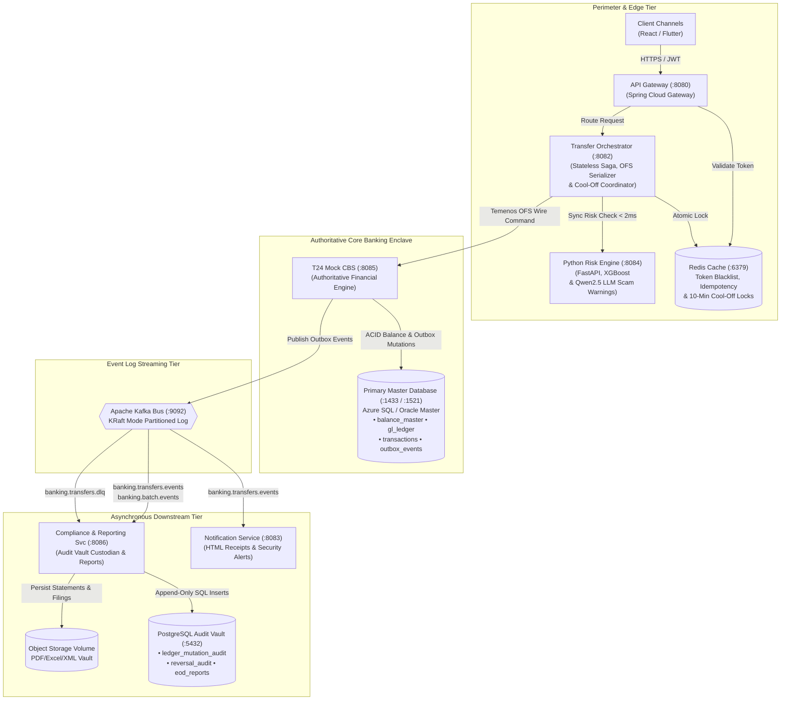

---

## 3. Added and Split Services: Architectural Evolution

The target architecture reorganizes backend responsibilities to achieve total isolation between high-frequency transactional locking and regulatory archiving.

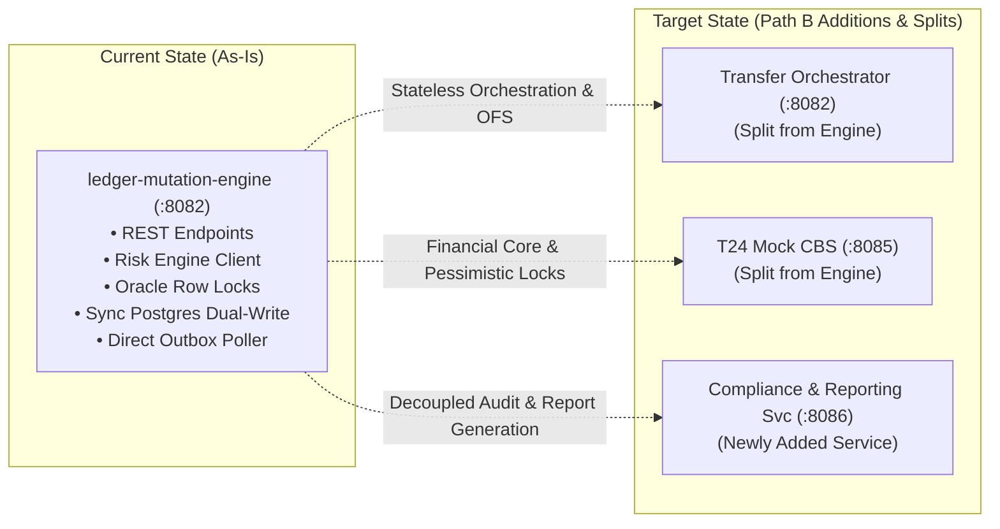

### 3.1 Service Evolution Breakdown

| Service Name | Port | Transition Nature | Origin & Rationale for Addition / Split |
| :--- | :--- | :--- | :--- |
| **`transfer-orchestrator`** | `:8082` | **Split Service** | **Split from `ledger-mutation-engine`**.<br/>*Why Split*: Stripping database drivers and datasource configurations out of the intake tier prevents database connections from idling during perimeter validation, external risk scoring, or client MPIN input. It acts as a stateless Saga orchestrator, coordinates Resilience4j circuit breakers with DLQ routing, enforces 10-minute anti-scam cool-off locks in Redis, and serializes requests into Temenos OFS wire syntax. |
| **`t24-mock-cbs`** | `:8085` | **Split Service** | **Split from `ledger-mutation-engine`**.<br/>*Why Split*: Isolates the Authoritative Core Banking System. It is the sole entity holding credentials to the Primary Master Database. Eliminating external HTTP and secondary database calls ensures account row-level locks are held strictly under 5 milliseconds. |
| **`compliance-service`** | `:8086` | **Added Service** | **Newly Added Service (replaces legacy synchronous dual-write)**.<br/>*Why Added*: Decouples the PostgreSQL Audit Vault from the core transaction loop. Ingests Kafka events to execute idempotent append-only inserts, calculates cryptographic SHA-256 hash chains, compiles AMLA CTR/STR regulatory filings, provides DLQ inspection/replay endpoints, and generates CPU-heavy EOD PDF/Excel reports without impacting CBS throughput. |
| **`gateway-service`** | `:8080` | Existing (Retained) | Updated routing rules to proxy `/api/v1/compliance/**` to port `:8086`, `/api/v1/transfers/**` and `/api/v1/reversals/**` to port `:8082`. |
| **`account-service`** | `:8081` | Existing (Retained) | Manages user registration, authentication, JWT issuing, KYC tier levels, and Redis session stores. |
| **`notification-service`**| `:8083` | Existing (Retained) | Consumes domain events from Kafka to generate customer HTML transaction receipts and deliver manager security alerts via MailHog SMTP (Transfer authorization is validated directly via in-app MPIN prompt popup). |
| **`risk-service`** | `:8084` | Existing (Retained) | Real-time Python FastAPI microservice combining XGBoost classification with local neural LLM inference (Qwen2.5-0.5B-Instruct / NanoJev) to evaluate transfer risk and generate contextual natural language anti-scam advisories. |

---

## 4. Database Additions & Segregation Model

The system enforces strict multi-database segregation: **No microservice connects to more than one database engine**.

```mermaid
flowchart TD
    subgraph Master_Persistence["Primary Relational Store (Azure SQL / Oracle Master :1433)"]
        direction TB
        M1["Existing: accounts, balance_master, transactions, outbox_events"]
        M2["Added: gl_accounts (Chart of Accounts)"]
        M3["Added: gl_ledger (Double-Entry Journal Postings)"]
        M4["Added: gl_balances (Real-Time Debit/Credit Accumulators)"]
        M5["Added: reversal_requests (Maker-Checker Dispute Tickets)"]
        M6["Added: uncollected_fees (Zero-Overdraft Arrears Tracking)"]
        M7["Added: interest_accruals (Daily Accrued Interest)"]
        M8["Added: eod_balance_snapshots (Closing State Freezes)"]
        M9["Added: system_dates (Core Business Date & State Machine)"]
        M10["Added: transaction_status_history (Master Transition Log)"]
    end

    subgraph Audit_Vault["Dedicated Immutable Vault (PostgreSQL 16 :5432)"]
        direction TB
        A1["Enhanced: ledger_mutation_audit (Trigger Protected + Hash Chained)"]
        A2["Added: reversal_audit (Dual-Control Sign-Off History)"]
        A3["Added: failed_transaction_audit (DLQ Poison Pill Ingestion)"]
        A4["Added: eod_reports_metadata (SHA-256 Registry of Generated Files)"]
        A5["Added: compliance_filings (AMLA CTR >= 500k & STR Filings)"]
        A6["Added: transaction_status_audit (Tamper-Evident Mirror of Status Changes)"]
    end

    CBS_NODE["T24 Mock CBS (:8085)"] -->|Exclusive Read / Write| Master_Persistence
    COMP_NODE["Compliance Service (:8086)"] -->|Exclusive Append-Only| Audit_Vault
```

### 4.1 Master Database Table Additions (`azure-sql-db` / `oracle-xe-master`)

| Table Name | Schema Type | Primary Purpose | Key Fields & Constraints | Exclusive Owner |
| :--- | :--- | :--- | :--- | :--- |
| **`gl_accounts`** | Master Ledger | Chart of Accounts defining asset, liability, equity, revenue, and expense accounts. | `gl_code` (PK), `account_name`, `account_type`, `currency`, `is_active` | `t24-mock-cbs` |
| **`gl_ledger`** | Transactional | Immutable double-entry financial journal lines created atomically with customer transactions. | `journal_id` (PK), `transaction_id` (FK), `gl_code` (FK), `debit_amount`, `credit_amount`, `posting_date` | `t24-mock-cbs` |
| **`gl_balances`** | Summary Ledger | Real-time and end-of-day debit/credit balance aggregations. | `gl_code` (PK), `fiscal_period`, `total_debit`, `total_credit`, `net_balance` | `t24-mock-cbs` |
| **`reversal_requests`** | Transactional | Maker-Checker dispute ticket state machine governing financial reversals. | `ticket_id` (PK), `original_tx_id` (FK), `maker_id`, `checker_id`, `status` (`PENDING`, `APPROVED`, `REJECTED`) | `t24-mock-cbs` |
| **`uncollected_fees`** | Transactional | Zero-overdraft arrears ledger tracking uncollected below-min ADB fees. | `fee_id` (PK), `account_id` (FK), `fee_type`, `amount_due`, `amount_collected`, `is_settled` | `t24-mock-cbs` |
| **`interest_accruals`** | Transactional | Daily interest accrual records calculated during EOD Phase 2 pending month-end capitalization. | `accrual_id` (PK), `account_id` (FK), `accrual_date`, `daily_rate`, `accrued_amount`, `is_capitalized` | `t24-mock-cbs` |
| **`eod_balance_snapshots`**| Analytical | Daily immutable snapshot of closing customer balances frozen during EOD Phase 3. | `snapshot_id` (PK), `account_id` (FK), `business_date`, `closing_balance` | `t24-mock-cbs` |
| **`system_dates`** | Control State | Core banking operational calendar and batch state machine coordinator. | `system_date_id` (PK), `business_date`, `status` (`ONLINE`, `EOD_CUTOFF`, `EOD_PROCESSING`), `is_eod_running` | `t24-mock-cbs` |
| **`transaction_status_history`**| Master Audit | Chronological status change log capturing every state transition, actor ID, and mandatory change reason. | `history_id` (PK), `transaction_id` (FK), `from_status`, `to_status`, `change_reason`, `reason_details`, `actor_id`, `actor_type`, `changed_at`, `metadata_json` | `t24-mock-cbs` |

### 4.2 Dedicated Audit Vault Table Additions (`postgres-audit-vault`)

| Table Name | Schema Type | Primary Purpose | Key Fields & Security Constraints | Exclusive Owner |
| :--- | :--- | :--- | :--- | :--- |
| **`ledger_mutation_audit`**| Immutable Audit | Append-only financial mutation mirror. Protected by PostgreSQL triggers preventing `UPDATE`/`DELETE`. | `audit_id` (PK), `transaction_id` (UNIQUE), `source_account_id`, `target_account_id`, `amount`, `sha256_hash` | `compliance-service` |
| **`reversal_audit`** | Compliance | Immutable audit trail of dual-control Maker-Checker reversal operations. | `audit_id` (PK), `ticket_id`, `maker_id`, `checker_id`, `original_tx_id`, `approved_at`, `reversal_tx_id` | `compliance-service` |
| **`failed_transaction_audit`**| Ops / Compliance | Dead Letter Queue (DLQ) ingested failure payloads and circuit breaker trip events for incident replay. | `incident_id` (PK), `transaction_id`, `error_code`, `payload_json`, `stack_trace`, `replay_status` | `compliance-service` |
| **`eod_reports_metadata`**| Compliance Vault | Registry and cryptographic verification ledger of all generated EOD PDFs, CSVs, and Excel sheets. | `report_id` (PK), `report_type`, `file_uri`, `sha256_checksum`, `record_count`, `retention_expiry_date` | `compliance-service` |
| **`compliance_filings`** | Regulatory | Automated Covered Transaction Reports (CTR) and Suspicious Transaction Reports (STR) filed per AMLA. | `filing_id` (PK), `filing_type` (`CTR_500K`, `STR_FRAUD`), `transaction_id`, `payload_xml`, `amlc_ref` | `compliance-service` |
| **`transaction_status_audit`**| Immutable Audit | Mirrored append-only status change audit trail with cryptographic SHA-256 hash chaining. Protected by trigger against `UPDATE`/`DELETE`. | `audit_id` (PK), `transaction_id`, `from_status`, `to_status`, `change_reason`, `reason_details`, `actor_id`, `actor_type`, `changed_at`, `sha256_hash`, `prev_hash` | `compliance-service` |

### 4.3 Canonical Transaction Status Model & Lifecycle Audit Architecture

To provide end-to-end operational traceability, prevent phantom financial mutations, and meet strict Bangko Sentral ng Pilipinas (BSP) audit guidelines, the target architecture enforces a strict **finite state machine** governing the lifecycle of every funds transfer. Every transaction must reside in exactly one canonical state at any given point in time, and **every single status mutation must be chronologically recorded with a mandatory change reason code, explanatory reason narrative, actor identifier, and UTC timestamp**.

#### 4.3.1 Canonical Status Definitions & State Semantics

The platform standardizes on seven core operational statuses, augmented by two dual-control governance states:

| Status Identifier | Lifecycle Category | State Description & Core Semantics | Typical Duration / TTL | Permitted Next States |
| :--- | :--- | :--- | :--- | :--- |
| **`Initiated`** | Ingestion | Request has been received and ingested by `transfer-orchestrator:8082` via API Gateway. Distributed idempotency lock is held in Redis (`tx:idemp:<id>`), payload schema constraints validated, and transaction tracking UUID assigned. Solvency and fraud scoring have not yet executed. | $< 100\text{ms}$ | `Authorized`, `Cancelled` |
| **`Authorized`** | Verification | Security perimeter validation passed: Customer JWT claims verified, KYC daily limits checked, ML/XGBoost fraud classification passed (or anti-scam warning acknowledged + voluntary 10-minute cool-off elapsed), and secret in-app 6-digit MPIN verified against BCrypt hash in `account-service`. Customer intent is legally certified. | $< 500\text{ms}$ | `Reserved`, `Cancelled` |
| **`Reserved`** | Pre-Settlement | Source account liquidity has been earmarked/reserved in pre-settlement controls to guarantee sufficient funds before dispatching to the core banking engine. Prevents concurrent double-spend race conditions while awaiting CBS lock acquisition. | $< 200\text{ms}$ | `Processing`, `Failed` |
| **`Processing`** | Core Execution | The transaction instruction has been serialized into Temenos OFS syntax (`FUNDS.TRANSFER,INITIATE...`) and dispatched to `t24-mock-cbs:8085`. The core banking engine has initiated an ACID transaction and acquired pessimistic row-level locks (`UPDLOCK, ROWLOCK`) on `balance_master` in strict ascending ID order. Double-entry general ledger computations are actively executing. | $< 5\text{ms}$ | `Posted`, `Failed` |
| **`Posted`** | Terminal Success | Authoritative final settlement committed. Account balances debited and credited in `balance_master`, double-entry journals committed to `gl_ledger`, transactional outbox event written to `outbox_events`, and ACID database commit completed. Transaction is financially immutable. | Permanent | `PendingReversal` (if disputed) |
| **`Failed`** | Terminal Failure | Unrecoverable error occurred during core processing. Solvency deficit in CBS (`ACCOUNT.BAL.LT.ZERO`), account status inactive/closed, database deadlock timeout, or downstream circuit breaker exhaustion. No customer balance or general ledger mutations persist. | Permanent | None (Terminal) |
| **`Cancelled`** | Terminal Abort | Transaction aborted prior to core financial processing. Triggered by automated hard fraud rejection (`risk_score > 0.85`), user cancellation upon reading the LLM anti-scam warning or during the 10-minute cool-off period, abandoned MPIN modal dialog, or 3 consecutive invalid MPIN attempts. | Permanent | None (Terminal) |
| **`PendingReversal`** | Dual-Control Escrow | Operational dispute ticket filed by a Branch Teller (Maker) against an existing `Posted` transaction (`reversal_requests`). The transaction is placed under dual-control managerial escrow awaiting Operations Manager (Checker) adjudication. | 24–72 hours | `Reversed`, `Posted` |
| **`Reversed`** | Post-Terminal Settlement | Reversal dispute approved by Operations Manager (Checker). Authoritative compensating double-entry accounting lines committed to `gl_ledger`, customer funds restored in `balance_master`, and reversal audit trail cryptographically sealed in `reversal_audit`. | Permanent | None (Terminal) |

#### 4.3.2 Transaction Lifecycle State Machine Diagram

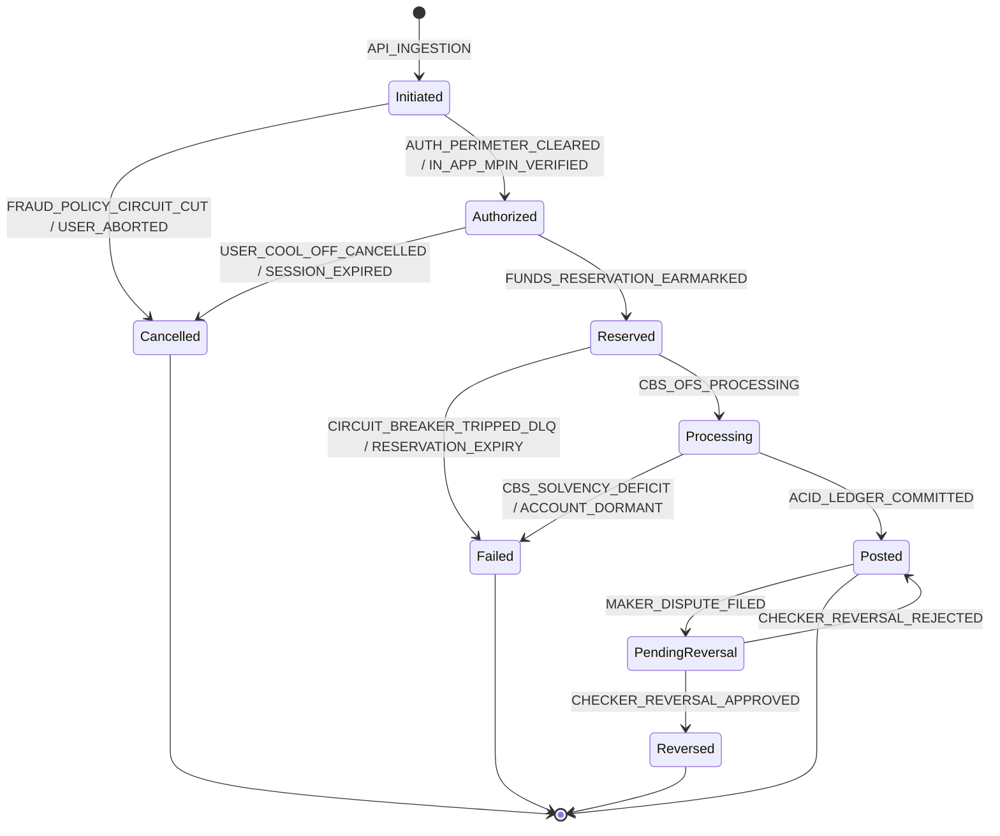

#### 4.3.3 State Transition Matrix, Change Reason Catalog & Business Invariants

Every state transition must carry an authorized **Reason Code**, a descriptive explanation, and the originating **Actor ID** and **Actor Type**:

| From Status | To Status | Triggering Event / API | Standardized Reason Code | Reason Narrative & Context | Enforced Invariant & Business Rule | Responsible Actor & Service |
| :--- | :--- | :--- | :--- | :--- | :--- | :--- |
| `[*]` | `Initiated` | `POST /api/v1/transfers` | `API_INGESTION` | Transfer request ingested by Gateway and Orchestrator; idempotency key locked. | Lock `tx:idemp:<key>` acquired with 60s TTL in Redis. Prevents concurrent duplicates. | `CUSTOMER`<br/>`transfer-orchestrator` |
| `Initiated` | `Authorized` | Perimeter & ML Check Passed | `AUTH_PERIMETER_CLEARED` | JWT valid, KYC limit ok, ML fraud score $\le 0.40$; perimeter passed. | Low-risk transaction eligible for direct execution. | `SYSTEM_RISK`<br/>`transfer-orchestrator` |
| `Initiated` | `Authorized` | `POST /verify-mpin` | `IN_APP_MPIN_VERIFIED` | Customer completed step-up challenge by entering 6-digit MPIN into popup keypad. | BCrypt verification against `UserEntity.pin_hash` succeeded within 3 attempts. | `CUSTOMER`<br/>`account-service` |
| `Initiated` | `Authorized` | Cool-off Reconfirmation | `SCAM_ADVISORY_CONFIRMED_MPIN_VERIFIED` | Customer completed 10-minute cool-off after scam warning and re-confirmed with MPIN. | Cool-off lock `tx:cooloff:<id>` expired (600s); explicit customer reconfirmation. | `CUSTOMER`<br/>`transfer-orchestrator` |
| `Initiated` | `Cancelled` | Risk Score $> 0.85$ | `FRAUD_POLICY_CIRCUIT_CUT` | Real-time ML inference classified transaction as high fraud risk; execution blocked. | Hard fraud circuit cut. Zero DB connections opened; opens AMLA STR docket. | `SYSTEM_RISK`<br/>`risk-service` |
| `Initiated` | `Cancelled` | MPIN 3 Fails | `MPIN_ATTEMPTS_EXCEEDED` | Customer entered invalid MPIN 3 consecutive times; transaction aborted. | Redis counter `mpin:attempts:<userId>` reached 3; user locked for 15 minutes. | `CUSTOMER`<br/>`account-service` |
| `Initiated` | `Cancelled` | User Modal Dismiss | `USER_ABORTED_TRANSFER` | Customer closed in-app MPIN prompt dialog without submitting credentials. | Challenge TTL expires; distributed idempotency lock released in Redis. | `CUSTOMER`<br/>`transfer-orchestrator` |
| `Authorized` | `Reserved` | Internal Liquidity Earmark | `FUNDS_RESERVATION_EARMARKED` | Source account funds earmarked to guarantee solvency during CBS transit. | Internal balance earmark applied prior to dispatching wire to core banking engine. | `SYSTEM_ORCH`<br/>`transfer-orchestrator` |
| `Authorized` | `Cancelled` | Cool-off Cancellation | `USER_COOL_OFF_CANCELLED` | Customer reviewed anti-scam warning during 10-minute pause and chose to cancel. | Social engineering coercion broken; Redis cool-off key deleted; locks freed. | `CUSTOMER`<br/>`transfer-orchestrator` |
| `Authorized` | `Cancelled` | Challenge Timeout | `SESSION_TIMEOUT_ABANDONED` | Challenge authorization window (180s) expired without client submission. | Challenge key `chal:tx:<id>` expired in Redis. | `SYSTEM_ORCH`<br/>`transfer-orchestrator` |
| `Reserved` | `Processing` | Dispatch Temenos OFS | `CBS_OFS_PROCESSING` | OFS wire string transmitted to `t24-mock-cbs:8085`; CBS ACID transaction started. | Row locks acquired on `balance_master` in strict ascending ID order (`min`, `max`). | `SYSTEM_CBS`<br/>`t24-mock-cbs` |
| `Reserved` | `Failed` | Circuit Breaker Trip | `CIRCUIT_BREAKER_TRIPPED_DLQ` | Downstream CBS unreachable after 3 retries; circuit tripped to OPEN. | Resilience4j circuit open; payload dispatched to `banking.transfers.dlq`. | `SYSTEM_ORCH`<br/>`transfer-orchestrator` |
| `Processing` | `Posted` | ACID Commit Master DB | `ACID_LEDGER_COMMITTED` | Balances mutated, balanced GL journals created, and outbox event registered. | Sub-5ms lock budget maintained; double-entry equality ($\sum \text{DR} = \sum \text{CR}$) verified. | `SYSTEM_CBS`<br/>`t24-mock-cbs` |
| `Processing` | `Failed` | CBS Solvency Check Deficit | `CBS_SOLVENCY_DEFICIT` | Source account available balance is insufficient to settle transfer amount. | Rollback transaction; emit OFS NACK `ACCOUNT.BAL.LT.ZERO`; zero GL mutation. | `SYSTEM_CBS`<br/>`t24-mock-cbs` |
| `Processing` | `Failed` | Account Inactive / Closed | `CBS_ACCOUNT_INACTIVE` | Beneficiary account is marked dormant, suspended, or closed in CBS core. | Rollback transaction; emit OFS NACK `ACCOUNT.STATUS.INVALID`. | `SYSTEM_CBS`<br/>`t24-mock-cbs` |
| `Posted` | `PendingReversal` | `POST /reversals/request` | `MAKER_DISPUTE_FILED` | Branch Teller (Maker) filed dispute ticket `REV-500` requesting fund clawback. | Segregation of duties enforced: ticket status `PENDING`, awaiting manager sign-off. | `TELLER_MAKER`<br/>`t24-mock-cbs` |
| `PendingReversal` | `Reversed` | `POST /reversals/approve` | `CHECKER_REVERSAL_APPROVED_SETTLED` | Operations Manager (Checker) authorized reversal; compensating settlement executed. | Dual-control verified: `checker_id != maker_id`; beneficiary balance verified. | `MANAGER_CHECKER`<br/>`t24-mock-cbs` |
| `PendingReversal` | `Posted` | `POST /reversals/reject` | `CHECKER_REVERSAL_REJECTED` | Operations Manager (Checker) rejected dispute ticket; original transaction maintained. | Ticket marked `REJECTED`; original transaction restored to unencumbered `Posted` state. | `MANAGER_CHECKER`<br/>`t24-mock-cbs` |

#### 4.3.4 Logical Data Architecture for Status & Reason Tracking

To guarantee complete operational auditability, system-of-record consistency, and compliance with Bangko Sentral ng Pilipinas (BSP) core banking standards without prematurely coupling the architecture to physical database-specific storage types, the design specifies the **logical schema attributes**, domain concepts, and integrity invariants for both the primary transaction store and the immutable audit vault.

##### Primary Master Database Entity: `transaction_status_history` (`azure-sql-db` / `oracle-xe-master`)
Every status mutation within the core banking enclave creates an immutable entry in `transaction_status_history`:

| Logical Attribute | Domain Concept | Cardinality / Nullability | Architectural Purpose & Business Semantics |
| :--- | :--- | :--- | :--- |
| `history_id` | Unique Identifier | Mandatory (PK) | Sequential or unique record identifier within the state transition log. |
| `transaction_id` | Foreign Key Reference | Mandatory (FK) | Relational correlation linking this state change to the parent financial record in `transactions`. |
| `from_status` | Status Enumeration | Optional (Null for origin) | Prior canonical status immediately preceding this transition (`Initiated`, `Authorized`, `Reserved`, `Processing`, etc.). |
| `to_status` | Status Enumeration | Mandatory | Resulting canonical status (`Initiated`, `Authorized`, `Reserved`, `Processing`, `Posted`, `Failed`, `Cancelled`, `PendingReversal`, `Reversed`). |
| `change_reason` | Standardized Reason Code | Mandatory | Standardized, machine-readable reason code identifying the business rule, perimeter policy, or settlement trigger (e.g., `ACID_LEDGER_COMMITTED`, `CBS_SOLVENCY_DEFICIT`, `FRAUD_POLICY_CIRCUIT_CUT`). |
| `reason_details`| Explanatory Narrative | Optional | Human-readable explanation, error diagnosis, or operational context associated with the transition. |
| `actor_id` | Actor Identifier | Mandatory | Unique identity of the human actor (Customer, Teller, Manager) or automated system process initiating the transition. |
| `actor_type` | Actor Classification | Mandatory | Classification of the acting principal (`CUSTOMER`, `SYSTEM_ORCHESTRATOR`, `SYSTEM_CBS`, `SYSTEM_RISK`, `TELLER_MAKER`, `MANAGER_CHECKER`, `BATCH_SCHEDULER`). |
| `changed_at` | Universal Timestamp | Mandatory | High-precision UTC timestamp recording the exact chronological moment of state transition. |
| `metadata_json` | Contextual Telemetry | Optional | Structured contextual payload capturing request telemetry, risk scores, challenge IDs, or core banking wire references. |

*Architectural Access Pattern*:
* Designed for low-latency chronological lineage lookups by `transaction_id` and regulatory compliance aggregation by `change_reason`.

##### Dedicated Audit Vault Entity: `transaction_status_audit` (`postgres-audit-vault :5432`)
The `compliance-service` consumes all `TransactionStatusChangedEvent` messages from Kafka and mirrors them into the dedicated Audit Vault:

| Logical Attribute | Domain Concept | Cardinality / Nullability | Architectural Purpose & Regulatory Semantics |
| :--- | :--- | :--- | :--- |
| `audit_id` | Vault Sequence ID | Mandatory (PK) | Monotonically increasing record sequence identifier within the compliance vault. |
| `transaction_id` | Transaction Reference | Mandatory | Correlation identifier linking the audit entry to the original transaction. |
| `from_status` | Status Enumeration | Optional | Status prior to state transition. |
| `to_status` | Status Enumeration | Mandatory | Resulting canonical status. |
| `change_reason` | Standardized Reason Code | Mandatory | Standardized transition reason code matching the core banking event. |
| `reason_details`| Explanatory Narrative | Optional | Descriptive narrative or operational explanation. |
| `actor_id` | Actor Identifier | Mandatory | Identity of the human or service actor. |
| `actor_type` | Actor Classification | Mandatory | Classification of the initiating entity. |
| `changed_at` | Universal Timestamp | Mandatory | Universal timestamp in UTC. |
| `metadata_json` | Contextual Telemetry | Optional | Structured contextual parameters and telemetry. |
| `prev_hash` | Cryptographic Hash Link | Mandatory | SHA-256 digest of the immediately preceding vault record, establishing an unbroken cryptographic hash chain. |
| `sha256_hash` | Cryptographic Digest | Mandatory | Tamper-evident digest computed over current attributes and `prev_hash` ($\text{SHA256}(\text{audit\_id} \parallel \text{prev\_hash} \parallel \text{tx\_id} \parallel \text{to\_status} \parallel \text{reason} \parallel \text{changed\_at})$). |

*Storage Immutability Invariant*:
* The audit vault enforces strict append-only semantics. Modifying or deleting existing status audit rows is architecturally prohibited at the storage boundary.

#### 4.3.5 Event Streaming Contract: `TransactionStatusChangedEvent`

Whenever a transaction status transition occurs, a domain event is streamed to topic `banking.transfers.events` so downstream subscribers (Audit Vault, Notification Engine, UI WebSocket Gateway) synchronize in real time:

```json
{
  "eventId": "evt-7f8e9a2b-3c4d-5e6f-7a8b-9c0d1e2f3a4b",
  "eventType": "TransactionStatusChangedEvent",
  "version": "1.0",
  "transactionId": "TX-100234",
  "fromStatus": "Processing",
  "toStatus": "Posted",
  "changeReason": "ACID_LEDGER_COMMITTED",
  "reasonDetails": "ACID transaction committed atomically: debited source account, credited target account, general ledger balanced",
  "actorId": "SYSTEM_CBS_8085",
  "actorType": "SYSTEM_CBS",
  "changedAt": "2026-10-07T01:45:00.123456Z",
  "metadata": {
    "sourceAccountId": "ACC-01",
    "targetAccountId": "ACC-02",
    "amount": 5000.00,
    "currency": "PHP",
    "ofsReference": "FT261007000123"
  }
}
```

---

## 5. Event-Driven Architecture: Kafka Event Catalog

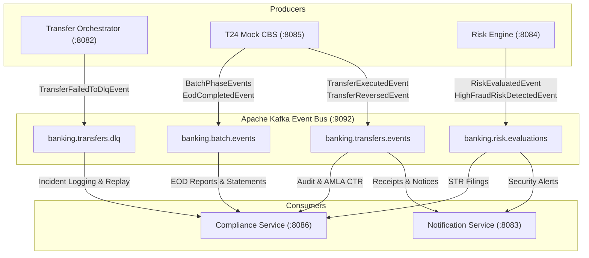

### 5.1 Kafka Events Catalog

| Topic Name | Event Name | Producer Service | When Produced (Trigger Condition) | Consumer Service(s) | Consumer Purpose & Action |
| :--- | :--- | :--- | :--- | :--- | :--- |
| `banking.transfers.events` | `TransferExecutedEvent` | `t24-mock-cbs` | After ACID transaction successfully commits debits, credits, and GL entries in master DB. | 1. `notification-service`<br/>2. `compliance-service` | 1. Renders HTML receipt and emails customer.<br/>2. Persists row to `ledger_mutation_audit`, calculates hash chain, and triggers AMLA CTR if amount $\ge ₱500,000.00$. |
| `banking.transfers.events` | `TransferReversedEvent` | `t24-mock-cbs` | After dual-control reversal settles compensating accounting entries in master DB. | 1. `notification-service`<br/>2. `compliance-service` | 1. Emails customer reversal confirmation.<br/>2. Persists immutable entry to `reversal_audit`. |
| `banking.transfers.events` | `TransactionStatusChangedEvent` | `transfer-orchestrator` / `t24-mock-cbs` | Emitted upon every state transition across the canonical status set (`Initiated`, `Authorized`, `Reserved`, `Processing`, `Posted`, `Failed`, `Cancelled`, `PendingReversal`, `Reversed`) with mandatory change reason code and actor telemetry. | 1. `compliance-service`<br/>2. `notification-service` | 1. Mirrors transition to `transaction_status_audit` in PostgreSQL with SHA-256 hash chaining.<br/>2. Emits real-time SSE push updates / toasts to client UI. |
| `banking.transfers.dlq` | `TransferFailedToDlqEvent` | `transfer-orchestrator`| When Resilience4j circuit breaker trips or retries exhaust. | `compliance-service` | Ingests payload into `failed_transaction_audit` for administrative review and replay API. |
| `banking.risk.evaluations` | `RiskEvaluatedEvent` | `risk-service` | Upon completion of real-time ML fraud inference ($< 2\text{ms}$). | `compliance-service` | Stores scoring telemetry and feature vectors for auditability. |
| `banking.risk.evaluations` | `HighFraudRiskDetectedEvent` | `risk-service` | When fraud probability score exceeds $0.85$ or structuring alert trips. | 1. `compliance-service`<br/>2. `notification-service` | 1. Creates AMLA Suspicious Transaction Report (STR) investigation docket.<br/>2. Alerts Branch Manager. |
| `banking.batch.events` | `PostingCutoffInitiatedEvent` | `t24-mock-cbs` | When EOD Phase 0 starts and daytime online traffic is buffered for $T+1$. | `compliance-service` | Prepares reporting engines and queues nightly jobs. |
| `banking.batch.events` | `FeeDeductedEvent` | `t24-mock-cbs` | During EOD Phase 1 when below-min ADB or dormancy fees are debited. | 1. `notification-service`<br/>2. `compliance-service` | 1. Dispatches fee deduction statement notice.<br/>2. Records fee collection audit. |
| `banking.batch.events` | `InterestCapitalizedEvent` | `t24-mock-cbs` | During EOD Phase 2 when net 80% interest is capitalized and 20% BIR tax withheld. | 1. `notification-service`<br/>2. `compliance-service` | 1. Emails interest credited notification.<br/>2. Records BIR Form 2306 tax withholding line in audit vault. |
| `banking.batch.events` | `BalanceSnapshotFrozenEvent` | `t24-mock-cbs` | During EOD Phase 3 when closing balances are committed to `eod_balance_snapshots`. | `compliance-service` | Triggers E-Statement and Trial Balance generation routines. |
| `banking.batch.events` | `EodCompletedEvent` | `t24-mock-cbs` | During EOD Phase 4 when business date advances to $T+1$ and status returns to `ONLINE`. | 1. `compliance-service`<br/>2. `gateway-service` | 1. Finalizes daily reporting packages.<br/>2. Unfreezes regular daytime transaction routing. |

---

## 6. Request-Response Sequence Diagrams

### 6.1 Feature 1: Intra-Bank Funds Transfer

#### 6.1.1 Happy Path: Straight-Through Processing (STP)

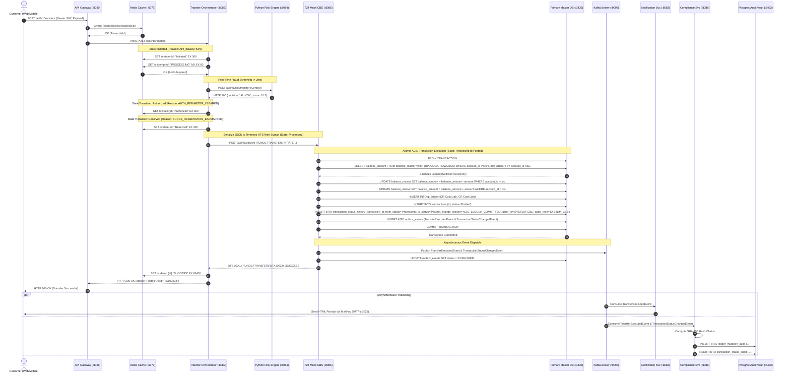

#### 6.1.2 Alternate Flow A: Medium Fraud Risk (In-App Popup / Prompt MPIN Verification)

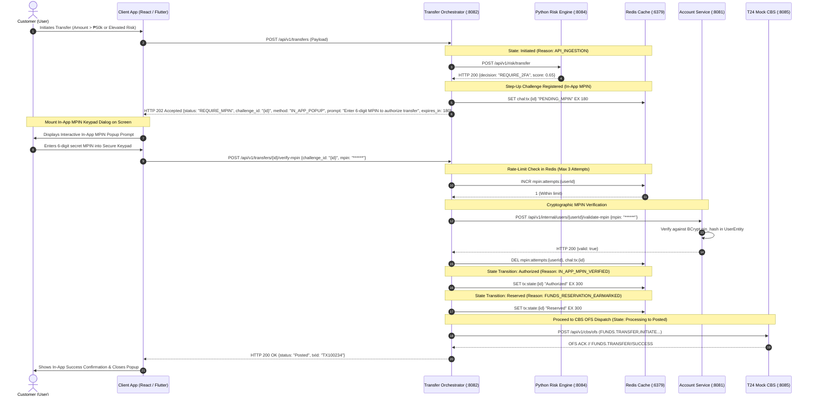

#### 6.1.3 Alternate Flow B: High Fraud Risk Cutoff (Immediate Block)

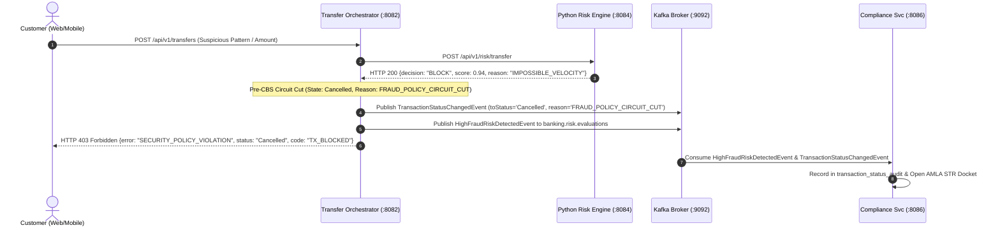

#### 6.1.4 Alternate Flow C: Insufficient Account Balance (CBS Solvency Failure)

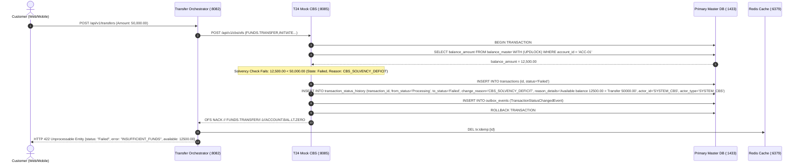

#### 6.1.5 Alternate Flow D: Idempotency Lock Collision (Duplicate In-Flight Request)

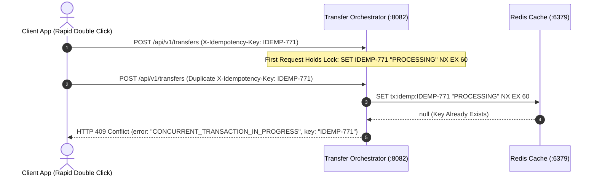

#### 6.1.6 Alternate Flow E: LLM-Generated Anti-Scam Advisory & 10-Minute Cool-Off Flow

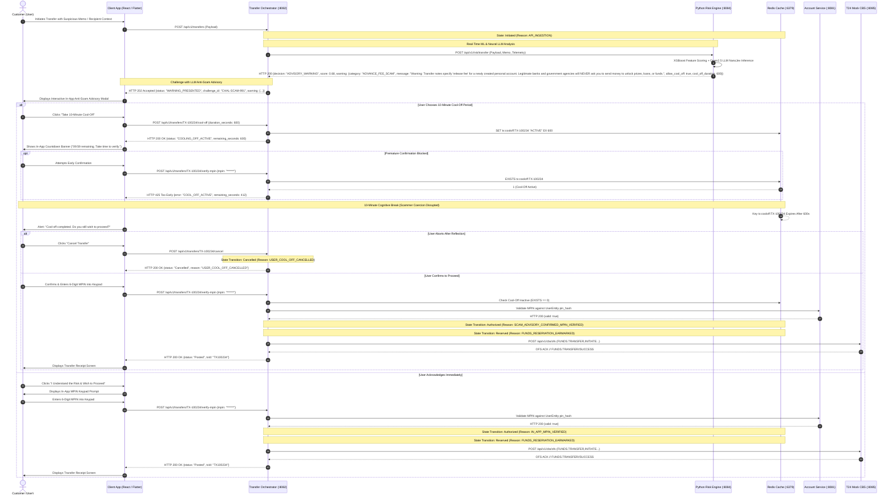

---

### 6.2 Feature 2: Intra-Bank Transaction Reversal (Maker-Checker Governance)

#### 6.2.1 Happy Path: Reversal Ticket Creation, Approval, and Compensating Settlement

```mermaid
sequenceDiagram
    autonumber
    actor Maker as Branch Teller (Maker)
    actor Checker as Operations Manager (Checker)
    participant Orch as Transfer Orchestrator (:8082)
    participant CBS as T24 Mock CBS (:8085)
    participant MasterDB as Primary Master DB (:1433)
    participant Kafka as Kafka Broker (:9092)
    participant Comp as Compliance Svc (:8086)
    participant AuditDB as Postgres Audit Vault (:5432)

    Note over Maker,Orch: Phase 1: Reversal Dispute Ticket Filing (State: Posted to PendingReversal)
    Maker->>Orch: POST /api/v1/reversals/request {original_tx_id: "TX-100", reason: "WRONG_ACCOUNT"}
    Orch->>CBS: POST /api/v1/cbs/reversals/ticket
    CBS->>MasterDB: INSERT INTO reversal_requests (ticket_id, original_tx_id, maker_id, status='PENDING')
    CBS->>MasterDB: UPDATE transactions SET status = 'PendingReversal' WHERE id = 'TX-100'
    CBS->>MasterDB: INSERT INTO transaction_status_history (transaction_id, from_status='Posted', to_status='PendingReversal', change_reason='MAKER_DISPUTE_FILED', reason_details='Wrong account dispute filed by teller', actor_id='USR-99', actor_type='TELLER_MAKER')
    CBS->>MasterDB: INSERT INTO outbox_events (TransactionStatusChangedEvent)
    CBS-->>Orch: Ticket REV-500 Created
    Orch-->>Maker: HTTP 201 Created {ticketId: "REV-500", transactionStatus: "PendingReversal"}

    Note over Checker,Orch: Phase 2: Checker Review & Dual Authorization
    Checker->>Orch: POST /api/v1/reversals/REV-500/approve (Manager JWT)
    Note over Orch: Validate Segregation of Duties: checker_id != maker_id
    Orch->>CBS: POST /api/v1/cbs/ofs (FUNDS.TRANSFER,REVERSAL/REV-500)

    Note over CBS,MasterDB: Phase 3: Compensating Double-Entry Settlement (State: PendingReversal to Reversed)
    CBS->>MasterDB: BEGIN TRANSACTION
    CBS->>MasterDB: SELECT balance_amount FROM balance_master WITH (UPDLOCK) WHERE account_id = beneficiary
    Note over CBS: Solvency Check: beneficiary balance >= reversal amount
    CBS->>MasterDB: UPDATE balance_master SET balance_amount = balance_amount - amount WHERE account_id = beneficiary
    CBS->>MasterDB: UPDATE balance_master SET balance_amount = balance_amount + amount WHERE account_id = original_sender
    CBS->>MasterDB: INSERT INTO gl_ledger (Inverted Compensating DR/CR Lines)
    CBS->>MasterDB: UPDATE reversal_requests SET checker_id = ?, status = 'APPROVED'
    CBS->>MasterDB: UPDATE transactions SET status = 'Reversed', reversal_ref_id = 'REV-500' WHERE id = 'TX-100'
    CBS->>MasterDB: INSERT INTO transaction_status_history (transaction_id, from_status='PendingReversal', to_status='Reversed', change_reason='CHECKER_REVERSAL_APPROVED_SETTLED', reason_details='Operations Manager approved reversal of wrong account credit', actor_id='MGR-02', actor_type='MANAGER_CHECKER')
    CBS->>MasterDB: INSERT INTO outbox_events (TransferReversedEvent & TransactionStatusChangedEvent)
    CBS->>MasterDB: COMMIT TRANSACTION

    CBS->>Kafka: Publish TransferReversedEvent & TransactionStatusChangedEvent to banking.transfers.events
    CBS-->>Orch: OFS ACK // FUNDS.TRANSFER,REVERSAL//SUCCESS
    Orch-->>Checker: HTTP 200 OK {status: "Reversed", reversalRef: "REV-500"}

    par Asynchronous Audit Ingestion
        Kafka->>Comp: Consume TransferReversedEvent & TransactionStatusChangedEvent
        Comp->>AuditDB: INSERT INTO reversal_audit (ticket_id, maker_id, checker_id, timestamp)
        Comp->>AuditDB: INSERT INTO transaction_status_audit (...)
    end
```

#### 6.2.2 Alternate Flow A: Segregation of Duties Violation (Self-Approval Blocked)

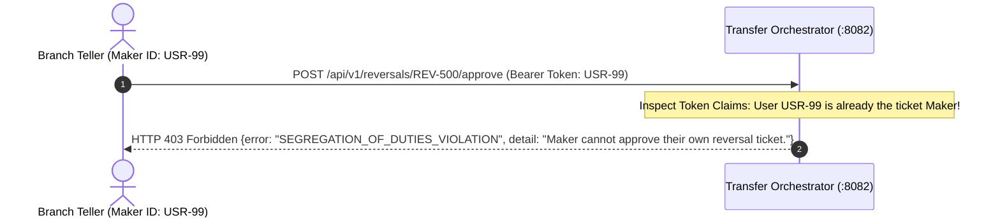

#### 6.2.3 Alternate Flow B: Checker Rejection of Dispute Ticket

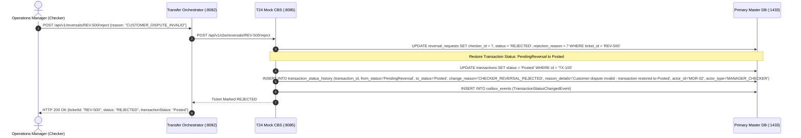

#### 6.2.4 Alternate Flow C: Beneficiary Insufficient Balance for Reversal

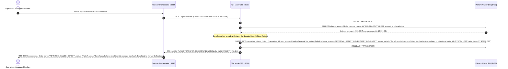

---

### 6.3 Feature 3: Circuit Breaker & DLQ Incident Management

#### 6.3.1 Downstream CBS Failure, Circuit Breaker Trip, and DLQ Routing

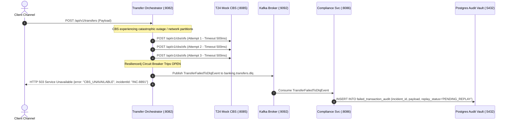

#### 6.3.2 Administrative DLQ Incident Inspection and Manual Replay Flow

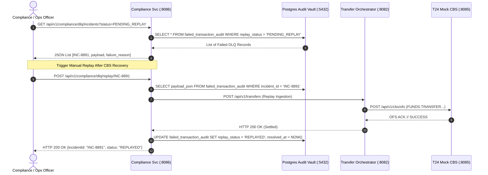

---

### 6.4 Feature 4: End-of-Day (EOD) Batch Pipeline Master Execution

#### 6.4.1 Master EOD Execution (Phases 0 through 4)

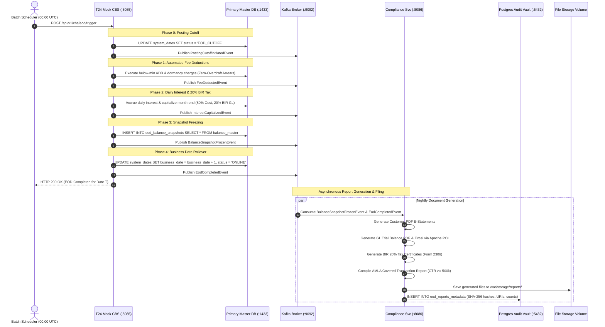

#### 6.4.2 Phase 0 Alternate Flow: Daytime Online Requests Buffered During Cutoff

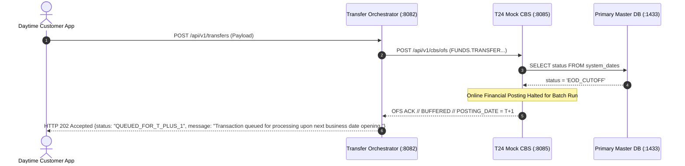

#### 6.4.3 Phase 1 Alternate Flow: Zero-Overdraft Arrears Capping for Insolvent Accounts

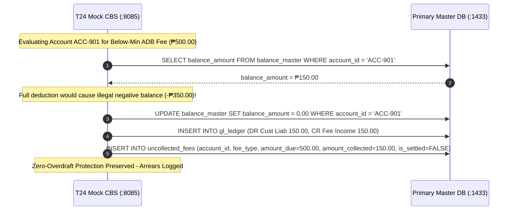

---

## 7. Business Logic Flowcharts (Happy Paths & Alternate Cases)

### 7.1 Funds Transfer Processing Logic Flowchart

```mermaid
flowchart TD
    Start([Inbound Transfer Request]) --> ValidatePerimeter{Valid Token &<br/>Payload Precision?}
    ValidatePerimeter -- No --> Ret400[Return HTTP 400 Bad Request]
    ValidatePerimeter -- Yes --> CheckIdemp{Acquire Redis Lock<br/>tx:idemp:id?}
    CheckIdemp -- Collision --> Ret409[Return HTTP 409 Duplicate Transfer]
    CheckIdemp -- Acquired --> SetInit[State: Initiated<br/>Reason: API_INGESTION]
    SetInit --> CallRisk[Invoke Python Risk Engine<br/>FastAPI / XGBoost]

    CallRisk --> EvalRisk{Risk Engine &<br/>LLM Analysis}
    EvalRisk -- Score > 0.85 --> BlockFraud[State: Cancelled<br/>Reason: FRAUD_POLICY_CIRCUIT_CUT<br/>Emit HighFraudRiskDetectedEvent<br/>Return HTTP 403 Forbidden]
    EvalRisk -- 0.40 < Score <= 0.85 or Scam Typology --> GenLLMWarning[Qwen2.5 LLM Synthesizes Natural<br/>Language Anti-Scam Advisory]
    GenLLMWarning --> PresentAdvisory[Return HTTP 202 WARNING_PRESENTED<br/>Mount In-App Scam Advisory Modal]
    PresentAdvisory --> UserAdvisoryAction{Customer Action on<br/>Scam Advisory}
    UserAdvisoryAction -- Cancel Transfer --> AbortTx[State: Cancelled<br/>Reason: USER_ABORTED_TRANSFER<br/>Return HTTP 200 Cancelled]
    UserAdvisoryAction -- Take 10-Min Cool-Off --> StartCoolOff[Set Redis Cool-Off Lock 600s<br/>Display In-App Countdown Banner]
    StartCoolOff --> CoolOffTimer{10 Minutes Elapsed?}
    CoolOffTimer -- Premature Attempt --> RejectEarly[Reject: Return HTTP 425 Too Early]
    CoolOffTimer -- Timer Finished --> PromptReconfirm{Customer Confirms<br/>Wish to Proceed?}
    PromptReconfirm -- No / Abort --> AbortCoolOff[State: Cancelled<br/>Reason: USER_COOL_OFF_CANCELLED<br/>Return HTTP 200 Cancelled]
    PromptReconfirm -- Yes --> ReqMPIN[Trigger In-App MPIN Popup Prompt<br/>Return HTTP 202 Accepted]
    UserAdvisoryAction -- Acknowledge Immediately --> ReqMPIN
    ReqMPIN --> AwaitMPIN{Validate Customer<br/>In-App MPIN Input?}
    AwaitMPIN -- Invalid MPIN / Lockout --> Ret401[State: Cancelled<br/>Reason: MPIN_ATTEMPTS_EXCEEDED<br/>Return HTTP 401 Unauthorized]
    AwaitMPIN -- Valid Match --> SetAuthMPIN[State: Authorized<br/>Reason: IN_APP_MPIN_VERIFIED]
    EvalRisk -- Score <= 0.40 Clean --> SetAuthClean[State: Authorized<br/>Reason: AUTH_PERIMETER_CLEARED]

    SetAuthMPIN --> SetReserved[State: Reserved<br/>Reason: FUNDS_RESERVATION_EARMARKED]
    SetAuthClean --> SetReserved
    SetReserved --> TranslateOFS[Translate Request into<br/>Temenos OFS Wire Syntax]

    TranslateOFS --> DispatchCBS[Transmit OFS Command to<br/>T24 Mock CBS :8085]
    DispatchCBS --> CheckCBSStatus{CBS System Date<br/>Status?}
    CheckCBSStatus -- EOD_CUTOFF --> BufferT1[Queue Transaction for T+1 &<br/>Return HTTP 202 Accepted]
    CheckCBSStatus -- ONLINE --> BeginTx[CBS Begins ACID Transaction<br/>State: Processing]

    BeginTx --> RowLock[Pessimistic Row Lock Accounts<br/>ORDER BY account_id ASC]
    RowLock --> CheckSolv{Available Balance >=<br/>Transfer Amount?}
    CheckSolv -- No --> RollbackOFS[State: Failed<br/>Reason: CBS_SOLVENCY_DEFICIT<br/>Rollback & Return OFS NACK<br/>Return HTTP 422 Unprocessable]
    CheckSolv -- Yes --> MutateBalances[Debit Source & Credit Target<br/>in balance_master]

    MutateBalances --> PostGL[Insert Double-Entry Records<br/>into gl_ledger]
    PostGL --> WriteHistory[Insert into transaction_status_history<br/>State: Posted, Reason: ACID_LEDGER_COMMITTED]
    WriteHistory --> WriteOutbox[Insert Outbox Events<br/>TransferExecuted & StatusChanged]
    WriteOutbox --> CommitTx[Commit ACID Transaction]
    CommitTx --> PubKafka[Publish Domain Events to Kafka<br/>banking.transfers.events]
    PubKafka --> Ret200[Return HTTP 200 OK to Client<br/>status: Posted]
    Ret200 --> AsyncNotif[Notification Svc Sends Email]
    Ret200 --> AsyncAudit[Compliance Svc Writes Hash Chains]
```

---

### 7.2 Maker-Checker Reversal Dispute Governance Flowchart

```mermaid
flowchart TD
    Start([Dispute Claim Initiated]) --> MakerCreate[Teller / Maker Creates Reversal Ticket]
    MakerCreate --> RecordTicket[Insert into reversal_requests &<br/>Update transactions status = PendingReversal<br/>Reason: MAKER_DISPUTE_FILED]
    RecordTicket --> WaitChecker[Await Operations Manager Review]

    WaitChecker --> CheckerAction{Checker Decision}
    CheckerAction -- Reject --> CheckerReject[Checker Rejects Ticket]
    CheckerReject --> UpdateRej[Update status = REJECTED &<br/>Restore transactions status = Posted<br/>Reason: CHECKER_REVERSAL_REJECTED]
    UpdateRej --> EndRej([Dispute Denied - HTTP 200])

    CheckerAction -- Approve --> VerifyDual{Checker ID !=<br/>Maker ID?}
    VerifyDual -- Same User --> BlockSeg[Reject: Segregation of Duties Violation<br/>Return HTTP 403 Forbidden]
    VerifyDual -- Distinct --> CheckBenSolv{Beneficiary Balance >=<br/>Reversal Amount?}

    CheckBenSolv -- Deficit --> BenFail[Reject: Beneficiary Balance Depleted<br/>State: Failed<br/>Reason: REVERSAL_DEFICIT_BENEFICIARY_INSOLVENT<br/>Return HTTP 422 Unprocessable]
    CheckBenSolv -- Sufficient --> BeginReversal[CBS Begins ACID Reversal Transaction<br/>State: Processing Reversal]

    BeginReversal --> MutateCompensating[Debit Beneficiary Account &<br/>Credit Original Sender Account]
    MutateCompensating --> ReverseGL[Post Inverted Journal Lines to gl_ledger]
    ReverseGL --> MarkReversed[Update transactions status = Reversed &<br/>Insert into transaction_status_history<br/>Reason: CHECKER_REVERSAL_APPROVED_SETTLED]
    MarkReversed --> OutboxRev[Write Outbox Events<br/>Reversed & StatusChanged]
    OutboxRev --> CommitRev[Commit Master DB Transaction]
    CommitRev --> KafkaRev[Publish to Kafka banking.transfers.events]
    KafkaRev --> ArchiveRev[Compliance Svc Persists to<br/>reversal_audit & status_audit]
    ArchiveRev --> EndAppr([Reversal Settled - HTTP 200<br/>status: Reversed])
```

---

### 7.3 Resilience4j Circuit Breaker & DLQ Escalation Flowchart

```mermaid
flowchart TD
    Start([Dispatch Transfer to CBS]) --> CheckCBState{Resilience4j<br/>Circuit State?}
    
    CheckCBState -- OPEN --> RouteDLQDirect[Short-Circuit: Bypass CBS Call]
    CheckCBState -- CLOSED / HALF-OPEN --> AttemptCall[Transmit OFS Command over HTTP]

    AttemptCall --> CallOutcome{CBS Call Outcome}
    CallOutcome -- Success 200 ACK --> ResetCB[Record Success & Return 200 OK]
    CallOutcome -- Solvency NACK --> ReturnBizError[Return 422 Business Error]
    CallOutcome -- Network Timeout / 5xx --> RetryEval{Retries < 3?}

    RetryEval -- Yes --> Backoff[Exponential Backoff 100ms, 200ms, 400ms]
    Backoff --> AttemptCall
    RetryEval -- Exhausted --> TripCB[Increment Failure Count]

    TripCB --> CheckTripRate{Failure Rate >= 50%?}
    CheckTripRate -- Yes --> OpenCircuit[Trip Circuit State to OPEN for 10s]
    CheckTripRate -- No --> RouteDLQDirect

    OpenCircuit --> RouteDLQDirect
    RouteDLQDirect --> PublishDLQ[Publish TransferFailedToDlqEvent<br/>to banking.transfers.dlq]
    PublishDLQ --> Return503[Return HTTP 503 Service Unavailable]

    PublishDLQ --> CompIngest[Compliance Svc Consumes DLQ Event]
    CompIngest --> InsertFailedAudit[Insert into failed_transaction_audit<br/>status = PENDING_REPLAY]

    InsertFailedAudit --> OfficerReview{Operations Officer<br/>Manual Intervention}
    OfficerReview -- Fix Poison Pill & Replay --> ExecuteReplay[Compliance Svc Invokes Replay API]
    ExecuteReplay --> AttemptCall
    OfficerReview -- Mark Unrecoverable --> DropTx[Update replay_status = CANCELLED]
```

---

### 7.4 Master End-of-Day (EOD) Batch State Machine Pipeline Flowchart

```mermaid
flowchart TD
    Trigger([EOD Scheduler Fires 00:00 UTC]) --> Phase0[Phase 0: Posting Cutoff]
    Phase0 --> SetCutoff[Update system_dates status = EOD_CUTOFF]
    SetCutoff --> BufferTx[Route New Daytime Traffic to T+1 Buffer Queue]
    BufferTx --> Phase1[Phase 1: Automated Fee Deductions]

    Phase1 --> ScanADB[Identify Accounts Below Minimum ADB]
    ScanADB --> DeductFee{Balance >= Fee?}
    DeductFee -- Yes --> FullDeduct[Debit Full Fee & Credit Fee Income GL]
    DeductFee -- No --> CapZero[Debit Balance to Exactly 0.00 &<br/>Log Unpaid Balance to uncollected_fees]
    FullDeduct --> Phase2[Phase 2: Daily Interest Accruals]
    CapZero --> Phase2

    Phase2 --> CalcDailyInt[Calculate Daily Interest: Bal * Rate / 365]
    CalcDailyInt --> CheckMonthEnd{Is Today Last Day<br/>of Month?}
    CheckMonthEnd -- No --> AccrueOnly[Insert Accrued Interest to interest_accruals]
    CheckMonthEnd -- Yes --> CapitalizeInt[Capitalize: Credit 80% to Customer Account &<br/>Credit 20% to BIR Tax Withholding GL]
    AccrueOnly --> Phase3[Phase 3: Snapshot Freezing]
    CapitalizeInt --> Phase3

    Phase3 --> FreezeSnap[Freeze Closing Balances into eod_balance_snapshots]
    Phase3 --> Phase4[Phase 4: Business Date Rollover]

    Phase4 --> AdvanceDate[Advance system_dates business_date to T+1]
    AdvanceDate --> SetOnline[Update status = ONLINE]
    SetOnline --> PubEODComp[Publish EodCompletedEvent to Kafka]
    PubEODComp --> GenReports[Compliance Svc Generates Statements,<br/>Trial Balance & AMLA Filings]
    GenReports --> EndEOD([System Ready for Daytime T+1 Operations])
```

---

## 8. Non-Negotiable Architectural Rules & Invariants

To guarantee financial correctness and regulatory auditability, the implementation must adhere strictly to these rules:

1. **Rule 1 (Temenos OFS Wire Serialization)**:
   * The Transfer Orchestrator (`:8082`) must translate all financial instructions into official Temenos OFS syntax strings (`FUNDS.TRANSFER,INITIATE`, `FUNDS.TRANSFER,REVERSAL`) prior to transmitting them to `t24-mock-cbs` (`:8085`).
2. **Rule 2 (Exclusive Database Connection Boundary)**:
   * Only `t24-mock-cbs` holds datasource credentials to the Master Database (`azure-sql-db` / `oracle-xe-master`).
   * Only `compliance-service` holds datasource credentials to `postgres-audit-vault`.
   * The `transfer-orchestrator` must possess **zero SQL datasource configurations or JDBC drivers**.
3. **Rule 3 (Transactional Outbox Atomicity)**:
   * Senders of events must record domain events into `outbox_events` in the primary database within the exact same ACID transaction as the financial ledger mutations. Events are streamed to Kafka only after the database transaction has committed.
4. **Rule 4 (Zero-Deadlock Account Locking Order)**:
   * Pessimistic row-level locks on `balance_master` must always be acquired in strict ascending alphabetical order of account IDs (`min(account_A, account_B)` followed by `max(account_A, account_B)`).
5. **Rule 5 (Sub-5 Millisecond Primary Lock Budget)**:
   * The primary database lock must never be held across network boundaries. All risk evaluations, in-app MPIN prompt verifications, and Kafka streaming must occur before lock acquisition or after transaction commit.
6. **Rule 6 (Maker-Checker Segregation of Duties)**:
   * In any intra-bank reversal, the approving user (`checker_id`) must not match the initiating user (`maker_id`). Reversals attempted by the same user must be rejected immediately with `HTTP 403 Forbidden`.
7. **Rule 7 (Immutable Audit Vault Anti-Tamper Triggers)**:
   * The PostgreSQL Audit Vault must enforce database-level trigger rules prohibiting any `UPDATE` or `DELETE` SQL operations on `ledger_mutation_audit`, `reversal_audit`, and `transaction_status_audit`.
8. **Rule 8 (Anti-Scam Cool-Off Window Invariant)**:
   * When a customer opts into the 10-minute behavioral cool-off period upon receiving an LLM anti-scam warning, the orchestrator sets an atomic lock in Redis (`tx:cooloff:<txId>`) with a 600-second TTL. Any attempt to confirm or settle the transaction prior to the expiration of the timer must be rejected immediately with `HTTP 425 Too Early`. Upon timer expiration, the transaction requires explicit customer re-confirmation and in-app MPIN verification before an OFS settlement command can be dispatched to CBS.
9. **Rule 9 (Transaction Status Lifecycle Immutability & Mandatory Reason Logging Invariant)**:
   * Every transaction status mutation across the canonical lifecycle (`Initiated` -> `Authorized` -> `Reserved` -> `Processing` -> `Posted`, terminal states `Failed` and `Cancelled`, and governance states `PendingReversal` and `Reversed`) must be accompanied by an atomic insert into `transaction_status_history` in the Master Database and an asynchronous mirror into `transaction_status_audit` in the PostgreSQL Audit Vault. Every status change record must capture an explicit machine-readable `change_reason` code, an explanatory `reason_details` narrative, the originating `actor_id` and `actor_type`, and a high-precision UTC timestamp. Unlogged direct mutations of `transactions.status` are strictly prohibited by database-level constraints and domain service validation.

---

## 9. Added Endpoints & Interface Payload Contracts

This section defines the API specifications, HTTP routes, headers, and request/response JSON payload schemas across the newly split and added microservices in the target architecture.

### 9.1 Overview & Endpoint Catalog

| Microservice | Port | HTTP Method | Endpoint Path | Caller / Consumer | Purpose & Scope |
| :--- | :--- | :--- | :--- | :--- | :--- |
| **`transfer-orchestrator`** | `:8082` | `POST` | `/api/v1/transfers` | Client Channels / Gateway | Ingests transfer, coordinates fraud evaluation, triggers MPIN / advisory challenges, or initiates settlement. |
| **`transfer-orchestrator`** | `:8082` | `POST` | `/api/v1/transfers/{id}/verify-mpin` | Client Channels (In-App Popup) | Submits customer 6-digit MPIN to authorize an initiated transfer. |
| **`transfer-orchestrator`** | `:8082` | `POST` | `/api/v1/transfers/{id}/cool-off` | Client Channels (Advisory UI) | Activates voluntary 10-minute anti-scam cooling-off lock in Redis. |
| **`transfer-orchestrator`** | `:8082` | `POST` | `/api/v1/transfers/{id}/cancel` | Client Channels (Advisory UI) | Explicitly aborts a transfer during advisory warning or cooling-off period. |
| **`transfer-orchestrator`** | `:8082` | `POST` | `/api/v1/reversals/request` | Branch Teller (Maker UI) | Files an intra-bank transaction dispute reversal ticket. |
| **`transfer-orchestrator`** | `:8082` | `POST` | `/api/v1/reversals/{ticketId}/approve` | Operations Manager (Checker UI) | Approves reversal ticket and dispatches compensating reversal to CBS. |
| **`transfer-orchestrator`** | `:8082` | `POST` | `/api/v1/reversals/{ticketId}/reject` | Operations Manager (Checker UI) | Rejects reversal ticket and restores transaction state to Posted. |
| **`t24-mock-cbs`** | `:8085` | `POST` | `/api/v1/cbs/ofs` | `transfer-orchestrator` | Core banking execution: funds transfer initiation, balance locking, and posting. |
| **`t24-mock-cbs`** | `:8085` | `POST` | `/api/v1/cbs/reversals/ticket` | `transfer-orchestrator` | Persists reversal ticket in Master DB and transitions status to `PendingReversal`. |
| **`t24-mock-cbs`** | `:8085` | `POST` | `/api/v1/cbs/reversals/{ticketId}/execute` | `transfer-orchestrator` | Executes compensating double-entry journal reversal and marks status `Reversed`. |
| **`t24-mock-cbs`** | `:8085` | `POST` | `/api/v1/cbs/reversals/{ticketId}/reject` | `transfer-orchestrator` | Records dispute rejection and restores transaction status to `Posted`. |
| **`t24-mock-cbs`** | `:8085` | `POST` | `/api/v1/cbs/eod/trigger` | Scheduled Batch Job / Ops Admin | Triggers the 4-phase End-of-Day (EOD) batch processing pipeline. |
| **`t24-mock-cbs`** | `:8085` | `GET` | `/api/v1/cbs/system-date` | Internal Services / Gateway | Queries current core banking business date, status, and posting window state. |
| **`compliance-service`** | `:8086` | `GET` | `/api/v1/compliance/audit/transactions/{txId}` | Audit / Compliance Portal | Queries immutable audit trail, status transitions, and SHA-256 hash chains. |
| **`compliance-service`** | `:8086` | `GET` | `/api/v1/compliance/dlq/incidents` | Operations / DevOps Portal | Queries dead-lettered failed transactions for inspection. |
| **`compliance-service`** | `:8086` | `POST` | `/api/v1/compliance/dlq/replay/{incidentId}` | Operations / DevOps Portal | Triggers authorized manual replay of a DLQ incident through the orchestrator. |
| **`compliance-service`** | `:8086` | `GET` | `/api/v1/compliance/reports/eod/{businessDate}` | Audit / Compliance Portal | Retrieves catalog and SHA-256 checksums of generated EOD artifacts. |
| **`compliance-service`** | `:8086` | `GET` | `/api/v1/compliance/filings/amla` | AMLA Compliance Officer Portal | Queries AMLA Covered Transaction (CTR) and Suspicious Transaction (STR) filings. |
| **`account-service`** | `:8081` | `POST` | `/api/v1/internal/users/{userId}/validate-mpin` | `transfer-orchestrator` (Internal) | Cryptographically verifies 6-digit MPIN against BCrypt hash in `users` store. |
| **`risk-service`** | `:8084` | `POST` | `/api/v1/risk/transfer` | `transfer-orchestrator` (Internal) | Real-time ML fraud scoring and local neural LLM anti-scam advisory generation. |

> [!NOTE]
> ### Architectural Note: Endpoint Segregation and Payload Protocols in `t24-mock-cbs`
>
> **1. Why `t24-mock-cbs` Exposes Multiple Endpoints Instead of a Single OFS Ingress**:
> In a production core banking deployment, Temenos T24 provides a centralized Open Financial Services (OFS) message broker (`OFS.SOURCE` / `OFS.BULK.MANAGER`) for high-throughput financial transactions. However, in our decoupled architecture, `t24-mock-cbs` (:8085) intentionally exposes multiple distinct REST endpoints to maintain a strict separation of concerns between **financial ledger execution**, **administrative batch controls**, and **operational dispute workflows**:
> * **Transactional Financial Ingress (`POST /api/v1/cbs/ofs`)**: Dedicated strictly to atomic, row-locking financial ledger mutations (`FUNDS.TRANSFER,INITIATE` and `FUNDS.TRANSFER,REVERSAL`). Isolating financial execution on a dedicated route ensures that connection pooling, circuit breaking, and sub-5ms row-level locks on `balance_master` are never delayed by administrative traffic.
> * **Dispute Workflow Management (`POST /api/v1/cbs/reversals/ticket` and `POST /api/v1/cbs/reversals/{ticketId}/reject`)**: Manages the multi-party Maker-Checker ticketing lifecycle (persisting tickets in `reversal_requests`, status tracking in `transaction_status_history`) without invoking financial ledger calculations. In enterprise core banking, operational dispute workflows are handled via middleware workflow engines or branch management APIs rather than standard transaction OFS queues.
> * **Batch Pipeline Administration (`POST /api/v1/cbs/eod/trigger`)**: Triggers the 4-phase End-of-Day (EOD) batch state machine (posting cutoff, automated fee deductions, daily interest accruals with 20% BIR withholding, snapshot freezing, and business date rollover). This mirrors Temenos Close of Business (COB) / TSM batch control routines, which are triggered via administrative schedulers rather than customer-facing OFS channels.
> * **Operational State Inquiry (`GET /api/v1/cbs/system-date`)**: Lightweight, read-only inquiry enabling perimeter services (`transfer-orchestrator`, `gateway-service`) to inspect active business dates and posting window state without incurring OFS message parsing overhead.
>
> **2. Wire Payload Protocol Clarification (OFS vs. Native JSON Payloads)**:
> * **OFS Ingress (`POST /api/v1/cbs/ofs`)**: In actual runtime execution, this endpoint accepts and returns **raw Temenos OFS syntax strings** over the wire (e.g. `FUNDS.TRANSFER,INITIATE/I/PROCESS/...` requests and `1/TX100234//SUCCESS` or `-1//ACCOUNT.BAL.LT.ZERO` responses). The JSON representations documented in Section 9.3.1 for `/api/v1/cbs/ofs` are provided solely for visual readability and schema clarity in this specification.
> * **Non-OFS Endpoints (`/api/v1/cbs/reversals/ticket`, `/api/v1/cbs/reversals/{ticketId}/reject`, `/api/v1/cbs/eod/trigger`, and `GET /api/v1/cbs/system-date`)**: These endpoints **genuinely use standard JSON payloads and native HTTP REST semantics** both in design and in runtime implementation. They do **NOT** use OFS wire syntax. They are modern RESTful administrative and operational APIs designed for programmatic interoperability with Docker schedulers, management dashboards, and the orchestration tier.

---

### 9.2 Perimeter Orchestration Layer: `transfer-orchestrator` (:8082)

#### 9.2.1 `POST /api/v1/transfers` (Initiate Transfer / Challenge Evaluation)
* **Purpose**: Primary intake endpoint for customer fund transfers. Coordinates perimeter validation, Redis idempotency locking, and real-time fraud scoring via `risk-service`. If low risk, transitions status `Initiated` -> `Authorized` -> `Reserved` -> `Processing` -> `Posted` via CBS. If elevated risk or step-up threshold is met, returns an HTTP `202 Accepted` challenge (In-App MPIN keypad prompt or Anti-Scam Advisory modal).
* **Caller**: Client App (React / Flutter) via `gateway-service:8080`.
* **Headers**:
  * `Authorization: Bearer <Customer-JWT>`
  * `Content-Type: application/json`
  * `X-Idempotency-Key: <UUID-v4>`

**Request Payload**:
```json
{
  "sourceAccountId": "ACC-001294",
  "destinationAccountId": "ACC-008541",
  "amount": 15000.00,
  "currency": "PHP",
  "transactionType": "INTRA_BANK",
  "memo": "Payment for freelance software consulting",
  "channel": "MOBILE_APP",
  "clientMetadata": {
    "ipAddress": "120.29.74.112",
    "deviceFingerprint": "dev-fp-98a7c2e14",
    "userAgent": "FinTechApp/2.4.0 (Android 14; Pixel 8)"
  }
}
```

**Response Payload: Happy Path (Instant Posting - HTTP 200 OK)**:
```json
{
  "transactionId": "TX-100234",
  "referenceNumber": "REF-20261007-0091",
  "status": "Posted",
  "sourceAccountId": "ACC-001294",
  "destinationAccountId": "ACC-008541",
  "amount": 15000.00,
  "currency": "PHP",
  "settledAtUtc": "2026-10-07T08:14:22.108Z",
  "cbsExecutionRef": "FT2628000100234",
  "message": "Transfer successfully posted to core banking ledger."
}
```

**Response Payload: Step-Up Challenge (In-App MPIN Required - HTTP 202 Accepted)**:
```json
{
  "transactionId": "TX-100235",
  "status": "Initiated",
  "challenge": {
    "challengeId": "CHAL-MPIN-4891",
    "challengeType": "IN_APP_MPIN",
    "prompt": "Enter your 6-digit MPIN in the secure popup keypad to authorize this transfer.",
    "expiresInSeconds": 180,
    "maxAttempts": 3
  },
  "message": "Step-up authorization required for transfer amount exceeding ₱50,000.00."
}
```

**Response Payload: Anti-Scam Advisory Warning with Cool-Off Option (HTTP 202 Accepted)**:
```json
{
  "transactionId": "TX-100236",
  "status": "Initiated",
  "challenge": {
    "challengeId": "CHAL-SCAM-991",
    "challengeType": "ANTI_SCAM_ADVISORY",
    "riskScore": 0.68,
    "warning": {
      "category": "ADVANCE_FEE_SCAM",
      "message": "Warning: Transfer notes specify 'release fee' for a newly created recipient account. Legitimate financial institutions and government agencies will NEVER ask you to send money to unlock prizes, loans, or funds.",
      "allowCoolOff": true,
      "coolOffDurationSeconds": 600
    },
    "availableActions": [
      "TAKE_COOL_OFF",
      "PROCEED_WITH_MPIN",
      "CANCEL"
    ]
  },
  "message": "Elevated social engineering risk pattern identified by neural risk model."
}
```

**Response Payload: Security Policy Cutoff (HTTP 403 Forbidden)**:
```json
{
  "error": "SECURITY_POLICY_VIOLATION",
  "code": "TX_BLOCKED",
  "status": "Cancelled",
  "reason": "FRAUD_POLICY_CIRCUIT_CUT",
  "detail": "Transfer blocked due to critical risk detection (Impossible Velocity).",
  "timestampUtc": "2026-10-07T08:14:25Z"
}
```

**Response Payload: Insufficient Available Balance (HTTP 422 Unprocessable Entity)**:
```json
{
  "error": "INSUFFICIENT_FUNDS",
  "status": "Failed",
  "transactionId": "TX-100237",
  "sourceAccountId": "ACC-001294",
  "requestedAmount": 50000.00,
  "availableBalance": 12500.00,
  "cbsReasonCode": "CBS_SOLVENCY_DEFICIT"
}
```

**Response Payload: Circuit Breaker Open / CBS Outage (HTTP 503 Service Unavailable)**:
```json
{
  "error": "CORE_BANKING_CIRCUIT_OPEN",
  "status": "Failed",
  "incidentId": "INC-8891",
  "detail": "Core Banking System is currently unavailable. Request safely dispatched to Dead Letter Queue for compliance review.",
  "timestampUtc": "2026-10-07T08:14:26Z"
}
```

---

#### 9.2.2 `POST /api/v1/transfers/{id}/verify-mpin` (Submit In-App MPIN Verification)
* **Purpose**: Submits the customer's secret 6-digit MPIN entered into the secure in-app keypad dialog. Enforces Redis rate limiting (<3 failed attempts), verifies hash via `account-service`, and upon success advances status to `Authorized` and dispatches to CBS for posting.
* **Caller**: Client App (React / Flutter) via `gateway-service:8080`.
* **Headers**:
  * `Authorization: Bearer <Customer-JWT>`
  * `Content-Type: application/json`

**Request Payload**:
```json
{
  "challengeId": "CHAL-MPIN-4891",
  "mpin": "729401"
}
```

**Response Payload: Success (HTTP 200 OK)**:
```json
{
  "transactionId": "TX-100235",
  "referenceNumber": "REF-20261007-0092",
  "status": "Posted",
  "sourceAccountId": "ACC-001294",
  "destinationAccountId": "ACC-008541",
  "amount": 60000.00,
  "settledAtUtc": "2026-10-07T08:15:02.411Z",
  "cbsExecutionRef": "FT2628000100235",
  "message": "In-app MPIN verified successfully. Transaction posted to core ledger."
}
```

**Response Payload: Invalid MPIN (HTTP 401 Unauthorized)**:
```json
{
  "error": "INVALID_MPIN",
  "attemptsRemaining": 2,
  "challengeId": "CHAL-MPIN-4891",
  "detail": "Incorrect MPIN entered. Account transfer privileges will be temporarily locked after 3 failed attempts."
}
```

---

#### 9.2.3 `POST /api/v1/transfers/{id}/cool-off` (Initiate 10-Minute Behavioral Cool-Off Lock)
* **Purpose**: Triggered when the customer chooses the voluntary 10-minute behavioral cool-off option upon reading an anti-scam warning. Sets an atomic lock in Redis (`tx:cooloff:<txId>`) with a 600-second TTL to enforce a cognitive pause and break social engineering coercion.
* **Caller**: Client App (React / Flutter) via `gateway-service:8080`.
* **Headers**:
  * `Authorization: Bearer <Customer-JWT>`
  * `Content-Type: application/json`

**Request Payload**:
```json
{
  "challengeId": "CHAL-SCAM-991",
  "coolOffDurationSeconds": 600
}
```

**Response Payload: Success (HTTP 200 OK)**:
```json
{
  "transactionId": "TX-100236",
  "status": "COOLING_OFF_ACTIVE",
  "coolOffDurationSeconds": 600,
  "lockExpiresAtUtc": "2026-10-07T08:24:22Z",
  "message": "A 10-minute cooling-off period has been activated. During this time, transfer settlement is locked. Please use this time to contact your bank or verify the recipient independently."
}
```

**Response Payload: Premature Verification Attempt Blocked (HTTP 425 Too Early)**:
```json
{
  "error": "COOL_OFF_ACTIVE",
  "transactionId": "TX-100236",
  "remainingSeconds": 412,
  "lockExpiresAtUtc": "2026-10-07T08:24:22Z",
  "detail": "Cooling-off lock is currently active. Early confirmation is blocked to protect you from social engineering."
}
```

---

#### 9.2.4 `POST /api/v1/transfers/{id}/cancel` (Abort Transfer During Advisory or Cool-Off)
* **Purpose**: Allows the customer to abort an initiated transfer after reflecting on an anti-scam warning advisory or during the 10-minute cool-off window. Transitions status to `Cancelled` with reason `USER_COOL_OFF_CANCELLED` or `USER_ADVISORY_ABORTED`.
* **Caller**: Client App (React / Flutter) via `gateway-service:8080`.
* **Headers**:
  * `Authorization: Bearer <Customer-JWT>`
  * `Content-Type: application/json`

**Request Payload**:
```json
{
  "challengeId": "CHAL-SCAM-991",
  "cancellationReason": "USER_COOL_OFF_CANCELLED",
  "userFeedback": "Suspected advance-fee scam attempt after reviewing warning notice"
}
```

**Response Payload: Success (HTTP 200 OK)**:
```json
{
  "transactionId": "TX-100236",
  "status": "Cancelled",
  "changeReason": "USER_COOL_OFF_CANCELLED",
  "cancelledAtUtc": "2026-10-07T08:18:14Z",
  "message": "Transfer cancelled by user. No funds were debited."
}
```

---

#### 9.2.5 `POST /api/v1/reversals/request` (Maker Files Dispute Reversal Ticket)
* **Purpose**: Branch Teller (Maker) files a dispute ticket to reverse a previously posted intra-bank transaction (e.g. wrong account credited or duplicate entry). Dispatches ticket initialization to CBS, transitioning transaction status from `Posted` to `PendingReversal`.
* **Caller**: Branch Teller Console via `gateway-service:8080`.
* **Headers**:
  * `Authorization: Bearer <Teller-JWT>`
  * `Content-Type: application/json`

**Request Payload**:
```json
{
  "originalTransactionId": "TX-100234",
  "disputeReason": "WRONG_ACCOUNT_CREDITED",
  "makerNotes": "Customer reported sending funds to wrong recipient due to miskeyed account digits. Disputed within 24hr window."
}
```

**Response Payload: Success (HTTP 201 Created)**:
```json
{
  "ticketId": "REV-500",
  "originalTransactionId": "TX-100234",
  "transactionStatus": "PendingReversal",
  "makerId": "TELLER-USR-99",
  "status": "PENDING",
  "createdAtUtc": "2026-10-07T09:30:00Z",
  "message": "Reversal dispute ticket registered. Transaction status moved to PendingReversal awaiting Manager Checker review."
}
```

---

#### 9.2.6 `POST /api/v1/reversals/{ticketId}/approve` (Checker Dual-Approval & Reversal Execution)
* **Purpose**: Operations Manager (Checker) approves the reversal dispute ticket. Enforces segregation of duties (`checkerId != makerId`) and triggers CBS compensating double-entry accounting, transitioning transaction status from `PendingReversal` to `Reversed`.
* **Caller**: Operations Manager Console via `gateway-service:8080`.
* **Headers**:
  * `Authorization: Bearer <Manager-JWT>`
  * `Content-Type: application/json`

**Request Payload**:
```json
{
  "approvalNotes": "Customer dispute documentation and affidavit reviewed. Dual authorization approved for full clawback."
}
```

**Response Payload: Success (HTTP 200 OK)**:
```json
{
  "ticketId": "REV-500",
  "originalTransactionId": "TX-100234",
  "reversalTransactionId": "TX-REV-901",
  "transactionStatus": "Reversed",
  "checkerId": "MGR-02",
  "approvedAtUtc": "2026-10-07T09:45:10Z",
  "cbsExecutionRef": "FT2628000100901",
  "message": "Reversal approved and executed. Compensating ledger journals posted successfully."
}
```

**Response Payload: Segregation of Duties Violation (HTTP 403 Forbidden)**:
```json
{
  "error": "SEGREGATION_OF_DUTIES_VIOLATION",
  "ticketId": "REV-500",
  "makerId": "TELLER-USR-99",
  "checkerId": "TELLER-USR-99",
  "detail": "Maker cannot approve their own reversal ticket. Dual control requires an independent Operations Manager."
}
```

**Response Payload: Beneficiary Balance Deficit (HTTP 422 Unprocessable Entity)**:
```json
{
  "error": "REVERSAL_FAILED_DEFICIT",
  "ticketId": "REV-500",
  "transactionStatus": "Failed",
  "originalTransactionId": "TX-100234",
  "requiredClawbackAmount": 15000.00,
  "beneficiaryAvailableBalance": 500.00,
  "detail": "Beneficiary account balance is insufficient to execute clawback. Dispute escalated to Manual Collections."
}
```

---

#### 9.2.7 `POST /api/v1/reversals/{ticketId}/reject` (Checker Rejection of Dispute Ticket)
* **Purpose**: Operations Manager (Checker) rejects the reversal dispute ticket. Dispatches rejection to CBS, restoring transaction status from `PendingReversal` back to `Posted`.
* **Caller**: Operations Manager Console via `gateway-service:8080`.
* **Headers**:
  * `Authorization: Bearer <Manager-JWT>`
  * `Content-Type: application/json`

**Request Payload**:
```json
{
  "rejectionReason": "CUSTOMER_DISPUTE_INVALID",
  "checkerNotes": "Investigation confirmed legitimate transaction authorized by cardholder."
}
```

**Response Payload: Success (HTTP 200 OK)**:
```json
{
  "ticketId": "REV-500",
  "ticketStatus": "REJECTED",
  "originalTransactionId": "TX-100234",
  "transactionStatus": "Posted",
  "checkerId": "MGR-02",
  "rejectedAtUtc": "2026-10-07T09:40:00Z",
  "message": "Dispute ticket rejected. Original transaction restored to Posted."
}
```

---

### 9.3 Core Banking Layer: `t24-mock-cbs` (:8085)

> [!IMPORTANT]
> **Architectural Note on T24 Mock Core Banking System Payloads**:
> The request and response payloads documented below for `t24-mock-cbs` (`:8085`) are presented in JSON format for easy viewing, schema documentation, and human readability only. In practice and actual runtime wire transmission, all financial commands transmitted between `transfer-orchestrator` and `t24-mock-cbs` are serialized into and parsed from standard Temenos Open Financial Services (OFS) syntax strings over HTTP/TCP wire protocols (e.g., `FUNDS.TRANSFER,INITIATE/I/PROCESS//...,TRANSACTION.TYPE=AC,DEBIT.ACCT.NO=...,CREDIT.ACCT.NO=...,AMOUNT=...` and OFS ACK/NACK responses such as `1/TX100234//SUCCESS` or `-1//ACCOUNT.BAL.LT.ZERO`).

#### 9.3.1 `POST /api/v1/cbs/ofs` (Core Financial Transaction Execution - Funds Transfer)
* **Purpose**: Core banking funds transfer execution. Acquires pessimistic row-level locks on `balance_master` in canonical ascending account order, evaluates solvency, mutates balances, posts double-entry lines in `gl_ledger`, updates `transactions` (to `Posted` or `Failed`), inserts `transaction_status_history`, and records events to `outbox_events`.
* **Caller**: `transfer-orchestrator:8082`.
* **OFS Wire Syntax Equivalent**:
  ```text
  FUNDS.TRANSFER,INITIATE/I/PROCESS//123456,USER01/123456,TRANSACTION.TYPE=AC,DEBIT.ACCT.NO=ACC-001294,CREDIT.ACCT.NO=ACC-008541,AMOUNT=15000.00,CURRENCY=PHP,VALUE.DATE=20261007
  ```

**Request Payload (JSON View for Readability)**:
```json
{
  "transactionId": "TX-100234",
  "commandType": "FUNDS.TRANSFER,INITIATE",
  "sourceAccountId": "ACC-001294",
  "destinationAccountId": "ACC-008541",
  "amount": 15000.00,
  "currency": "PHP",
  "valueDate": "2026-10-07",
  "referenceNumber": "REF-20261007-0091",
  "narration": "Intra-bank client transfer"
}
```

**Response Payload: Success / OFS ACK Equivalent (JSON View for Readability)**:
```json
{
  "ofsStatus": "1",
  "transactionId": "TX-100234",
  "cbsReference": "FT2628000100234",
  "status": "Posted",
  "sourceAccountId": "ACC-001294",
  "sourceBalanceAfter": 85000.00,
  "destinationAccountId": "ACC-008541",
  "destinationBalanceAfter": 45000.00,
  "executionTimestampUtc": "2026-10-07T08:14:22.095Z"
}
```

**Response Payload: Solvency Deficit / OFS NACK Equivalent (JSON View for Readability)**:
```json
{
  "ofsStatus": "-1",
  "transactionId": "TX-100234",
  "status": "Failed",
  "cbsErrorCode": "ACCOUNT.BAL.LT.ZERO",
  "cbsErrorMessage": "Debit account balance insufficient to cover transaction amount",
  "sourceAccountId": "ACC-001294",
  "availableBalance": 12500.00,
  "requestedAmount": 50000.00
}
```

---

#### 9.3.2 `POST /api/v1/cbs/reversals/ticket` (Dispute Ticket Initialization & Status Transition)
* **Purpose**: Records a new dispute ticket in `reversal_requests`, sets `transactions.status` to `PendingReversal`, logs reason `MAKER_DISPUTE_FILED` in `transaction_status_history`, and writes `TransactionStatusChangedEvent` to `outbox_events`.
* **Caller**: `transfer-orchestrator:8082`.

**Request Payload (JSON View for Readability)**:
```json
{
  "ticketId": "REV-500",
  "originalTransactionId": "TX-100234",
  "makerId": "TELLER-USR-99",
  "disputeReason": "WRONG_ACCOUNT_CREDITED",
  "makerNotes": "Customer reported miskeyed digits"
}
```

**Response Payload (JSON View for Readability)**:
```json
{
  "ticketId": "REV-500",
  "ticketStatus": "PENDING",
  "originalTransactionId": "TX-100234",
  "transactionStatus": "PendingReversal",
  "recordedAtUtc": "2026-10-07T09:30:00.050Z"
}
```

---

#### 9.3.3 `POST /api/v1/cbs/reversals/{ticketId}/execute` (Compensating Reversal Settlement)
* **Purpose**: Executes dual-control approved reversal. Acquires pessimistic locks, swaps debit and credit accounts, verifies beneficiary solvency, posts inverted double-entry entries to `gl_ledger`, marks ticket `APPROVED`, sets `transactions.status = 'Reversed'`, and writes domain events to `outbox_events`.
* **Caller**: `transfer-orchestrator:8082`.
* **OFS Wire Syntax Equivalent**:
  ```text
  FUNDS.TRANSFER,REVERSAL/I/PROCESS//123456,MGR02/123456,ORIGINAL.FT.NO=FT2628000100234,TICKET.ID=REV-500
  ```

**Request Payload (JSON View for Readability)**:
```json
{
  "ticketId": "REV-500",
  "originalTransactionId": "TX-100234",
  "checkerId": "MGR-02",
  "approvalNotes": "Dual control approval executed by Branch Manager"
}
```

**Response Payload: Success (JSON View for Readability)**:
```json
{
  "ofsStatus": "1",
  "ticketId": "REV-500",
  "reversalTransactionId": "TX-REV-901",
  "cbsReference": "FT2628000100901",
  "status": "Reversed",
  "beneficiaryAccountId": "ACC-008541",
  "beneficiaryBalanceAfter": 30000.00,
  "originalSenderAccountId": "ACC-001294",
  "originalSenderBalanceAfter": 100000.00,
  "executedAtUtc": "2026-10-07T09:45:10.022Z"
}
```

**Response Payload: Beneficiary Insolvent Deficit (JSON View for Readability)**:
```json
{
  "ofsStatus": "-1",
  "ticketId": "REV-500",
  "status": "Failed",
  "cbsErrorCode": "BENEFICIARY_INSUFFICIENT_FUNDS",
  "cbsErrorMessage": "Beneficiary account balance insufficient to perform clawback",
  "beneficiaryAccountId": "ACC-008541",
  "availableBalance": 500.00,
  "requiredAmount": 15000.00
}
```

---

#### 9.3.4 `POST /api/v1/cbs/reversals/{ticketId}/reject` (Dispute Rejection & Status Restoration)
* **Purpose**: Records dispute rejection in `reversal_requests`, restores `transactions.status` from `PendingReversal` back to `Posted`, logs reason `CHECKER_REVERSAL_REJECTED` in `transaction_status_history`, and writes `TransactionStatusChangedEvent` to `outbox_events`.
* **Caller**: `transfer-orchestrator:8082`.

**Request Payload (JSON View for Readability)**:
```json
{
  "ticketId": "REV-500",
  "checkerId": "MGR-02",
  "rejectionReason": "CUSTOMER_DISPUTE_INVALID",
  "checkerNotes": "Investigation confirmed legitimate cardholder authorization"
}
```

**Response Payload (JSON View for Readability)**:
```json
{
  "ticketId": "REV-500",
  "ticketStatus": "REJECTED",
  "originalTransactionId": "TX-100234",
  "transactionStatus": "Posted",
  "recordedAtUtc": "2026-10-07T09:40:00.012Z"
}
```

---

#### 9.3.5 `POST /api/v1/cbs/eod/trigger` (4-Phase End-of-Day Batch Pipeline Invocation)
* **Purpose**: Triggers the 4-phase sequential EOD batch processing: Phase 0 Posting Cutoff (`system_dates.status = EOD_CUTOFF`), Phase 1 Automated Fee Deductions (Zero-overdraft arrears to `uncollected_fees`), Phase 2 Daily Interest Accruals (with 20% BIR withholding on month-end), Phase 3 Balance Snapshot Freezing (`eod_balance_snapshots`), and Phase 4 Business Date Rollover to T+1 (`system_dates.status = ONLINE`).
* **Caller**: Batch Scheduler (00:00 UTC) / Operations Admin.

**Request Payload (JSON View for Readability)**:
```json
{
  "executionMode": "AUTOMATED_SCHEDULE",
  "targetBusinessDate": "2026-10-07",
  "operatorId": "SYSTEM_SCHEDULER"
}
```

**Response Payload: Success (JSON View for Readability)**:
```json
{
  "status": "COMPLETED",
  "previousBusinessDate": "2026-10-07",
  "newBusinessDate": "2026-10-08",
  "phasesCompleted": [
    "PHASE_0_POSTING_CUTOFF",
    "PHASE_1_AUTOMATED_FEE_DEDUCTIONS",
    "PHASE_2_DAILY_INTEREST_ACCRUALS",
    "PHASE_3_SNAPSHOT_FREEZING",
    "PHASE_4_BUSINESS_DATE_ROLLOVER"
  ],
  "metrics": {
    "accountsProcessed": 14500,
    "totalFeesCollectedPhp": 85200.00,
    "totalUncollectedFeesLoggedPhp": 3400.00,
    "totalInterestAccruedPhp": 41250.00,
    "totalTaxWithheldBirPhp": 8250.00,
    "snapshotsFrozen": 14500
  },
  "systemState": "ONLINE",
  "executionDurationMs": 4210,
  "completedAtUtc": "2026-10-08T00:04:10Z"
}
```

---

#### 9.3.6 `GET /api/v1/cbs/system-date` (Operational Core Business Date & State Query)
* **Purpose**: Fetches the authoritative core banking business date, posting cutoff status, and batch pipeline state.
* **Caller**: `transfer-orchestrator:8082`, `gateway-service:8080`, Admin Dashboards.

**Request**: None (HTTP GET).

**Response Payload (JSON View for Readability)**:
```json
{
  "businessDate": "2026-10-07",
  "status": "ONLINE",
  "postingWindowOpen": true,
  "currentPhase": null,
  "lastRolloverAtUtc": "2026-10-07T00:04:21Z"
}
```

---

### 9.4 Compliance & Reporting Layer: `compliance-service` (:8086)

#### 9.4.1 `GET /api/v1/compliance/audit/transactions/{txId}` (Query Immutable Audit Trail & Hash Validation)
* **Purpose**: Retrieves immutable audit trail from PostgreSQL `ledger_mutation_audit` and `transaction_status_audit`, returning complete lifecycle transitions, actors, reason codes, and verification of cryptographic SHA-256 hash chains.
* **Caller**: Internal Audit Portal / Compliance Officers.
* **Headers**:
  * `Authorization: Bearer <Audit-JWT>`

**Response Payload: Success (HTTP 200 OK)**:
```json
{
  "transactionId": "TX-100234",
  "currentStatus": "Posted",
  "hashValidation": {
    "chainIntact": true,
    "inspectedRecordsCount": 1,
    "tamperDetected": false
  },
  "ledgerAuditRecords": [
    {
      "auditId": 89412,
      "sourceAccountId": "ACC-001294",
      "destinationAccountId": "ACC-008541",
      "amount": 15000.00,
      "sourceBalanceAfter": 85000.00,
      "destBalanceAfter": 45000.00,
      "recordHash": "a3f81e7d28c94bf01034fbe9a128e4692881bce9f1a2384910248401928490b4",
      "prevRecordHash": "7b2c918a00234fe89234812398401923849102934810293481029348129344e1",
      "timestampUtc": "2026-10-07T08:14:22.120Z"
    }
  ],
  "statusTransitions": [
    {
      "fromStatus": "Initiated",
      "toStatus": "Authorized",
      "changeReason": "AUTH_PERIMETER_CLEARED",
      "actorId": "SYSTEM_ORCH",
      "actorType": "ORCHESTRATOR",
      "timestampUtc": "2026-10-07T08:14:21.050Z"
    },
    {
      "fromStatus": "Authorized",
      "toStatus": "Reserved",
      "changeReason": "FUNDS_RESERVATION_EARMARKED",
      "actorId": "SYSTEM_ORCH",
      "actorType": "ORCHESTRATOR",
      "timestampUtc": "2026-10-07T08:14:21.080Z"
    },
    {
      "fromStatus": "Reserved",
      "toStatus": "Processing",
      "changeReason": "CBS_OFS_DISPATCHED",
      "actorId": "SYSTEM_ORCH",
      "actorType": "ORCHESTRATOR",
      "timestampUtc": "2026-10-07T08:14:21.110Z"
    },
    {
      "fromStatus": "Processing",
      "toStatus": "Posted",
      "changeReason": "ACID_LEDGER_COMMITTED",
      "actorId": "SYSTEM_CBS",
      "actorType": "SYSTEM_CBS",
      "timestampUtc": "2026-10-07T08:14:22.095Z"
    }
  ]
}
```

---

#### 9.4.2 `GET /api/v1/compliance/dlq/incidents` (Query Dead Letter Queue Failed Incidents)
* **Purpose**: Queries paginated list of failed DLQ transaction incidents stored in `failed_transaction_audit` for operational and compliance review.
* **Caller**: Operations / DevOps Portal.
* **Query Parameters**: `?status=PENDING_REPLAY&page=0&size=20`.

**Response Payload: Success (HTTP 200 OK)**:
```json
{
  "totalElements": 1,
  "totalPages": 1,
  "pageNumber": 0,
  "pageSize": 20,
  "content": [
    {
      "incidentId": "INC-8891",
      "correlationId": "CORR-99812",
      "errorType": "CBS_CONNECTION_TIMEOUT",
      "circuitBreakerState": "OPEN",
      "replayStatus": "PENDING_REPLAY",
      "originalPayload": {
        "sourceAccountId": "ACC-004112",
        "destinationAccountId": "ACC-009981",
        "amount": 2500.00,
        "currency": "PHP"
      },
      "failureTimestampUtc": "2026-10-07T08:14:26Z"
    }
  ]
}
```

---

#### 9.4.3 `POST /api/v1/compliance/dlq/replay/{incidentId}` (Trigger Manual DLQ Incident Replay)
* **Purpose**: Operations officer triggers manual authorized replay of a dead-lettered transaction payload back through `transfer-orchestrator`.
* **Caller**: Operations / DevOps Portal.
* **Headers**:
  * `Authorization: Bearer <OpsOfficer-JWT>`
  * `Content-Type: application/json`

**Request Payload**:
```json
{
  "officerId": "OPS-OFFICER-07",
  "officerNotes": "CBS connectivity restored. Replaying transaction payload from DLQ after verifying downstream health."
}
```

**Response Payload: Success (HTTP 200 OK)**:
```json
{
  "incidentId": "INC-8891",
  "replayStatus": "REPLAYED",
  "settledTransactionId": "TX-100238",
  "resolvedBy": "OPS-OFFICER-07",
  "resolvedAtUtc": "2026-10-07T08:25:01Z",
  "message": "Incident successfully replayed and settled in CBS."
}
```

---

#### 9.4.4 `GET /api/v1/compliance/reports/eod/{businessDate}` (Query Generated EOD Artifacts Catalog)
* **Purpose**: Queries generated End-of-Day artifacts catalog from `eod_reports_metadata`, providing download storage URIs and cryptographic SHA-256 checksums for customer e-statements, GL trial balance spreadsheets, BIR Form 2306 tax certificates, and AMLA CTR XML packages.
* **Caller**: Compliance Officer / Financial Auditors.

**Request**: None (HTTP GET).

**Response Payload: Success (HTTP 200 OK)**:
```json
{
  "businessDate": "2026-10-07",
  "reportsCount": 3,
  "reports": [
    {
      "reportType": "GL_TRIAL_BALANCE_EXCEL",
      "fileName": "gl_trial_balance_2026-10-07.xlsx",
      "storageUri": "s3://compliance-vault/eod/2026-10-07/gl_trial_balance_2026-10-07.xlsx",
      "sha256Checksum": "4e7c1f8a29b40c812739481239841029348102934810293481029348102933b9",
      "fileSizeBytes": 142850,
      "generatedAtUtc": "2026-10-08T00:06:12Z"
    },
    {
      "reportType": "BIR_FORM_2306_WITHHOLDING_PDF",
      "fileName": "bir_2306_withholding_2026-10-07.pdf",
      "storageUri": "s3://compliance-vault/eod/2026-10-07/bir_2306_withholding_2026-10-07.pdf",
      "sha256Checksum": "8a1d0f5e12839481203948102934810293481029348102934810293481029c14",
      "fileSizeBytes": 512400,
      "generatedAtUtc": "2026-10-08T00:07:33Z"
    },
    {
      "reportType": "AMLA_CTR_XML_BATCH",
      "fileName": "amla_ctr_package_2026-10-07.xml",
      "storageUri": "s3://compliance-vault/eod/2026-10-07/amla_ctr_package_2026-10-07.xml",
      "sha256Checksum": "3c98b2e102934810293481029348102934810293481029348102934810293f07",
      "fileSizeBytes": 89420,
      "generatedAtUtc": "2026-10-08T00:08:45Z"
    }
  ]
}
```

---

#### 9.4.5 `GET /api/v1/compliance/filings/amla` (AMLA Covered & Suspicious Transaction Filings)
* **Purpose**: Lists AMLA Covered Transaction Reports (CTR >= PHP 500,000) and Suspicious Transaction Reports (STR) compiled from the audit vault.
* **Caller**: AMLA Compliance Officer Portal.
* **Query Parameters**: `?filingType=CTR&businessDate=2026-10-07`.

**Response Payload: Success (HTTP 200 OK)**:
```json
{
  "businessDate": "2026-10-07",
  "filingType": "CTR",
  "batchReference": "AMLA-CTR-20261007-01",
  "totalTransactions": 2,
  "items": [
    {
      "transactionId": "TX-100220",
      "sourceAccountId": "ACC-000551",
      "destinationAccountId": "ACC-009941",
      "amount": 750000.00,
      "currency": "PHP",
      "reportingThresholdPhp": 500000.00,
      "status": "READY_FOR_SUBMISSION"
    }
  ]
}
```

---

### 9.5 Internal Support Service Interfaces

#### 9.5.1 `POST /api/v1/internal/users/{userId}/validate-mpin` (`account-service` :8081)
* **Purpose**: Internal synchronous endpoint called by `transfer-orchestrator` to verify entered 6-digit MPIN against BCrypt hash stored in `users.pin_hash`.
* **Caller**: `transfer-orchestrator:8082`.
* **Headers**: `Content-Type: application/json`.

**Request Payload**:
```json
{
  "mpin": "729401"
}
```

**Response Payload: Valid MPIN (HTTP 200 OK)**:
```json
{
  "valid": true,
  "userId": "USR-10928",
  "validatedAtUtc": "2026-10-07T08:15:02Z"
}
```

**Response Payload: Invalid MPIN (HTTP 200 OK)**:
```json
{
  "valid": false,
  "userId": "USR-10928",
  "errorCode": "HASH_MISMATCH"
}
```

---

#### 9.5.2 `POST /api/v1/risk/transfer` (`risk-service` :8084)
* **Purpose**: Real-time fraud scoring (<2ms XGBoost model) and natural language scam warning generation (local Qwen2.5-0.5B-Instruct neural LLM).
* **Caller**: `transfer-orchestrator:8082`.
* **Headers**: `Content-Type: application/json`.

**Request Payload**:
```json
{
  "transactionId": "TX-100236",
  "userId": "USR-10928",
  "sourceAccount": "ACC-001294",
  "destinationAccount": "ACC-008541",
  "amount": 48500.00,
  "currency": "PHP",
  "channel": "MOBILE_APP",
  "ipAddress": "120.29.74.112",
  "deviceFingerprint": "dev-fp-98a7c2e14",
  "transferMemo": "Release fee for prize claim winning package",
  "clientMetadata": {
    "appVersion": "2.4.0",
    "batteryLevel": 0.88
  }
}
```

**Response Payload: Success (HTTP 200 OK)**:
```json
{
  "decision": "ADVISORY_WARNING",
  "riskScore": 0.68,
  "inferenceLatencyMs": 1.4,
  "warning": {
    "category": "ADVANCE_FEE_SCAM",
    "message": "Warning: The transfer notes specify 'release fee' for a newly created recipient account. Legitimate financial institutions and government agencies will NEVER ask you to send money to unlock prizes, loans, or funds.",
    "allowCoolOff": true,
    "coolOffDurationSeconds": 600
  }
}
```

---

## 10. Phased Transition & Implementation Roadmap

The transition from the existing codebase to Path B will be executed in three phased milestones:

```mermaid
flowchart LR
    M1["Phase 1: Module Scaffolding<br/>• Create compliance-service :8086<br/>• Migrate PostgresAuditDataSource<br/>• Implement Kafka Audit Consumer<br/>• Configure SHA-256 Hash Chaining"]
    M2["Phase 2: Decouple CBS & Orchestrator<br/>• Create t24-mock-cbs :8085<br/>• Strip JDBC from orchestrator :8082<br/>• Implement Temenos OFS Parser<br/>• Implement Outbox Publisher"]
    M3["Phase 3: Core Capabilities & Batch<br/>• Reversal Maker-Checker Engine<br/>• Resilience4j DLQ Pipeline<br/>• 4-Phase EOD Batch Pipeline<br/>• AMLA CTR & BIR Reports"]

    M1 --> M2 --> M3
```

### Phase 1: Compliance Decoupling (`compliance-service` :8086)
1. Scaffold `backend/compliance-service` using Spring Boot 3.
2. Relocate `PostgresAuditDataSourceConfig.java` and `LedgerMutationAudit.java` out of `ledger-mutation-engine` into `compliance-service`.
3. Implement Kafka consumer listening to `banking.transfers.events` and `banking.transfers.dlq`.
4. Deploy PostgreSQL anti-tamper triggers and sequential SHA-256 hash chaining.

### Phase 2: Engine Decoupling (`transfer-orchestrator` & `t24-mock-cbs`)
1. Refactor `backend/ledger-mutation-engine` into two isolated Maven modules:
   * `backend/t24-mock-cbs` (Port `:8085`, master DB owner).
   * `backend/transfer-orchestrator` (Port `:8082`, stateless Saga & OFS client).
2. Implement the Temenos OFS syntax generator in `transfer-orchestrator` and the corresponding OFS command parser in `t24-mock-cbs`.
3. Implement the transactional outbox relay in `t24-mock-cbs` for Kafka streaming.

### Phase 3: Core Features & EOD Batch Implementation
1. Implement **Intra-Bank Reversals** with Maker-Checker dual control and segregation of duties.
2. Configure **Resilience4j Circuit Breaker** and DLQ incident routing to `banking.transfers.dlq` with administrative replay APIs in `compliance-service`.
3. Implement the **EOD Batch Engine** (Posting Cutoff, Zero-Overdraft Fee Deductions, Daily Interest Accruals with 20% BIR Withholding, Snapshot Freezing, and Business Date Rollover).
4. Build EOD report generators (PDF E-Statements, Excel Trial Balances, AMLA CTR filings) in `compliance-service`.
