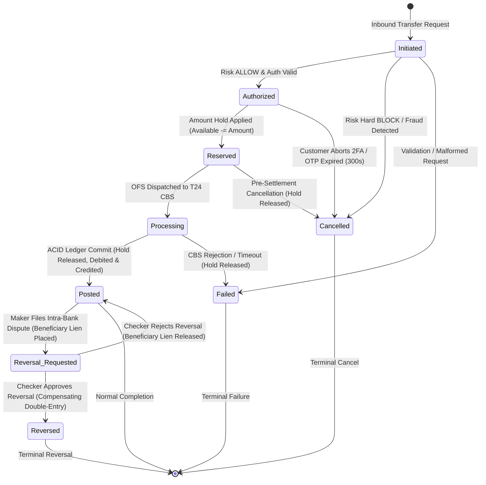

# Transaction Lifecycle, Status Tracking & Reversal Architecture

This document defines the 8-state transaction state machine, status transition rules, database audit schemas, and sequence flows for tracking transaction status changes and reversals in the Core Banking Platform.

---

## 1. The Transaction Statuses & Reversal Governance

The transaction lifecycle encompasses core operational states and an explicit dual-control governance state for intra-bank reversals:

| Status | Type | Description | Trigger / Condition |
| :--- | :--- | :--- | :--- |
| **`INITIATED`** | Transient | Transaction payload received by API Gateway and Orchestrator; payload validated and assigned a unique transaction tracking ID. | Inbound `POST /api/v1/transfers` request. |
| **`AUTHORIZED`** | Milestone | Perimeter security checks passed: Bearer JWT validated, Risk Engine verdict is `ALLOW`, and 2FA OTP verified (if required). | Risk inference passed & OTP verified. |
| **`RESERVED`** | Financial Hold | An **Amount Hold** is applied against the source account (`hold_amount += amount`, reducing available balance) to guarantee fund availability without yet mutating the ledger. | Orchestrator requests T24 Mock CBS hold. |
| **`PROCESSING`** | In-Flight | Temenos OFS command dispatched and actively being processed by the T24 Mock CBS concurrency kernel. | T24 begins ACID database transaction. |
| **`POSTED`** | Terminal (Success) | Final double-entry ledger mutation committed in Azure SQL (`balance_master` updated, hold released, GL accounts posted). | T24 commits database transaction. |
| **`FAILED`** | Terminal (Error) | Transaction could not be posted due to system error, database deadlock, or balance inconsistency. Any active hold is immediately released. | T24 rollback, timeout, or NSF error. |
| **`CANCELLED`** | Terminal (Aborted) | Transaction was aborted prior to core ledger posting (e.g., customer abandoned 2FA modal, OTP timed out after 300s, or fraud block). | Customer cancel, OTP expiry, or risk block. |
| **`REVERSAL_REQUESTED`** | Governance Hold | **Intra-Bank Maker-Checker Step 1**: A dispute officer/teller (Maker) initiated a reversal claim. A **pre-reversal lien** is placed on the beneficiary account, pending supervisor (Checker) review. | Maker submits dispute ticket (`ROLE_TELLER`). |
| **`REVERSED`** | Post-Terminal | **Intra-Bank Maker-Checker Step 2**: A previously `POSTED` transaction is undone via an atomic compensating double-entry transaction following Checker approval. | Checker sign-off (`ROLE_BRANCH_MANAGER`). |

---

## 2. Transaction State Machine Diagram



---

## 3. Status Transition Matrix & Invariants

To guarantee ledger integrity, transitions must follow strict validation rules:

| Current Status | Allowed Next Statuses | Invariant / Financial Actions Required |
| :--- | :--- | :--- |
| `INITIATED` | `AUTHORIZED`, `CANCELLED`, `FAILED` | Zero ledger mutation. No hold placed. |
| `AUTHORIZED` | `RESERVED`, `CANCELLED` | Customer authorized transfer. Preparing for hold placement. |
| `RESERVED` | `PROCESSING`, `CANCELLED` | Source account has `hold_amount += amount`. If moving to `CANCELLED`, hold must be released (`hold_amount -= amount`). |
| `PROCESSING` | `POSTED`, `FAILED` | T24 holds row locks. If `POSTED`, release hold and mutate balance. If `FAILED`, release hold and restore available balance. |
| `POSTED` | `REVERSAL_REQUESTED` | **Intra-bank only**. Maker submits dispute ticket. CBS places pre-reversal lien on beneficiary (`ACC-202`) if available balance covers amount. |
| `REVERSAL_REQUESTED` | `REVERSED` | **Checker Approved**. Segregation of duties verified (`checker_id != maker_id`). CBS releases lien, executes compensating double-entry debiting beneficiary and crediting source. |
| `REVERSAL_REQUESTED` | `POSTED` | **Checker Rejected**. Reversal declined. CBS releases beneficiary lien. Original posting restored to active standing. |
| `FAILED` | *(None)* | Terminal state. |
| `CANCELLED` | *(None)* | Terminal state. |
| `REVERSED` | *(None)* | Terminal state. Original posting remains for audit; reversal transaction links back. |

---

## 4. Status Change Tracking & Audit History Sequence Flow

```mermaid
sequenceDiagram
    autonumber
    actor Customer as Customer
    actor Maker as Maker (Dispute Teller)
    actor Checker as Checker (Branch Manager)
    participant Orch as Transfer Orchestrator (:8082)
    participant CBS as T24 Mock CBS (:8085)
    participant AzureSQL as Azure SQL DB (:1433)
    participant Kafka as Kafka Broker (:9092)
    participant AuditVault as Postgres Audit (:5432)

    %% PHASE 1: INITIATED TO RESERVED
    rect rgb(240, 248, 255)
    Note over Customer,CBS: 1. Lifecycle: INITIATED to AUTHORIZED to RESERVED
    Customer->>Orch: POST /transfers (Amount: 5000.00 PHP)
    Note over Orch,CBS: Orchestrator instructs isolated T24 CBS to create initial transaction state
    Orch->>CBS: POST /api/v1/internal/cbs/transfers/initiate (TX-101, Amount: 5000.00 PHP)
    CBS->>AzureSQL: INSERT INTO transactions (id: "TX-101", status: "INITIATED")
    CBS->>AzureSQL: INSERT INTO transaction_status_history (tx_id: "TX-101", from_status: NULL, to_status: "INITIATED", reason: "API_INGESTION")
    CBS-->>Orch: 201 Created (TX-101 INITIATED)
    Note over Orch,Kafka: Orchestrator publishes event to Kafka on behalf of isolated CBS
    Orch->>Kafka: Publish TransactionStatusChangedEvent (TX-101, INITIATED)

    Note over Orch: Verify JWT & Risk Engine ALLOW
    Note over Orch,CBS: Orchestrator instructs T24 CBS: Authorization completed
    Orch->>CBS: POST /api/v1/internal/cbs/transfers/TX-101/authorize
    CBS->>AzureSQL: UPDATE transactions SET status = "AUTHORIZED" WHERE id = "TX-101"
    CBS->>AzureSQL: INSERT INTO transaction_status_history (tx_id: "TX-101", from_status: "INITIATED", to_status: "AUTHORIZED", reason: "RISK_ALLOW")
    CBS-->>Orch: 200 OK (TX-101 AUTHORIZED)
    Orch->>Kafka: Publish TransactionStatusChangedEvent (TX-101, AUTHORIZED)

    Note over Orch,CBS: Orchestrator instructs T24 CBS to place Amount Hold on Source Account
    Orch->>CBS: POST /api/v1/internal/cbs/transfers/TX-101/reserve (ACC-101, Amount: 5000.00 PHP)
    CBS->>AzureSQL: BEGIN TRANSACTION
    CBS->>AzureSQL: UPDATE balance_master SET hold_amount = hold_amount + 5000.00 WHERE account_id = 'ACC-101'
    CBS->>AzureSQL: UPDATE transactions SET status = "RESERVED" WHERE id = "TX-101"
    CBS->>AzureSQL: INSERT INTO transaction_status_history (tx_id: "TX-101", from_status: "AUTHORIZED", to_status: "RESERVED", reason: "AMOUNT_HOLD_APPLIED")
    CBS->>AzureSQL: COMMIT TRANSACTION
    CBS-->>Orch: 200 OK (TX-101 RESERVED, Hold Applied)
    Orch->>Kafka: Publish TransactionStatusChangedEvent (TX-101, RESERVED)
    end

    %% PHASE 2: PROCESSING TO POSTED
    rect rgb(245, 255, 245)
    Note over CBS,AzureSQL: 2. Lifecycle: RESERVED to PROCESSING to POSTED
    Orch->>CBS: POST /api/v1/internal/cbs/ofs-command (Payload: FUNDS.TRANSFER...)
    CBS->>AzureSQL: UPDATE transactions SET status = "PROCESSING" WHERE id = "TX-101"
    CBS->>AzureSQL: INSERT INTO transaction_status_history (tx_id: "TX-101", from_status: "RESERVED", to_status: "PROCESSING", reason: "T24_OFS_PROCESSING")

    Note over CBS,AzureSQL: Execute Double-Entry Balance Mutation & Release Hold
    CBS->>AzureSQL: BEGIN TRANSACTION
    CBS->>AzureSQL: UPDATE balance_master SET balance_amount = balance_amount - 5000.00, hold_amount = hold_amount - 5000.00 WHERE account_id = 'ACC-101'
    CBS->>AzureSQL: UPDATE balance_master SET balance_amount = balance_amount + 5000.00 WHERE account_id = 'ACC-202'
    CBS->>AzureSQL: UPDATE transactions SET status = "POSTED" WHERE id = "TX-101"
    CBS->>AzureSQL: INSERT INTO transaction_status_history (tx_id: "TX-101", from_status: "PROCESSING", to_status: "POSTED", reason: "LEDGER_COMMITTED")
    CBS->>AzureSQL: COMMIT TRANSACTION
    CBS-->>Orch: 200 OK (OFS Response: SUCCESS, status: POSTED)

    Note over Orch,Kafka: Orchestrator publishes events to Kafka on behalf of isolated CBS
    Orch->>Kafka: Publish TransactionStatusChangedEvent (TX-101, PROCESSING)
    Orch->>Kafka: Publish TransactionStatusChangedEvent (TX-101, POSTED)
    end

    %% PHASE 3: INTRA-BANK MAKER-CHECKER REVERSAL FLOW
    rect rgb(255, 240, 240)
    Note over Maker,AuditVault: 3. Intra-Bank Reversal: Maker-Checker Dual Control & Beneficiary Lien
    Maker->>Orch: POST /api/v1/transfers/TX-101/reversal-request { disputeTicket: "DISP-8801", reason: "DUPLICATE_TRANSFER", makerId: "OP-MAKER-01" }
    Note over Orch,CBS: Orchestrator instructs CBS to validate intra-bank status and place beneficiary lien
    Orch->>CBS: POST /api/v1/internal/cbs/transfers/TX-101/reversal-request { ticketId: "DISP-8801", makerId: "OP-MAKER-01" }
    CBS->>AzureSQL: BEGIN TRANSACTION
    CBS->>AzureSQL: SELECT source_account_id, target_account_id, status FROM transactions WITH (UPDLOCK) WHERE id = 'TX-101'
    Note over CBS: Validate Intra-Bank: Both ACC-101 and ACC-202 exist in CBS and status is POSTED
    CBS->>AzureSQL: SELECT balance_amount, hold_amount FROM balance_master WITH (UPDLOCK, ROWLOCK) WHERE account_id = 'ACC-202'
    Note over CBS: Place Pre-Reversal Lien on Beneficiary (Freeze 5000.00 PHP)
    CBS->>AzureSQL: UPDATE balance_master SET hold_amount = hold_amount + 5000.00 WHERE account_id = 'ACC-202'
    CBS->>AzureSQL: INSERT INTO reversal_requests (ticket_id, transaction_id, maker_id, reversal_reason, status) VALUES ('DISP-8801', 'TX-101', 'OP-MAKER-01', 'DUPLICATE_TRANSFER', 'PENDING_APPROVAL')
    CBS->>AzureSQL: UPDATE transactions SET status = "REVERSAL_REQUESTED" WHERE id = 'TX-101'
    CBS->>AzureSQL: INSERT INTO transaction_status_history (tx_id: "TX-101", from_status: "POSTED", to_status: "REVERSAL_REQUESTED", reason: "MAKER_DISPUTE_FILED", operator_id: "OP-MAKER-01")
    CBS->>AzureSQL: COMMIT TRANSACTION
    CBS-->>Orch: 201 Created { ticketId: "DISP-8801", status: "PENDING_APPROVAL" }
    Note over Orch,Kafka: Orchestrator publishes event to Kafka on behalf of isolated CBS
    Orch->>Kafka: Publish TransactionStatusChangedEvent (TX-101, REVERSAL_REQUESTED, ticketId: "DISP-8801")
    Orch-->>Maker: 201 Created (Reversal Queued for Checker Review)

    Note over Checker,Orch: Checker reviews reversal ticket in authorization queue
    Checker->>Orch: POST /api/v1/transfers/TX-101/reversal-request/DISP-8801/review { decision: "APPROVE", checkerId: "OP-CHECKER-09" }
    Note over Orch: Enforce Segregation of Duties: checkerId != makerId (OP-CHECKER-09 != OP-MAKER-01)
    Orch->>CBS: POST /api/v1/internal/cbs/transfers/TX-101/reversal-request/approve { checkerId: "OP-CHECKER-09", ticketId: "DISP-8801" }
    CBS->>AzureSQL: BEGIN TRANSACTION
    CBS->>AzureSQL: SELECT status FROM reversal_requests WITH (UPDLOCK) WHERE ticket_id = 'DISP-8801'
    Note over CBS: Execute Compensating Double-Entry & Release Beneficiary Lien
    CBS->>AzureSQL: UPDATE balance_master SET balance_amount = balance_amount - 5000.00, hold_amount = hold_amount - 5000.00 WHERE account_id = 'ACC-202'
    CBS->>AzureSQL: UPDATE balance_master SET balance_amount = balance_amount + 5000.00 WHERE account_id = 'ACC-101'
    CBS->>AzureSQL: INSERT INTO transactions (id: "TX-REV-101", type: "REVERSAL", amount: 5000.00, status: "POSTED", original_tx_id: "TX-101")
    CBS->>AzureSQL: INSERT INTO gl_ledger (DR: ACC-202, CR: ACC-101, amount: 5000.00, ref: "TX-REV-101")
    CBS->>AzureSQL: UPDATE reversal_requests SET status = "APPROVED", checker_id = "OP-CHECKER-09", reviewed_at = SYSUTCDATETIME() WHERE ticket_id = 'DISP-8801'
    CBS->>AzureSQL: UPDATE transactions SET status = "REVERSED", reversal_ref_id = "TX-REV-101" WHERE id = 'TX-101'
    CBS->>AzureSQL: INSERT INTO transaction_status_history (tx_id: "TX-101", from_status: "REVERSAL_REQUESTED", to_status: "REVERSED", reason: "CHECKER_APPROVED", operator_id: "OP-CHECKER-09")
    CBS->>AzureSQL: COMMIT TRANSACTION
    CBS-->>Orch: 200 OK (TX-101 REVERSED, reversal_ref_id: TX-REV-101)
    Note over Orch,Kafka: Orchestrator publishes REVERSED events to Kafka
    Orch->>Kafka: Publish TransactionStatusChangedEvent (TX-101, REVERSED, ref: TX-REV-101)
    Orch->>Kafka: Publish TransferReversedEvent (txId: "TX-101", reversalRefId: "TX-REV-101", makerId: "OP-MAKER-01", checkerId: "OP-CHECKER-09")
    Orch-->>Checker: 200 OK (Compensating Reversal Executed Successfully)
    end

    par Asynchronous Audit Ingestion
        Kafka->>AuditVault: Consume All TransactionStatusChangedEvents
        AuditVault->>AuditVault: INSERT INTO ledger_mutation_audit (Full Status Transition Roll)
    end
```



---

## 5. Database Schema for Status Change Tracking (Azure SQL)

### A. The Master Transactions Table
```sql
CREATE TABLE transactions (
    transaction_id      VARCHAR(64) PRIMARY KEY,
    source_account_id   VARCHAR(32) NOT NULL,
    target_account_id   VARCHAR(32) NOT NULL,
    amount              DECIMAL(18, 4) NOT NULL,
    currency            VARCHAR(3) DEFAULT 'PHP',
    status              VARCHAR(32) NOT NULL, -- INITIATED, AUTHORIZED, RESERVED, PROCESSING, POSTED, FAILED, CANCELLED, REVERSAL_REQUESTED, REVERSED
    reversal_ref_id     VARCHAR(64) NULL,     -- Points to reversing transaction if REVERSED
    original_tx_id      VARCHAR(64) NULL,     -- Points to original transaction if this record is a REVERSAL
    created_at          DATETIME2 DEFAULT SYSUTCDATETIME(),
    updated_at          DATETIME2 DEFAULT SYSUTCDATETIME(),
    CONSTRAINT chk_status CHECK (status IN (
        'INITIATED', 'AUTHORIZED', 'RESERVED', 'PROCESSING', 
        'POSTED', 'FAILED', 'CANCELLED', 'REVERSAL_REQUESTED', 'REVERSED'
    ))
);
```

### B. The Status Change Audit History Table
```sql
CREATE TABLE transaction_status_history (
    history_id          BIGINT IDENTITY(1,1) PRIMARY KEY,
    transaction_id      VARCHAR(64) NOT NULL,
    from_status         VARCHAR(32) NULL,     -- NULL on initial creation
    to_status           VARCHAR(32) NOT NULL,
    transition_reason   VARCHAR(255) NOT NULL, -- e.g., 'API_INGESTION', 'RISK_ALLOW', 'OFS_COMMITTED', 'MAKER_DISPUTE_FILED', 'CHECKER_APPROVED'
    operator_id         VARCHAR(64) NULL,     -- User ID or service identifier triggering transition (Maker or Checker ID)
    service_name        VARCHAR(64) NOT NULL, -- 'transfer-orchestrator', 't24-mock-cbs'
    metadata_payload    NVARCHAR(MAX) NULL,   -- JSON metadata (ticket ID, justification, reversal details)
    transition_time     DATETIME2 DEFAULT SYSUTCDATETIME(),
    CONSTRAINT fk_tx_history FOREIGN KEY (transaction_id) REFERENCES transactions(transaction_id)
);

CREATE NONCLUSTERED INDEX idx_tx_history_lookup 
ON transaction_status_history (transaction_id, transition_time ASC);
```

### C. The Intra-Bank Reversal Requests Table (`reversal_requests`)
```sql
CREATE TABLE reversal_requests (
    request_id          BIGINT IDENTITY(1,1) PRIMARY KEY,
    ticket_id           VARCHAR(64) UNIQUE NOT NULL,       -- e.g. 'DISP-8801'
    transaction_id      VARCHAR(64) NOT NULL,              -- Target transaction to be reversed
    maker_id            VARCHAR(64) NOT NULL,              -- Dispute Officer / Teller who submitted claim
    checker_id          VARCHAR(64) NULL,                  -- Branch Manager / Supervisor who reviewed
    status              VARCHAR(32) NOT NULL,              -- 'PENDING_APPROVAL', 'APPROVED', 'REJECTED'
    reversal_reason     VARCHAR(255) NOT NULL,             -- 'DUPLICATE_TRANSFER', 'FRAUD_CLAIM', 'CUSTOMER_DISPUTE'
    maker_notes         NVARCHAR(MAX) NULL,                -- Maker investigation findings
    checker_notes       NVARCHAR(MAX) NULL,                -- Checker authorization notes
    beneficiary_lien_id VARCHAR(64) NULL,                  -- Pre-reversal hold placed on target account
    created_at          DATETIME2 DEFAULT SYSUTCDATETIME(),
    reviewed_at         DATETIME2 NULL,
    CONSTRAINT fk_rev_req_tx FOREIGN KEY (transaction_id) REFERENCES transactions(transaction_id),
    CONSTRAINT chk_rev_status CHECK (status IN ('PENDING_APPROVAL', 'APPROVED', 'REJECTED')),
    CONSTRAINT chk_segregation_of_duties CHECK (checker_id IS NULL OR checker_id <> maker_id) -- 4-Eyes Rule
);

CREATE NONCLUSTERED INDEX idx_rev_pending 
ON reversal_requests (status, created_at ASC);
```

---

## 6. Kafka Event Contract: `TransactionStatusChangedEvent`

Every status mutation is published exclusively by the **Transfer Orchestrator (`:8082`)** (acting as event broker for the isolated T24 CBS enclave) to `banking.transfers.events`:

```json
{
  "eventId": "evt_stat_882910",
  "eventType": "TRANSACTION_STATUS_CHANGED",
  "transactionId": "TX-101",
  "fromStatus": "REVERSAL_REQUESTED",
  "toStatus": "REVERSED",
  "timestamp": "2026-10-05T17:15:30.100Z",
  "amount": 5000.0000,
  "currency": "PHP",
  "sourceAccountId": "ACC-101",
  "targetAccountId": "ACC-202",
  "transitionReason": "CHECKER_APPROVED",
  "operatorId": "OP-CHECKER-09",
  "serviceSource": "t24-mock-cbs",
  "reversalReferenceId": "TX-REV-101",
  "metadata": {
    "disputeTicket": "DISP-8801",
    "makerId": "OP-MAKER-01",
    "checkerId": "OP-CHECKER-09"
  }
}
```

### Kafka Event Contract: `TransferReversedEvent`

Published when an intra-bank reversal is finalized following Checker approval:

```json
{
  "eventId": "evt_rev_771920",
  "eventType": "TRANSFER_REVERSED",
  "originalTransferId": "TX-101",
  "reversalTransferId": "TX-REV-101",
  "disputeTicketId": "DISP-8801",
  "sourceAccountId": "ACC-101",
  "targetAccountId": "ACC-202",
  "reversedAmount": 5000.0000,
  "currency": "PHP",
  "makerId": "OP-MAKER-01",
  "checkerId": "OP-CHECKER-09",
  "approvalTimestamp": "2026-10-05T17:15:30.100Z",
  "status": "REVERSED"
}
```
