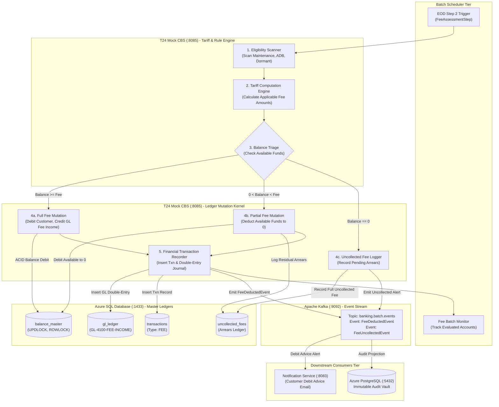

# Subfeature 4.2: Automated Batch Fees & Maintenance Charges Architecture

This document defines the technical architecture, swimlane process models, request/response sequence flows, and data schemas for **Subfeature 4.2: Fees** within the **End-of-Day (EOD) / Batch Processing** engine.

---

## 1. Subfeature Scope & Functional Requirements

During the End-of-Day batch window, the **T24 Mock CBS** (:8085) executes the automated fee assessment engine against the **Azure SQL Database** master ledgers. The engine evaluates account profiles, balances, and activity against bank fee schedules:

1. **Monthly Account Maintenance Fees**:
   - Assessed on specific account types (e.g., checking accounts, commercial accounts) on their billing anniversary or month-end.
2. **Below Minimum Average Daily Balance (ADB) Penalty Fees**:
   - Assessed when an account's calculated monthly ADB or closing balance falls below the regulatory/contractual threshold (e.g., PHP ₱5,000.00 for standard savings, ₱10,000.00 for checking).
3. **Inactivity / Dormancy Charges**:
   - Assessed on accounts flagged as `DORMANT` (no customer-initiated financial activity for > 24 months for savings or > 12 months for checking) whose balance remains below the maintaining requirement.
4. **ACID Ledger Mutation & Pessimistic Concurrency**:
   - T24 Mock CBS executes atomic balance mutations with row locks:
     `SELECT balance_amount, hold_amount FROM balance_master WITH (UPDLOCK, ROWLOCK) WHERE account_id = ?`
   - Enforces double-entry accounting:
     - **Debit**: Customer Account (`balance_master.balance_amount -= fee`)
     - **Credit**: Bank Fee Income GL (`GL-4100-FEE-INCOME += fee`)
5. **Boundary Conditions & Zero-Overdraft Protection**:
   - Respects database constraint `CHECK (balance_amount >= 0)`.
   - **Full Deduction**: If balance $\ge$ fee, full fee is deducted.
   - **Partial Deduction**: If balance $<$ fee and balance $>$ 0, available balance is deducted to ₱0.00, and remaining unpaid balance is logged into `uncollected_fees`.
   - **Zero Balance**: If balance $\equiv$ 0, no deduction occurs; uncollected fee is logged without overdrafting the customer.
6. **Asynchronous Notification & Audit**:
   - T24 Mock CBS publishes `FeeDeductedEvent` to **Apache Kafka** (:9092).
   - **Notification Service** (:8083) delivers customer fee advice via email (MailHog).
   - **Azure PostgreSQL** (:5432) records append-only immutable audit entries.

---

## 2. Fees Processing Swimlane Diagram



---

## 3. Fees Request / Response Sequence Flow

```mermaid
sequenceDiagram
    autonumber
    participant BatchCoordinator as EOD Batch Coordinator
    participant CBS as T24 Mock CBS (:8085)
    participant AzureSQL as Azure SQL DB (:1433)
    participant Kafka as Kafka Broker (:9092)
    participant Notif as Notification Svc (:8083)
    participant AuditVault as Postgres Audit (:5432)

    Note over BatchCoordinator,AuditVault: Subfeature 4.2 Execution Sequence: Batch Fee Assessment & Deduction

    BatchCoordinator->>CBS: POST /api/v1/batch/fees/run { valueDate: "2026-10-05" }
    CBS->>AzureSQL: SELECT a.account_id, a.account_type, a.status, b.balance_amount, f.fee_type, f.fee_amount, f.min_balance_threshold FROM accounts a JOIN balance_master b ON a.account_id = b.account_id JOIN fee_schedules f ON a.account_type = f.account_type WHERE a.status IN ('ACTIVE', 'DORMANT')
    AzureSQL-->>CBS: List of fee candidate accounts (e.g., 2 accounts: ACC-101 and ACC-102)

    %% SCENARIO 1: SUFFICIENT FUNDS (FULL DEDUCTION)
    rect rgb(240, 248, 255)
    Note over CBS,AzureSQL: Account 1 (ACC-101): Sufficient Funds (Balance: 25000 PHP, Fee: 500 PHP Below-Min ADB)
    CBS->>AzureSQL: BEGIN TRANSACTION
    CBS->>AzureSQL: SELECT balance_amount, hold_amount FROM balance_master WITH (UPDLOCK, ROWLOCK) WHERE account_id = 'ACC-101'
    AzureSQL-->>CBS: balance_amount = 25000.0000, hold_amount = 0.0000
    Note over CBS: Available 25000.0000 >= 500.0000 (Full Deduction)
    CBS->>AzureSQL: UPDATE balance_master SET balance_amount = balance_amount - 500.0000 WHERE account_id = 'ACC-101'
    CBS->>AzureSQL: INSERT INTO transactions (transaction_id, account_id, type, amount, status, description) VALUES ('TXN-FEE-881', 'ACC-101', 'FEE_BELOW_MIN_ADB', 500.0000, 'EXECUTED', 'Monthly Below-Min ADB Fee')
    CBS->>AzureSQL: INSERT INTO gl_ledger (gl_code, debit_amount, credit_amount, ref_id) VALUES ('GL-2100-CUST-LIAB', 500.0000, 0.0000, 'TXN-FEE-881')
    CBS->>AzureSQL: INSERT INTO gl_ledger (gl_code, debit_amount, credit_amount, ref_id) VALUES ('GL-4100-FEE-INCOME', 0.0000, 500.0000, 'TXN-FEE-881')
    CBS->>AzureSQL: COMMIT TRANSACTION
    AzureSQL-->>CBS: Transaction Committed (New Balance: 24,500.00 PHP)
    end

    %% SCENARIO 2: INSUFFICIENT FUNDS (PARTIAL DEDUCTION & ARREARS)
    rect rgb(255, 250, 240)
    Note over CBS,AzureSQL: Account 2 (ACC-102): Insufficient Funds (Balance: 200 PHP, Fee: 500 PHP Below-Min ADB)
    CBS->>AzureSQL: BEGIN TRANSACTION
    CBS->>AzureSQL: SELECT balance_amount, hold_amount FROM balance_master WITH (UPDLOCK, ROWLOCK) WHERE account_id = 'ACC-102'
    AzureSQL-->>CBS: balance_amount = 200.0000, hold_amount = 0.0000
    Note over CBS: Available 200.0000 < 500.0000 (Partial Deduction: 200.00 deducted, 300.00 to arrears)
    CBS->>AzureSQL: UPDATE balance_master SET balance_amount = 0.0000 WHERE account_id = 'ACC-102'
    CBS->>AzureSQL: INSERT INTO transactions (transaction_id, account_id, type, amount, status, description) VALUES ('TXN-FEE-882', 'ACC-102', 'FEE_BELOW_MIN_ADB_PARTIAL', 200.0000, 'EXECUTED', 'Partial Below-Min ADB Fee')
    CBS->>AzureSQL: INSERT INTO uncollected_fees (account_id, original_fee_amount, collected_amount, uncollected_amount, reason) VALUES ('ACC-102', 500.0000, 200.0000, 300.0000, 'INSUFFICIENT_FUNDS')
    CBS->>AzureSQL: INSERT INTO gl_ledger (gl_code, debit_amount, credit_amount, ref_id) VALUES ('GL-2100-CUST-LIAB', 200.0000, 0.0000, 'TXN-FEE-882')
    CBS->>AzureSQL: INSERT INTO gl_ledger (gl_code, debit_amount, credit_amount, ref_id) VALUES ('GL-4100-FEE-INCOME', 0.0000, 200.0000, 'TXN-FEE-882')
    CBS->>AzureSQL: COMMIT TRANSACTION
    AzureSQL-->>CBS: Transaction Committed (New Balance: 0.00 PHP, Uncollected: 300.00 PHP)
    end

    %% BATCH COMPLETION & ASYNC DELIVERY
    rect rgb(240, 255, 255)
    CBS-->>BatchCoordinator: 200 OK { status: "FEES_ASSESSED", processedCount: 2, totalFeesDeducted: 700.0000, uncollectedArrears: 300.0000 }
    Note over BatchCoordinator,Kafka: Batch Orchestrator publishes fee deduction events to Kafka on behalf of isolated CBS
    BatchCoordinator->>Kafka: Publish FeeDeductedEvent { accountId: 'ACC-101', feeType: 'BELOW_MIN_ADB', feeAmount: 500.0000, newBalance: 24500.0000 }
    BatchCoordinator->>Kafka: Publish FeeDeductedEvent { accountId: 'ACC-102', feeType: 'BELOW_MIN_ADB_PARTIAL', feeAmount: 200.0000, uncollectedAmount: 300.0000, newBalance: 0.0000 }
    end

    par Asynchronous Customer Advice Delivery
        Kafka->>Notif: Consume FeeDeductedEvent (ACC-101 & ACC-102)
        Notif->>Notif: Generate HTML Fee Advice Email
        Notif->>Notif: Send Email via MailHog (:8025)
    and Append-Only Compliance Archival
        Kafka->>AuditVault: Consume FeeDeductedEvent
        AuditVault->>AuditVault: INSERT INTO ledger_mutation_audit (event: "FEE_DEDUCTED", details: json)
    end
```



---

## 4. Key Data Contracts & Schemas

### A. Database Table: `uncollected_fees` (Azure SQL)
```sql
CREATE TABLE uncollected_fees (
    id                   BIGINT IDENTITY(1,1) PRIMARY KEY,
    account_id           VARCHAR(32) NOT NULL,
    fee_type             VARCHAR(64) NOT NULL, -- MAINTENANCE, BELOW_MIN_ADB, DORMANCY
    original_fee_amount  DECIMAL(18, 4) NOT NULL,
    collected_amount     DECIMAL(18, 4) NOT NULL,
    uncollected_amount   DECIMAL(18, 4) NOT NULL,
    status               VARCHAR(32) DEFAULT 'PENDING', -- PENDING, RECOVERED, WAIVED
    assessment_date      DATE NOT NULL,
    created_at           DATETIME2 DEFAULT SYSUTCDATETIME()
);
```

### B. Kafka Event: `FeeDeductedEvent`
```json
{
  "eventId": "evt_fee_449102",
  "eventType": "FEE_DEDUCTED",
  "businessDate": "2026-10-05",
  "timestamp": "2026-10-05T23:59:15.340Z",
  "accountId": "ACC-100223",
  "customerId": "CUST-882190",
  "feeType": "FEE_BELOW_MIN_ADB",
  "feeAmount": 500.0000,
  "currency": "PHP",
  "uncollectedAmount": 0.0000,
  "previousBalance": 3500.0000,
  "newBalance": 3000.0000,
  "transactionRef": "TXN-FEE-881290",
  "glIncomeAccount": "GL-4100-FEE-INCOME"
}
```
