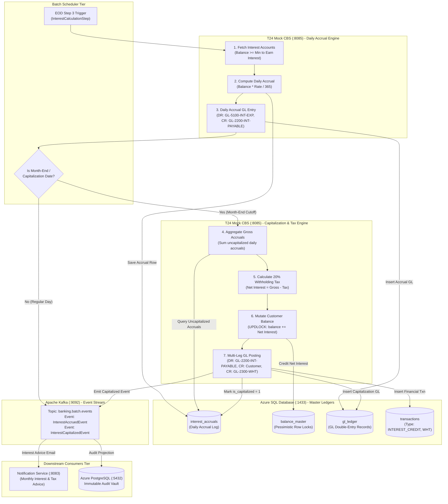

# Subfeature 4.3: Interest Calculations & Capitalization Architecture

This document defines the technical architecture, swimlane process models, request/response sequence flows, and data schemas for **Subfeature 4.3: Interest Calculations** within the **End-of-Day (EOD) / Batch Processing** engine.

---

## 1. Subfeature Scope & Functional Requirements

The **T24 Mock CBS** (:8085) executes the interest engine directly against the **Azure SQL Database** master ledgers, adhering to BSP MORB (Bangko Sentral ng Pilipinas Manual of Regulations for Banks) and Philippine Bureau of Internal Revenue (BIR) regulations:

1. **Daily Interest Accrual**:
   - Executed on every business day $T$ for all eligible interest-bearing accounts (e.g., Regular Savings, High-Yield Savings).
   - Calculates daily interest using the **Average Daily Balance (ADB)** or daily closing cleared balance:
     $$\text{Daily Accrual} = \text{Cleared Balance} \times \frac{\text{Annual Interest Rate}}{365}$$
   - **Threshold Rule**: Accounts below the minimum balance to earn interest (e.g., 10,000.00 PHP) earn 0.0000 PHP.
   - Updates the cumulative accrual table `interest_accruals`.
   - Posts daily accrual double-entry journal:
     - **Debit**: Interest Expense GL (`GL-5100-INT-EXP`)
     - **Credit**: Interest Payable GL (`GL-2200-INT-PAYABLE`)
2. **Periodic Capitalization & Final Withholding Tax**:
   - Executed on the interest payment date (typically the last calendar day of the month or quarter).
   - Sums gross accrued interest for the cycle:
     $$\text{Gross Interest} = \sum_{d=1}^{N} \text{Daily Accrual}_d$$
   - Deducts the mandatory **20% Final Withholding Tax (FWT)** under Philippine tax laws:
     $$\text{Withholding Tax} = \text{Gross Interest} \times 0.20$$
     $$\text{Net Interest Credited} = \text{Gross Interest} - \text{Withholding Tax}$$
3. **Atomic Balance Mutation & Double-Entry Accounting**:
   - T24 Mock CBS applies pessimistic row locks:
     `SELECT balance_amount FROM balance_master WITH (UPDLOCK, ROWLOCK) WHERE account_id = ?`
   - Executes atomic multi-leg posting:
     - **Credit**: Customer Account (`balance_master.balance_amount += Net Interest`)
     - **Debit**: Interest Payable GL (`GL-2200-INT-PAYABLE -= Gross Interest`)
     - **Credit**: Withholding Tax Payable GL (`GL-2300-WHT-PAYABLE += Withholding Tax`)
   - Marks accrued records as capitalized (`is_capitalized = 1`).
4. **Asynchronous Notification & Compliance Audit**:
   - Emits `InterestCapitalizedEvent` to **Apache Kafka** (:9092).
   - **Notification Service** (:8083) delivers customer credit and tax deduction advice via email (MailHog).
   - **Azure PostgreSQL** (:5432) records append-only immutable audit entries.

---

## 2. Interest Calculations Swimlane Diagram



---

## 3. Interest Request / Response Sequence Flow

```mermaid
sequenceDiagram
    autonumber
    participant BatchJob as EOD Batch Coordinator
    participant CBS as T24 Mock CBS (:8085)
    participant AzureSQL as Azure SQL DB (:1433)
    participant Kafka as Kafka Broker (:9092)
    participant Notif as Notification Svc (:8083)
    participant AuditWorker as Audit Vault Consumer
    participant AuditVault as Postgres Audit (:5432)

    Note over BatchJob,AuditVault: Subfeature 4.3 Execution Sequence: Daily Accrual & Month-End Capitalization

    %% PART 1: DAILY ACCRUAL
    rect rgb(240, 248, 255)
    Note over CBS,AzureSQL: Part 1: Daily Accrual Calculation (Every Business Day)
    Note over BatchJob: Rule 1: Translate Accrual command to Temenos OFS wire syntax
    BatchJob->>BatchJob: Map to OFS: IC.CHARGE,ACCRUAL/I/PROCESS,,VALUE.DATE=20261005
    BatchJob->>CBS: POST /api/v1/internal/cbs/ofs-command (Payload: IC.CHARGE,ACCRUAL wire string)

    CBS->>AzureSQL: SELECT a.account_id, a.interest_rate, b.balance_amount FROM accounts a JOIN balance_master b ON a.account_id = b.account_id WHERE a.status = 'ACTIVE' AND a.is_interest_bearing = 1 AND b.balance_amount >= a.min_balance_to_earn_interest
    AzureSQL-->>CBS: List of qualifying accounts (e.g., ACC-101 balance = 100000 PHP, rate = 2.50%)
    loop For each eligible account
        Note over CBS: Daily Interest = 100000.0000 * 0.0250 / 365 = 6.8493 PHP
        CBS->>AzureSQL: INSERT INTO interest_accruals (account_id, accrual_date, daily_balance, daily_accrued_amount, is_capitalized) VALUES ('ACC-101', '2026-10-05', 100000.0000, 6.8493, 0)
        CBS->>AzureSQL: INSERT INTO gl_ledger (gl_code, debit_amount, credit_amount, ref_id) VALUES ('GL-5100-INT-EXP', 6.8493, 0.0000, 'ACCRUAL-ACC-101-20261005')
        CBS->>AzureSQL: INSERT INTO gl_ledger (gl_code, debit_amount, credit_amount, ref_id) VALUES ('GL-2200-INT-PAYABLE', 0.0000, 6.8493, 'ACCRUAL-ACC-101-20261005')
    end
    AzureSQL-->>CBS: Daily accruals committed
    CBS-->>BatchJob: 200 OK (OFS: IC.CHARGE-ACCRUAL//1/SUCCESS,PROCESSED=12000,TOTAL_ACCRUED=82191.60)
    end

    %% PART 2: MONTH-END CAPITALIZATION
    rect rgb(255, 250, 240)
    Note over CBS,AzureSQL: Part 2: Periodic Capitalization & 20% Withholding Tax (Month-End Cutoff)
    Note over BatchJob: Rule 1: Translate Interest Capitalization command to Temenos OFS wire syntax
    BatchJob->>BatchJob: Map to OFS: IC.CHARGE,BATCH/I/PROCESS,,VALUE.DATE=20261005,PERIOD=2026-10
    BatchJob->>CBS: POST /api/v1/internal/cbs/ofs-command (Payload: IC.CHARGE,BATCH wire string)

    CBS->>AzureSQL: SELECT account_id, SUM(daily_accrued_amount) AS gross_interest FROM interest_accruals WHERE is_capitalized = 0 GROUP BY account_id
    AzureSQL-->>CBS: Accounts with accrued interest (e.g., ACC-101 gross_interest = 212.3300 PHP)

    loop For each capitalized account
        Note over CBS: Compute 20% Final Withholding Tax (Gross 212.3300 PHP, Tax 42.4660 PHP, Net 169.8640 PHP)
        CBS->>AzureSQL: BEGIN TRANSACTION
        CBS->>AzureSQL: SELECT balance_amount, accrued_interest FROM balance_master WITH (UPDLOCK, ROWLOCK) WHERE account_id = 'ACC-101'
        AzureSQL-->>CBS: balance_amount = 100000.0000
        CBS->>AzureSQL: UPDATE balance_master SET balance_amount = balance_amount + 169.8640 WHERE account_id = 'ACC-101'
        CBS->>AzureSQL: INSERT INTO transactions (transaction_id, account_id, type, amount, status, description) VALUES ('TXN-INT-991', 'ACC-101', 'INTEREST_CREDIT', 169.8640, 'EXECUTED', 'Monthly Net Interest Credit')
        CBS->>AzureSQL: INSERT INTO transactions (transaction_id, account_id, type, amount, status, description) VALUES ('TXN-TAX-992', 'ACC-101', 'WITHHOLDING_TAX', 42.4660, 'EXECUTED', '20% Final Withholding Tax')
        CBS->>AzureSQL: INSERT INTO gl_ledger (gl_code, debit_amount, credit_amount, ref_id) VALUES ('GL-2200-INT-PAYABLE', 212.3300, 0.0000, 'TXN-INT-991')
        CBS->>AzureSQL: INSERT INTO gl_ledger (gl_code, debit_amount, credit_amount, ref_id) VALUES ('GL-2100-CUST-LIAB', 0.0000, 169.8640, 'TXN-INT-991')
        CBS->>AzureSQL: INSERT INTO gl_ledger (gl_code, debit_amount, credit_amount, ref_id) VALUES ('GL-2300-WHT-PAYABLE', 0.0000, 42.4660, 'TXN-TAX-992')
        CBS->>AzureSQL: UPDATE interest_accruals SET is_capitalized = 1 WHERE account_id = 'ACC-101' AND is_capitalized = 0
        Note over CBS,AzureSQL: Rule 3: Record interest event into cbs_outbox within ACID transaction
        CBS->>AzureSQL: INSERT INTO cbs_outbox (event_type: "INTEREST_CAPITALIZED", aggregate_id: "BATCH-INT-20261005", status: "PENDING")
        CBS->>AzureSQL: COMMIT TRANSACTION
        AzureSQL-->>CBS: Transaction Committed (New Balance: 100,169.8640 PHP)
    end
    CBS-->>BatchJob: 200 OK (OFS: IC.CHARGE-BATCH//1/SUCCESS,PROCESSED=12000,NET_CREDITED=2038368.00,TAX_WITHHELD=509592.00)

    Note over CBS,Kafka: Rule 3: CBS publishes interest events directly to Kafka from cbs_outbox
    CBS->>Kafka: Publish InterestCapitalizedEvent (capitalizedAccounts: 12000, totalNetCredited: 2038368.00 PHP)
    CBS->>AzureSQL: UPDATE cbs_outbox SET status = "PUBLISHED", published_at = SYSUTCDATETIME() WHERE aggregate_id = "BATCH-INT-20261005" AND status = "PENDING"
    end

    %% ASYNCHRONOUS CONSUMPTION
    par Asynchronous Customer Advice Delivery
        Kafka->>Notif: Consume InterestCapitalizedEvent
        Notif->>Notif: Generate HTML Monthly Interest & Tax Certificate
        Notif->>Notif: Dispatch Email via MailHog (:8025)
    and Rule 2: Append-Only Compliance Archival via Audit Worker
        Kafka->>AuditWorker: Consume InterestCapitalizedEvent
        AuditWorker->>AuditVault: INSERT INTO ledger_mutation_audit (event: "INTEREST_CAPITALIZED", details: json)
    end
```



---

## 4. Key Data Contracts & Schemas

### A. Database Table: `interest_accruals` (Azure SQL)
```sql
CREATE TABLE interest_accruals (
    accrual_id           BIGINT IDENTITY(1,1) PRIMARY KEY,
    account_id           VARCHAR(32) NOT NULL,
    accrual_date         DATE NOT NULL,
    daily_balance        DECIMAL(18, 4) NOT NULL,
    annual_interest_rate DECIMAL(6, 4) NOT NULL, -- e.g. 0.0250 (2.50%)
    daily_accrued_amount DECIMAL(18, 4) NOT NULL,
    is_capitalized       BIT DEFAULT 0,
    created_at           DATETIME2 DEFAULT SYSUTCDATETIME(),
    CONSTRAINT uq_accrual_account_date UNIQUE (account_id, accrual_date)
);
```

### B. Kafka Event: `InterestCapitalizedEvent`
```json
{
  "eventId": "evt_int_661902",
  "eventType": "INTEREST_CAPITALIZED",
  "businessDate": "2026-10-05",
  "timestamp": "2026-10-05T23:59:30.150Z",
  "accountId": "ACC-100223",
  "customerId": "CUST-882190",
  "period": "2026-10",
  "currency": "PHP",
  "grossInterest": 212.3300,
  "withholdingTaxRate": 0.2000,
  "withholdingTaxAmount": 42.4660,
  "netInterestCredited": 169.8640,
  "previousBalance": 100000.0000,
  "newBalance": 100169.8640,
  "transactionRefInterest": "TXN-INT-991204",
  "transactionRefTax": "TXN-TAX-992305"
}
```
