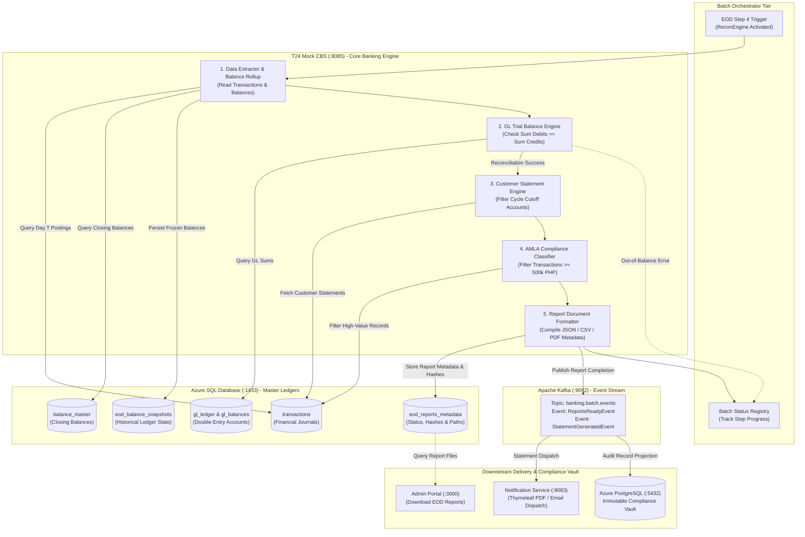
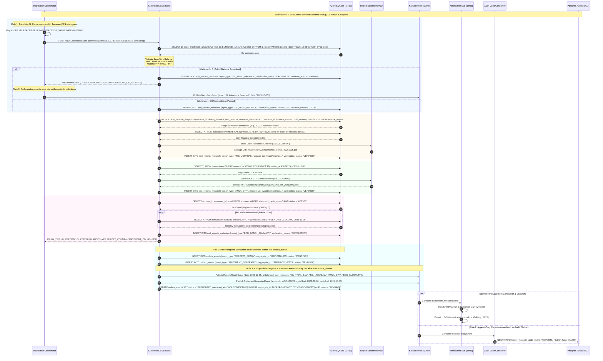

# Subfeature 4.1: End-of-Day (EOD) Reports & GL Reconciliation Architecture

This document defines the technical architecture, swimlane process models, request/response sequence flows, and data schemas for **Subfeature 4.1: Reports** within the **End-of-Day (EOD) / Batch Processing** engine.

---

## 1. Subfeature Scope & Functional Requirements

At the conclusion of the daily posting cycle, **T24 Mock CBS** (:8085) generates core operational, financial, and compliance reports directly against the **Azure SQL Database** master ledgers:

1. **General Ledger (GL) Trial Balance & Reconciliation Report**:
   - Aggregates debits and credits across all internal bank chart of accounts (`gl_accounts`, `gl_ledger`).
   - Verifies the fundamental accounting equation: $\sum \text{Debits} \equiv \sum \text{Credits}$.
   - Flags out-of-balance exceptions immediately with batch halt warnings.
2. **Daily Transaction Journal**:
   - Comprehensive audit roll of all posted transactions on business date $T$ (transfers, reversals, fee charges, interest credits, tax withholdings).
   - Records transaction reference, timestamp, source/target accounts, currency, and operator/system channel.
3. **EOD Account Balance Snapshot**:
   - Freezes immutable closing ledger balances, hold amounts, and available funds into `eod_balance_snapshots`.
   - Used for historical balance inquiry, audit verification, and average daily balance (ADB) calculations.
4. **Periodic Customer E-Statements**:
   - Identifies accounts matching today's monthly statement cycle cutoff.
   - Compiles monthly transaction history, opening/closing balance, interest earned, and withholding tax withheld.
   - Emits Kafka events for the **Notification Service** (:8083) to generate PDF statements and dispatch email advisories.
5. **Regulatory AMLA Covered Transaction Report (CTR)**:
   - Identifies all transactions exceeding the Anti-Money Laundering Act (AMLA) threshold of 500,000.00 PHP (or aggregated structuring).
   - Compiles structured compliance data ready for AMLC regulator extraction.
6. **Batch Execution & Exception Summary**:
   - Logs overall batch run statistics, record throughput, execution duration, and uncollected fee exceptions.

---

## 2. Reports Generation Swimlane Diagram



---

## 3. Reports Request / Response Sequence Flow



---

## 4. Key Data Contracts & Schemas

### A. Database Table: `eod_reports_metadata` (Azure SQL)
```sql
CREATE TABLE eod_reports_metadata (
    report_id           BIGINT IDENTITY(1,1) PRIMARY KEY,
    report_type         VARCHAR(64) NOT NULL, -- GL_TRIAL_BALANCE, TXN_JOURNAL, AMLA_CTR, EOD_SUMMARY
    business_date       DATE NOT NULL,
    generated_at        DATETIME2 DEFAULT SYSUTCDATETIME(),
    record_count        INT NOT NULL,
    total_debit_amount  DECIMAL(18, 4) NULL,
    total_credit_amount DECIMAL(18, 4) NULL,
    variance_amount     DECIMAL(18, 4) DEFAULT 0.0000,
    storage_uri         VARCHAR(512) NOT NULL,
    file_sha256_hash    CHAR(64) NOT NULL,
    verification_status VARCHAR(32) NOT NULL -- PENDING, VERIFIED, EXCEPTION
);
```

### B. Kafka Event: `StatementGeneratedEvent`
```json
{
  "eventId": "evt_stmt_992104",
  "eventType": "STATEMENT_GENERATED",
  "businessDate": "2026-10-05",
  "timestamp": "2026-10-05T23:59:45.120Z",
  "accountId": "ACC-100223",
  "customerId": "CUST-882190",
  "customerEmail": "customer@example.com",
  "currency": "PHP",
  "cycleStart": "2026-09-06",
  "cycleEnd": "2026-10-05",
  "openingBalance": 125000.0000,
  "closingBalance": 184500.5000,
  "totalDebits": 45000.0000,
  "totalCredits": 104500.5000,
  "interestCredited": 120.5000,
  "withholdingTaxWithheld": 24.1000,
  "transactionCount": 18
}
```

### C. Kafka Event: `ReportsReadyEvent`
```json
{
  "eventId": "evt_rep_771829",
  "eventType": "REPORTS_READY",
  "businessDate": "2026-10-05",
  "glBalanced": true,
  "totalLedgerDebits": 14500000.0000,
  "totalLedgerCredits": 14500000.0000,
  "generatedReports": [
    { "type": "GL_TRIAL_BALANCE", "records": 48, "status": "VERIFIED" },
    { "type": "TXN_JOURNAL", "records": 4210, "status": "STORED" },
    { "type": "AMLA_CTR", "records": 12, "status": "FILED" }
  ]
}
```
