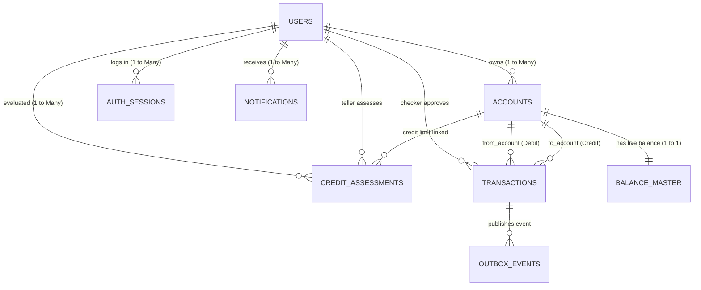

# Beginner's Guide: Oracle XE Database & Schema Design
**Capstone FSE: Core Retail Ledger & Balance Mutation Engine**  
*Epic B: Database & Schema Design (Task FSE-201)*

---

## 1. Introduction: What is a Database Schema?

Imagine a bank without computers. You would have physical ledgers, customer folders, and paper slips:
- A **Customer Folder** containing names, phone numbers, and IDs.
- An **Account Book** recording account numbers.
- A **Balance Card** tracking the current cash balance.
- A **Receipt Pad** recording every single transfer or deposit.

In the digital world, a **database schema** is the strict architectural blueprint that organizes these digital folders into **tables**. It defines:
1. **What data can be stored** (e.g., text, numbers, dates).
2. **What rules must never be broken** (e.g., balance cannot be negative without credit; email must be unique).
3. **How tables talk to each other** (Relationships via Primary Keys and Foreign Keys).

---

## 2. System Entity-Relationship Diagram (ERD)

Below is the visual relationship between all 8 Oracle XE tables:



---

## 3. The 8 Tables Explained in Plain English

### Table 1: `users` (Who are you?)
- **Analogy:** The bank's Master Customer & Employee ID Registry.
- **Why it exists:** Stores everyone who can log into the system—customers, tellers (bank branch staff), and administrators/supervisors.
- **Key Columns:**
  - `user_id`: Unique identifier (e.g., `U1001` or a 36-character UUID).
  - `role`: Can only be `CUSTOMER`, `TELLER`, or `ADMIN`.
  - `password_hash` & `pin_hash`: Scrambled passwords (BCrypt) so even if someone peeks at the database, they cannot see your real password or 6-digit transaction PIN.
  - `failed_login_attempts`: A counter. If someone tries the wrong password 5 times, `status` changes from `ACTIVE` to `LOCKED`.

---

### Table 2: `accounts` (What accounts do you have?)
- **Analogy:** Your bank account card (Savings, Checking, Credit Card).
- **Why it exists:** One customer can have multiple accounts (e.g., a Savings account for salary, and a Credit account for borrowing).
- **Key Columns:**
  - `account_id`: Internal unique ID (`VARCHAR2(64)`).
  - `user_id`: Points back to `users` (Foreign Key). Tells us who owns this account.
  - `account_number`: The formatted public account number (e.g., `1000-2000-3001`).
  - `account_type`: `SAVINGS` or `CREDIT`.
  - `credit_limit`: Approved credit limit for credit accounts (`NUMBER(18, 4)`).
  - `status`: `ACTIVE`, `LOCKED`, or `PENDING_APPROVAL`.

---

### Table 3: `balance_master` (How much money is in the account?)
- **Analogy:** The live cash vault ticker for the account.
- **Why it is separated from `accounts` (Crucial Banking Architecture):**
  > **The Double-Spend Problem:** If you have 100 PHP, and you swipe your debit card at two stores at the exact same millisecond, two server threads might check your balance simultaneously. Both see 100 PHP, both approve the purchase, and your balance drops to -100 PHP!
  >
  > To stop this, banking software uses **Pessimistic Locking**:
  > ```sql
  > SELECT * FROM balance_master WHERE account_id = 'A2001' FOR UPDATE;
  > ```
  > This tells the database: *"Freeze this specific row! Nobody else can read or touch this balance until Thread 1 finishes."*
  > 
  > If balance were stored inside the `accounts` table, locking the balance would also lock the customer's profile, preventing them from updating their address or viewing account settings. By isolating balances in `balance_master`, the lock is ultra-lightweight and lightning-fast.
- **Key Columns:**
  - `balance_amount`: Total funds in the account.
  - `hold_amount`: Frozen funds (for example, if a transfer is over 100k PHP and is waiting for supervisor sign-off).
  - `available_balance`: The actual spendable amount (`balance_amount - hold_amount`), automatically calculated by a database trigger.

---

### Table 4: `transactions` (The State-Changing Mutation Log)
- **Analogy:** The printed transaction receipt slip.
- **Why it exists:** Every single deposit, withdrawal, and transfer must be permanently recorded with a timestamp, the amount, and a snapshot of the balance *before* and *after* the change.
- **Key Columns:**
  - `transaction_id`: A distributed **Idempotency Key**. If your mobile app loses signal and retries the transfer request, the database sees the same `transaction_id` and refuses to charge you twice!
  - `from_account_id` & `to_account_id`: Where the money came from, and where it went.
  - `type`: `DEPOSIT`, `WITHDRAWAL`, `TRANSFER`, or `CREDIT_DRAW`.
  - `amount`: The money moved (must strictly be positive `amount > 0`).
  - `before_balance` & `after_balance`: Proof of mathematical correctness.
  - `requires_maker_checker`: Banking regulation. High-value transactions (e.g. > PHP 100,000) require a supervisor (Checker) to approve them before money moves.

---

### Table 5: `credit_assessments` (Loan and Collateral Evaluation)
- **Analogy:** The loan application evaluation file.
- **Why it exists:** When a customer requests a credit line or loan, a teller evaluates their collateral (e.g., car, house, or time deposit) and assigns a credit score and risk tier.
- **Key Columns:**
  - `collateral_type`: `REAL_ESTATE`, `VEHICLE`, or `TIME_DEPOSIT`.
  - `collateral_market_value` vs `collateral_appraised_value`.
  - `credit_score`: Numeric score between 300 and 850.
  - `risk_tier`: `LOW_RISK`, `MEDIUM_RISK`, or `HIGH_RISK`.
  - `assessed_by_teller_id`: Identifies which bank teller performed the review.

---

### Table 6: `outbox_events` (Reliable Message Dispatcher)
- **Analogy:** The outgoing mail tray.
- **Why it exists (The Transactional Outbox Pattern):**
  > When a customer transfers money, the bank must do two things:
  > 1. Update the database balance.
  > 2. Send a message to Kafka / RabbitMQ to trigger SMS alerts and audit logs.
  >
  > What if the database updates, but the network drops before reaching Kafka? The customer lost money without getting a notification or audit record!
  >
  > To solve this, we save the message *inside the database* in the `outbox_events` table **in the exact same database transaction**. A background worker then reads this table and publishes to Kafka. If Kafka is down, it retries safely without losing any messages.

---

### Table 7: `notifications` (Customer Inbox)
- **Analogy:** SMS/In-App inbox.
- **Why it exists:** Stores alerts for deposits, transfers, and security events.
- **Key Columns:** `user_id`, `message`, `sent_at`.

---

### Table 8: `auth_sessions` (Active Login Devices)
- **Analogy:** The visitor badge log.
- **Why it exists:** Enforces concurrency limits (e.g., maximum 3 simultaneous logins per customer). Allows the system to immediately revoke a stolen session or token.

---

## 4. Key Banking Rules Enforced by the Database

1. **Exact Currency Precision (`NUMBER(18, 4)`):**
   - Computers use binary floating points (`float` / `double`), which can produce rounding inaccuracies like `0.1 + 0.2 = 0.30000000000000004`.
   - In banking, rounding errors are illegal. We use `NUMBER(18, 4)` (14 integer digits and exactly 4 decimal places) matching the Spring Boot `@Digits(integer=14, fraction=4)` rule.
2. **B-Tree Foreign Key Indexes:**
   - In Oracle Database, foreign key columns are **not** automatically indexed.
   - If an unindexed child table exists, updating or deleting the parent table locks the *entire child table*! We explicitly create B-Tree indexes on every foreign key column (`02_create_indexes.sql`) to ensure maximum speed and zero locking deadlocks.
3. **Automatic Balance Calculation Trigger:**
   - A database trigger (`trg_calc_available_balance`) automatically recomputes `available_balance = balance_amount - hold_amount` every time a balance row changes, preventing human or programming errors.

---

## 5. How to Run the Scripts

### Option A: Run everything at once (Recommended)
Connect to your Oracle XE database via **SQL*Plus**, **SQLcl**, **DBeaver**, or **Oracle SQL Developer**, and execute:
```sql
@00_master_setup.sql
```
This script will sequentially:
1. Clean up old tables (`04_cleanup_schema.sql`).
2. Create all 8 tables and constraints (`01_create_tables_and_constraints.sql`).
3. Create all foreign key and query performance indexes (`02_create_indexes.sql`).
4. Insert initial seed test data (`03_seed_sample_data.sql`).
5. Run a row count verification query.

### Option B: Run step-by-step
```sql
@04_cleanup_schema.sql
@01_create_tables_and_constraints.sql
@02_create_indexes.sql
@03_seed_sample_data.sql
```

---

## 6. How to Verify That It Worked

Run these sample queries in your SQL client:

### 1. View all seeded users and their roles
```sql
SELECT user_id, first_name, last_name, role, status FROM users;
```
*Expected: 4 rows (Juan - CUSTOMER, Maria - CUSTOMER, Alex - TELLER, Diana - ADMIN).*

### 2. View accounts and balances with their live calculated amounts
```sql
SELECT 
    a.account_number,
    a.account_type,
    u.first_name || ' ' || u.last_name AS account_owner,
    b.balance_amount,
    b.hold_amount,
    b.available_balance
FROM accounts a
JOIN users u ON a.user_id = u.user_id
JOIN balance_master b ON a.account_id = b.account_id;
```

### 3. View the transaction history
```sql
SELECT 
    transaction_id,
    type,
    amount,
    before_balance,
    after_balance,
    status,
    created_at
FROM transactions
ORDER BY created_at DESC;
```
