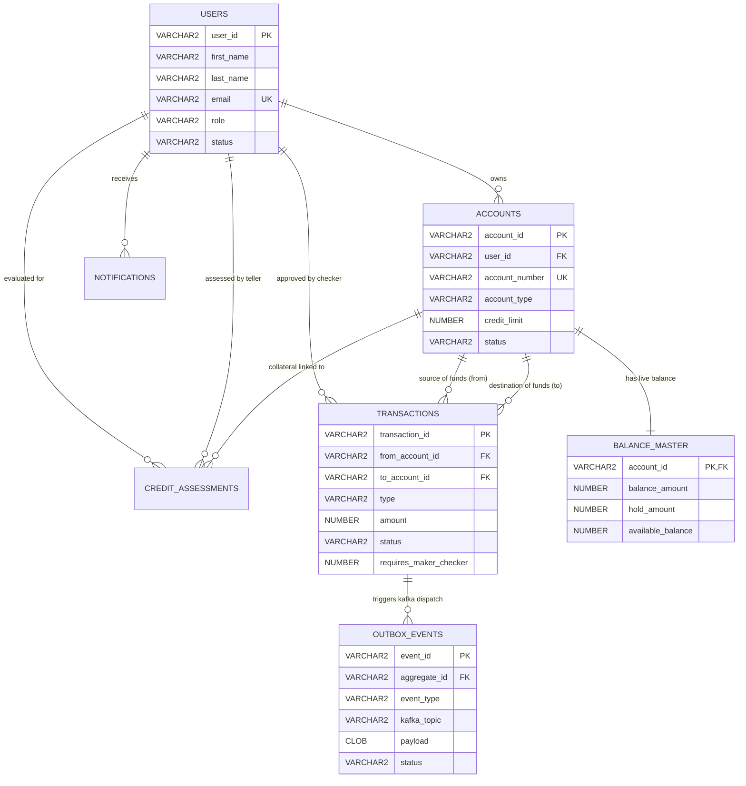

# 📚 Oracle Database Master Study Guide & Architecture Manual
**Group 3 - FSE Capstone: Core Retail Ledger & Balance Mutation Engine**  
*Document Version: 1.0.0 | Engine: Oracle Database Express Edition (XE) 21c*

---

## 🎯 1. Overview & Architecture Context

### Bakit Oracle XE 21c ang Master Database natin?
Sa architecture ng ating retail banking system, gumagamit tayo ng **Dual-Storage Architecture**:
1. **Oracle XE 21c (Write Master / System of Record):**
   - Dito pumapasok ang lahat ng updates sa pera (Deposits, Withdrawals, Transfers).
   - Sinusuportahan nito ang mahigpit na **ACID guarantees** (Atomicity, Consistency, Isolation, Durability).
   - Dito ginagawa ang **Pessimistic Row Locking (`SELECT ... FOR UPDATE`)** para maiwasan ang race conditions o sabay-sabay na pagbawas sa iisang account.
2. **PostgreSQL 16 (CQRS / Read Model):**
   - Ginagamit para sa mabilisang customer queries, dashboards, at search queries upang hindi mapagod ang Oracle write engine.

---

## 📂 2. File Organization & Naming Standard

Mapapansin mo na may numero ang simula ng bawat file sa `infrastructure/oracle/`:

```text
infrastructure/oracle/
├── 00_master_setup.sql             # 🌟 The Orchestrator (Patakbuhin ito para magawa lahat)
├── 01_create_tables_and_constraints.sql # 🏗️ DDL: Tables, Constraints, at Triggers
├── 02_create_indexes.sql           # ⚡ Performance: B-Tree at Composite Indexes
├── 03_seed_sample_data.sql         # 👥 DML: Realistic Test Data (Users, Balances, Txns)
├── 04_cleanup_schema.sql           # 🧹 Teardown: Malinis na pag-drop ng tables
├── 05_view_all_data.sql            # 🔍 Verification: Formatted terminal diagnostic report
├── init.sql                        # 🐳 Docker Auto-Init (Isahang file para sa container boot)
└── README_BEGINNER_GUIDE.md        # 📖 Quickstart command reference
```

### 💡 Golden Rule sa Database Development:
> [!IMPORTANT]
> **Deterministic Order of Execution**: Hindi pwedeng gumawa ng Foreign Key kung wala pa ang Parent Table. Hindi pwedeng mag-insert ng Account kung wala pa ang User. Kaya nakasulat ang mga files sa tiyak na pagkakasunod-sunod:  
> **Cleanup (04) ➡️ DDL Tables (01) ➡️ Indexes (02) ➡️ Seed Data (03) ➡️ Verification (05)**.

---

## 🧩 3. Entity Relationship Diagram (ERD)



---

## 🔍 4. Deep Dive sa Bawat File

---

### 📄 File 1: `00_master_setup.sql` (The Master Orchestrator)
* **Ano ang purpose nito?** Ito ang script na pinapatakbo ng developer gamit ang isang command lang: `@00_master_setup.sql`.
* **Paano ito gumagana?**
  1. Tinatawag nito ang `@@04_cleanup_schema.sql` para burahin ang anumang lumang data.
  2. Tinatawag ang `@@01_create_tables_and_constraints.sql` para itayo ang 7 tables.
  3. Tinatawag ang `@@02_create_indexes.sql` para sa speed at foreign keys.
  4. Tinatawag ang `@@03_seed_sample_data.sql` para magkalaman ng realistic users at accounts.
  5. Nagpapatakbo ng **`UNION ALL` count query** para ipakita sa terminal kung ilang rows ang nalikha sa bawat table.
* **Ano ang ibig sabihin ng `@@`?**
  Sa Oracle SQL*Plus, ang `@@` ay ibig sabihin *"patakbuhin ang script na nasa parehong directory/folder kung nasaan ang tumatawag na script."*

---

### 📄 File 2: `01_create_tables_and_constraints.sql` (Schema DDL)
Ito ang pinakamahalagang file sa database dahil ito ang nagde-define ng mga table at business rules:

#### 1. `users` Table
* **Laman:** Impormasyon ng mga Customers, Tellers, at Admins.
* **Mahalagang Columns:**
  * `role`: May check constraint `CHECK (role IN ('CUSTOMER', 'TELLER', 'ADMIN'))`.
  * `failed_login_attempts`: Counter para sa security. Kapag umabot sa 5 failed logins, magiging `LOCKED` ang status.
  * `max_concurrent_sessions`: Nililimitahan sa 3 sessions para maiwasan ang account sharing o unauthorized access.

#### 2. `accounts` Table
* **Laman:** Ang bank accounts na pagmamay-ari ng users.
* **Mahalagang Columns:**
  * `account_type`: `SAVINGS`, `CHECKING`, o `CREDIT`.
  * `credit_limit`: `NUMBER(18, 4)`. Kapag credit account, dito nakalagay ang maximum limit; kapag savings, default ay `0.0000`.

#### 3. `balance_master` Table (⭐ The Core Banking Innovation)
* **Bakit inihiwalay sa `accounts` table?**
  * Sa high-throughput banking, kapag nag-withdraw o transfer ang user, kailangang i-lock ang row gamit ang:
    ```sql
    SELECT * FROM balance_master WHERE account_id = 'A2001' FOR UPDATE;
    ```
  * Kung nasa iisang table ang account details at balance, **lahat** ng magbabasa ng account info (tulad ng pag-check ng profile o view account details sa app) ay maba-block o maghihintay! Dahil nakahiwalay ang `balance_master`, tanging mutation/money operations lang ang nagla-lock sa balance row.
* **3 Mahahalagang Columns sa Balanse:**
  * `balance_amount`: Kabuuang pera sa ledger.
  * `hold_amount`: Frozen funds (hal. pending approval sa Maker-Checker transaction).
  * `available_balance`: Ang perang pwede talagang gastusin:
    $$\text{available\_balance} = \text{balance\_amount} - \text{hold\_amount}$$
* **Constraint & Trigger:**
  * `chk_bm_solvency CHECK (balance_amount >= hold_amount)`: Bawal maging mas malaki ang naka-hold kaysa sa kabuuang pera.
  * `trg_calc_available_balance`: Trigger na awtomatikong nagko-compute ng `available_balance` bago mag-save sa database.

#### 4. `transactions` Table (Idempotent Mutation Log)
* **Laman:** Talaan ng bawat pasok at labas ng pera (`DEPOSIT`, `WITHDRAWAL`, `TRANSFER`, `CREDIT_DRAW`).
* **Idempotency Key (`transaction_id`):** 
  * Primary Key ang `transaction_id` (madalas UUID). Kapag nag-pindot ang user ng transfer nang dalawang beses dahil mabagal ang internet, itatapon ng database ang pangalawang request dahil magkaka-duplicate key error. Walang double charge!
* **Maker-Checker Flag (`requires_maker_checker`):**
  * Kapag ang halaga ng transaksyon ay lampas sa threshold (hal. > ₱100,000.00), ang flag ay magiging `1` (True) at ang status ay magiging `PENDING_APPROVAL` hanggang pirmahan ng Teller/Checker.

#### 5. `credit_assessments` Table
* **Laman:** Pagsusuri ng Bank Teller para sa Credit Card o Loan applications.
* **Risk Tiering:** `LOW_RISK`, `MEDIUM_RISK`, `HIGH_RISK` batay sa `credit_score` (300 to 850) at appraised collateral value.

#### 6. `outbox_events` Table (Transactional Outbox Pattern)
* **Bakit kailangan ito sa Microservices?**
  * Kapag nagbawas ng pera sa database, kailangan ding magpadala ng message sa Apache Kafka para malaman ng ibang services.
  * Kung nag-crash ang computer pagkatapos magbawas ng pera pero BAGO makapagpadala sa Kafka, mawawalan ng sync ang system (**The Dual-Write Problem**)!
  * **Solusyon:** Sa iisang database transaction, isinusulat ang pagbawas sa pera AT ang event sa `outbox_events` table. Pagkatapos, may hiwalay na background poller na magbabasa sa `outbox_events` at magpapadala nito sa Kafka. 100% guaranteed delivery!

#### 7. `notifications` Table
* **Laman:** In-app alerts para sa customer (hal. "Transfer of ₱5,000 successful", "Security alert: login from new device").

---

### 📄 File 3: `02_create_indexes.sql` (Performance & Lock Prevention)
Hindi lang ito para mapabilis ang queries, kundi para sa **Oracle Concurrency**:

1. **Foreign Key Indexes (Sobrang importante sa Oracle!):**
   * Sa Oracle Database, kapag may Foreign Key ka pero WALANG index ang child column (hal. `accounts.user_id`), tuwing may mag-a-update o delete sa parent table (`users`), magkakaroon ng **Full Table Share Lock (TM lock)** sa buong child table!
   * Dahil naglagay tayo ng index sa lahat ng foreign keys, walang whole-table locking na mangyayari.
2. **Composite / Polling Queue Indexes:**
   * `idx_txn_pending_approval`: Ginawa para sa Maker-Checker dashboard kung saan madalas i-query ang:
     `WHERE status = 'PENDING_APPROVAL' AND requires_maker_checker = 1 ORDER BY created_at ASC`
   * `idx_outbox_pending_dispatch`: Ginawa para sa Outbox background worker:
     `WHERE status = 'PENDING' ORDER BY retry_count ASC, created_at ASC`

---

### 📄 File 4: `03_seed_sample_data.sql` (Realistic Bank Data)
Naglalaman ng ready-to-test accounts na tugma sa specifications ng Capstone:

| User ID | Pangalan | Role | Details |
| :--- | :--- | :--- | :--- |
| **U1001** | Juan Dela Cruz | `CUSTOMER` | May Savings (`A2001`, ₱50,000) at Checking (`A2002`, ₱125,000) |
| **U1002** | Maria Santos | `CUSTOMER` | May Credit Account (`A2003`, ₱20,000 limit) |
| **U3001** | Alex Mercer | `TELLER` | Bank branch staff na nag-a-approve ng loans at credit limits |
| **U0001** | Diana Vance | `ADMIN` | System Administrator na namamahala sa user access at security |

---

### 📄 File 5: `04_cleanup_schema.sql` (Safe Teardown)
* **Reverse Dependency Order:**
  Bago mabura ang `users`, kailangan munang mabura ang `accounts` at `credit_assessments` na nakatali rito.
* **Idempotent / Resilient PL/SQL Block:**
  ```sql
  BEGIN
      EXECUTE IMMEDIATE 'DROP TABLE notifications CASCADE CONSTRAINTS PURGE';
  EXCEPTION WHEN OTHERS THEN IF SQLCODE != -942 THEN RAISE; END IF;
  END;
  ```
  * Ang error code **`-942`** sa Oracle ay `table or view does not exist`. 
  * Ibig sabihin, kung unang beses mo pa lang pinapatakbo ang script at wala pang table, **hindi ito magka-crash**; tuloy-tuloy lang ito nang mapayapa.

---

### 📄 File 6: `05_view_all_data.sql` (Terminal Diagnostics)
* Gumagamit ng Oracle formatting utilities:
  * `SET LINESIZE 300`: Pinapalapad ang terminal output para hindi maputol ang columns.
  * `SET COLSEP ' | '`: Naglalagay ng vertical bar divider para madaling basahin tulad ng spreadsheet.
  * `COLUMN balance_amount FORMAT 999,999,990.0000`: Pina-format ang pera na may commas at eksaktong 4 decimal places.

---

### 📄 File 7: `init.sql` (Docker Automated Initializer)
* Pinagsama-samang single-file script.
* Kapag nag-spin up ang container sa Docker gamit ang volume mount, ito ang awtomatikong binabasa ng Oracle entrypoint upang maihanda ang database bago pa man mag-boot ang Spring Boot microservices.

---

## 🎓 5. Financial & Database Concepts (Interview & Defense Cheatsheet)

Kung tatanungin ka sa Capstone defense o sa technical interview, ito ang mga sagot sa pinakamahalagang mga tanong:

### Q1: Bakit `NUMBER(18, 4)` ang ginamit sa pera imbes na `FLOAT` o `DOUBLE`?
> **Sagot:** Ang `FLOAT` at `DOUBLE` ay gumagamit ng binary floating-point representation (IEEE 754) na may kilalang rounding error (halimbawa, `0.1 + 0.2 = 0.30000000000000004`). Sa core banking, kahit isang sentimo o fraction ng sentimo ay hindi pwedeng mawala o magka-drift. Ang `NUMBER(18, 4)` ay exact-decimal data type na kayang mag-imbak ng hanggang 18 digits na may 4 decimal places para sa foreign exchange o micro-interest calculations nang walang rounding distortion.

### Q2: Paano pinipigilan ang Double Spending at Race Conditions?
> **Sagot:** 
> 1. Gumagamit kami ng **Pessimistic Row Locking (`SELECT ... FOR UPDATE`)** sa `balance_master` table. Kapag may ongoing transfer sa isang account, naka-lock ang row na iyon hanggang matapos ang transaction (`COMMIT` o `ROLLBACK`).
> 2. Gumagamit kami ng **Idempotency Key (`transaction_id`)** sa `transactions` table para maiwasan ang duplicate execution mula sa network retries.

### Q3: Ano ang silbi ng Transactional Outbox pattern sa `outbox_events`?
> **Sagot:** Para masigurado ang **At-Least-Once Delivery** ng events sa Apache Kafka nang hindi gumagamit ng mabagal at marupok na Two-Phase Commit (2PC / XA Transactions). Ang pagbawas sa pera at pag-insert sa `outbox_events` ay nasa iisang local ACID database transaction.

### Q4: Bakit nakahiwalay ang `balance_master` sa `accounts` table?
> **Sagot:** Para i-decouple ang read-heavy operations (e.g., account profile, metadata) mula sa write-heavy row locking operations (e.g., balance mutation). Dahil dito, hindi nai-lock ang buong account profile habang nagaganap ang transfer.
