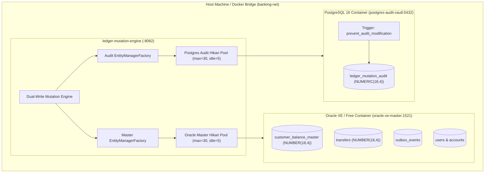
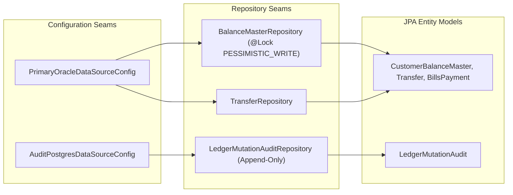

# Day 32 Technical Architecture & Database Design

This document details the technical implementation, schema models, container topology, and thread pool isolation mechanics for Day 32.

---

## 1. System Modeling

### System Context Diagram

### Component View & Seams

---

## 2. Technology Selection Matrix

| Layer | Technology Choice | Architectural Rationale |
| :--- | :--- | :--- |
| **Master Operational DB** | Oracle Database Free / XE 21c | Enterprise transaction processing, deterministic row-level locks via `SELECT ... FOR UPDATE`, high-concurrency consistency. |
| **Dedicated Audit Vault** | PostgreSQL 16 (Alpine) | Reliable append-only journal, native PL/pgSQL triggers enforcing complete immutability, high write ingestion throughput. |
| **Connection Pooling** | HikariCP 5.1 | Zero-overhead connection pooling, sub-millisecond connection checkout, thread-isolated pool dimensions preventing cross-database saturation. |
| **ORM & Persistence** | Spring Data JPA / Hibernate 6 | Explicit entity modeling, strict decimal mapping via `BigDecimal` with scale 4, transactional boundaries. |
| **Container Engine** | Docker Compose on `banking-net` | Reproducible deployment, deterministic internal network DNS, isolated container lifecycle. |

---

## 3. Correctness Properties & Invariants

Financial data models must guarantee strict mathematical correctness:

1. **Balance Solvency Invariant**:
   For any account $a \in \text{Accounts}$,
   $$\text{balance\_amount}(a) \ge \text{held\_balance}(a) \ge 0$$
   $$\text{available\_balance}(a) = \text{balance\_amount}(a) - \text{held\_balance}(a) \ge 0$$
   Enforced at the persistence layer via Oracle check constraints `chk_positive_balance`, `chk_positive_held`, and `chk_available_balance`.

2. **Strict Currency Representation**:
   All financial values satisfy:
   $$\text{val} \in \mathbb{Q}, \quad 10^4 \cdot \text{val} \in \mathbb{Z}, \quad 0 \le \text{val} < 10^{14}$$
   Represented as `NUMBER(18, 4)` in Oracle and `NUMERIC(18, 4)` in PostgreSQL.

3. **Audit Ledger Immutability Property**:
   Let $\mathcal{A}_t$ be the multiset of rows in `ledger_mutation_audit` at time $t$. For any two timestamps $t_1 \le t_2$:
   $$\mathcal{A}_{t_1} \subseteq \mathcal{A}_{t_2}$$
   Rows may only be inserted. Modification and deletion commands are rejected by trigger `trg_no_update_delete_mutation_audit`.

4. **Pool Isolation Invariant**:
   Surges in master database transactions cannot consume audit connections, and vice versa:
   $$\text{ActiveConnections}_{\text{oracle}} \le 30, \quad \text{ActiveConnections}_{\text{postgres}} \le 30$$
   $$\text{IdleConnections}_{\text{oracle}} \ge 5, \quad \text{IdleConnections}_{\text{postgres}} \ge 5$$

---

## 4. Traceability Matrix

| Requirement | Design Component | Persistence Target | Verification Gate |
| :--- | :--- | :--- | :--- |
| `REQ-1.1` | `customer_balance_master`, `transfers` | Oracle XE (`init.sql`) | Column metadata check: `DATA_PRECISION=18, DATA_SCALE=4` |
| `REQ-1.2` | Check constraint `chk_positive_balance` | Oracle XE (`init.sql`) | Negative balance insert rejected |
| `REQ-1.3` | Check constraint `chk_positive_held` | Oracle XE (`init.sql`) | Negative held balance insert rejected |
| `REQ-1.4` | Check constraint `chk_available_balance` | Oracle XE (`init.sql`) | Held balance exceeding total balance rejected |
| `REQ-1.6` | Check constraint `amount > 0` | Oracle XE (`init.sql`) | Non-positive transfer amount insert rejected |
| `REQ-2.1` | `ledger_mutation_audit` DDL | PostgreSQL (`init.sql`) | Column metadata check: `numeric_precision=18, numeric_scale=4` |
| `REQ-2.3` | Trigger `trg_no_update_delete_mutation_audit` | PostgreSQL (`init.sql`) | UPDATE statement raises compliance exception |
| `REQ-2.4` | Trigger `trg_no_update_delete_mutation_audit` | PostgreSQL (`init.sql`) | DELETE statement raises compliance exception |
| `REQ-3.1` to `REQ-3.4` | `docker-compose.yml` (`banking-net`) | Docker Engine | `docker ps` healthchecks, bridge network inspection |
| `REQ-4.1` to `REQ-4.5` | `application.properties`, Config classes | Spring Boot / HikariCP | Properties file inspection and HikariCP pool bean initialization |
