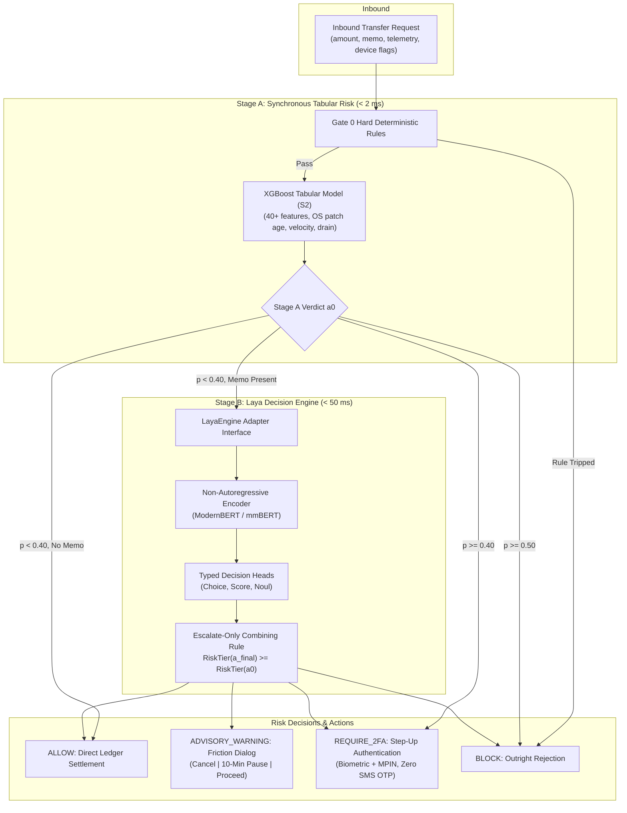

# Technical Design: Laya Decision Engine Integration for Retail Bank Risk Scoring

## 1. System Architecture & Component Modeling

The risk service sits between the core banking transfer engine and the risk intelligence databases. Stage A evaluates tabular and device features (< 2 ms), while Stage B invokes the Laya decision engine for semantic memo evaluation and unstructured threat synthesis.



---

## 2. Technology Selection & Comparison

| Architecture Layer | Current NanoJev | Proposed Laya Engine | Architectural Rationale |
| :--- | :--- | :--- | :--- |
| **Model Type** | Causal generative decoder (`Qwen2.5-0.5B-Instruct`) | Non-autoregressive bidirectional encoder (`ModernBERT` / `mmBERT`) | Eliminates next-token autoregression overhead; generates all decision logits in one forward pass. |
| **Inference Latency** | 294 ms p50, 957 ms p99 (CPU) | ~33 ms single request, ~7 ms batched | Enables synchronous evaluation within the 200 ms payment settlement SLA. |
| **Multilingual Support** | English prompt template with single-token logit hacking | Multilingual `laya-multilingual` covering 100+ languages natively | Directly parses Tagalog, Taglish, and Philippine banking vernacular without translation. |
| **Primitives Handling** | Manual space/non-space token lookup in tokenizer vocabulary | Native `choice`, `score`, and `noul` schema heads | Handles arbitrary multi-word labels and structured questions without tokenizer subword fragmentation bugs. |
| **Calibration** | High temperature heuristic ($T = 5.0, T = 7.12$) | RLCD proper scoring rules + histogram binning | Mathematically guarantees calibrated posterior probabilities. |

---

## 3. Interface Seam & Adapter Architecture

To prevent breaking existing endpoints or upstream Java services, `LayaEngine` adheres to the exact same contract as `NanoJevEngine`:

```python
class LayaEngine:
    """
    Non-autoregressive System 1 decision engine wrapping Laya.
    Maintains 100% backward compatibility with NanoJevEngine calling interface.
    """
    def __init__(self, model_name: str = "laya-multilingual", prefer_onnx: bool = True):
        ...

    def evaluate(
        self,
        amount: float,
        avg_amount: float,
        memo: str,
        geo_signals: Dict[str, Any],
        threat_narrative: Optional[str] = None,
        threat_category: Optional[str] = None
    ) -> Dict[str, Any]:
        """
        1. Evaluates Gate 0 deterministic triage (< 0.1 ms).
        2. Formats typed question schemas for verdict, typology, and anomaly.
        3. Executes single forward pass via Laya Router/Agent.
        4. Applies Bayesian contextual priors and escalate-only invariant.
        5. Returns structured response matching RiskAnalysisResponse.
        """
        ...
```

---

## 4. Formal Correctness Properties

1. **Escalate-Only Monotonicity Invariant**:
   For any Stage A initial action $a_0$ and Stage B recommended action $a_{\text{laya}}$:
   $$\text{RiskTier}(a_{\text{final}}) = \max(\text{RiskTier}(a_0), \text{RiskTier}(a_{\text{laya}}))$$
   $$\forall a_0, a_{\text{laya}} \in \{\text{ALLOW}, \text{ADVISORY\_WARNING}, \text{REQUIRE\_2FA}, \text{BLOCK}\}, \quad \text{RiskTier}(a_{\text{final}}) \ge \text{RiskTier}(a_0)$$
   **Theorem**: Adversarial prompt injection contained within `memo` cannot decrease the risk tier assigned by Stage A.

2. **Deterministic Fallback Safety**:
   If model loading or forward pass raises any exception or timeout:
   $$a_{\text{final}} = a_0$$
   Guarantees that system availability is decoupled from neural model availability.

3. **Decision Idempotency**:
   For identical inputs $(tx\_id, a_0, memo)$, the engine yields identical action $a_{\text{final}}$ and identical probability distributions.

---

## 5. Traceability Matrix

| Requirement | Design Component | Verification Mechanism |
| :--- | :--- | :--- |
| `REQ-1.1`, `REQ-1.2` | `LayaEngine.evaluate()` adapter in `laya_engine.py` | Unit test in `test_device_binding_advisory.py` |
| `REQ-1.3` | Graceful fallback block in `_load_engine()` | Test with simulated missing weights in `test_api_integration.py` |
| `REQ-1.4`, `REQ-2.1` | `compute_final_action()` in `two_stage.py` | 1,000-case randomized invariant test in `test_two_stage.py` |
| `REQ-2.2`, `REQ-2.3` | `enforce_escalate_only()` in `reviewer.py` | Invariant matrix test in `test_async_reviewer.py` |
| `REQ-3.1`, `REQ-3.2` | `typology` Choice question schema in `laya_engine.py` | Verification across all 7 typologies in `test_two_stage.py` |
| `REQ-3.3` | `get_warning_dialog()` catalog integration | UI dialog assertions in `test_device_binding_advisory.py` |
