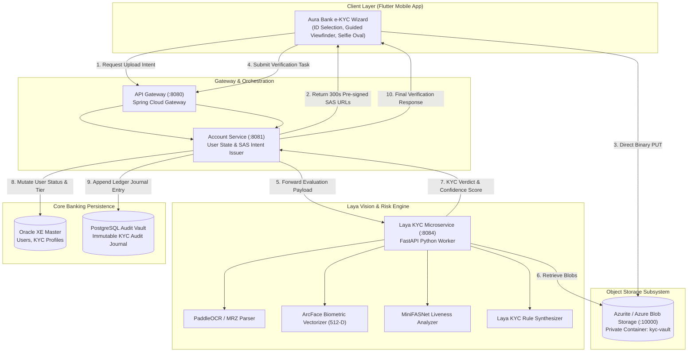

# Technical Design: Mobile e-KYC Verification with Laya Vision Engine & Azurite Storage

## 1. System Architecture & System Modeling

The e-KYC subsystem provides an automated, mobile-first onboarding verification pipeline. The mobile client captures identity documents and a live selfie, streams them directly to encrypted blob storage (Azurite locally or Azure Blob Storage in cloud), and prompts the Laya KYC Engine to perform synchronous document OCR, biometric face matching, and policy-driven tier classification.

### 1.1 System Context Diagram



---

### 1.2 Sequence Flow: End-to-End KYC Submission & Evaluation

```mermaid
sequenceDiagram
    autonumber
    actor User as Customer (Mobile)
    participant App as Flutter Mobile App
    participant GW as API Gateway
    participant AccSvc as Account Service
    participant Storage as Azurite / Azure Blob
    participant Laya as Laya KYC Service
    participant DB as Oracle Master DB

    User->>App: Selects ID Type & Captures Photos (Front, Back, Selfie)
    App->>GW: POST /api/v1/kyc/upload-intent (JWT Authenticated)
    GW->>AccSvc: Route upload intent request
    AccSvc->>AccSvc: Generate UUID submissionId & 300s SAS tokens
    AccSvc-->>App: Return SAS Upload URLs (id_front, id_back, selfie)
    
    par Direct Image Ingestion
        App->>Storage: PUT /kyc-vault/users/{uid}/{subId}/id_front.jpg (Direct Blob Upload)
        App->>Storage: PUT /kyc-vault/users/{uid}/{subId}/id_back.jpg (Direct Blob Upload)
        App->>Storage: PUT /kyc-vault/users/{uid}/{subId}/selfie.jpg (Direct Blob Upload)
    end

    App->>GW: POST /api/v1/kyc/verify (submissionId, idType, registrationData)
    GW->>AccSvc: Forward verification request
    AccSvc->>Laya: POST /api/v1/kyc/evaluate (blobPaths, userProfile)
    
    Laya->>Storage: Fetch image byte streams via internal service connection
    Laya->>Laya: Step 1: Detect Document Layout & Extract Text via OCR
    Laya->>Laya: Step 2: Detect & Crop ID Face; Extract 512-D ArcFace Vector
    Laya->>Laya: Step 3: Run Selfie Liveness & Extract 512-D Selfie Vector
    Laya->>Laya: Step 4: Compute Cosine Distance & Composite Confidence
    
    alt Confidence >= 90% and Face Match >= 0.85 (Tier A: Auto-Approve)
        Laya-->>AccSvc: Status: APPROVED, Confidence: 94.5, Match: 0.91
        AccSvc->>DB: UPDATE users SET status='ACTIVE', kyc_status='VERIFIED'
        AccSvc-->>App: { status: "VERIFIED", message: "Account fully activated" }
    else Confidence 70% - 89% (Tier B: Manual Review)
        Laya-->>AccSvc: Status: PENDING_REVIEW, Confidence: 78.2, Reason: "SLIGHT_NAME_DISCREPANCY"
        AccSvc->>DB: UPDATE users SET kyc_status='PENDING_REVIEW'
        AccSvc-->>App: { status: "PENDING_REVIEW", message: "Application under compliance review" }
    else Confidence < 70% (Tier C: Auto-Reject)
        Laya-->>AccSvc: Status: REJECTED, Confidence: 42.0, Reason: "FACE_MISMATCH"
        AccSvc->>DB: UPDATE users SET kyc_status='REJECTED'
        AccSvc-->>App: { status: "REJECTED", message: "Verification failed. Please retry." }
    end
```

---

## 2. Technology Selection & Comparison

| Subsystem Component | Choice | Alternative Considered | Architectural Rationale |
| :--- | :--- | :--- | :--- |
| **Object Storage** | **Azurite (Local) / Azure Blob (Cloud)** | AWS S3, MinIO, Local Disk | Directly matches team cloud infrastructure (Azure AKS/Container Apps). Azurite provides local 1:1 API parity without cloud cost. |
| **OCR Engine** | **PaddleOCR (Lightweight ONNX)** | Tesseract, Google Vision API | Superior detection accuracy on low-resolution camera crops, native support for Latin characters, and fast ONNX runtime (< 80 ms). |
| **Biometric Matcher** | **ArcFace / InsightFace (ResNet50 / MobileFaceNet)** | FaceNet, dlib Euclidean | Margin-based angular loss produces superior separation in 512-D hypersphere space; resistant to lighting variations and aging. |
| **Presentation Attack Detection** | **MiniFASNet (Passive Texture & Depth CNN)** | Active Blink/Challenge-Response | Passive liveness eliminates customer friction (no forced head rotations) while effectively blocking 2D screens and print attacks. |
| **Orchestration Language** | **Python FastAPI + Spring Boot Client** | Pure Java Deeplearning4j | Python gives access to state-of-the-art vision models and ONNX execution providers, while Spring Boot manages transactional core banking state. |

---

## 3. Interface Seams & Adapters

### 3.1 Blob Storage Seam (`account-service` & `risk-service`)

Both services access object storage behind uniform storage adapter interfaces:

```java
// backend/account-service/.../storage/BlobStorageAdapter.java
public interface BlobStorageAdapter {
    KycUploadSasResponse generateUploadIntent(String userId, String submissionId, List<String> documentTypes);
    boolean verifyBlobExists(String blobPath);
    String generateReadSasUri(String blobPath, Duration ttl);
}
```

```python
# backend/risk-service/app/kyc/storage_adapter.py
class BlobStorageAdapter(ABC):
    @abstractmethod
    def fetch_image_bytes(self, blob_path: str) -> bytes:
        """Retrieves raw image bytes from Azurite or Azure Blob Storage."""
        pass
```

### 3.2 Evaluation API Wire Formats

#### Inbound Evaluation Contract (`POST /api/v1/kyc/evaluate`)
```json
{
  "user_id": "U1001",
  "submission_id": "KYC-2026-99120",
  "id_type": "DRIVERS_LICENSE",
  "front_blob_path": "users/U1001/KYC-2026-99120/id_front.jpg",
  "back_blob_path": "users/U1001/KYC-2026-99120/id_back.jpg",
  "selfie_blob_path": "users/U1001/KYC-2026-99120/selfie.jpg",
  "declared_first_name": "Elijah Riley",
  "declared_last_name": "Montefalco",
  "declared_dob": "1999-07-10"
}
```

#### Outbound Evaluation Response
```json
{
  "decision": "APPROVED",
  "confidence_score": 93.4,
  "face_similarity": 0.892,
  "liveness_score": 0.965,
  "ocr_data": {
    "full_name": "ELIJAH RILEY MONTEFALCO",
    "dob": "1999-07-10",
    "id_number": "N02-18-091234",
    "expiry_date": "2029-07-10",
    "ocr_confidence": 0.941
  },
  "checks": {
    "id_template_valid": true,
    "name_match": true,
    "dob_match": true,
    "liveness_passed": true,
    "face_matched": true
  },
  "flags": []
}
```

---

## 4. Correctness Properties & Invariants

1. **Cosine Similarity Boundedness**:
   Let $\vec{v}_{\text{id}}, \vec{v}_{\text{selfie}} \in \mathbb{R}^{512}$ be unit-normalized facial embeddings ($\|\vec{v}\|_2 = 1.0$). The facial similarity score $S_{\text{face}}$ is strictly bounded:
   $$S_{\text{face}} = \frac{\vec{v}_{\text{id}} \cdot \vec{v}_{\text{selfie}}}{\|\vec{v}_{\text{id}}\|_2 \|\vec{v}_{\text{selfie}}\|_2} \in [-1.0, 1.0]$$
   For classification purposes, values below $0.0$ are clamped to $0.0$.

2. **SAS Expiry Guarantee**:
   For any upload URL generated at timestamp $T_0$, the authorization token signature valid period $\Delta t$ satisfies:
   $$\Delta t = 300\text{ seconds}$$
   Any access attempt at $T > T_0 + 300$ returns HTTP 403 Forbidden.

3. **Deterministic Tier Decision Invariant**:
   The decision mapping function $\Phi(C_{\text{kyc}}, S_{\text{face}}, S_{\text{live}})$ is strictly monotonic and partitions the state space without overlap:
   $$\Phi = \begin{cases}
   \text{APPROVED} & \text{if } C_{\text{kyc}} \ge 90 \land S_{\text{face}} \ge 0.85 \land S_{\text{live}} \ge 0.90 \land \text{HardFlags} = \emptyset \\
   \text{PENDING\_REVIEW} & \text{if } (70 \le C_{\text{kyc}} < 90 \lor 0.70 \le S_{\text{face}} < 0.85) \land \text{HardFraud} = \emptyset \\
   \text{REJECTED} & \text{otherwise}
   \end{cases}$$

4. **Zero SPI Leakage Invariant**:
   Raw image binaries and 512-D biometric float arrays SHALL NEVER be written to stdout, application console logs, or unindexed metadata tables.

---

## 5. Traceability Matrix

| Requirement | Design Component | Interface / Implementation Seam |
| :--- | :--- | :--- |
| `REQ-1.1` - `REQ-1.5` | Mobile e-KYC Flow | `aurabank_app/lib/screens/kyc_wizard_screen.dart` |
| `REQ-1.6` | Mobile Pre-Capture Verification | `CameraViewfinderOverlay` in Flutter |
| `REQ-2.1` - `REQ-2.3` | Upload Intent Contract | `AccountService.java` -> `KycController.java` |
| `REQ-2.4` - `REQ-2.6` | Storage Ingestion Adapter | `Azurite` container + `BlobStorageAdapter.java` |
| `REQ-3.1` - `REQ-3.4` | Document Classification & OCR | `backend/risk-service/app/kyc/ocr_pipeline.py` |
| `REQ-4.1` - `REQ-4.5` | Biometric Face Match & Liveness | `backend/risk-service/app/kyc/biometric_engine.py` |
| `REQ-5.1` - `REQ-5.5` | Decision Routing & Maker-Checker | `KycDecisionSynthesizer.py` + `KycService.java` |
